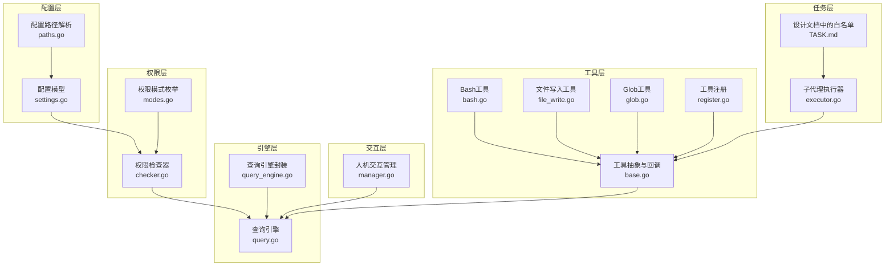
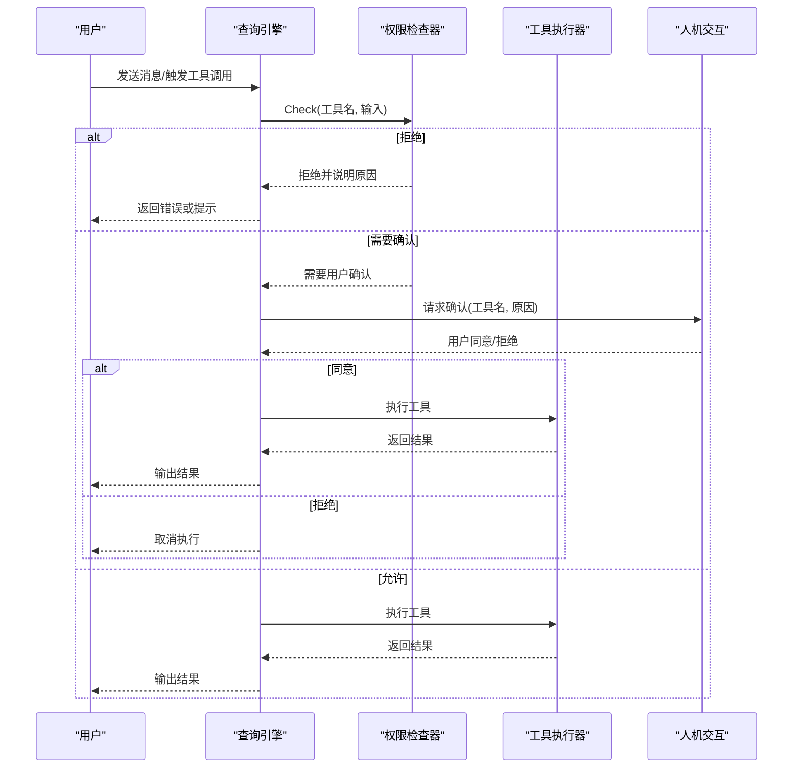
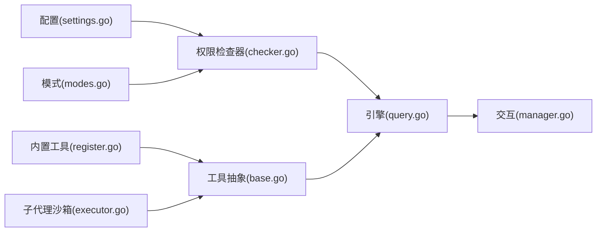

# 权限控制系统

<cite>
**本文档引用的文件**
- [checker.go](file://pkg/permissions/checker.go)
- [modes.go](file://pkg/permissions/modes.go)
- [settings.go](file://pkg/config/settings.go)
- [paths.go](file://pkg/config/paths.go)
- [base.go](file://pkg/tools/base.go)
- [query.go](file://pkg/engine/query.go)
- [query_engine.go](file://pkg/engine/query_engine.go)
- [manager.go](file://pkg/hitl/manager.go)
- [executor.go](file://pkg/tasks/executor.go)
- [TASK.md](file://design/TASK.md)
- [bash.go](file://pkg/tools/builtin/bash.go)
- [file_write.go](file://pkg/tools/builtin/file_write.go)
- [glob.go](file://pkg/tools/builtin/glob.go)
- [register.go](file://pkg/tools/builtin/register.go)
</cite>

## 目录
1. [引言](#引言)
2. [项目结构](#项目结构)
3. [核心组件](#核心组件)
4. [架构总览](#架构总览)
5. [详细组件分析](#详细组件分析)
6. [依赖关系分析](#依赖关系分析)
7. [性能考量](#性能考量)
8. [故障排查指南](#故障排查指南)
9. [结论](#结论)
10. [附录](#附录)

## 引言
本文件面向开发者与安全工程师，系统化阐述 OpenHarness 权限控制系统的设计与实现。内容涵盖权限模式、路径规则、工具沙箱、权限检查器、白名单机制与安全策略；提供配置指南、适用场景与安全考虑，并给出扩展与自定义策略的实践建议。

## 项目结构
权限控制涉及以下关键模块：
- 配置层：定义权限模式、路径规则与全局设置
- 权限检查层：基于配置进行决策
- 引擎层：在工具调用前执行权限检查
- 人机交互层：在需要时请求用户确认
- 工具层：内置工具的只读/可变属性与输入约束
- 任务执行层：子代理的工具白名单沙箱

图表来源
- [settings.go:37-54](file://pkg/config/settings.go#L37-L54)
- [modes.go:4-11](file://pkg/permissions/modes.go#L4-L11)
- [checker.go:25-28](file://pkg/permissions/checker.go#L25-L28)
- [query.go:72-79](file://pkg/engine/query.go#L72-L79)
- [query_engine.go:50-68](file://pkg/engine/query_engine.go#L50-L68)
- [manager.go:12-18](file://pkg/hitl/manager.go#L12-L18)
- [base.go:14-27](file://pkg/tools/base.go#L14-L27)
- [bash.go:24-27](file://pkg/tools/builtin/bash.go#L24-L27)
- [file_write.go:24-26](file://pkg/tools/builtin/file_write.go#L24-L26)
- [glob.go:24-27](file://pkg/tools/builtin/glob.go#L24-L27)
- [register.go:7-21](file://pkg/tools/builtin/register.go#L7-L21)
- [executor.go:139-176](file://pkg/tasks/executor.go#L139-L176)
- [TASK.md:153-217](file://design/TASK.md#L153-L217)

章节来源
- [settings.go:37-54](file://pkg/config/settings.go#L37-L54)
- [paths.go:8-23](file://pkg/config/paths.go#L8-L23)
- [modes.go:4-11](file://pkg/permissions/modes.go#L4-L11)
- [checker.go:25-28](file://pkg/permissions/checker.go#L25-L28)
- [query.go:72-79](file://pkg/engine/query.go#L72-L79)
- [query_engine.go:50-68](file://pkg/engine/query_engine.go#L50-L68)
- [manager.go:12-18](file://pkg/hitl/manager.go#L12-L18)
- [base.go:14-27](file://pkg/tools/base.go#L14-L27)
- [bash.go:24-27](file://pkg/tools/builtin/bash.go#L24-L27)
- [file_write.go:24-26](file://pkg/tools/builtin/file_write.go#L24-L26)
- [glob.go:24-27](file://pkg/tools/builtin/glob.go#L24-L27)
- [register.go:7-21](file://pkg/tools/builtin/register.go#L7-L21)
- [executor.go:139-176](file://pkg/tasks/executor.go#L139-L176)
- [TASK.md:153-217](file://design/TASK.md#L153-L217)

## 核心组件
- 权限模式：default、plan、full_auto
- 权限设置：模式、允许/禁止工具列表、路径规则、禁止命令
- 权限检查器：根据设置与模式进行决策，支持路径匹配与命令匹配
- 引擎集成：在工具执行前调用权限检查接口
- 人机交互：在需要时向前端发出确认请求
- 工具抽象：定义只读/可变语义与执行上下文回调
- 子代理沙箱：按类型构建白名单工具集合

章节来源
- [modes.go:4-11](file://pkg/permissions/modes.go#L4-L11)
- [settings.go:37-54](file://pkg/config/settings.go#L37-L54)
- [checker.go:25-28](file://pkg/permissions/checker.go#L25-L28)
- [query.go:72-79](file://pkg/engine/query.go#L72-L79)
- [manager.go:63-90](file://pkg/hitl/manager.go#L63-L90)
- [base.go:14-27](file://pkg/tools/base.go#L14-L27)
- [executor.go:139-176](file://pkg/tasks/executor.go#L139-L176)

## 架构总览
OpenHarness 的权限控制贯穿“配置—检查—执行—交互”链路。配置层提供权限策略，权限检查器在引擎执行工具前进行判定，必要时通过人机交互层请求用户确认，最终由工具执行器完成实际操作。

图表来源
- [query.go:286-325](file://pkg/engine/query.go#L286-L325)
- [checker.go:42-82](file://pkg/permissions/checker.go#L42-L82)
- [manager.go:63-90](file://pkg/hitl/manager.go#L63-L90)

## 详细组件分析

### 权限模式与配置
- 权限模式
  - default：默认模式，只读工具直接放行，可变工具需用户确认
  - plan：计划模式，阻止可变工具，直到用户退出计划模式
  - full_auto：全自动化，允许所有工具
- 权限设置字段
  - mode：当前模式
  - allowed_tools/denied_tools：显式允许/禁止的工具名
  - path_rules：基于 glob 的路径规则，支持允许/禁止
  - denied_commands：基于 glob 的命令禁止模式

章节来源
- [modes.go:4-11](file://pkg/permissions/modes.go#L4-L11)
- [settings.go:37-54](file://pkg/config/settings.go#L37-L54)

### 权限检查器实现
- 决策流程
  1) 若工具在禁止列表，直接拒绝
  2) 若工具在允许列表，直接放行
  3) 若存在路径规则且匹配到禁止路径，拒绝
  4) 若存在命令禁止模式且匹配，拒绝
  5) 根据模式与只读属性决定放行或需要确认
- 关键点
  - 路径规则使用 glob 匹配
  - 命令禁止同样使用 glob 匹配
  - 只读工具总是被允许
  - plan 模式下可变工具一律拒绝

```mermaid
flowchart TD
S["开始(Evaluate)"] --> D1["检查是否在禁止工具列表"]
D1 --> |是| R1["拒绝: 明确禁止"]
D1 --> |否| A1["检查是否在允许工具列表"]
A1 --> |是| R2["放行: 明确允许"]
A1 --> |否| P1["若提供路径且存在路径规则"]
P1 --> |是| M1["逐条匹配glob规则"]
M1 --> |命中禁止规则| R3["拒绝: 路径规则禁止"]
M1 --> |未命中禁止规则| C1["继续"]
P1 --> |否| C1
C1 --> CMD["若提供命令且存在禁止命令"]
CMD --> |匹配| R4["拒绝: 命令禁止模式"]
CMD --> |不匹配| M2["确定模式"]
M2 --> FA["模式=full_auto?"]
FA --> |是| R5["放行: 全自动模式"]
FA --> |否| RO["是否只读工具?"]
RO --> |是| R6["放行: 只读工具"]
RO --> |否| PL["模式=plan?"]
PL --> |是| R7["拒绝: 计划模式"]
PL --> |否| R8["需要确认: 默认模式"]
```

图表来源
- [checker.go:42-82](file://pkg/permissions/checker.go#L42-L82)

章节来源
- [checker.go:42-82](file://pkg/permissions/checker.go#L42-L82)

### 引擎与权限检查集成
- 引擎通过 PermissionChecker 接口统一接入权限控制
- AllowAllPermissions 实现用于测试或特殊场景
- 在工具执行前调用 Check，失败则中断执行并返回错误

章节来源
- [query.go:72-80](file://pkg/engine/query.go#L72-L80)
- [query.go:302-306](file://pkg/engine/query.go#L302-L306)

### 人机交互与确认
- Manager 维护待处理的“问题/权限”请求映射
- AskPermission 发起确认请求，等待前端响应
- HandleFrontendRequest 处理前端返回，解析并投递结果

章节来源
- [manager.go:63-90](file://pkg/hitl/manager.go#L63-L90)
- [manager.go:120-142](file://pkg/hitl/manager.go#L120-L142)

### 工具抽象与只读语义
- BaseTool 定义工具契约，包含只读判断与执行上下文
- 工具执行上下文提供 AskUser/AskPermission 回调
- 内置工具示例：Bash、Write、Glob 等，明确只读/可变属性

章节来源
- [base.go:51-59](file://pkg/tools/base.go#L51-L59)
- [base.go:14-27](file://pkg/tools/base.go#L14-L27)
- [bash.go:24-27](file://pkg/tools/builtin/bash.go#L24-L27)
- [file_write.go:24-26](file://pkg/tools/builtin/file_write.go#L24-L26)
- [glob.go:24-27](file://pkg/tools/builtin/glob.go#L24-L27)

### 子代理工具沙箱
- 根据子代理类型构建白名单工具集合
- Explore/Plan/Verification 分别预设不同的工具白名单
- 未指定白名单时可使用完整工具集（排除特定工具）

章节来源
- [executor.go:139-176](file://pkg/tasks/executor.go#L139-L176)
- [TASK.md:153-217](file://design/TASK.md#L153-L217)

## 依赖关系分析
- 配置依赖：权限设置来源于配置文件，路径解析来自配置路径工具
- 权限检查依赖：权限检查器依赖配置与模式
- 引擎依赖：查询引擎依赖权限检查器接口
- 交互依赖：人机交互依赖引擎提供的回调注入
- 工具依赖：工具实现依赖工具抽象与执行上下文

图表来源
- [settings.go:37-54](file://pkg/config/settings.go#L37-L54)
- [modes.go:4-11](file://pkg/permissions/modes.go#L4-L11)
- [checker.go:25-28](file://pkg/permissions/checker.go#L25-L28)
- [query.go:72-79](file://pkg/engine/query.go#L72-L79)
- [manager.go:12-18](file://pkg/hitl/manager.go#L12-L18)
- [base.go:51-59](file://pkg/tools/base.go#L51-L59)
- [register.go:7-21](file://pkg/tools/builtin/register.go#L7-L21)
- [executor.go:139-176](file://pkg/tasks/executor.go#L139-L176)

章节来源
- [settings.go:37-54](file://pkg/config/settings.go#L37-L54)
- [modes.go:4-11](file://pkg/permissions/modes.go#L4-L11)
- [checker.go:25-28](file://pkg/permissions/checker.go#L25-L28)
- [query.go:72-79](file://pkg/engine/query.go#L72-L79)
- [manager.go:12-18](file://pkg/hitl/manager.go#L12-L18)
- [base.go:51-59](file://pkg/tools/base.go#L51-L59)
- [register.go:7-21](file://pkg/tools/builtin/register.go#L7-L21)
- [executor.go:139-176](file://pkg/tasks/executor.go#L139-L176)

## 性能考量
- 权限检查为常量时间操作，复杂度主要取决于路径规则数量与命令规则数量
- glob 匹配在路径规则较多时可能成为瓶颈，建议精简规则或采用更高效的匹配策略
- 引擎并发执行工具时，权限检查应保持无锁与快速返回，避免阻塞工具并发
- 人机交互采用异步通道，注意请求ID唯一性与超时处理

## 故障排查指南
- 常见问题
  - 工具被意外拒绝：检查 allowed_tools/denied_tools 与 path_rules 是否冲突
  - 命令被误杀：确认 denied_commands 的 glob 模式是否过于宽泛
  - 只读工具仍被要求确认：确认当前模式是否为 default 或 plan
  - 交互请求未生效：检查请求ID是否正确传递至前端
- 排查步骤
  - 打印权限检查器的决策原因，定位拒绝/确认触发点
  - 校验配置文件路径与加载顺序
  - 在测试环境使用 AllowAllPermissions 快速验证工具可用性

章节来源
- [checker.go:42-82](file://pkg/permissions/checker.go#L42-L82)
- [manager.go:120-142](file://pkg/hitl/manager.go#L120-L142)
- [paths.go:20-23](file://pkg/config/paths.go#L20-L23)

## 结论
OpenHarness 的权限系统以“配置驱动+模式控制+路径与命令规则”为核心，结合引擎前置检查与人机交互，形成可演进的安全边界。通过工具沙箱与白名单机制，可在不同子代理场景下实现细粒度的访问控制。建议在生产环境中优先采用 default 模式，配合严格的 path_rules 与 denied_commands，必要时再启用 full_auto。

## 附录

### 权限配置完整指南
- 模式选择
  - default：推荐用于一般开发与协作场景
  - plan：适用于仅浏览/探索的阶段
  - full_auto：仅在完全信任的受控环境中使用
- 规则定义
  - allowed_tools/denied_tools：精确控制工具可用性
  - path_rules：使用 glob 控制文件系统访问范围
  - denied_commands：限制危险命令执行
- 工具授权
  - 通过白名单机制限定子代理可用工具
  - 对只读工具无需额外授权

章节来源
- [settings.go:37-54](file://pkg/config/settings.go#L37-L54)
- [modes.go:4-11](file://pkg/permissions/modes.go#L4-L11)
- [executor.go:139-176](file://pkg/tasks/executor.go#L139-L176)

### 不同权限模式的适用场景与安全考虑
- default
  - 场景：日常开发、代码审查、问题排查
  - 安全：最小权限原则，可变工具需确认
- plan
  - 场景：深度探索、制定计划
  - 安全：防止在计划阶段误改文件
- full_auto
  - 场景：受控沙箱、自动化流水线
  - 安全：严格限制工具与路径，最小暴露面

章节来源
- [modes.go:4-11](file://pkg/permissions/modes.go#L4-L11)
- [checker.go:70-81](file://pkg/permissions/checker.go#L70-L81)

### 扩展方法与自定义策略
- 自定义权限检查器
  - 实现 PermissionChecker 接口，扩展参数级规则（如命令参数匹配）
  - 建议保留现有模式与规则兼容
- 增强模式
  - 设计新的模式（如只读/工作区写入等）并维护有效值集合
  - 与白名单机制协同，细化工具授权
- 规则引擎
  - 引入更复杂的规则语法与执行引擎，支持条件组合与动态评估

章节来源
- [query.go:72-79](file://pkg/engine/query.go#L72-L79)
- [TASK.md:312-328](file://design/TASK.md#L312-L328)