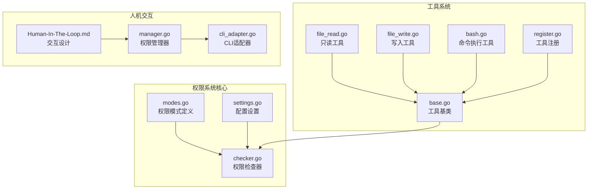
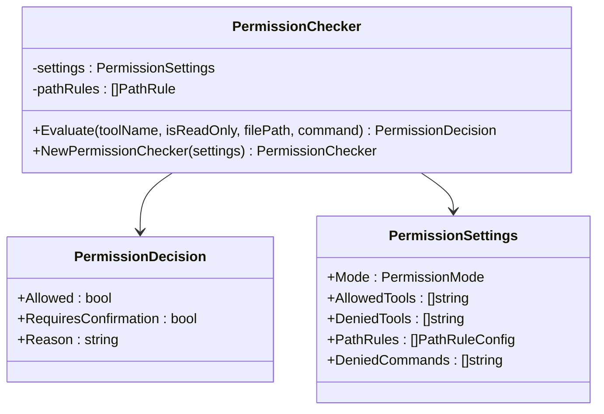
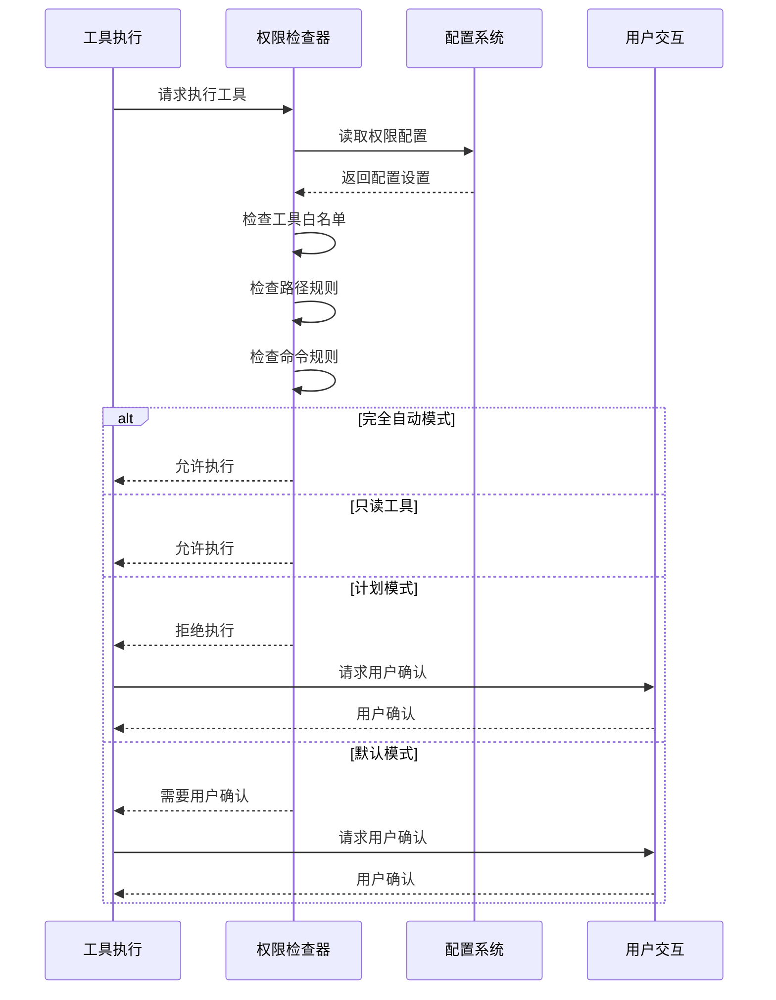
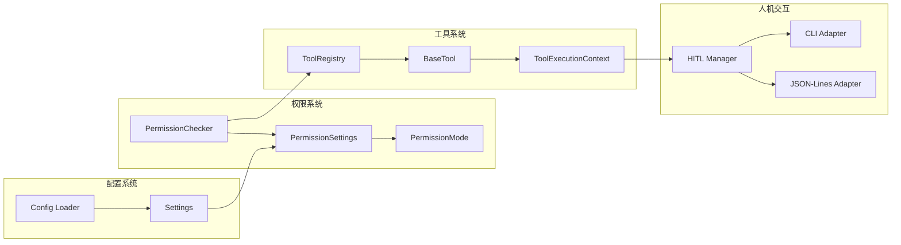

# 权限模式详解

<cite>
**本文档引用的文件**
- [modes.go](file://pkg/permissions/modes.go)
- [checker.go](file://pkg/permissions/checker.go)
- [settings.go](file://pkg/config/settings.go)
- [base.go](file://pkg/tools/base.go)
- [manager.go](file://pkg/hitl/manager.go)
- [cli_adapter.go](file://pkg/hitl/cli_adapter.go)
- [register.go](file://pkg/tools/builtin/register.go)
- [file_read.go](file://pkg/tools/builtin/file_read.go)
- [file_write.go](file://pkg/tools/builtin/file_write.go)
- [bash.go](file://pkg/tools/builtin/bash.go)
- [Human-In-The-Loop.md](file://design/Human-In-The-Loop.md)
- [TASK.md](file://design/TASK.md)
</cite>

## 目录
1. [简介](#简介)
2. [项目结构](#项目结构)
3. [核心组件](#核心组件)
4. [架构概览](#架构概览)
5. [详细组件分析](#详细组件分析)
6. [依赖关系分析](#依赖关系分析)
7. [性能考虑](#性能考虑)
8. [故障排除指南](#故障排除指南)
9. [结论](#结论)
10. [附录](#附录)

## 简介

OpenHarness 的权限模式系统提供了灵活而安全的工具执行控制机制。该系统支持四种不同的权限模式，每种模式都有其特定的安全级别和用户体验特征。本文档深入解释了四种权限模式的设计原理、行为特征以及在实际应用中的表现。

权限模式系统的核心设计理念是在自动化效率和安全性之间找到平衡点，通过渐进式的权限控制让用户能够根据具体场景选择最适合的执行模式。

## 项目结构

权限模式相关的代码主要分布在以下几个关键模块中：



**图表来源**
- [modes.go:1-28](file://pkg/permissions/modes.go#L1-L28)
- [checker.go:1-92](file://pkg/permissions/checker.go#L1-L92)
- [settings.go:1-212](file://pkg/config/settings.go#L1-L212)

**章节来源**
- [modes.go:1-28](file://pkg/permissions/modes.go#L1-L28)
- [checker.go:1-92](file://pkg/permissions/checker.go#L1-L92)
- [settings.go:1-212](file://pkg/config/settings.go#L1-L212)

## 核心组件

### 权限模式枚举

系统定义了三种核心权限模式：

| 模式名称 | 模式标识 | 安全级别 | 自动执行能力 | 用户交互需求 |
|---------|---------|---------|-------------|-------------|
| 默认模式 | `default` | 高 | 部分允许 | 需要确认 |
| 计划模式 | `plan` | 中高 | 有限允许 | 需要确认 |
| 完全自动模式 | `full_auto` | 低 | 全部允许 | 无需确认 |

### 权限检查器

权限检查器是权限系统的核心组件，负责评估工具调用的合法性：



**图表来源**
- [checker.go:25-82](file://pkg/permissions/checker.go#L25-L82)
- [settings.go:37-44](file://pkg/config/settings.go#L37-L44)

**章节来源**
- [checker.go:41-82](file://pkg/permissions/checker.go#L41-L82)
- [settings.go:37-55](file://pkg/config/settings.go#L37-L55)

## 架构概览

权限模式系统的整体架构采用分层设计，确保了灵活性和可扩展性：



**图表来源**
- [checker.go:42-82](file://pkg/permissions/checker.go#L42-L82)
- [manager.go:63-90](file://pkg/hitl/manager.go#L63-L90)

## 详细组件分析

### 完全自动模式 (Full Auto Mode)

完全自动模式是最宽松的权限控制方式，适用于高度可信的环境：

#### 设计原理
- **信任模型**：假设所有工具调用都是安全的
- **自动化优先**：最大化执行效率，最小化用户干预
- **适用场景**：受控实验室环境、内部测试工具

#### 行为特征
- 允许所有工具执行
- 无需用户确认
- 无路径规则检查
- 无命令模式检查

#### 用户交互要求
- 无用户交互
- 工具执行完全自动化
- 错误处理通过日志记录

**章节来源**
- [checker.go:72-74](file://pkg/permissions/checker.go#L72-L74)

### 计划模式 (Plan Mode)

计划模式提供了一种平衡的安全控制方式，特别适合需要严格控制但又不能完全限制的场景：

#### 设计原理
- **阶段化控制**：区分计划阶段和执行阶段
- **渐进式授权**：在计划阶段允许只读操作，在执行阶段需要确认
- **场景导向**：适合需要先探索再执行的工作流

#### 行为特征
- 拒绝所有写入类工具
- 允许只读工具执行
- 需要用户显式退出计划模式才能执行写入操作
- 提供清晰的状态指示

#### 用户交互要求
- 明确的模式状态显示
- 清晰的工具执行反馈
- 便捷的模式切换机制

**章节来源**
- [checker.go:78-80](file://pkg/permissions/checker.go#L78-L80)

### 默认模式 (Default Mode)

默认模式是系统的主要工作模式，提供标准的安全控制：

#### 设计原理
- **最小权限原则**：只允许必要的工具执行
- **用户中心**：重要操作需要用户明确授权
- **透明控制**：所有权限决策都有明确的原因说明

#### 行为特征
- 拒绝写入类工具
- 允许只读工具
- 对写入类工具请求用户确认
- 提供详细的拒绝原因

#### 用户交互要求
- 权限请求对话框
- 清晰的操作说明
- 简单的确认/拒绝流程

**章节来源**
- [checker.go:81](file://pkg/permissions/checker.go#L81)

### 只读模式 (Read-Only Mode)

只读模式专注于提供安全的文件访问能力：

#### 设计原理
- **数据保护**：防止任何可能的数据修改
- **信息获取**：允许安全地读取和分析信息
- **审计友好**：所有操作都是可追踪的

#### 行为特征
- 仅允许只读工具
- 完全禁止写入操作
- 提供丰富的文件浏览能力
- 支持搜索和过滤功能

#### 用户交互要求
- 简化的用户界面
- 直观的文件导航
- 详细的操作反馈

**章节来源**
- [checker.go:75-77](file://pkg/permissions/checker.go#L75-L77)

## 依赖关系分析

权限模式系统与其他组件的依赖关系如下：



**图表来源**
- [checker.go:25-28](file://pkg/permissions/checker.go#L25-L28)
- [settings.go:37-44](file://pkg/config/settings.go#L37-L44)
- [base.go:17-27](file://pkg/tools/base.go#L17-L27)

**章节来源**
- [checker.go:1-92](file://pkg/permissions/checker.go#L1-L92)
- [settings.go:1-212](file://pkg/config/settings.go#L1-L212)
- [base.go:1-132](file://pkg/tools/base.go#L1-L132)

## 性能考虑

权限模式系统在设计时充分考虑了性能影响：

### 检查开销
- **常量时间检查**：权限检查的时间复杂度为 O(1)
- **缓存策略**：工具白名单检查使用哈希表实现
- **早期退出**：一旦确定结果就立即返回

### 内存使用
- **配置缓存**：权限配置在内存中缓存
- **规则优化**：路径规则按模式存储，减少不必要的匹配

### 并发安全
- **无锁设计**：权限检查器是无状态的
- **线程安全**：工具注册表使用读写锁保护

## 故障排除指南

### 常见问题及解决方案

#### 权限检查失败
**症状**：工具执行被拒绝
**原因**：
- 工具在拒绝列表中
- 路径规则匹配拒绝规则
- 命令模式匹配拒绝模式

**解决方案**：
1. 检查工具是否在拒绝列表中
2. 验证路径规则配置
3. 确认命令模式设置

#### 用户确认超时
**症状**：权限请求无响应
**原因**：
- 用户未及时响应
- 交互适配器配置错误
- 网络连接问题

**解决方案**：
1. 检查交互适配器配置
2. 验证网络连接
3. 增加超时时间设置

#### 模式切换问题
**症状**：无法正确切换权限模式
**原因**：
- 配置文件格式错误
- 权限不足
- 系统状态不一致

**解决方案**：
1. 验证配置文件格式
2. 检查用户权限
3. 重启系统服务

**章节来源**
- [checker.go:48-68](file://pkg/permissions/checker.go#L48-L68)
- [manager.go:298-325](file://pkg/hitl/manager.go#L298-L325)

## 结论

OpenHarness 的权限模式系统通过精心设计的多层次安全控制，为不同场景提供了灵活而强大的工具执行管理能力。四种权限模式各有特色，用户可以根据具体需求选择最适合的模式。

系统的核心优势在于：
- **渐进式安全**：从严格的只读模式到完全自动模式的平滑过渡
- **透明控制**：所有权限决策都有明确的理由和依据
- **用户友好**：提供直观的用户交互和清晰的反馈
- **高性能**：优化的检查算法和缓存策略

通过合理选择和配置权限模式，用户可以在保证安全的前提下获得最佳的使用体验。

## 附录

### 模式选择决策指南

#### 推荐场景

| 使用场景 | 推荐模式 | 理由 |
|---------|---------|------|
| 开发调试 | 默认模式 | 平衡安全性和便利性 |
| 生产环境 | 计划模式 | 严格的执行控制 |
| 数据分析 | 只读模式 | 完全的数据保护 |
| 自动化脚本 | 完全自动模式 | 高效的批量处理 |

#### 安全考虑

1. **最小权限原则**：始终使用最低必要权限
2. **定期审查**：定期检查权限配置的有效性
3. **监控日志**：启用详细的权限执行日志
4. **备份恢复**：建立权限配置的备份机制

### 配置示例

#### 基础配置
```json
{
  "permission": {
    "mode": "default",
    "allowed_tools": [],
    "denied_tools": [],
    "path_rules": [],
    "denied_commands": []
  }
}
```

#### 高级配置
```json
{
  "permission": {
    "mode": "plan",
    "allowed_tools": ["Read", "Glob", "Grep"],
    "denied_tools": ["Write", "Bash"],
    "path_rules": [
      {"pattern": "*.txt", "allow": true},
      {"pattern": "secrets/*", "allow": false}
    ],
    "denied_commands": ["rm -rf *", "chmod 777 *"]
  }
}
```

### 最佳实践建议

1. **分层配置**：使用多层权限控制，从全局到具体路径
2. **动态调整**：根据使用场景动态调整权限设置
3. **监控告警**：建立权限使用情况的监控和告警机制
4. **定期审计**：定期审计权限配置和使用记录
5. **文档记录**：详细记录权限配置的变更历史