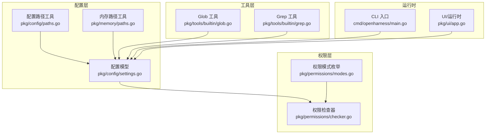
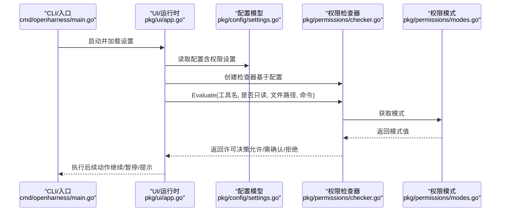
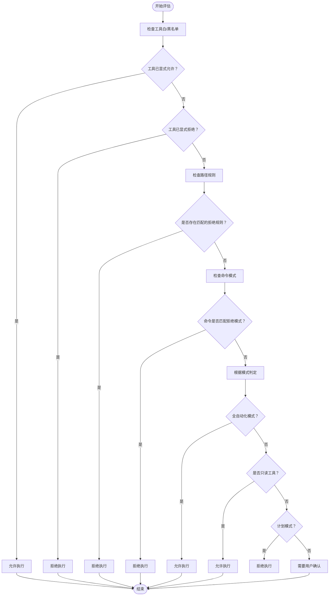
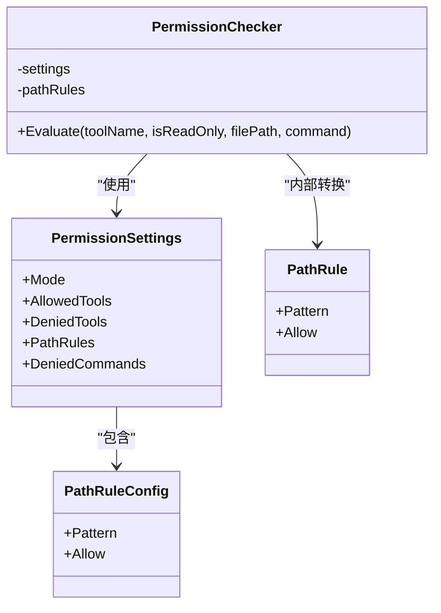
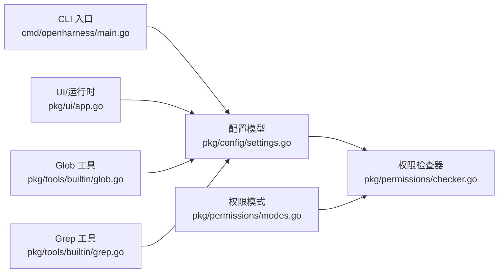

# 路径规则配置

<cite>
**本文引用的文件**
- [pkg/permissions/checker.go](file://pkg/permissions/checker.go)
- [pkg/permissions/modes.go](file://pkg/permissions/modes.go)
- [pkg/config/settings.go](file://pkg/config/settings.go)
- [pkg/config/paths.go](file://pkg/config/paths.go)
- [pkg/memory/paths.go](file://pkg/memory/paths.go)
- [pkg/tools/builtin/glob.go](file://pkg/tools/builtin/glob.go)
- [pkg/tools/builtin/grep.go](file://pkg/tools/builtin/grep.go)
- [cmd/openharness/main.go](file://cmd/openharness/main.go)
- [pkg/ui/app.go](file://pkg/ui/app.go)
</cite>

## 目录
1. [引言](#引言)
2. [项目结构](#项目结构)
3. [核心组件](#核心组件)
4. [架构总览](#架构总览)
5. [详细组件分析](#详细组件分析)
6. [依赖关系分析](#依赖关系分析)
7. [性能考量](#性能考量)
8. [故障排除指南](#故障排除指南)
9. [结论](#结论)
10. [附录](#附录)

## 引言
本文件聚焦于基于通配符（glob）的路径规则系统，系统性阐述其模式匹配机制、规则优先级与执行顺序，并深入解析 PathRule 结构体的配置项（模式定义、允许/拒绝标志、规则组合逻辑）。同时提供实际应用场景（文件系统访问控制、目录权限管理、敏感文件保护）、最佳实践、常见模式示例与故障排除建议，帮助读者在不直接阅读源码的情况下也能正确配置与使用该系统。

## 项目结构
围绕路径规则的核心代码分布在以下模块：
- 权限模型与检查器：pkg/config/settings.go 定义配置数据结构；pkg/permissions/checker.go 实现规则评估逻辑；pkg/permissions/modes.go 定义权限模式。
- 配置路径与内存路径：pkg/config/paths.go 提供配置与数据目录路径；pkg/memory/paths.go 提供内存目录路径。
- 工具与示例：pkg/tools/builtin/glob.go 与 pkg/tools/builtin/grep.go 展示了 glob 匹配在工具中的应用。
- 命令行入口与运行时：cmd/openharness/main.go 支持通过命令行参数覆盖权限模式；pkg/ui/app.go 提供交互式运行环境。

图表来源
- [pkg/config/settings.go:37-44](file://pkg/config/settings.go#L37-L44)
- [pkg/permissions/checker.go:25-28](file://pkg/permissions/checker.go#L25-L28)
- [pkg/permissions/modes.go:4-11](file://pkg/permissions/modes.go#L4-L11)
- [pkg/config/paths.go:9-28](file://pkg/config/paths.go#L9-L28)
- [pkg/memory/paths.go:12-23](file://pkg/memory/paths.go#L12-L23)
- [pkg/tools/builtin/glob.go:24-52](file://pkg/tools/builtin/glob.go#L24-L52)
- [pkg/tools/builtin/grep.go:27-59](file://pkg/tools/builtin/grep.go#L27-L59)
- [cmd/openharness/main.go:104-144](file://cmd/openharness/main.go#L104-L144)
- [pkg/ui/app.go:20-61](file://pkg/ui/app.go#L20-L61)

章节来源
- [pkg/config/settings.go:37-44](file://pkg/config/settings.go#L37-L44)
- [pkg/permissions/checker.go:25-28](file://pkg/permissions/checker.go#L25-L28)
- [pkg/permissions/modes.go:4-11](file://pkg/permissions/modes.go#L4-L11)
- [pkg/config/paths.go:9-28](file://pkg/config/paths.go#L9-L28)
- [pkg/memory/paths.go:12-23](file://pkg/memory/paths.go#L12-L23)
- [pkg/tools/builtin/glob.go:24-52](file://pkg/tools/builtin/glob.go#L24-L52)
- [pkg/tools/builtin/grep.go:27-59](file://pkg/tools/builtin/grep.go#L27-L59)
- [cmd/openharness/main.go:104-144](file://cmd/openharness/main.go#L104-L144)
- [pkg/ui/app.go:20-61](file://pkg/ui/app.go#L20-L61)

## 核心组件
- 权限模式（PermissionMode）
  - default：默认模式，读取类工具放行，写入类工具需要用户确认或被阻断。
  - plan：计划模式，阻止所有变更型工具，直到用户退出计划模式。
  - full_auto：全自动化模式，允许所有工具。
- 路径规则（PathRuleConfig 与内部 PathRule）
  - Pattern：glob 模式字符串，用于匹配文件路径。
  - Allow：布尔值，true 表示允许，false 表示拒绝。
  - 规则组合：按顺序遍历，遇到首个匹配且 Allow=false 的规则即拒绝；若无显式允许/拒绝，则进入模式判定。
- 权限检查器（PermissionChecker）
  - 评估流程：先检查工具白名单/黑名单，再检查路径规则，再检查命令模式，最后根据模式返回结果或要求确认。

章节来源
- [pkg/permissions/modes.go:4-11](file://pkg/permissions/modes.go#L4-L11)
- [pkg/config/settings.go:27-31](file://pkg/config/settings.go#L27-L31)
- [pkg/permissions/checker.go:17-21](file://pkg/permissions/checker.go#L17-L21)
- [pkg/permissions/checker.go:30-39](file://pkg/permissions/checker.go#L30-L39)
- [pkg/permissions/checker.go:41-82](file://pkg/permissions/checker.go#L41-L82)

## 架构总览
下图展示从配置到检查器再到工具调用的整体流程，以及模式与规则如何影响最终决策。

图表来源
- [cmd/openharness/main.go:104-144](file://cmd/openharness/main.go#L104-L144)
- [pkg/ui/app.go:20-61](file://pkg/ui/app.go#L20-L61)
- [pkg/config/settings.go:37-44](file://pkg/config/settings.go#L37-L44)
- [pkg/permissions/checker.go:41-82](file://pkg/permissions/checker.go#L41-L82)
- [pkg/permissions/modes.go:4-11](file://pkg/permissions/modes.go#L4-L11)

## 详细组件分析

### 权限检查器与规则匹配
- 模式匹配机制
  - 使用标准库路径匹配函数对文件路径进行 glob 匹配。
  - 命令匹配同样采用 glob 模式，用于拒绝特定命令。
- 规则优先级与执行顺序
  1) 工具白名单/黑名单：若工具在允许列表中直接放行；若在拒绝列表中直接拒绝。
  2) 路径规则：按顺序遍历路径规则，遇到首个匹配且 Allow=false 的规则即拒绝；若存在 Allow=true 的规则但未显式允许，仍会进入模式判定。
  3) 命令模式：若命令匹配拒绝模式，直接拒绝。
  4) 模式判定：根据模式返回允许、需要确认或拒绝。
- 决策结构
  - 结果包含是否允许、是否需要确认、原因说明，便于 UI 或日志输出。

图表来源
- [pkg/permissions/checker.go:41-82](file://pkg/permissions/checker.go#L41-L82)

章节来源
- [pkg/permissions/checker.go:41-82](file://pkg/permissions/checker.go#L41-L82)

### 配置模型与路径规则结构体
- PathRuleConfig（配置层）
  - 字段：Pattern（glob 模式）、Allow（布尔）。
  - 用途：作为 settings.json 中 path_rules 的元素，支持 JSON 序列化/反序列化。
- PathRule（内部转换）
  - 字段：Pattern（glob 模式）、Allow（布尔）。
  - 用途：在构建检查器时，将配置层的 PathRuleConfig 转换为内部 PathRule 列表，过滤空模式。
- PermissionSettings
  - 字段：Mode（权限模式）、AllowedTools、DeniedTools、PathRules、DeniedCommands。
  - 默认值：DefaultPermissionSettings 提供默认空集合，Mode 默认为 default。

图表来源
- [pkg/config/settings.go:37-44](file://pkg/config/settings.go#L37-L44)
- [pkg/config/settings.go:27-31](file://pkg/config/settings.go#L27-L31)
- [pkg/permissions/checker.go:25-28](file://pkg/permissions/checker.go#L25-L28)
- [pkg/permissions/checker.go:17-21](file://pkg/permissions/checker.go#L17-L21)
- [pkg/permissions/checker.go:30-39](file://pkg/permissions/checker.go#L30-L39)

章节来源
- [pkg/config/settings.go:27-31](file://pkg/config/settings.go#L27-L31)
- [pkg/config/settings.go:37-44](file://pkg/config/settings.go#L37-L44)
- [pkg/permissions/checker.go:17-21](file://pkg/permissions/checker.go#L17-L21)
- [pkg/permissions/checker.go:30-39](file://pkg/permissions/checker.go#L30-L39)

### 权限模式
- default：默认行为，读取类工具放行，写入类工具需要确认。
- plan：阻止所有变更型工具，直至用户退出计划模式。
- full_auto：允许所有工具，适合高度信任的自动化场景。

章节来源
- [pkg/permissions/modes.go:4-11](file://pkg/permissions/modes.go#L4-L11)

### 配置路径与内存路径
- 配置路径：GetConfigDir/GetConfigFilePath 等函数提供 settings.json 的位置与数据目录结构。
- 内存路径：基于项目工作目录生成哈希目录，用于存储项目专属记忆数据。

章节来源
- [pkg/config/paths.go:9-28](file://pkg/config/paths.go#L9-L28)
- [pkg/memory/paths.go:12-23](file://pkg/memory/paths.go#L12-L23)

### 工具中的 glob 匹配示例
- Glob 工具：支持在指定目录下按 glob 模式查找文件，内部使用相对路径与文件名双重匹配策略。
- Grep 工具：支持按正则表达式搜索文件内容，并可配合文件名 glob 过滤。

章节来源
- [pkg/tools/builtin/glob.go:54-105](file://pkg/tools/builtin/glob.go#L54-L105)
- [pkg/tools/builtin/grep.go:61-117](file://pkg/tools/builtin/grep.go#L61-L117)

## 依赖关系分析
- 配置层依赖
  - settings.go 定义 PermissionSettings 与 PathRuleConfig，作为权限系统的数据基础。
- 检查器依赖
  - checker.go 依赖 settings.go 的 PermissionSettings 与 modes.go 的 PermissionMode，实现规则评估。
- 工具层依赖
  - 工具（如 Glob/Grep）在执行前通常会经过权限检查器评估，确保符合路径规则与模式限制。
- 运行时依赖
  - cmd/openharness/main.go 支持通过命令行参数覆盖权限模式；pkg/ui/app.go 在交互式运行时负责构建运行时并处理用户输入。

图表来源
- [pkg/config/settings.go:37-44](file://pkg/config/settings.go#L37-L44)
- [pkg/permissions/checker.go:25-28](file://pkg/permissions/checker.go#L25-L28)
- [pkg/permissions/modes.go:4-11](file://pkg/permissions/modes.go#L4-L11)
- [cmd/openharness/main.go:104-144](file://cmd/openharness/main.go#L104-L144)
- [pkg/ui/app.go:20-61](file://pkg/ui/app.go#L20-L61)
- [pkg/tools/builtin/glob.go:24-52](file://pkg/tools/builtin/glob.go#L24-L52)
- [pkg/tools/builtin/grep.go:27-59](file://pkg/tools/builtin/grep.go#L27-L59)

章节来源
- [pkg/config/settings.go:37-44](file://pkg/config/settings.go#L37-L44)
- [pkg/permissions/checker.go:25-28](file://pkg/permissions/checker.go#L25-L28)
- [pkg/permissions/modes.go:4-11](file://pkg/permissions/modes.go#L4-L11)
- [cmd/openharness/main.go:104-144](file://cmd/openharness/main.go#L104-L144)
- [pkg/ui/app.go:20-61](file://pkg/ui/app.go#L20-L61)
- [pkg/tools/builtin/glob.go:24-52](file://pkg/tools/builtin/glob.go#L24-L52)
- [pkg/tools/builtin/grep.go:27-59](file://pkg/tools/builtin/grep.go#L27-L59)

## 性能考量
- 规则遍历成本：路径规则按顺序线性遍历，规则数量较多时应合理组织顺序，将高频/高命中率规则靠前放置以减少匹配次数。
- 模式复杂度：glob 模式的复杂程度会影响匹配性能，建议避免过于宽泛的模式导致大量文件扫描。
- 工具扫描范围：Glob/Grep 工具在目录树上进行遍历，建议限定 baseDir 与 include 过滤条件，减少 IO 开销。
- 模式判定短路：工具白/黑名单与命令模式优先判定，有助于快速拒绝明显不符合的请求。

## 故障排除指南
- 规则未生效
  - 检查 Pattern 是否为空；空模式不会被转换为内部规则。
  - 确认 Allow 标志与期望一致；Allow=false 的规则会拒绝匹配路径。
  - 确认路径是否使用了正确的分隔符与相对/绝对路径形式。
- 模式不生效
  - 确认权限模式设置是否为 full_auto（允许所有）或 plan（阻止变更型工具）。
  - 若工具在 AllowedTools/DeniedTools 中，将覆盖路径规则与模式判定。
- 命令被误拒
  - 检查 DeniedCommands 是否包含对应命令的 glob 模式。
- 交互式运行时行为异常
  - 通过命令行参数覆盖权限模式，验证不同模式下的行为差异。
  - 检查 UI 输出的决策原因，定位具体触发点。

章节来源
- [pkg/permissions/checker.go:30-39](file://pkg/permissions/checker.go#L30-L39)
- [pkg/permissions/checker.go:41-82](file://pkg/permissions/checker.go#L41-L82)
- [cmd/openharness/main.go:104-144](file://cmd/openharness/main.go#L104-L144)

## 结论
该路径规则系统以 glob 模式为核心，结合工具白/黑名单、命令模式与权限模式，形成清晰的优先级与执行顺序。PathRuleConfig 与 PathRule 的分离设计使配置与执行解耦，便于扩展与维护。通过合理的规则组织与模式选择，可在保证安全的前提下灵活支持多种使用场景。

## 附录

### 实际应用场景
- 文件系统访问控制
  - 仅允许读取特定目录（如只读访问），拒绝写入操作。
  - 对敏感文件（如密钥、日志）设置拒绝规则，防止意外修改。
- 目录权限管理
  - 限制工具在项目根目录外的访问，确保操作边界。
  - 通过 glob 模式精确控制子目录可见性与可写性。
- 敏感文件保护
  - 将包含机密信息的文件纳入拒绝规则，或仅允许特定工具访问。

### 最佳实践
- 明确优先级
  - 将最严格的拒绝规则放在前面，避免宽泛模式覆盖更具体的允许规则。
- 分层治理
  - 使用 AllowedTools/DeniedTools 快速封禁高风险工具；使用 PathRules 精细化路径控制；使用 DeniedCommands 阻止危险命令。
- 模式选择
  - 默认场景使用 default；需要严格控制时使用 plan；高度信任的自动化场景使用 full_auto。
- 可观测性
  - 依据 PermissionDecision.Reason 输出明确的拒绝/确认原因，便于审计与排错。

### 常见模式示例（描述性）
- 仅允许读取
  - 工具白名单包含常用只读工具；路径规则允许特定目录；模式设为 default。
- 限制到项目根
  - 路径规则拒绝所有不在项目根目录下的路径；允许只读工具。
- 敏感文件隔离
  - 路径规则拒绝包含“secret”“log”等关键词的文件；允许只读工具；模式设为 default。
- 自动化测试
  - 模式设为 full_auto；仅在 CI 环境启用；工具白名单限定为安全工具集。