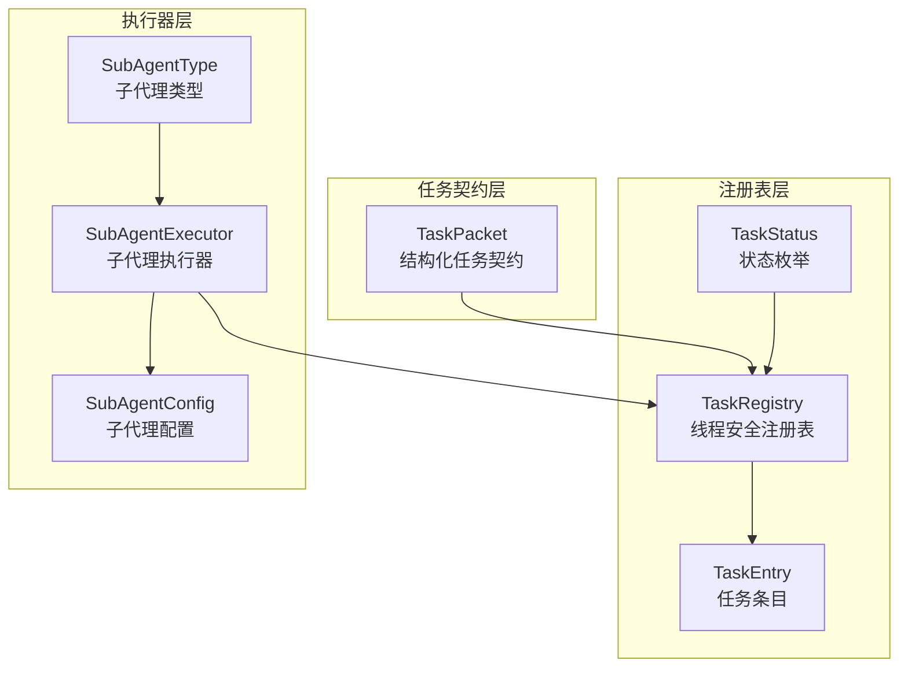
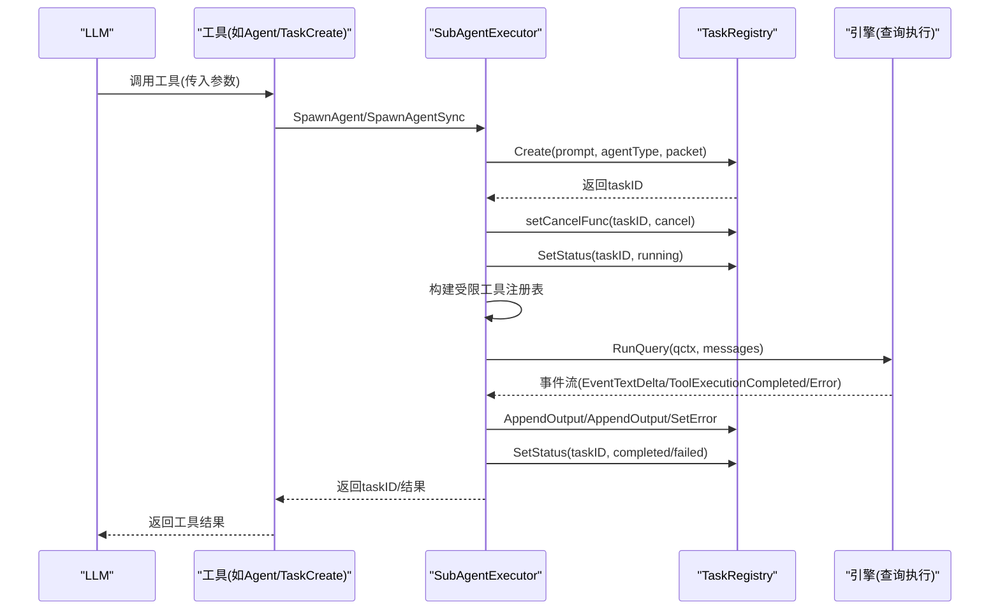
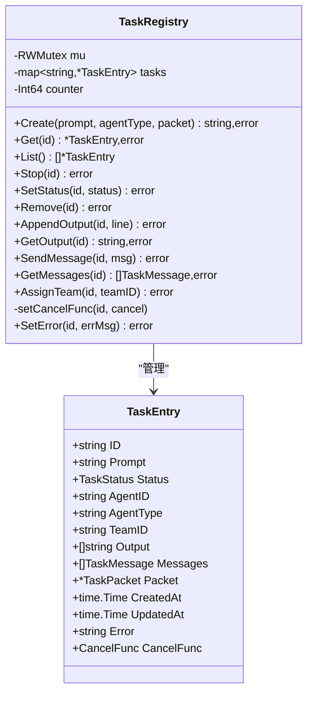
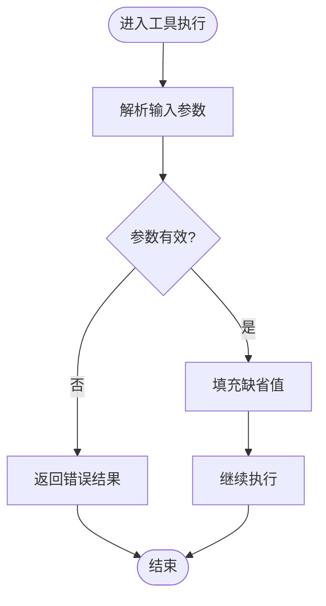
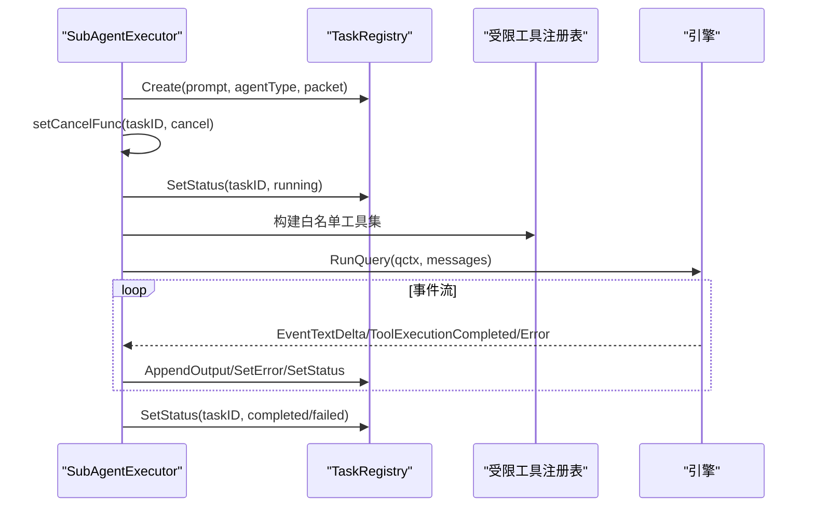
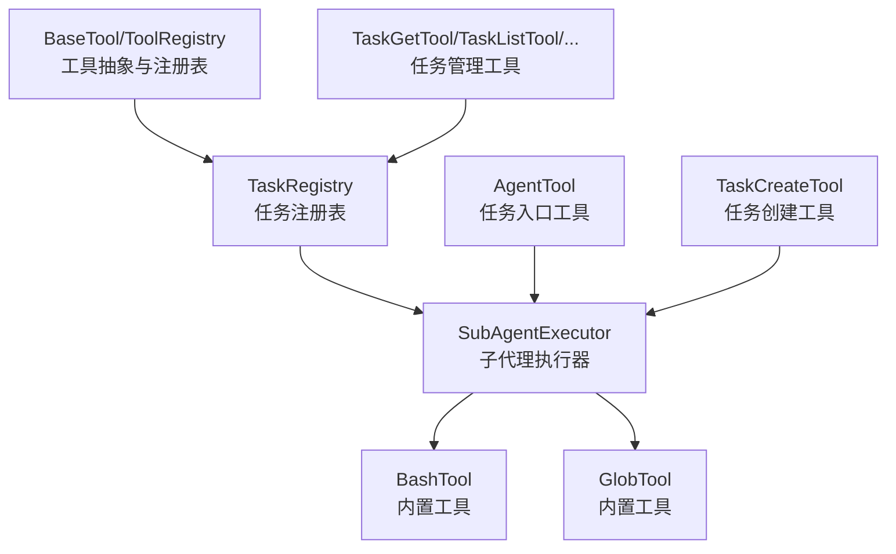

# 任务注册表扩展

<cite>
**本文引用的文件**
- [pkg/tasks/registry.go](file://pkg/tasks/registry.go)
- [pkg/tasks/types.go](file://pkg/tasks/types.go)
- [pkg/tasks/executor.go](file://pkg/tasks/executor.go)
- [design/TASK.md](file://design/TASK.md)
- [pkg/tools/base.go](file://pkg/tools/base.go)
- [pkg/tools/builtin/register.go](file://pkg/tools/builtin/register.go)
- [pkg/tools/builtin/agent.go](file://pkg/tools/builtin/agent.go)
- [pkg/tools/builtin/task_tools.go](file://pkg/tools/builtin/task_tools.go)
- [pkg/tools/builtin/bash.go](file://pkg/tools/builtin/bash.go)
- [pkg/tools/builtin/glob.go](file://pkg/tools/builtin/glob.go)
</cite>

## 目录
1. [简介](#简介)
2. [项目结构](#项目结构)
3. [核心组件](#核心组件)
4. [架构总览](#架构总览)
5. [详细组件分析](#详细组件分析)
6. [依赖分析](#依赖分析)
7. [性能考虑](#性能考虑)
8. [故障排查指南](#故障排查指南)
9. [结论](#结论)
10. [附录](#附录)

## 简介
本文件围绕任务注册表扩展进行深入技术文档化，覆盖以下主题：
- 任务注册表的数据结构与注册机制：任务类型定义、参数校验、生命周期管理
- 任务执行器工作流：任务调度、并发控制、错误处理
- 任务扩展实现指南：新增任务类型、参数配置、执行逻辑
- 注册表扩展点：自定义任务处理器、任务过滤器、优先级管理
- 性能优化与资源管理策略
- 开发最佳实践与示例代码路径

## 项目结构
任务系统由三层组成：
- 任务契约层（TaskPacket）：结构化任务描述
- 注册表层（TaskRegistry）：线程安全的任务状态与数据存储
- 执行器层（SubAgentExecutor）：子代理执行、工具沙箱、并发调度

图表来源
- [pkg/tasks/types.go:18-49](file://pkg/tasks/types.go#L18-L49)
- [pkg/tasks/registry.go:13-17](file://pkg/tasks/registry.go#L13-L17)
- [pkg/tasks/executor.go:24-31](file://pkg/tasks/executor.go#L24-L31)

章节来源
- [design/TASK.md:10-47](file://design/TASK.md#L10-L47)
- [pkg/tasks/types.go:8-59](file://pkg/tasks/types.go#L8-L59)
- [pkg/tasks/registry.go:13-191](file://pkg/tasks/registry.go#L13-L191)
- [pkg/tasks/executor.go:24-224](file://pkg/tasks/executor.go#L24-L224)

## 核心组件
- 任务状态与消息
  - 状态枚举：created、running、completed、failed、stopped
  - 任务消息：包含来源、内容、时间戳
- 任务条目
  - 关键字段：ID、Prompt、Status、AgentID、AgentType、TeamID、Output、Messages、Packet、CreatedAt、UpdatedAt、Error、CancelFunc
- 任务包（TaskPacket）
  - 结构化契约：Objective、Scope、Repo、BranchPolicy、AcceptanceTests、CommitPolicy、ReportingContract、EscalationPolicy
- 注册表（TaskRegistry）
  - 提供创建、查询、列表、停止、更新、删除、追加输出、获取输出、发送消息、获取消息、分配团队等能力
  - 使用读写锁保证并发安全，原子计数器生成唯一ID
- 执行器（SubAgentExecutor）
  - 通过SpawnAgent/SpawnAgentSync创建并启动子代理任务
  - 构建受限工具注册表（白名单沙箱）
  - 运行引擎查询，收集增量输出，最终标记完成或失败

章节来源
- [pkg/tasks/types.go:8-59](file://pkg/tasks/types.go#L8-L59)
- [pkg/tasks/registry.go:13-191](file://pkg/tasks/registry.go#L13-L191)
- [pkg/tasks/executor.go:24-224](file://pkg/tasks/executor.go#L24-L224)

## 架构总览
任务系统采用“任务注册表 + 子代理执行器”的分层架构。主流程如下：
- LLM调用工具（如Agent/TaskCreate）触发任务创建
- 执行器在注册表中创建任务条目，设置状态为running，并启动goroutine执行
- 执行器构建受限工具集（白名单沙箱），构造系统提示词，调用引擎执行
- 执行过程中事件流驱动输出累积与错误处理，最终更新状态为completed或failed

图表来源
- [pkg/tasks/executor.go:33-137](file://pkg/tasks/executor.go#L33-L137)
- [pkg/tasks/registry.go:30-102](file://pkg/tasks/registry.go#L30-L102)
- [pkg/tools/builtin/agent.go:43-71](file://pkg/tools/builtin/agent.go#L43-L71)
- [pkg/tools/builtin/task_tools.go:43-67](file://pkg/tools/builtin/task_tools.go#L43-L67)

## 详细组件分析

### 任务注册表（TaskRegistry）
- 数据结构
  - 任务映射：id -> TaskEntry
  - 读写锁：保护并发访问
  - 原子计数器：生成唯一ID
- 关键方法
  - Create：创建任务条目并初始化状态
  - Get/List/Stop/SetStatus/Remove：查询、排序列出、停止、状态更新、删除
  - AppendOutput/GetOutput：累积输出与读取
  - SendMessage/GetMessages：消息收发
  - AssignTeam：分配团队
  - setCancelFunc：注入取消函数
  - SetError：记录错误信息
- 生命周期管理
  - 仅允许从created或running转为stopped
  - 失败时设置failed并记录错误
  - 列表按创建时间排序

图表来源
- [pkg/tasks/registry.go:13-191](file://pkg/tasks/registry.go#L13-L191)
- [pkg/tasks/types.go:29-43](file://pkg/tasks/types.go#L29-L43)

章节来源
- [pkg/tasks/registry.go:13-191](file://pkg/tasks/registry.go#L13-L191)
- [pkg/tasks/types.go:29-43](file://pkg/tasks/types.go#L29-L43)

### 任务类型与参数校验
- 任务状态（TaskStatus）
  - created、running、completed、failed、stopped
- 子代理类型（SubAgentType）
  - general-purpose、Explore、Plan、Verification
- 参数校验
  - Agent/TaskCreate工具对必填字段进行校验
  - 输入解析失败时返回错误结果
  - 缺省值处理：agent_type缺省为general-purpose

图表来源
- [pkg/tools/builtin/agent.go:43-71](file://pkg/tools/builtin/agent.go#L43-L71)
- [pkg/tools/builtin/task_tools.go:43-67](file://pkg/tools/builtin/task_tools.go#L43-L67)

章节来源
- [pkg/tasks/types.go:8-16](file://pkg/tasks/types.go#L8-L16)
- [pkg/tasks/types.go:51-59](file://pkg/tasks/types.go#L51-L59)
- [pkg/tools/builtin/agent.go:43-71](file://pkg/tools/builtin/agent.go#L43-L71)
- [pkg/tools/builtin/task_tools.go:43-67](file://pkg/tools/builtin/task_tools.go#L43-L67)

### 执行器工作流（SubAgentExecutor）
- 启动方式
  - SpawnAgent：异步启动，返回taskID
  - SpawnAgentSync：同步执行，直接返回结果
- 工具沙箱
  - 根据子代理类型构建白名单
  - 若显式指定AllowedTools，则使用显式列表
- 系统提示词
  - 根据子代理角色动态生成
  - 注入可用工具清单
- 执行过程
  - 构建查询上下文（模型、最大令牌、最大轮次等）
  - 事件驱动：文本增量、工具执行完成、错误
  - 错误处理：设置failed并记录错误
  - 完成后设置completed

图表来源
- [pkg/tasks/executor.go:33-137](file://pkg/tasks/executor.go#L33-L137)
- [pkg/tasks/executor.go:139-176](file://pkg/tasks/executor.go#L139-L176)
- [pkg/tasks/executor.go:178-204](file://pkg/tasks/executor.go#L178-L204)

章节来源
- [pkg/tasks/executor.go:24-224](file://pkg/tasks/executor.go#L24-L224)

### 任务扩展实现指南
- 新增任务类型
  - 在SubAgentType中定义新类型
  - 在工具白名单中为新类型配置AllowedTools
  - 在系统提示词生成逻辑中补充角色描述
- 参数配置
  - 在SubAgentConfig中扩展字段（如MaxTurns、SystemPrompt、AllowedTools）
  - 在工具输入Schema中声明新参数
- 执行逻辑
  - 在执行器中根据新类型调整沙箱与提示词
  - 在事件处理中补充新事件类型或输出格式
- 示例代码路径
  - 子代理类型与白名单：[pkg/tasks/executor.go:165-176](file://pkg/tasks/executor.go#L165-L176)
  - 系统提示词构建：[pkg/tasks/executor.go:178-204](file://pkg/tasks/executor.go#L178-L204)
  - 工具输入Schema（Agent/TaskCreate）：[pkg/tools/builtin/agent.go:24-40](file://pkg/tools/builtin/agent.go#L24-L40)，[pkg/tools/builtin/task_tools.go:24-40](file://pkg/tools/builtin/task_tools.go#L24-L40)

章节来源
- [pkg/tasks/executor.go:165-176](file://pkg/tasks/executor.go#L165-L176)
- [pkg/tasks/executor.go:178-204](file://pkg/tasks/executor.go#L178-L204)
- [pkg/tools/builtin/agent.go:24-40](file://pkg/tools/builtin/agent.go#L24-L40)
- [pkg/tools/builtin/task_tools.go:24-40](file://pkg/tools/builtin/task_tools.go#L24-L40)

### 注册表扩展点
- 自定义任务处理器
  - 通过TaskRegistry扩展业务处理器，实现自定义状态流转与输出聚合
- 任务过滤器
  - 在List中可按AgentType、TeamID、Status等条件筛选
- 优先级管理
  - 可在TaskEntry中引入Priority字段，并在List中按优先级排序
- 示例代码路径
  - 列表与排序：[pkg/tasks/registry.go:61-72](file://pkg/tasks/registry.go#L61-L72)
  - 分配团队：[pkg/tasks/registry.go:160-170](file://pkg/tasks/registry.go#L160-L170)

章节来源
- [pkg/tasks/registry.go:61-72](file://pkg/tasks/registry.go#L61-L72)
- [pkg/tasks/registry.go:160-170](file://pkg/tasks/registry.go#L160-L170)

## 依赖分析
- 工具抽象与注册表
  - BaseTool定义工具契约；ToolRegistry提供线程安全注册与API Schema导出
- 内置工具注册
  - RegisterAll将常用工具注册到全局注册表
- 任务相关工具
  - AgentTool、TaskCreateTool、TaskGetTool、TaskListTool、TaskStopTool、TaskOutputTool、TaskSendMessageTool、TaskUpdateTool均依赖TaskRegistry或SubAgentExecutor

图表来源
- [pkg/tools/base.go:51-132](file://pkg/tools/base.go#L51-L132)
- [pkg/tools/builtin/register.go:7-29](file://pkg/tools/builtin/register.go#L7-L29)
- [pkg/tools/builtin/agent.go:12-41](file://pkg/tools/builtin/agent.go#L12-L41)
- [pkg/tools/builtin/task_tools.go:12-67](file://pkg/tools/builtin/task_tools.go#L12-L67)
- [pkg/tools/builtin/bash.go:24-53](file://pkg/tools/builtin/bash.go#L24-L53)
- [pkg/tools/builtin/glob.go:24-52](file://pkg/tools/builtin/glob.go#L24-L52)

章节来源
- [pkg/tools/base.go:51-132](file://pkg/tools/base.go#L51-L132)
- [pkg/tools/builtin/register.go:7-29](file://pkg/tools/builtin/register.go#L7-L29)
- [pkg/tools/builtin/agent.go:12-41](file://pkg/tools/builtin/agent.go#L12-L41)
- [pkg/tools/builtin/task_tools.go:12-67](file://pkg/tools/builtin/task_tools.go#L12-L67)
- [pkg/tools/builtin/bash.go:24-53](file://pkg/tools/builtin/bash.go#L24-L53)
- [pkg/tools/builtin/glob.go:24-52](file://pkg/tools/builtin/glob.go#L24-L52)

## 性能考虑
- 并发与锁
  - 注册表使用读写锁，读多写少场景下提升吞吐
- 事件流与输出累积
  - 事件驱动增量输出，避免一次性大块拼接
- 工具沙箱
  - 白名单限制减少不必要的工具加载与权限检查
- 资源管理
  - 通过CancelFunc及时取消长时间运行任务
  - 限制子代理最大轮次（默认32轮）防止无限循环
- 自动压缩（建议）
  - 可在引擎侧基于token阈值进行消息压缩，降低上下文开销

章节来源
- [pkg/tasks/registry.go:13-191](file://pkg/tasks/registry.go#L13-L191)
- [pkg/tasks/executor.go:14-14](file://pkg/tasks/executor.go#L14)
- [pkg/tasks/executor.go:78-137](file://pkg/tasks/executor.go#L78-L137)

## 故障排查指南
- 常见错误
  - 任务不存在：Create/Get/Stop/SetStatus/Remove/AppendOutput/GetOutput/SendMessage/GetMessages/AssignTeam均会返回“not found”
  - 任务状态不合法：仅running或created可被停止
  - 工具输入无效：Agent/TaskCreate等工具对输入进行校验并返回错误
- 排查步骤
  - 使用TaskGet/TaskList确认任务状态与ID
  - 使用TaskOutput获取中间输出定位问题
  - 使用TaskStop取消长时间运行任务
  - 检查系统提示词与工具白名单是否匹配子代理类型
- 示例代码路径
  - 任务查询与输出：[pkg/tools/builtin/task_tools.go:95-108](file://pkg/tools/builtin/task_tools.go#L95-L108)，[pkg/tools/builtin/task_tools.go:223-238](file://pkg/tools/builtin/task_tools.go#L223-L238)
  - 任务停止：[pkg/tools/builtin/task_tools.go:184-195](file://pkg/tools/builtin/task_tools.go#L184-L195)
  - 输入校验与错误返回：[pkg/tools/builtin/agent.go:48-53](file://pkg/tools/builtin/agent.go#L48-L53)，[pkg/tools/builtin/task_tools.go:48-53](file://pkg/tools/builtin/task_tools.go#L48-L53)

章节来源
- [pkg/tasks/registry.go:51-112](file://pkg/tasks/registry.go#L51-L112)
- [pkg/tools/builtin/task_tools.go:95-108](file://pkg/tools/builtin/task_tools.go#L95-L108)
- [pkg/tools/builtin/task_tools.go:184-195](file://pkg/tools/builtin/task_tools.go#L184-L195)
- [pkg/tools/builtin/agent.go:48-53](file://pkg/tools/builtin/agent.go#L48-L53)
- [pkg/tools/builtin/task_tools.go:48-53](file://pkg/tools/builtin/task_tools.go#L48-L53)

## 结论
任务注册表扩展提供了清晰的三层架构：结构化任务契约、线程安全注册表与子代理执行器。通过工具白名单沙箱、事件驱动输出与状态机管理，系统实现了高并发、可扩展且可观测的任务执行框架。建议在实际工程中结合业务需求扩展子代理类型、完善参数校验与错误处理，并在引擎侧引入消息压缩与轮次限制以保障稳定性。

## 附录
- 设计文档要点
  - 任务类型与工具白名单对照表
  - 任务生命周期状态转换
  - 工具输入Schema与只读标记
- 示例代码路径
  - 子代理类型与白名单：[pkg/tasks/executor.go:165-176](file://pkg/tasks/executor.go#L165-L176)
  - 系统提示词构建：[pkg/tasks/executor.go:178-204](file://pkg/tasks/executor.go#L178-L204)
  - Agent工具输入Schema：[pkg/tools/builtin/agent.go:24-40](file://pkg/tools/builtin/agent.go#L24-L40)
  - TaskCreate工具输入Schema：[pkg/tools/builtin/task_tools.go:24-40](file://pkg/tools/builtin/task_tools.go#L24-L40)
  - Bash工具输入Schema：[pkg/tools/builtin/bash.go:36-52](file://pkg/tools/builtin/bash.go#L36-L52)
  - Glob工具输入Schema：[pkg/tools/builtin/glob.go:36-51](file://pkg/tools/builtin/glob.go#L36-L51)

章节来源
- [design/TASK.md:49-58](file://design/TASK.md#L49-L58)
- [design/TASK.md:256-283](file://design/TASK.md#L256-L283)
- [pkg/tasks/executor.go:165-176](file://pkg/tasks/executor.go#L165-L176)
- [pkg/tasks/executor.go:178-204](file://pkg/tasks/executor.go#L178-L204)
- [pkg/tools/builtin/agent.go:24-40](file://pkg/tools/builtin/agent.go#L24-L40)
- [pkg/tools/builtin/task_tools.go:24-40](file://pkg/tools/builtin/task_tools.go#L24-L40)
- [pkg/tools/builtin/bash.go:36-52](file://pkg/tools/builtin/bash.go#L36-L52)
- [pkg/tools/builtin/glob.go:36-51](file://pkg/tools/builtin/glob.go#L36-L51)