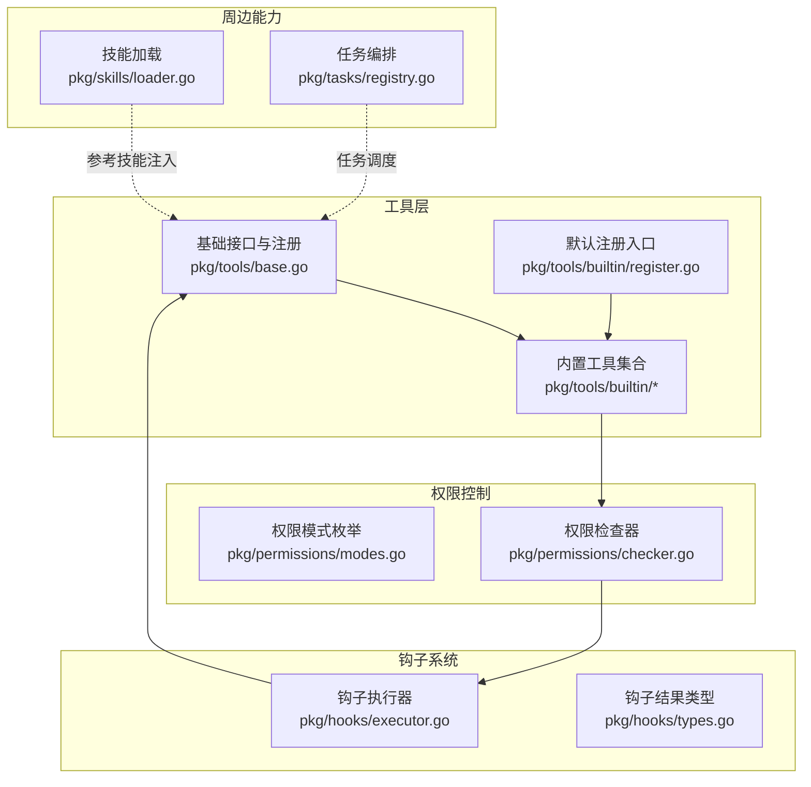
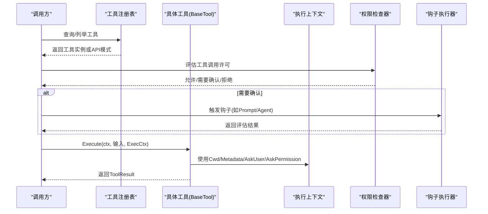
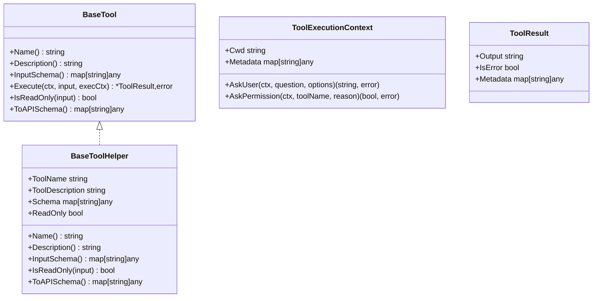
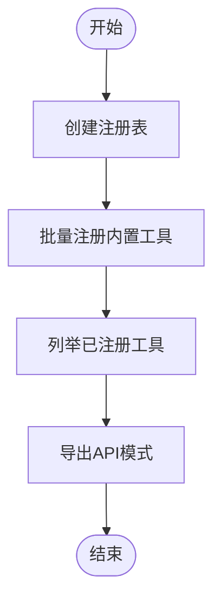
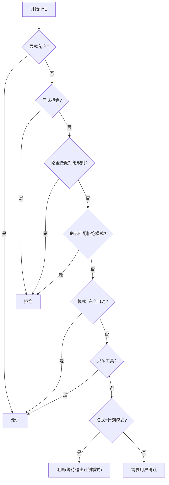
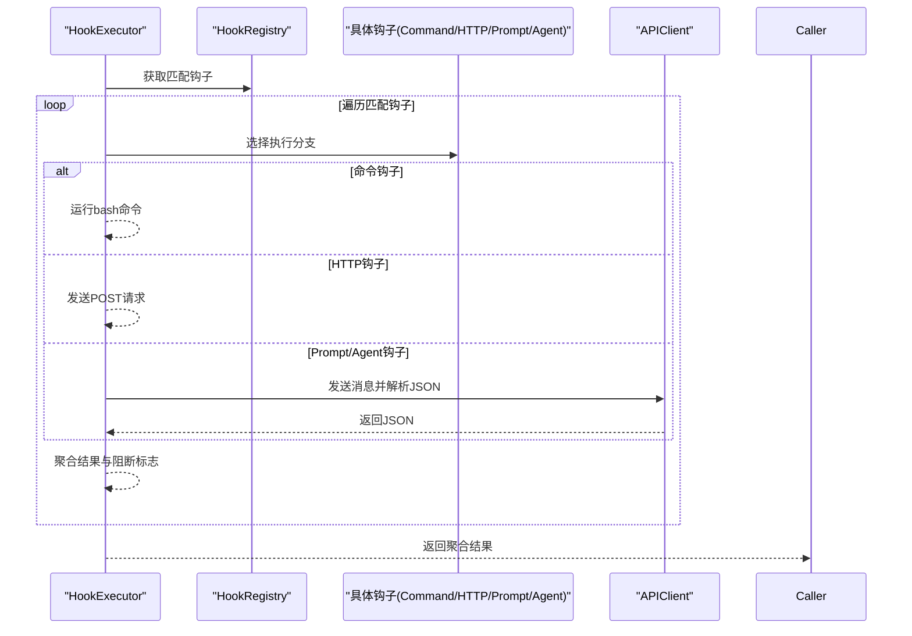
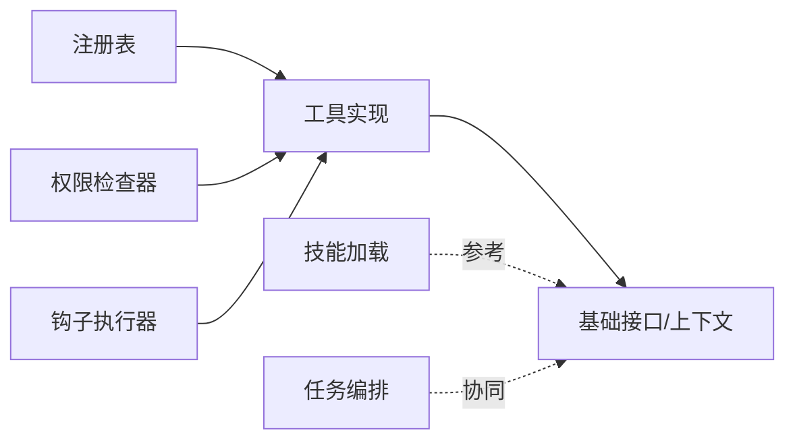

# 工具接口扩展

<cite>
**本文引用的文件**
- [pkg/tools/base.go](file://pkg/tools/base.go)
- [pkg/tools/builtin/register.go](file://pkg/tools/builtin/register.go)
- [pkg/tools/builtin/bash.go](file://pkg/tools/builtin/bash.go)
- [pkg/tools/builtin/file_read.go](file://pkg/tools/builtin/file_read.go)
- [pkg/tools/builtin/file_write.go](file://pkg/tools/builtin/file_write.go)
- [pkg/tools/builtin/file_edit.go](file://pkg/tools/builtin/file_edit.go)
- [pkg/tools/builtin/glob.go](file://pkg/tools/builtin/glob.go)
- [pkg/tools/builtin/grep.go](file://pkg/tools/builtin/grep.go)
- [pkg/tools/builtin/ask_user_question.go](file://pkg/tools/builtin/ask_user_question.go)
- [pkg/permissions/checker.go](file://pkg/permissions/checker.go)
- [pkg/permissions/modes.go](file://pkg/permissions/modes.go)
- [pkg/hooks/executor.go](file://pkg/hooks/executor.go)
- [pkg/hooks/types.go](file://pkg/hooks/types.go)
- [pkg/skills/loader.go](file://pkg/skills/loader.go)
- [pkg/tasks/registry.go](file://pkg/tasks/registry.go)
</cite>

## 目录
1. [引言](#引言)
2. [项目结构](#项目结构)
3. [核心组件](#核心组件)
4. [架构总览](#架构总览)
5. [详细组件分析](#详细组件分析)
6. [依赖分析](#依赖分析)
7. [性能考量](#性能考量)
8. [故障排查指南](#故障排查指南)
9. [结论](#结论)
10. [附录：开发与集成示例](#附录开发与集成示例)

## 引言
本文件面向“工具接口”的扩展与实践，系统阐述工具基类的抽象定义、通用方法与属性；解释工具注册机制与工具发现流程；给出自定义工具开发的完整指南（接口实现、参数定义、执行逻辑）；展示扩展点（工具装饰器、工具链组合、工具工厂模式）；分析安全与权限控制；并提供测试策略与性能优化建议。内容以仓库现有实现为依据，结合概念性图示帮助读者快速上手。

## 项目结构
工具系统位于 pkg/tools 下，包含基础抽象、内置工具与注册入口；权限控制位于 pkg/permissions；钩子系统（可作为工具执行前后的扩展点）位于 pkg/hooks；技能加载与任务编排在 pkg/skills 与 pkg/tasks 中，便于理解工具在整个执行链路中的位置。

图表来源
- [pkg/tools/base.go:1-132](file://pkg/tools/base.go#L1-L132)
- [pkg/tools/builtin/register.go:1-30](file://pkg/tools/builtin/register.go#L1-L30)
- [pkg/permissions/checker.go:1-92](file://pkg/permissions/checker.go#L1-L92)
- [pkg/permissions/modes.go:1-28](file://pkg/permissions/modes.go#L1-L28)
- [pkg/hooks/executor.go:1-336](file://pkg/hooks/executor.go#L1-L336)
- [pkg/hooks/types.go:1-44](file://pkg/hooks/types.go#L1-L44)
- [pkg/skills/loader.go:1-198](file://pkg/skills/loader.go#L1-L198)
- [pkg/tasks/registry.go:1-191](file://pkg/tasks/registry.go#L1-L191)

章节来源
- [pkg/tools/base.go:1-132](file://pkg/tools/base.go#L1-L132)
- [pkg/tools/builtin/register.go:1-30](file://pkg/tools/builtin/register.go#L1-L30)
- [pkg/permissions/checker.go:1-92](file://pkg/permissions/checker.go#L1-L92)
- [pkg/permissions/modes.go:1-28](file://pkg/permissions/modes.go#L1-L28)
- [pkg/hooks/executor.go:1-336](file://pkg/hooks/executor.go#L1-L336)
- [pkg/hooks/types.go:1-44](file://pkg/hooks/types.go#L1-L44)
- [pkg/skills/loader.go:1-198](file://pkg/skills/loader.go#L1-L198)
- [pkg/tasks/registry.go:1-191](file://pkg/tasks/registry.go#L1-L191)

## 核心组件
- 基础接口与上下文
  - BaseTool：统一的工具契约，要求实现名称、描述、输入模式、执行、只读判定、API模式导出等方法。
  - ToolExecutionContext：执行上下文，包含工作目录、任意元数据，以及用户问答与权限请求回调。
  - ToolResult：不可变的工具执行结果，包含输出、错误标记与元数据。
- 工具辅助器
  - BaseToolHelper：为实现者提供默认的名称、描述、输入模式与API模式导出；可选覆盖只读判定。
- 注册中心
  - ToolRegistry：线程安全的工具注册表，支持注册、查询、列举与API模式导出。

章节来源
- [pkg/tools/base.go:11-132](file://pkg/tools/base.go#L11-L132)

## 架构总览
工具系统采用“接口 + 注册表 + 内置工具集”的分层设计。调用方通过注册表发现工具，按需执行；权限控制在执行前介入；钩子系统可作为前置/后置扩展点参与决策或副作用处理。

图表来源
- [pkg/tools/base.go:51-132](file://pkg/tools/base.go#L51-L132)
- [pkg/permissions/checker.go:41-82](file://pkg/permissions/checker.go#L41-L82)
- [pkg/hooks/executor.go:67-105](file://pkg/hooks/executor.go#L67-L105)

## 详细组件分析

### 基础接口与上下文
- 接口职责
  - Name/Description：标识与文档化。
  - InputSchema/ToAPISchema：声明输入结构与对外API模式。
  - Execute：实际执行逻辑，接收上下文、原始输入与执行上下文。
  - IsReadOnly：是否只读，用于权限与模式判断。
- 上下文与结果
  - ToolExecutionContext：承载工作目录、任意元数据，以及交互式回调（AskUser、AskPermission）。
  - ToolResult：不可变输出，便于并发安全与结果传播。

图表来源
- [pkg/tools/base.go:51-79](file://pkg/tools/base.go#L51-L79)
- [pkg/tools/base.go:17-49](file://pkg/tools/base.go#L17-L49)

章节来源
- [pkg/tools/base.go:51-79](file://pkg/tools/base.go#L51-L79)
- [pkg/tools/base.go:17-49](file://pkg/tools/base.go#L17-L49)

### 工具注册机制与发现流程
- 注册表
  - 线程安全容器，键为工具名，值为BaseTool实例。
  - 支持注册、查询、列举、导出API模式。
- 默认注册
  - 提供批量注册内置工具与便捷构造默认注册表的方法。

图表来源
- [pkg/tools/builtin/register.go:7-29](file://pkg/tools/builtin/register.go#L7-L29)
- [pkg/tools/base.go:81-131](file://pkg/tools/base.go#L81-L131)

章节来源
- [pkg/tools/builtin/register.go:7-29](file://pkg/tools/builtin/register.go#L7-L29)
- [pkg/tools/base.go:81-131](file://pkg/tools/base.go#L81-L131)

### 内置工具实现要点
- BashTool
  - 输入：命令字符串与可选超时秒数。
  - 执行：在子进程中运行bash命令，支持上下文超时、合并标准输出与错误输出。
  - 安全：默认非只读；超时与错误均转换为ToolResult。
- FileReadTool
  - 输入：文件路径与可选偏移/限制。
  - 执行：相对路径基于工作目录解析，按行切分并截取。
  - 安全：只读工具。
- FileWriteTool
  - 输入：文件路径与内容。
  - 执行：确保父目录存在后写入文件。
  - 安全：非只读；失败时返回错误结果。
- FileEditTool
  - 输入：文件路径、旧字符串、新字符串。
  - 执行：唯一替换，失败时返回错误结果。
  - 安全：非只读。
- GlobTool
  - 输入：通配符模式与可选搜索根路径。
  - 执行：遍历目录树匹配相对路径或文件名。
  - 安全：只读。
- GrepTool
  - 输入：正则表达式、可选根路径与文件名过滤。
  - 执行：遍历文件，扫描匹配行，限制最大结果数量。
  - 安全：只读。
- ask_user_question
  - 输入：问题文本与可选选项列表。
  - 执行：通过执行上下文回调获取用户回答；若无前端回调则提示不可用。
  - 安全：只读。

章节来源
- [pkg/tools/builtin/bash.go:18-99](file://pkg/tools/builtin/bash.go#L18-L99)
- [pkg/tools/builtin/file_read.go:18-99](file://pkg/tools/builtin/file_read.go#L18-L99)
- [pkg/tools/builtin/file_write.go:17-80](file://pkg/tools/builtin/file_write.go#L17-L80)
- [pkg/tools/builtin/file_edit.go:18-98](file://pkg/tools/builtin/file_edit.go#L18-L98)
- [pkg/tools/builtin/glob.go:18-106](file://pkg/tools/builtin/glob.go#L18-L106)
- [pkg/tools/builtin/grep.go:20-141](file://pkg/tools/builtin/grep.go#L20-L141)
- [pkg/tools/builtin/ask_user_question.go:16-80](file://pkg/tools/builtin/ask_user_question.go#L16-L80)

### 权限控制与安全考虑
- 模式与规则
  - 模式：默认、计划模式、完全自动。
  - 工具白/黑名单、命令模式匹配、路径规则（通配符）。
- 决策流程
  - 显式允许/拒绝优先；
  - 路径规则匹配拒绝；
  - 命令模式匹配拒绝；
  - 模式决定是否放行或需要确认；
  - 只读工具通常直接放行。
- 与工具执行的衔接
  - 在工具执行前进行评估，必要时触发用户确认或阻断。

图表来源
- [pkg/permissions/checker.go:41-82](file://pkg/permissions/checker.go#L41-L82)
- [pkg/permissions/modes.go:4-27](file://pkg/permissions/modes.go#L4-L27)

章节来源
- [pkg/permissions/checker.go:41-82](file://pkg/permissions/checker.go#L41-L82)
- [pkg/permissions/modes.go:4-27](file://pkg/permissions/modes.go#L4-L27)

### 钩子系统与工具扩展点
- 钩子类型
  - 命令钩子、HTTP钩子、提示型钩子（Prompt）、代理型钩子（Agent）。
- 执行器
  - 统一执行入口，按事件匹配钩子，支持超时、环境变量注入、响应解析与阻断策略。
- 与工具的协作
  - 可在工具执行前后插入条件判断、阻断或旁路处理；也可作为权限确认的手段。

图表来源
- [pkg/hooks/executor.go:67-105](file://pkg/hooks/executor.go#L67-L105)
- [pkg/hooks/executor.go:111-151](file://pkg/hooks/executor.go#L111-L151)
- [pkg/hooks/executor.go:157-206](file://pkg/hooks/executor.go#L157-L206)
- [pkg/hooks/executor.go:212-269](file://pkg/hooks/executor.go#L212-L269)
- [pkg/hooks/types.go:3-44](file://pkg/hooks/types.go#L3-L44)

章节来源
- [pkg/hooks/executor.go:67-105](file://pkg/hooks/executor.go#L67-L105)
- [pkg/hooks/executor.go:111-151](file://pkg/hooks/executor.go#L111-L151)
- [pkg/hooks/executor.go:157-206](file://pkg/hooks/executor.go#L157-L206)
- [pkg/hooks/executor.go:212-269](file://pkg/hooks/executor.go#L212-L269)
- [pkg/hooks/types.go:3-44](file://pkg/hooks/types.go#L3-L44)

### 自定义工具开发指南
- 实现步骤
  - 定义输入结构体，明确字段与约束。
  - 实现 BaseToolHelper 或直接实现 BaseTool 接口。
  - 在 Execute 中完成输入校验、上下文使用（Cwd/Metadata/AskUser/AskPermission）、执行与结果封装。
  - 在 InputSchema 中声明输入模式；在 ToAPISchema 中导出工具信息。
  - 设置 IsReadOnly 以影响权限评估。
- 参数定义
  - 使用 map[string]any 描述 JSON Schema，标注必填字段与默认值。
- 执行逻辑
  - 严格区分只读与写操作；对潜在危险操作（如命令执行、文件写入）谨慎处理。
  - 对外部资源访问设置超时与上限，避免阻塞与资源耗尽。
- 注册与发现
  - 将工具注册到 ToolRegistry；或使用默认注册入口批量注册。
  - 通过 ListTools 或 ToAPISchema 暴露给上层使用。

章节来源
- [pkg/tools/base.go:51-79](file://pkg/tools/base.go#L51-L79)
- [pkg/tools/builtin/register.go:7-29](file://pkg/tools/builtin/register.go#L7-L29)

### 工具扩展点与模式
- 工具装饰器
  - 在不改变工具实现的前提下，包装执行过程（如日志、计时、重试、鉴权前置）。
- 工具链组合
  - 将多个工具串联，前一个工具的输出作为下一个工具的输入，形成流水线。
- 工具工厂模式
  - 通过工厂根据配置动态创建不同变体的工具实例，便于参数化与复用。

[本节为概念性说明，无需列出章节来源]

## 依赖分析
- 组件耦合
  - 工具实现依赖基础接口与上下文；注册表独立于具体工具实现，耦合度低。
  - 权限检查器与模式定义相互独立，可插拔。
  - 钩子系统与工具执行解耦，通过事件与负载匹配钩子。
- 外部依赖
  - 文件系统、进程执行、网络请求、正则表达式、JSON解析等标准库功能被广泛使用。

图表来源
- [pkg/tools/base.go:51-132](file://pkg/tools/base.go#L51-L132)
- [pkg/tools/builtin/register.go:7-29](file://pkg/tools/builtin/register.go#L7-L29)
- [pkg/permissions/checker.go:41-82](file://pkg/permissions/checker.go#L41-L82)
- [pkg/hooks/executor.go:67-105](file://pkg/hooks/executor.go#L67-L105)
- [pkg/skills/loader.go:21-60](file://pkg/skills/loader.go#L21-L60)
- [pkg/tasks/registry.go:30-49](file://pkg/tasks/registry.go#L30-L49)

章节来源
- [pkg/tools/base.go:51-132](file://pkg/tools/base.go#L51-L132)
- [pkg/tools/builtin/register.go:7-29](file://pkg/tools/builtin/register.go#L7-L29)
- [pkg/permissions/checker.go:41-82](file://pkg/permissions/checker.go#L41-L82)
- [pkg/hooks/executor.go:67-105](file://pkg/hooks/executor.go#L67-L105)
- [pkg/skills/loader.go:21-60](file://pkg/skills/loader.go#L21-L60)
- [pkg/tasks/registry.go:30-49](file://pkg/tasks/registry.go#L30-L49)

## 性能考量
- IO与遍历
  - 文件遍历与正则匹配可能带来高开销；建议限制搜索范围、设置最大结果数、对大文件分块处理。
- 超时与并发
  - 子进程命令执行应设置合理超时；并发场景下注意注册表与文件系统访问的锁竞争。
- 序列化与内存
  - 大量输出拼接前先估算大小；必要时采用流式处理减少内存峰值。
- 缓存与去重
  - 对重复查询（如Glob/Grep）可引入缓存；对重复用户确认可做短期记忆。

[本节提供一般性指导，无需列出章节来源]

## 故障排查指南
- 工具未注册或找不到
  - 检查注册表是否正确注册；确认工具名冲突与重复注册。
- 权限被拒
  - 核对权限模式、工具黑白名单、路径规则与命令模式；在计划模式下仅允许只读工具。
- 用户交互不可用
  - ask_user_question 需要有效的 AskUser 回调；若会话无交互前端将提示不可用。
- 命令执行失败
  - 查看超时、权限与环境变量；检查命令是否存在与可执行位。
- 钩子执行异常
  - 检查命令钩子的环境变量注入、HTTP钩子的URL与状态码、提示/代理钩子的模型可用性与JSON解析。

章节来源
- [pkg/tools/builtin/ask_user_question.go:64-79](file://pkg/tools/builtin/ask_user_question.go#L64-L79)
- [pkg/tools/builtin/bash.go:90-98](file://pkg/tools/builtin/bash.go#L90-L98)
- [pkg/hooks/executor.go:111-151](file://pkg/hooks/executor.go#L111-L151)
- [pkg/hooks/executor.go:157-206](file://pkg/hooks/executor.go#L157-L206)
- [pkg/hooks/executor.go:212-269](file://pkg/hooks/executor.go#L212-L269)

## 结论
该工具接口体系以清晰的契约与上下文抽象为核心，辅以注册表与内置工具集，满足从简单只读查询到复杂命令执行的多样化需求。配合权限控制与钩子扩展点，可在保证安全与可控的前提下灵活扩展。建议在自定义工具开发中严格遵循只读优先、输入校验、超时与限额、错误归一化等最佳实践，并结合测试与性能优化持续迭代。

[本节为总结性内容，无需列出章节来源]

## 附录：开发与集成示例
- 示例一：新增只读工具（如文件统计）
  - 定义输入结构（文件路径、统计维度），实现只读判定，执行时相对路径解析与行/字节统计，封装ToolResult。
  - 在注册表中注册，或通过默认注册入口纳入系统。
- 示例二：新增写入工具（如模板渲染）
  - 输入包含模板路径与参数映射；执行时读取模板、渲染、写入目标文件；失败时返回错误结果。
  - 注意目录创建与权限设置，避免覆盖敏感文件。
- 示例三：工具链组合
  - 使用Glob收集文件列表，再用Grep筛选匹配行，最后用FileEdit进行精确替换；每步输出作为下一步输入。
- 示例四：钩子联动
  - 在工具执行前通过Prompt钩子进行条件评估，若返回拒绝则阻断；成功则继续执行。
- 示例五：权限策略
  - 在默认模式下仅允许只读工具；对特定路径设置白名单；对危险命令模式进行全局拒绝。

[本节为概念性示例，无需列出章节来源]