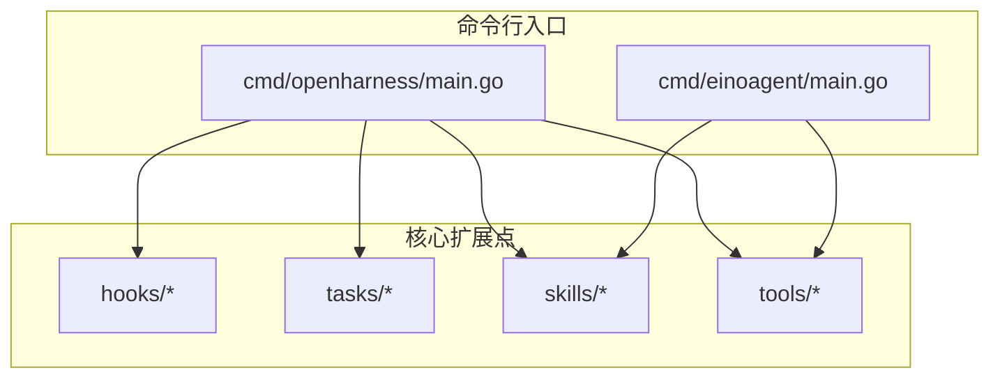
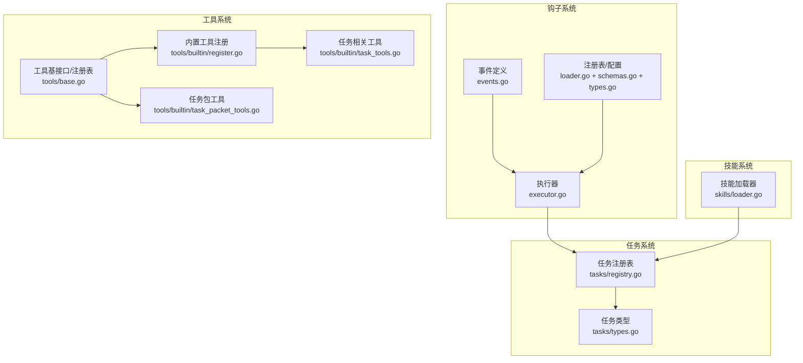
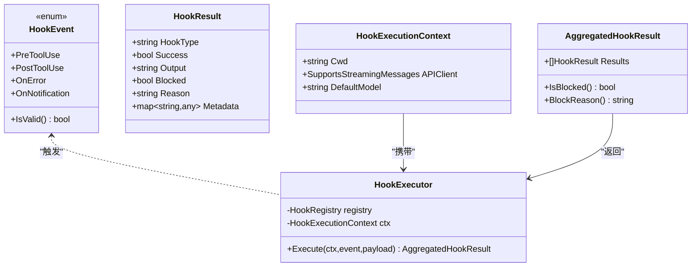
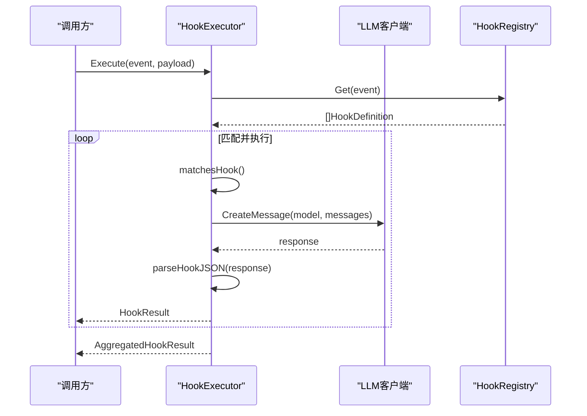
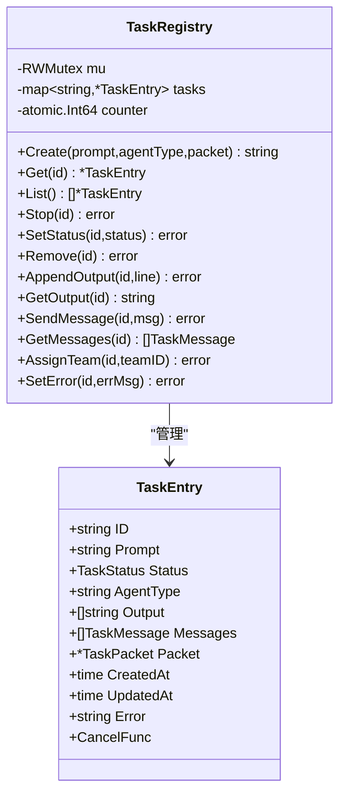
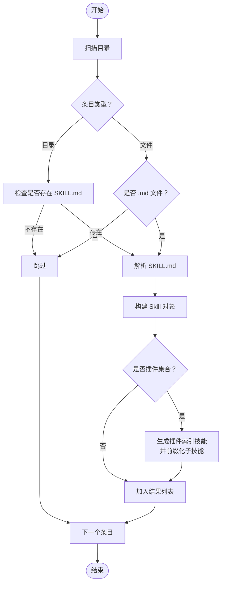
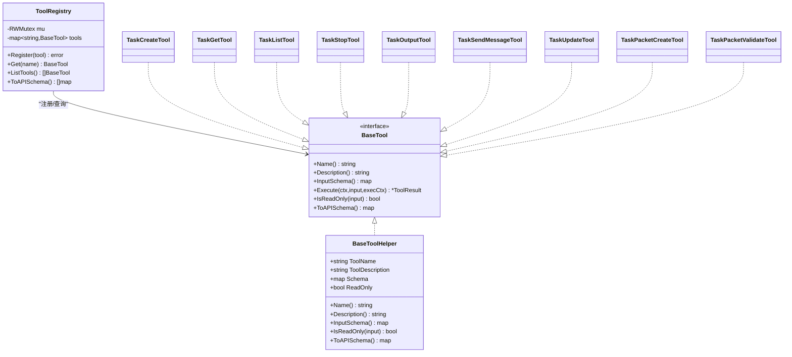
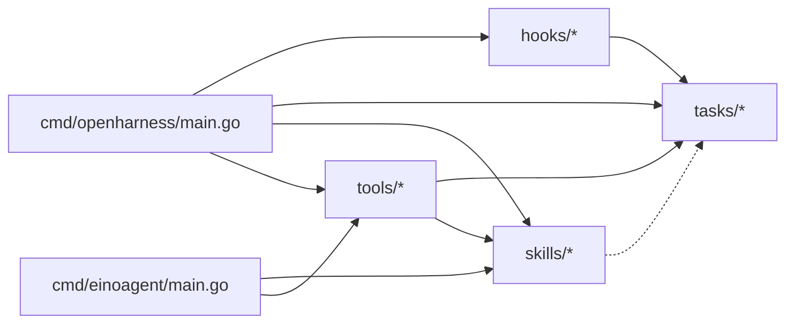

# 扩展点说明

<cite>
**本文引用的文件**
- [pkg/hooks/types.go](file://pkg/hooks/types.go)
- [pkg/hooks/events.go](file://pkg/hooks/events.go)
- [pkg/hooks/executor.go](file://pkg/hooks/executor.go)
- [pkg/hooks/loader.go](file://pkg/hooks/loader.go)
- [pkg/hooks/schemas.go](file://pkg/hooks/schemas.go)
- [pkg/taks/registry.go](file://pkg/tasks/registry.go)
- [pkg/taks/types.go](file://pkg/tasks/types.go)
- [pkg/skills/loader.go](file://pkg/skills/loader.go)
- [pkg/skills/loader_test.go](file://pkg/skills/loader_test.go)
- [pkg/tools/base.go](file://pkg/tools/base.go)
- [pkg/tools/builtin/register.go](file://pkg/tools/builtin/register.go)
- [pkg/tools/builtin/task_tools.go](file://pkg/tools/builtin/task_tools.go)
- [pkg/tools/builtin/task_packet_tools.go](file://pkg/tools/builtin/task_packet_tools.go)
- [cmd/openharness/main.go](file://cmd/openharness/main.go)
- [cmd/einoagent/main.go](file://cmd/einoagent/main.go)
</cite>

## 目录
1. [简介](#简介)
2. [项目结构](#项目结构)
3. [核心扩展点](#核心扩展点)
4. [架构总览](#架构总览)
5. [组件详解](#组件详解)
6. [依赖关系分析](#依赖关系分析)
7. [性能与稳定性考量](#性能与稳定性考量)
8. [故障排查指南](#故障排查指南)
9. [结论](#结论)
10. [附录](#附录)

## 简介
本文件面向插件开发者与系统集成者，系统性梳理 OpenHarness Go 中的扩展点体系，涵盖钩子系统（Hook）、任务注册表（Task Registry）、技能加载器（Skill Loader）、工具接口（Tool）等。文档从接口规范、实现要求、集成方式、最佳实践到性能与稳定性影响进行深入解析，并通过图示展示扩展点之间的依赖与组合模式。

## 项目结构
OpenHarness Go 采用按功能域分层的组织方式：
- 命令行入口位于 cmd 目录，分别提供 openharness CLI 与 einoagent 示例。
- 核心能力集中在 pkg 下的 hooks、tasks、skills、tools 等子包，提供可插拔的扩展点。
- 插件与技能资源位于 plugins 与各插件目录下的 skills 子目录中，便于动态加载与组合。

图表来源
- [cmd/openharness/main.go:1-299](file://cmd/openharness/main.go#L1-L299)
- [cmd/einoagent/main.go:1-107](file://cmd/einoagent/main.go#L1-L107)

章节来源
- [cmd/openharness/main.go:1-299](file://cmd/openharness/main.go#L1-L299)
- [cmd/einoagent/main.go:1-107](file://cmd/einoagent/main.go#L1-L107)

## 核心扩展点
本节概述系统中的主要扩展点及其职责：
- 钩子系统（Hooks）
  - 定义事件类型、执行上下文、执行器与配置加载。
  - 支持命令、HTTP、提示词（Prompt）、智能体（Agent）四类钩子。
- 任务注册表（Tasks）
  - 提供任务生命周期管理、状态变更、消息与输出维护。
- 技能加载器（Skills）
  - 解析 Markdown 技能文件，支持插件集合与子技能前缀化。
- 工具接口（Tools）
  - 定义工具基接口、注册表与默认内置工具集。
  - 提供与任务相关的工具（TaskCreate/TaskGet/TaskList/TaskStop/TaskOutput/TaskSendMessage/TaskUpdate）与任务包工具（TaskPacketCreate/TaskPacketValidate）。

章节来源
- [pkg/hooks/events.go:1-35](file://pkg/hooks/events.go#L1-L35)
- [pkg/hooks/executor.go:1-336](file://pkg/hooks/executor.go#L1-L336)
- [pkg/hooks/loader.go:1-90](file://pkg/hooks/loader.go#L1-L90)
- [pkg/taks/registry.go:1-191](file://pkg/tasks/registry.go#L1-L191)
- [pkg/skills/loader.go:1-198](file://pkg/skills/loader.go#L1-L198)
- [pkg/tools/base.go:1-132](file://pkg/tools/base.go#L1-L132)
- [pkg/tools/builtin/register.go:1-30](file://pkg/tools/builtin/register.go#L1-L30)
- [pkg/tools/builtin/task_tools.go:1-332](file://pkg/tools/builtin/task_tools.go#L1-L332)
- [pkg/tools/builtin/task_packet_tools.go:1-119](file://pkg/tools/builtin/task_packet_tools.go#L1-L119)

## 架构总览
下图展示了扩展点在系统中的交互关系与数据流：

图表来源
- [pkg/hooks/events.go:1-35](file://pkg/hooks/events.go#L1-L35)
- [pkg/hooks/executor.go:1-336](file://pkg/hooks/executor.go#L1-L336)
- [pkg/hooks/loader.go:1-90](file://pkg/hooks/loader.go#L1-L90)
- [pkg/hooks/schemas.go:1-182](file://pkg/hooks/schemas.go#L1-L182)
- [pkg/hooks/types.go:1-44](file://pkg/hooks/types.go#L1-L44)
- [pkg/taks/registry.go:1-191](file://pkg/tasks/registry.go#L1-L191)
- [pkg/taks/types.go:1-59](file://pkg/tasks/types.go#L1-L59)
- [pkg/skills/loader.go:1-198](file://pkg/skills/loader.go#L1-L198)
- [pkg/tools/base.go:1-132](file://pkg/tools/base.go#L1-L132)
- [pkg/tools/builtin/register.go:1-30](file://pkg/tools/builtin/register.go#L1-L30)
- [pkg/tools/builtin/task_tools.go:1-332](file://pkg/tools/builtin/task_tools.go#L1-L332)
- [pkg/tools/builtin/task_packet_tools.go:1-119](file://pkg/tools/builtin/task_packet_tools.go#L1-L119)

## 组件详解

### 钩子系统（Hooks）
- 接口与数据模型
  - 事件类型：预工具使用、后工具使用、错误、通知。
  - 结果聚合：单次钩子结果与聚合结果，包含成功标志、阻断标志与原因。
- 执行器
  - 支持命令、HTTP、提示词、智能体四类钩子。
  - 执行时注入事件名与载荷到环境变量或请求体。
  - 对 LLM 调用进行超时控制与 JSON 结果解析。
- 注册与配置
  - 以事件为键存储钩子定义，支持匹配器（通配符）筛选目标工具。
  - 从设置文件加载钩子配置，自动应用默认值。

图表来源
- [pkg/hooks/events.go:1-35](file://pkg/hooks/events.go#L1-L35)
- [pkg/hooks/types.go:1-44](file://pkg/hooks/types.go#L1-L44)
- [pkg/hooks/executor.go:1-336](file://pkg/hooks/executor.go#L1-L336)

章节来源
- [pkg/hooks/events.go:1-35](file://pkg/hooks/events.go#L1-L35)
- [pkg/hooks/types.go:1-44](file://pkg/hooks/types.go#L1-L44)
- [pkg/hooks/executor.go:1-336](file://pkg/hooks/executor.go#L1-L336)
- [pkg/hooks/loader.go:1-90](file://pkg/hooks/loader.go#L1-L90)
- [pkg/hooks/schemas.go:1-182](file://pkg/hooks/schemas.go#L1-L182)

#### 钩子执行序列（以 LLM 钩子为例）

图表来源
- [pkg/hooks/executor.go:67-105](file://pkg/hooks/executor.go#L67-L105)
- [pkg/hooks/executor.go:212-269](file://pkg/hooks/executor.go#L212-L269)

### 任务注册表（Tasks）
- 功能要点
  - 生成唯一任务 ID，记录状态、消息、输出、错误与取消函数。
  - 提供创建、查询、列表、停止、更新状态、追加输出、发送消息等操作。
- 与钩子的协作
  - 钩子可在“任务生命周期”事件中读取/写入任务状态，实现条件阻断与后续动作。

图表来源
- [pkg/taks/registry.go:13-191](file://pkg/tasks/registry.go#L13-L191)
- [pkg/taks/types.go:18-59](file://pkg/tasks/types.go#L18-L59)

章节来源
- [pkg/taks/registry.go:1-191](file://pkg/tasks/registry.go#L1-L191)
- [pkg/taks/types.go:1-59](file://pkg/tasks/types.go#L1-L59)

### 技能加载器（Skills）
- 功能要点
  - 支持根目录与子目录两种技能文件形式（*.md 或 SKILL.md）。
  - 解析 YAML 风格的 frontmatter，提取名称、描述与指令。
  - 插件集合加载：为每个插件生成顶层索引技能，子技能名前缀化避免冲突。
- 测试验证
  - 单元测试覆盖 frontmatter 解析与多级目录扫描。

图表来源
- [pkg/skills/loader.go:21-60](file://pkg/skills/loader.go#L21-L60)
- [pkg/skills/loader.go:62-124](file://pkg/skills/loader.go#L62-L124)
- [pkg/skills/loader.go:126-198](file://pkg/skills/loader.go#L126-L198)

章节来源
- [pkg/skills/loader.go:1-198](file://pkg/skills/loader.go#L1-L198)
- [pkg/skills/loader_test.go:1-71](file://pkg/skills/loader_test.go#L1-L71)

### 工具接口与内置工具（Tools）
- 工具基接口
  - 规范工具名称、描述、输入模式、只读属性、执行方法与 API 模式导出。
  - 工具注册表提供并发安全的注册、查询与导出。
- 内置工具
  - 默认注册全部内置工具（如 Bash、文件读写、Grep、AskUser 等）。
  - 提供与任务系统集成的工具集（TaskCreate/TaskGet/TaskList/TaskStop/TaskOutput/TaskSendMessage/TaskUpdate）与任务包工具（TaskPacketCreate/TaskPacketValidate）。

图表来源
- [pkg/tools/base.go:51-132](file://pkg/tools/base.go#L51-L132)
- [pkg/tools/builtin/register.go:7-30](file://pkg/tools/builtin/register.go#L7-L30)
- [pkg/tools/builtin/task_tools.go:12-332](file://pkg/tools/builtin/task_tools.go#L12-L332)
- [pkg/tools/builtin/task_packet_tools.go:12-119](file://pkg/tools/builtin/task_packet_tools.go#L12-L119)

章节来源
- [pkg/tools/base.go:1-132](file://pkg/tools/base.go#L1-L132)
- [pkg/tools/builtin/register.go:1-30](file://pkg/tools/builtin/register.go#L1-L30)
- [pkg/tools/builtin/task_tools.go:1-332](file://pkg/tools/builtin/task_tools.go#L1-L332)
- [pkg/tools/builtin/task_packet_tools.go:1-119](file://pkg/tools/builtin/task_packet_tools.go#L1-L119)

## 依赖关系分析
- 组件耦合
  - 钩子系统与任务系统通过事件与载荷进行松耦合交互；钩子执行器不直接依赖具体任务实现，仅通过事件与 payload 协作。
  - 工具系统与任务系统通过工具接口与注册表解耦，任务相关工具通过注册表与任务注册表交互。
  - 技能加载器独立于任务与工具系统，但可被上层工作流或代理使用。
- 外部依赖
  - 钩子系统在 LLM 钩子场景依赖外部 API 客户端接口；在命令钩子场景依赖系统 shell；在 HTTP 钩子场景依赖网络栈。
- 循环依赖
  - 当前设计未发现循环依赖，模块边界清晰。

图表来源
- [pkg/hooks/executor.go:67-105](file://pkg/hooks/executor.go#L67-L105)
- [pkg/tools/builtin/task_tools.go:43-67](file://pkg/tools/builtin/task_tools.go#L43-L67)
- [cmd/openharness/main.go:1-299](file://cmd/openharness/main.go#L1-L299)
- [cmd/einoagent/main.go:1-107](file://cmd/einoagent/main.go#L1-L107)

章节来源
- [pkg/hooks/executor.go:1-336](file://pkg/hooks/executor.go#L1-L336)
- [pkg/tools/builtin/task_tools.go:1-332](file://pkg/tools/builtin/task_tools.go#L1-L332)
- [cmd/openharness/main.go:1-299](file://cmd/openharness/main.go#L1-L299)
- [cmd/einoagent/main.go:1-107](file://cmd/einoagent/main.go#L1-L107)

## 性能与稳定性考量
- 钩子系统
  - 超时控制：命令、HTTP、LLM 钩子均设置超时，防止阻塞主流程。
  - 并发安全：钩子注册表与任务注册表均使用读写锁，保证高并发下的一致性。
  - 输出与阻断：聚合结果包含阻断信息，便于上层快速决策。
- 任务系统
  - 原子计数器生成任务 ID，避免竞态；状态字段与时间戳确保可观测性。
  - 取消函数支持任务中止，降低长时间运行任务的风险。
- 工具系统
  - 工具注册表并发安全，避免重复注册；只读标记帮助模型选择安全工具。
  - 任务相关工具直接访问任务注册表，减少中间层开销。
- 技能加载器
  - 目录扫描与文件读取为同步操作，建议在启动阶段完成，避免运行期抖动。

[本节为通用指导，无需列出章节来源]

## 故障排查指南
- 钩子执行失败
  - 检查事件类型是否有效、匹配器是否正确、超时设置是否合理。
  - 查看聚合结果中的阻断标志与原因，定位失败钩子。
- LLM 钩子异常
  - 确认 LLM 客户端已注入且模型名称解析正确。
  - 关注 JSON 解析逻辑，必要时调整提示词格式以提高可解析性。
- 任务状态异常
  - 使用 TaskGet/TaskList 查询状态，确认任务是否存在与是否处于可停止状态。
  - 若任务卡住，尝试 TaskStop 触发取消函数。
- 工具注册冲突
  - 工具注册表会拒绝重复注册，检查工具名称是否唯一。
- 技能加载问题
  - 确认 frontmatter 格式正确，文件编码与换行符符合预期。
  - 插件集合加载时注意子技能前缀化规则，避免命名冲突。

章节来源
- [pkg/hooks/executor.go:93-104](file://pkg/hooks/executor.go#L93-L104)
- [pkg/hooks/executor.go:212-269](file://pkg/hooks/executor.go#L212-L269)
- [pkg/taks/registry.go:74-90](file://pkg/tasks/registry.go#L74-L90)
- [pkg/tools/base.go:92-102](file://pkg/tools/base.go#L92-L102)
- [pkg/skills/loader.go:126-198](file://pkg/skills/loader.go#L126-L198)

## 结论
OpenHarness Go 的扩展点体系以清晰的接口与松耦合设计为核心，既保证了灵活性，也兼顾了性能与稳定性。通过钩子系统实现条件控制与外部集成，借助任务注册表管理复杂流程，结合技能加载器与工具接口形成完整的 AI 编码助手能力闭环。建议在实际集成中遵循本文的最佳实践，充分利用事件驱动与并发安全机制，确保系统在高负载与复杂场景下的可靠运行。

[本节为总结性内容，无需列出章节来源]

## 附录
- 最佳实践
  - 钩子：明确事件边界与匹配器，合理设置超时与阻断策略；LLM 钩子尽量返回结构化 JSON。
  - 任务：统一状态机与错误处理，及时清理输出与消息；为长任务提供取消路径。
  - 工具：保持只读工具优先，严格校验输入模式；为任务相关工具提供一致的错误返回。
  - 技能：规范化 frontmatter，避免歧义；插件集合使用前缀化命名空间。
- 示例参考
  - 钩子配置加载与执行：参见钩子注册与执行器实现。
  - 任务生命周期管理：参见任务注册表方法集合。
  - 技能文件解析：参见技能加载器与单元测试。
  - 工具注册与任务工具：参见工具基接口与任务相关工具实现。

[本节为补充说明，无需列出章节来源]