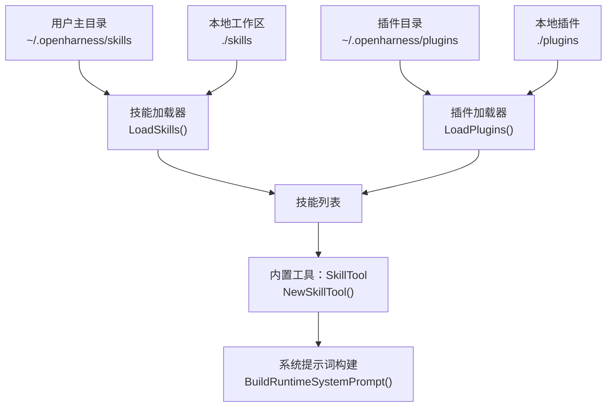
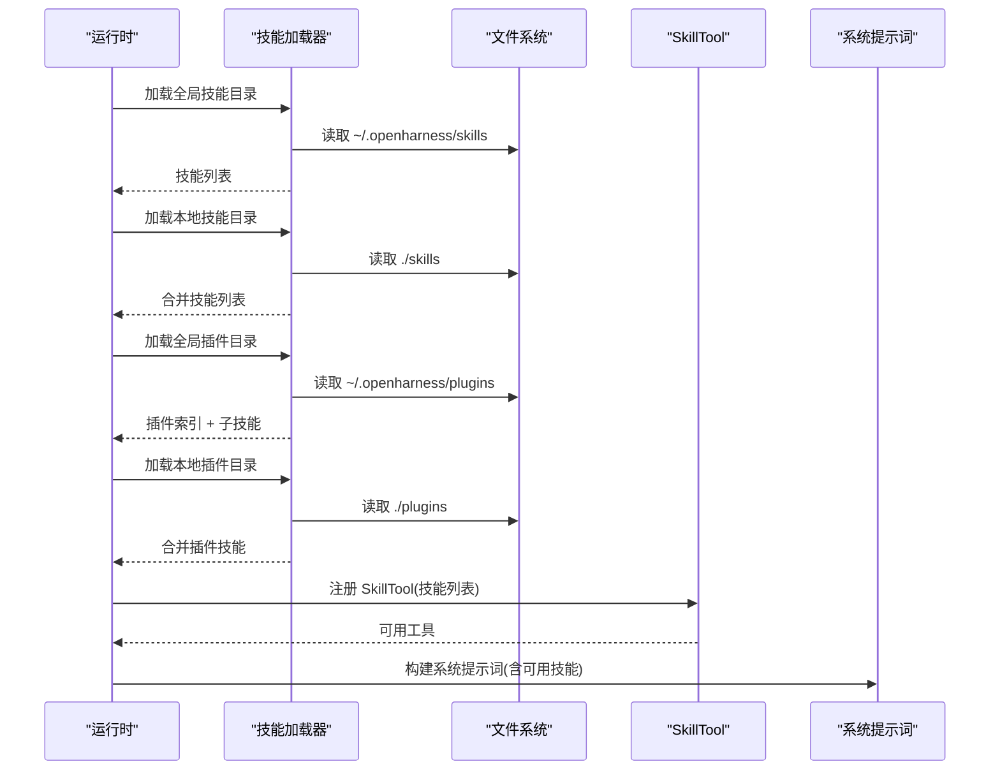
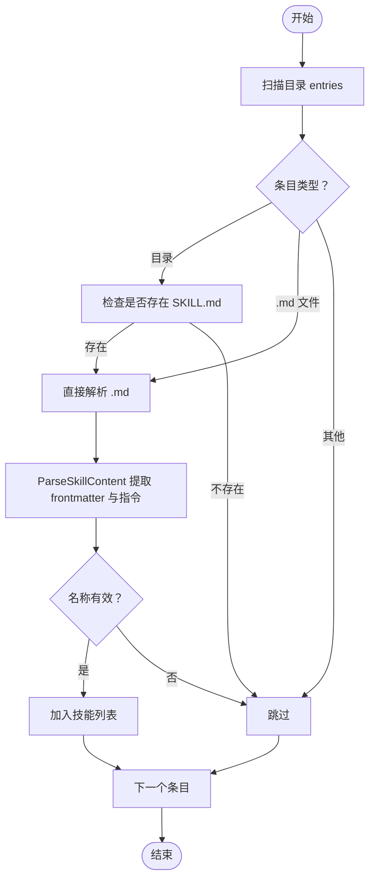
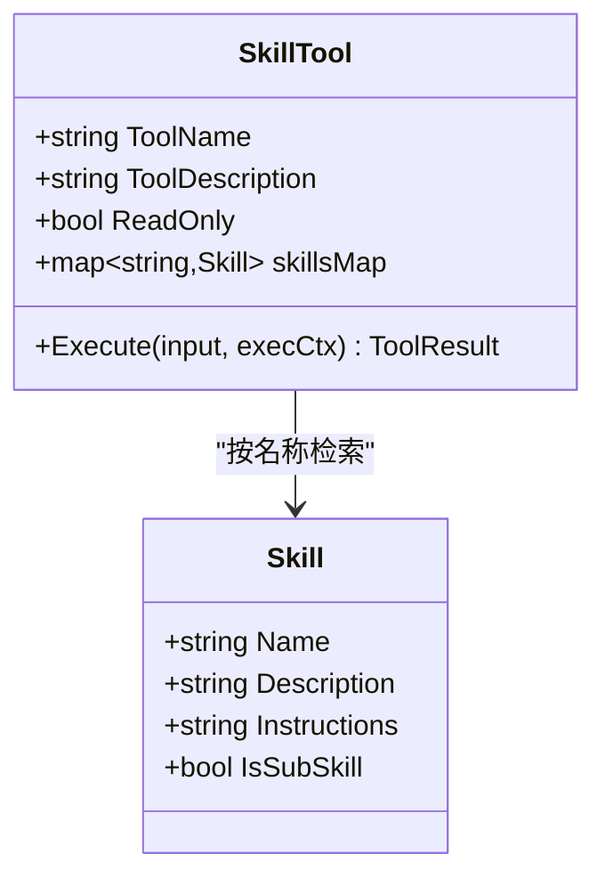
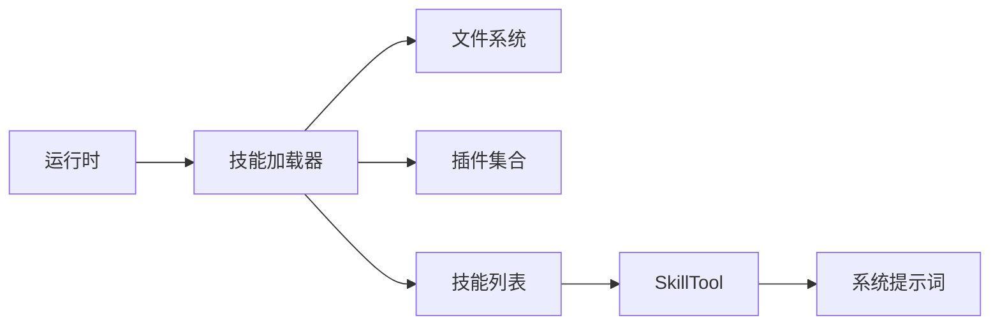

# 技能加载器扩展

<cite>
**本文引用的文件**
- [pkg/skills/loader.go](file://pkg/skills/loader.go)
- [pkg/skills/loader_test.go](file://pkg/skills/loader_test.go)
- [pkg/tools/builtin/skill.go](file://pkg/tools/builtin/skill.go)
- [pkg/ui/runtime.go](file://pkg/ui/runtime.go)
- [plugins/anthropic/skills/code-review/SKILL.md](file://plugins/anthropic/skills/code-review/SKILL.md)
- [plugins/superpowers/skills/brainstorming/SKILL.md](file://plugins/superpowers/skills/brainstorming/SKILL.md)
- [plugins/karpathy/skills/SKILL.md](file://plugins/karpathy/skills/SKILL.md)
- [plugins/superpowers/skills/writing-skills/SKILL.md](file://plugins/superpowers/skills/writing-skills/SKILL.md)
- [plugins/superpowers/skills/systematic-debugging/SKILL.md](file://plugins/superpowers/skills/systematic-debugging/SKILL.md)
- [plugins/anthropic/skills/skill-creator/scripts/package_skill.py](file://plugins/anthropic/skills/skill-creator/scripts/package_skill.py)
</cite>

## 目录
1. [简介](#简介)
2. [项目结构](#项目结构)
3. [核心组件](#核心组件)
4. [架构总览](#架构总览)
5. [详细组件分析](#详细组件分析)
6. [依赖关系分析](#依赖关系分析)
7. [性能考量](#性能考量)
8. [故障排查指南](#故障排查指南)
9. [结论](#结论)
10. [附录](#附录)

## 简介
本文件为“技能加载器”的扩展文档，聚焦于技能文件的发现、解析与注册流程，解释加载器的依赖关系与初始化顺序，并提供技能扩展的开发指南、可扩展点（自定义加载策略、技能验证器、动态加载）、性能影响与缓存策略、测试与调试方法，以及完整的开发示例与最佳实践。

## 项目结构
技能加载器位于 pkg/skills，围绕以下职责组织：
- 发现：扫描用户目录与本地工作区的技能与插件目录
- 解析：从 Markdown 文件中提取 YAML 风格的 frontmatter 与正文作为指令
- 注册：将技能注入工具注册表，供运行时系统提示词与工具调用使用

图表来源
- [pkg/ui/runtime.go:80-97](file://pkg/ui/runtime.go#L80-L97)
- [pkg/skills/loader.go:21-60](file://pkg/skills/loader.go#L21-L60)
- [pkg/skills/loader.go:62-124](file://pkg/skills/loader.go#L62-L124)
- [pkg/tools/builtin/skill.go:27-52](file://pkg/tools/builtin/skill.go#L27-L52)

章节来源
- [pkg/ui/runtime.go:80-97](file://pkg/ui/runtime.go#L80-L97)

## 核心组件
- 技能模型：包含名称、描述、指令正文与是否为子技能标记
- 技能文件解析：支持 frontmatter（YAML 风格）与纯 Markdown 指令
- 技能发现与聚合：支持单文件与目录内 SKILL.md；支持插件集合及其子技能前缀化
- 工具集成：将技能映射为只读工具，按名称检索并返回完整指令

章节来源
- [pkg/skills/loader.go:13-19](file://pkg/skills/loader.go#L13-L19)
- [pkg/skills/loader.go:126-197](file://pkg/skills/loader.go#L126-L197)
- [pkg/skills/loader.go:21-60](file://pkg/skills/loader.go#L21-L60)
- [pkg/skills/loader.go:62-124](file://pkg/skills/loader.go#L62-L124)
- [pkg/tools/builtin/skill.go:16-72](file://pkg/tools/builtin/skill.go#L16-L72)

## 架构总览
技能加载器在运行时初始化阶段被调用，分别从用户主目录与本地工作区加载技能与插件，随后将技能注册为工具，最终参与系统提示词构建。

图表来源
- [pkg/ui/runtime.go:80-97](file://pkg/ui/runtime.go#L80-L97)
- [pkg/skills/loader.go:21-60](file://pkg/skills/loader.go#L21-L60)
- [pkg/skills/loader.go:62-124](file://pkg/skills/loader.go#L62-L124)
- [pkg/tools/builtin/skill.go:27-52](file://pkg/tools/builtin/skill.go#L27-L52)

## 详细组件分析

### 组件一：技能发现与聚合（LoadSkills / LoadPlugins）
- 发现规则
  - 单文件：根目录下任意 .md 文件，若存在 frontmatter 则视为技能
  - 目录：子目录内存在 SKILL.md 的即为技能
- 聚合规则
  - 插件集合：每个插件目录下的 skills 子目录作为集合，生成一个“插件索引技能”列出子技能，并将子技能名前缀为“插件名:子技能名”，避免命名冲突
  - 子技能标记：子技能设置 IsSubSkill=true，以便在顶层索引中隐藏
  - 子技能指令增强：为子技能添加“已从某插件加载”的头部，便于模型识别上下文

图表来源
- [pkg/skills/loader.go:21-60](file://pkg/skills/loader.go#L21-L60)
- [pkg/skills/loader.go:126-197](file://pkg/skills/loader.go#L126-L197)

章节来源
- [pkg/skills/loader.go:21-60](file://pkg/skills/loader.go#L21-L60)
- [pkg/skills/loader.go:62-124](file://pkg/skills/loader.go#L62-L124)

### 组件二：技能解析（ParseSkillContent）
- frontmatter 识别：以 "---" 开头与结尾的块，键值对形式
- 支持字段：name、description（其余字段可扩展）
- 指令正文：frontmatter 结束后的剩余内容
- 无 frontmatter：整篇文件作为指令正文

章节来源
- [pkg/skills/loader.go:126-197](file://pkg/skills/loader.go#L126-L197)

### 组件三：插件集合与子技能前缀化
- 生成插件索引技能：描述集合规模，列出子技能清单
- 子技能前缀化：避免命名冲突，便于模型区分来源
- 子技能标记与指令增强：IsSubSkill=true，指令前加来源提示

章节来源
- [pkg/skills/loader.go:62-124](file://pkg/skills/loader.go#L62-L124)

### 组件四：工具集成（SkillTool）
- 将技能列表映射为只读工具
- 输入：技能名称
- 输出：带命令消息包装的指令正文
- 错误处理：名称缺失或未找到时返回错误结果

图表来源
- [pkg/skills/loader.go:13-19](file://pkg/skills/loader.go#L13-L19)
- [pkg/tools/builtin/skill.go:16-72](file://pkg/tools/builtin/skill.go#L16-L72)

章节来源
- [pkg/tools/builtin/skill.go:16-72](file://pkg/tools/builtin/skill.go#L16-L72)

### 组件五：运行时初始化与系统提示词
- 初始化顺序
  - 先加载全局与本地技能与插件
  - 若有技能，则注册 SkillTool
  - 构建系统提示词时注入可用技能目录
- 作用：使模型在对话中可按需加载具体技能的完整指令

章节来源
- [pkg/ui/runtime.go:80-97](file://pkg/ui/runtime.go#L80-L97)

## 依赖关系分析
- 内部依赖
  - 运行时依赖技能加载器输出技能列表
  - 工具层依赖技能模型进行指令检索
- 外部依赖
  - 文件系统：读取目录与 Markdown 文件
  - 插件生态：遵循“插件名:子技能名”的命名约定

图表来源
- [pkg/ui/runtime.go:80-97](file://pkg/ui/runtime.go#L80-L97)
- [pkg/skills/loader.go:21-124](file://pkg/skills/loader.go#L21-L124)
- [pkg/tools/builtin/skill.go:27-52](file://pkg/tools/builtin/skill.go#L27-L52)

章节来源
- [pkg/ui/runtime.go:80-97](file://pkg/ui/runtime.go#L80-L97)
- [pkg/skills/loader.go:21-124](file://pkg/skills/loader.go#L21-L124)
- [pkg/tools/builtin/skill.go:27-52](file://pkg/tools/builtin/skill.go#L27-L52)

## 性能考量
- I/O 成本
  - 目录扫描与文件读取为 O(N)（N 为技能与插件数量）
  - 建议：仅在启动时加载，避免频繁重扫
- 内存占用
  - 技能正文以字符串形式保存，建议控制单技能大小与数量
- 缓存策略
  - 可选：对已解析技能进行内存缓存，减少重复解析
  - 可选：基于文件修改时间的增量刷新
- 并发与线程安全
  - 工具执行为只读查询，无需写锁；如引入缓存需考虑并发一致性

## 故障排查指南
- 常见问题
  - 技能未出现在可用列表：检查 frontmatter 是否正确、名称是否为空
  - 插件子技能不可见：确认是否为 IsSubSkill=true 的子技能，应在插件索引技能中查看
  - 名称冲突：使用“插件名:子技能名”前缀避免冲突
- 调试技巧
  - 使用单元测试验证解析逻辑
  - 在运行时打印技能目录与加载结果
  - 通过工具调用验证 SkillTool 的输入输出

章节来源
- [pkg/skills/loader_test.go:9-70](file://pkg/skills/loader_test.go#L9-L70)
- [pkg/tools/builtin/skill.go:54-72](file://pkg/tools/builtin/skill.go#L54-L72)

## 结论
技能加载器以简洁的文件约定与解析规则，实现了对技能与插件集合的自动发现与聚合，并通过工具层无缝接入运行时系统提示词。其扩展点清晰：可定制加载策略（如多源合并、过滤器）、可扩展解析字段、可实现动态加载与缓存策略。配合完善的测试与调试手段，可稳定支撑技能生态的演进。

## 附录

### 技能开发指南
- 新技能创建
  - 在 skills 目录下新建子目录，或直接放置 .md 文件
  - 在 SKILL.md 中编写 YAML frontmatter（name、description 必填），后跟技能正文
- 配置文件格式与元数据
  - frontmatter 支持 name、description 等字段，其余字段可扩展
  - 指令正文为技能的详细步骤与约束
- 插件扩展
  - 在 plugins/<provider>/skills 下创建子目录，内部包含 SKILL.md
  - 插件集合会自动生成索引技能，并将子技能名前缀为“插件名:子技能名”
- 开发示例
  - 示例技能文件参考：
    - [plugins/anthropic/skills/code-review/SKILL.md](file://plugins/anthropic/skills/code-review/SKILL.md)
    - [plugins/superpowers/skills/brainstorming/SKILL.md](file://plugins/superpowers/skills/brainstorming/SKILL.md)
    - [plugins/karpathy/skills/SKILL.md](file://plugins/karpathy/skills/SKILL.md)
  - 技能创作与优化指南参考：
    - [plugins/superpowers/skills/writing-skills/SKILL.md](file://plugins/superpowers/skills/writing-skills/SKILL.md)
    - [plugins/superpowers/skills/systematic-debugging/SKILL.md](file://plugins/superpowers/skills/systematic-debugging/SKILL.md)
- 打包与分发
  - 使用打包脚本生成 .skill 包，包含校验与排除规则
  - 参考：[plugins/anthropic/skills/skill-creator/scripts/package_skill.py](file://plugins/anthropic/skills/skill-creator/scripts/package_skill.py)

### 测试方法
- 单元测试
  - 验证 frontmatter 解析与指令提取
  - 验证目录扫描与子目录 SKILL.md 发现
- 集成测试
  - 在运行时加载技能并注册工具，验证系统提示词中的技能目录
- 调试技巧
  - 打印技能列表与工具 Schema
  - 使用工具调用验证输入输出

章节来源
- [pkg/skills/loader_test.go:9-70](file://pkg/skills/loader_test.go#L9-L70)
- [pkg/ui/runtime.go:80-97](file://pkg/ui/runtime.go#L80-L97)
- [plugins/anthropic/skills/skill-creator/scripts/package_skill.py:1-136](file://plugins/anthropic/skills/skill-creator/scripts/package_skill.py#L1-L136)