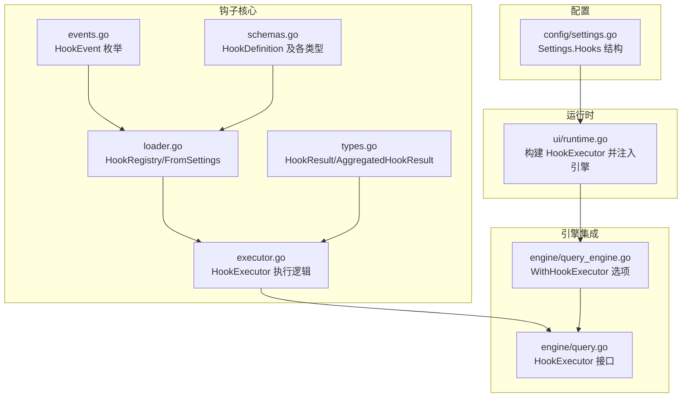
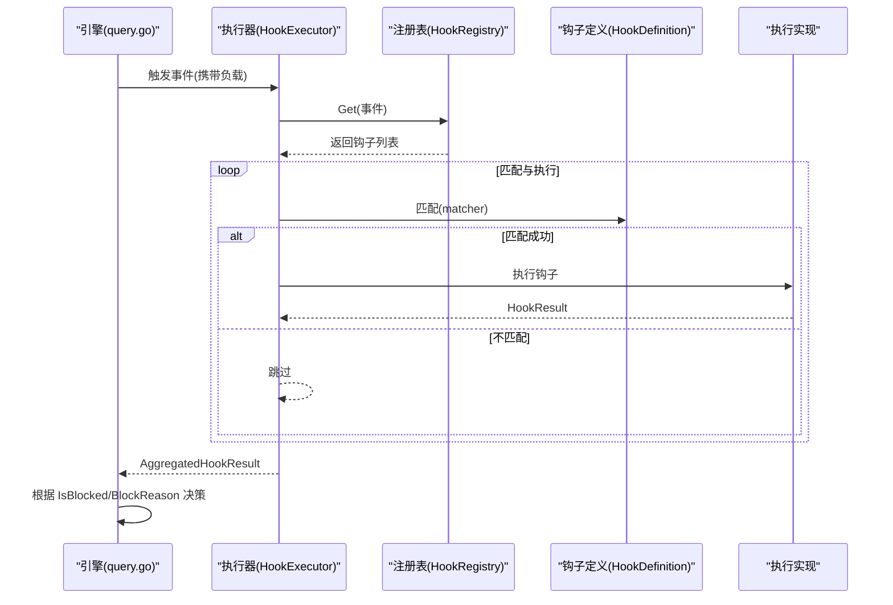
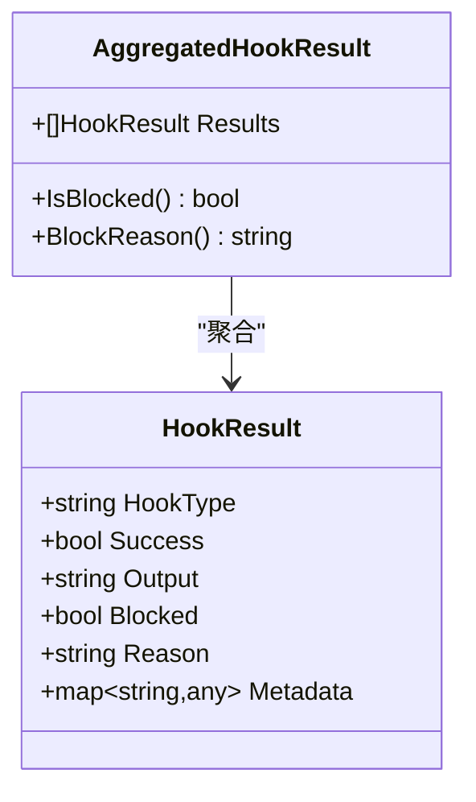
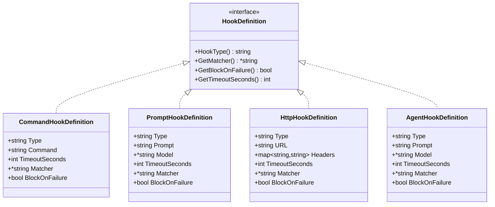
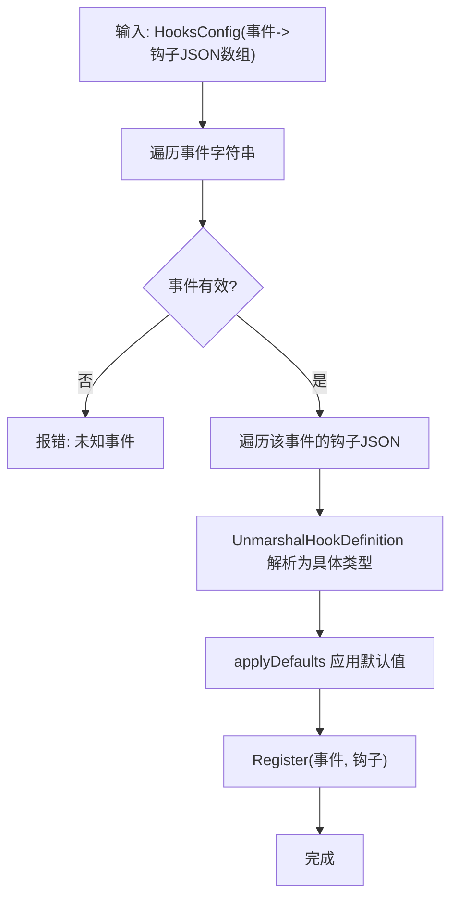
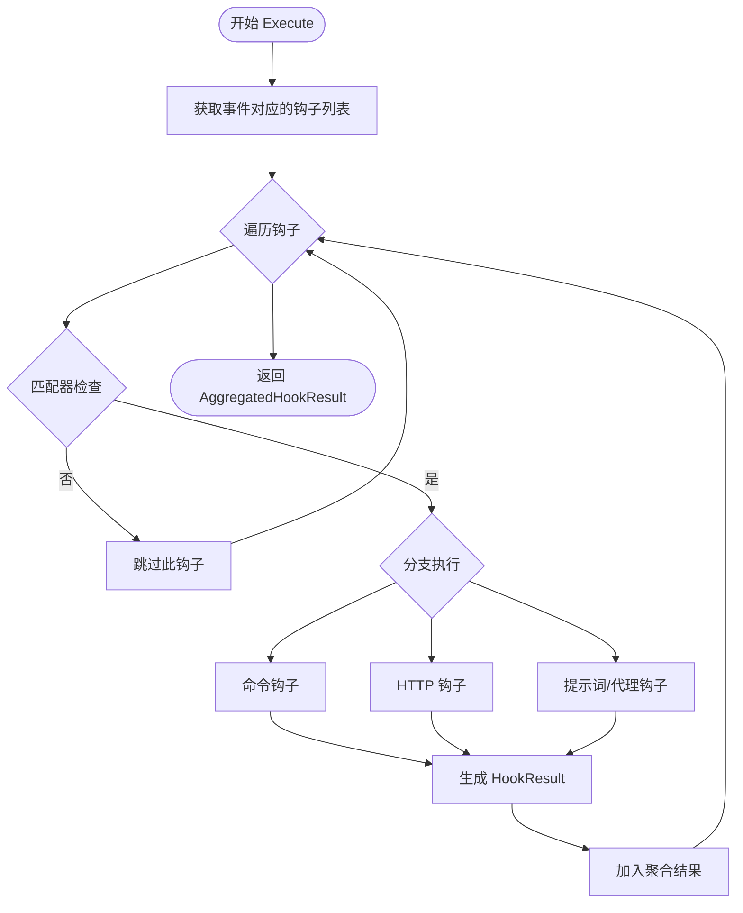
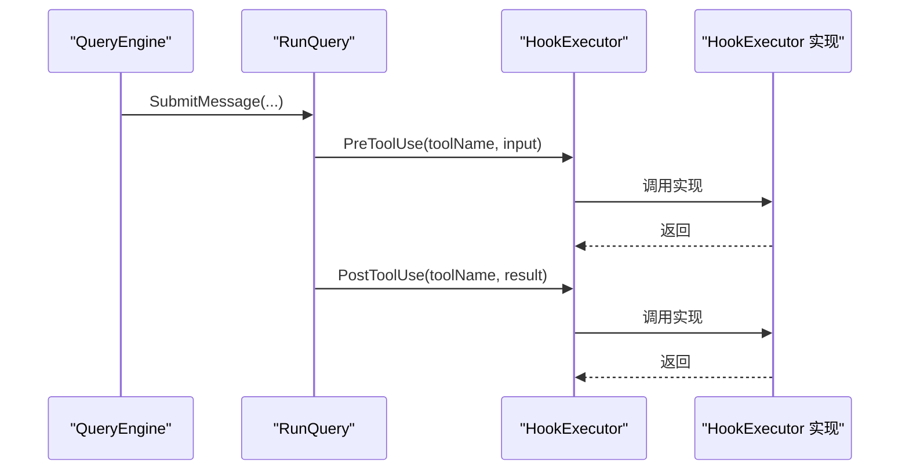
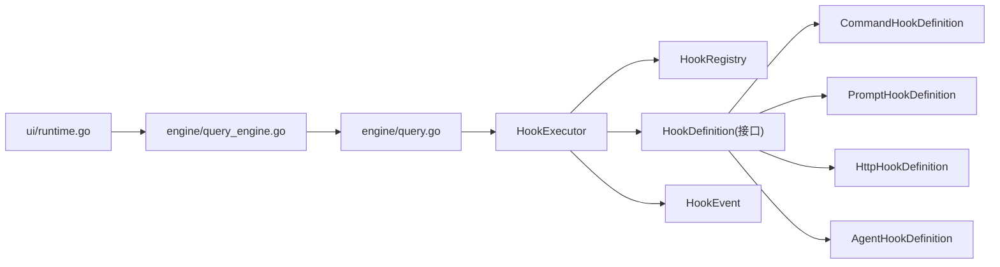

# 钩子系统扩展

<cite>
**本文引用的文件**
- [pkg/hooks/types.go](file://pkg/hooks/types.go)
- [pkg/hooks/events.go](file://pkg/hooks/events.go)
- [pkg/hooks/schemas.go](file://pkg/hooks/schemas.go)
- [pkg/hooks/executor.go](file://pkg/hooks/executor.go)
- [pkg/hooks/loader.go](file://pkg/hooks/loader.go)
- [pkg/engine/query.go](file://pkg/engine/query.go)
- [pkg/engine/query_engine.go](file://pkg/engine/query_engine.go)
- [pkg/ui/runtime.go](file://pkg/ui/runtime.go)
- [pkg/config/settings.go](file://pkg/config/settings.go)
</cite>

## 目录
1. [简介](#简介)
2. [项目结构](#项目结构)
3. [核心组件](#核心组件)
4. [架构总览](#架构总览)
5. [详细组件分析](#详细组件分析)
6. [依赖分析](#依赖分析)
7. [性能考虑](#性能考虑)
8. [故障排查指南](#故障排查指南)
9. [结论](#结论)
10. [附录：开发与调试示例](#附录开发与调试示例)

## 简介
本文件面向希望深度理解并扩展钩子系统的开发者，系统性阐述以下主题：
- HookResult 与 AggregatedHookResult 的数据结构设计与使用场景
- 钩子执行器的工作原理：事件触发机制、钩子注册流程与执行顺序控制
- 钩子接口与实现指南：钩子类型定义、执行结果处理与阻塞机制
- 自定义钩子开发：函数签名、参数传递与返回值处理
- 性能影响与最佳实践
- 完整的钩子开发示例与调试技巧

## 项目结构
钩子系统位于 pkg/hooks 目录，围绕“事件-钩子定义-执行器-注册表”的模式组织，同时在引擎与运行时中被集成调用。

图表来源
- [pkg/hooks/types.go:1-44](file://pkg/hooks/types.go#L1-L44)
- [pkg/hooks/events.go:1-35](file://pkg/hooks/events.go#L1-L35)
- [pkg/hooks/schemas.go:1-182](file://pkg/hooks/schemas.go#L1-L182)
- [pkg/hooks/loader.go:1-90](file://pkg/hooks/loader.go#L1-L90)
- [pkg/hooks/executor.go:1-336](file://pkg/hooks/executor.go#L1-L336)
- [pkg/engine/query.go:86-90](file://pkg/engine/query.go#L86-L90)
- [pkg/engine/query_engine.go:78-81](file://pkg/engine/query_engine.go#L78-L81)
- [pkg/ui/runtime.go:100-192](file://pkg/ui/runtime.go#L100-L192)
- [pkg/config/settings.go:97-125](file://pkg/config/settings.go#L97-L125)

章节来源
- [pkg/hooks/types.go:1-44](file://pkg/hooks/types.go#L1-L44)
- [pkg/hooks/events.go:1-35](file://pkg/hooks/events.go#L1-L35)
- [pkg/hooks/schemas.go:1-182](file://pkg/hooks/schemas.go#L1-L182)
- [pkg/hooks/loader.go:1-90](file://pkg/hooks/loader.go#L1-L90)
- [pkg/hooks/executor.go:1-336](file://pkg/hooks/executor.go#L1-L336)
- [pkg/engine/query.go:86-90](file://pkg/engine/query.go#L86-L90)
- [pkg/engine/query_engine.go:78-81](file://pkg/engine/query_engine.go#L78-L81)
- [pkg/ui/runtime.go:100-192](file://pkg/ui/runtime.go#L100-L192)
- [pkg/config/settings.go:97-125](file://pkg/config/settings.go#L97-L125)

## 核心组件
- 数据模型
  - HookResult：单个钩子执行的结果载体，包含类型、成功标志、输出、是否阻塞、阻塞原因以及任意元数据。
  - AggregatedHookResult：一次事件下所有匹配钩子执行结果的聚合，提供 IsBlocked 与 BlockReason 辅助判断。
- 事件模型
  - HookEvent：生命周期事件枚举，当前支持 pre_tool_use、post_tool_use、on_error、on_notification。
- 钩子定义与反序列化
  - HookDefinition 接口统一了钩子类型；具体类型包括 Command/Prompt/Http/Agent。
  - UnmarshalHookDefinition 基于 type 字段动态反序列化为具体类型，并设置默认值。
- 注册与加载
  - HookRegistry：按事件分组存储钩子定义，线程安全。
  - FromSettings：从配置映射构造注册表。
- 执行器
  - HookExecutor：根据事件与负载匹配钩子，依次执行并收集结果；支持命令、HTTP、提示词/代理两类 LLM 钩子。

章节来源
- [pkg/hooks/types.go:2-43](file://pkg/hooks/types.go#L2-L43)
- [pkg/hooks/events.go:3-34](file://pkg/hooks/events.go#L3-L34)
- [pkg/hooks/schemas.go:9-181](file://pkg/hooks/schemas.go#L9-L181)
- [pkg/hooks/loader.go:9-65](file://pkg/hooks/loader.go#L9-L65)
- [pkg/hooks/executor.go:53-105](file://pkg/hooks/executor.go#L53-L105)

## 架构总览
钩子系统在引擎中以“事件驱动 + 可插拔执行器”的方式工作：引擎在关键生命周期节点触发事件，执行器查询注册表并执行匹配的钩子，最终由聚合结果决定后续流程（如是否阻断）。

图表来源
- [pkg/engine/query.go:290-316](file://pkg/engine/query.go#L290-L316)
- [pkg/hooks/executor.go:67-105](file://pkg/hooks/executor.go#L67-L105)
- [pkg/hooks/loader.go:29-35](file://pkg/hooks/loader.go#L29-L35)

## 详细组件分析

### 数据结构：HookResult 与 AggregatedHookResult
- 设计要点
  - HookResult 提供统一的执行结果抽象，便于上层进行成功与否、阻塞与否、输出与元数据的处理。
  - AggregatedHookResult 将一次事件的所有结果聚合，提供快速判定阻塞的能力。
- 使用场景
  - 阻断式策略：当任一钩子请求阻塞时，整体流程可中断。
  - 输出汇总：收集多个钩子的输出，用于日志或二次处理。
  - 元数据透传：钩子可返回任意键值对，供后续钩子或上层逻辑使用。

图表来源
- [pkg/hooks/types.go:2-43](file://pkg/hooks/types.go#L2-L43)

章节来源
- [pkg/hooks/types.go:2-43](file://pkg/hooks/types.go#L2-L43)

### 事件模型：HookEvent
- 事件枚举
  - pre_tool_use：工具调用前触发
  - post_tool_use：工具调用后触发
  - on_error：发生错误时触发
  - on_notification：通知类事件触发
- 有效性校验与遍历
  - 提供 IsValid 与 AllHookEvents，便于配置与调试。

章节来源
- [pkg/hooks/events.go:3-34](file://pkg/hooks/events.go#L3-L34)

### 钩子定义与反序列化：HookDefinition 族
- 接口契约
  - HookType、GetMatcher、GetBlockOnFailure、GetTimeoutSeconds 统一访问钩子元信息。
- 类型族
  - CommandHookDefinition：Shell 命令钩子
  - PromptHookDefinition：提示词钩子（基于 LLM）
  - HttpHookDefinition：HTTP 钩子
  - AgentHookDefinition：代理钩子（具备工具调用能力）
- 默认值与兼容
  - UnmarshalHookDefinition 按类型设置默认超时与字段默认值，确保与历史行为一致。

图表来源
- [pkg/hooks/schemas.go:9-181](file://pkg/hooks/schemas.go#L9-L181)

章节来源
- [pkg/hooks/schemas.go:9-181](file://pkg/hooks/schemas.go#L9-L181)

### 注册与加载：HookRegistry 与 FromSettings
- 注册表
  - 以 HookEvent 为键，维护钩子定义切片；读写加锁保证并发安全。
- 加载流程
  - FromSettings 将配置映射为 HookRegistry：校验事件名、逐条反序列化、应用默认值、注册到对应事件。

图表来源
- [pkg/hooks/loader.go:45-65](file://pkg/hooks/loader.go#L45-L65)
- [pkg/hooks/schemas.go:105-164](file://pkg/hooks/schemas.go#L105-L164)

章节来源
- [pkg/hooks/loader.go:9-65](file://pkg/hooks/loader.go#L9-L65)
- [pkg/hooks/schemas.go:105-164](file://pkg/hooks/schemas.go#L105-L164)

### 执行器：HookExecutor 工作原理
- 执行入口
  - Execute 接收事件与负载，查询注册表，过滤匹配的钩子，依次执行并收集结果。
- 匹配规则
  - 若钩子未设置匹配器，则始终匹配；否则以 payload["tool_name"] 为基准进行通配匹配。
- 执行分支
  - 命令钩子：通过 bash 执行，注入 OPENHARNESS_HOOK_EVENT 与 OPENHARNESS_HOOK_PAYLOAD 环境变量。
  - HTTP 钩子：POST 请求，自动设置 Content-Type，支持自定义头。
  - 提示词/代理钩子：调用 LLM 客户端，解析响应中的 JSON 结构，支持阻断失败。
- 结果封装
  - 将每次执行结果封装为 HookResult，若执行出错则填充错误信息与阻断标志。

图表来源
- [pkg/hooks/executor.go:67-105](file://pkg/hooks/executor.go#L67-L105)
- [pkg/hooks/executor.go:111-151](file://pkg/hooks/executor.go#L111-L151)
- [pkg/hooks/executor.go:157-206](file://pkg/hooks/executor.go#L157-L206)
- [pkg/hooks/executor.go:212-269](file://pkg/hooks/executor.go#L212-L269)

章节来源
- [pkg/hooks/executor.go:67-105](file://pkg/hooks/executor.go#L67-L105)
- [pkg/hooks/executor.go:111-151](file://pkg/hooks/executor.go#L111-L151)
- [pkg/hooks/executor.go:157-206](file://pkg/hooks/executor.go#L157-L206)
- [pkg/hooks/executor.go:212-269](file://pkg/hooks/executor.go#L212-L269)

### 引擎集成点：事件触发与执行器注入
- 接口定义
  - HookExecutor 接口定义 PreToolUse 与 PostToolUse 两个方法，供引擎在工具调用前后调用。
- 引擎使用
  - QueryEngine 支持通过 WithHookExecutor 注入执行器。
  - RunQuery 在工具调用前后调用 HookExecutor，将工具名与输入/结果作为负载传递。

图表来源
- [pkg/engine/query_engine.go:78-81](file://pkg/engine/query_engine.go#L78-L81)
- [pkg/engine/query.go:290-316](file://pkg/engine/query.go#L290-L316)

章节来源
- [pkg/engine/query_engine.go:78-81](file://pkg/engine/query_engine.go#L78-L81)
- [pkg/engine/query.go:86-90](file://pkg/engine/query.go#L86-L90)
- [pkg/engine/query.go:290-316](file://pkg/engine/query.go#L290-L316)

### 运行时集成：构建与注入 HookExecutor
- 运行时创建
  - 构建 HookRegistry 与 HookExecutionContext（含工作目录与默认模型），再创建 HookExecutor。
- 注入引擎
  - 通过 RuntimeBundle 将 HookExecutor 注入到 QueryEngine 中，供后续会话使用。

章节来源
- [pkg/ui/runtime.go:100-192](file://pkg/ui/runtime.go#L100-L192)

### 配置结构：Settings.Hooks
- 配置模型
  - Settings.Hooks 为 map[string][]HookDefinitionConfig，键为事件名，值为钩子配置数组。
- 注意
  - 当前 HookDefinitionConfig 仅包含 command 字段；实际钩子定义应通过 loader/schemas 的 JSON 结构进行加载与反序列化。

章节来源
- [pkg/config/settings.go:97-125](file://pkg/config/settings.go#L97-L125)

## 依赖分析
- 组件耦合
  - HookExecutor 依赖 HookRegistry 与 HookDefinition 接口族，解耦了事件与具体钩子实现。
  - 引擎通过 HookExecutor 接口与钩子系统解耦，便于替换与扩展。
- 外部依赖
  - 命令钩子依赖系统 bash；HTTP 钩子依赖标准库 HTTP 客户端；LLM 钩子依赖外部 API 客户端接口。

图表来源
- [pkg/hooks/executor.go:53-105](file://pkg/hooks/executor.go#L53-L105)
- [pkg/hooks/loader.go:9-35](file://pkg/hooks/loader.go#L9-L35)
- [pkg/hooks/schemas.go:9-181](file://pkg/hooks/schemas.go#L9-L181)
- [pkg/engine/query.go:86-90](file://pkg/engine/query.go#L86-L90)
- [pkg/engine/query_engine.go:78-81](file://pkg/engine/query_engine.go#L78-L81)
- [pkg/ui/runtime.go:100-192](file://pkg/ui/runtime.go#L100-L192)

## 性能考虑
- 执行顺序与阻断
  - 执行器按注册顺序依次执行，遇到阻断即停止后续钩子（由上层决策逻辑决定是否继续）。
- 超时控制
  - 各类钩子均支持超时，避免长时间阻塞；建议为命令与 HTTP 钩子设置合理上限。
- LLM 钩子成本
  - 提示词/代理钩子会触发外部调用，需关注 Token 与延迟；建议在必要场景使用代理模式以提升能力。
- 匹配开销
  - 匹配器使用通配符匹配，建议在 payload 中提供稳定标识（如 tool_name），减少误匹配与无效执行。
- 并发与资源
  - 注册表读写加锁，注意在高并发场景下的锁竞争；可通过拆分事件或减少频繁注册降低压力。

## 故障排查指南
- 常见问题定位
  - 事件无效：确认事件字符串是否在 HookEvent 枚举内。
  - 钩子未执行：检查匹配器是否正确设置，payload 是否包含 tool_name。
  - 命令钩子失败：查看环境变量注入与工作目录设置，确认 bash 可用与权限足够。
  - HTTP 钩子失败：检查 URL、头信息与状态码；关注网络与超时。
  - LLM 钩子失败：确认 APIClient 是否注入，模型名称与默认模型是否正确，响应是否包含可解析的 JSON 结构。
- 结果分析
  - 使用 AggregatedHookResult.IsBlocked 与 BlockReason 快速判断是否需要阻断及阻断原因。
- 日志与可观测性
  - 建议在钩子内部记录关键上下文（事件、负载摘要、输出片段），便于回溯。

章节来源
- [pkg/hooks/executor.go:275-292](file://pkg/hooks/executor.go#L275-L292)
- [pkg/hooks/types.go:24-43](file://pkg/hooks/types.go#L24-L43)

## 结论
钩子系统通过清晰的数据模型、事件驱动与可插拔执行器，提供了强大的扩展能力。合理利用 HookResult 与 AggregatedHookResult 的阻断语义，结合匹配器与超时控制，可在保障性能的同时实现灵活的安全与治理策略。

## 附录：开发与调试示例

### 如何实现自定义钩子
- 步骤
  - 定义新的钩子类型：实现 HookDefinition 接口，提供类型标识、匹配器、阻断标志与超时。
  - 在执行器中添加分支：在 HookExecutor.Execute 的 switch 分支中新增类型分支，调用相应的 runXxxHook 方法。
  - 在注册表中注册：通过 HookRegistry.Register 或 FromSettings 加载配置。
  - 在引擎中触发：在合适的位置调用 HookExecutor 的方法（如 PreToolUse/PostToolUse）。
- 参数与返回
  - 输入：事件、负载（payload）；输出：HookResult；阻断：通过 Blocked 与 Reason 控制。
- 示例路径
  - 新类型定义参考：[pkg/hooks/schemas.go:25-94](file://pkg/hooks/schemas.go#L25-L94)
  - 执行器分支参考：[pkg/hooks/executor.go:79-92](file://pkg/hooks/executor.go#L79-L92)
  - 注册与加载参考：[pkg/hooks/loader.go:22-35](file://pkg/hooks/loader.go#L22-L35)

章节来源
- [pkg/hooks/schemas.go:25-94](file://pkg/hooks/schemas.go#L25-L94)
- [pkg/hooks/executor.go:79-92](file://pkg/hooks/executor.go#L79-L92)
- [pkg/hooks/loader.go:22-35](file://pkg/hooks/loader.go#L22-L35)

### 钩子接口实现指南
- 钩子类型定义
  - 保持 Type 字段与 HookType 返回值一致，确保反序列化与识别正确。
- 执行结果处理
  - 成功时设置 Success=true，输出可选；失败时设置 Success=false，并根据 BlockOnFailure 决定是否阻断。
- 阻塞机制
  - 使用 Blocked 与 Reason 明确表达阻断意图与原因；上层根据 IsBlocked/BlockReason 做决策。
- 参数传递
  - 通过 payload 传递工具名、输入、输出等上下文；命令钩子通过环境变量传递；HTTP 钩子通过请求体传递。
- LLM 钩子注意事项
  - 确保响应包含可解析的 JSON 对象（或 JSON 代码块），并遵循约定的 ok/reason 结构。

章节来源
- [pkg/hooks/schemas.go:105-164](file://pkg/hooks/schemas.go#L105-L164)
- [pkg/hooks/executor.go:111-151](file://pkg/hooks/executor.go#L111-L151)
- [pkg/hooks/executor.go:157-206](file://pkg/hooks/executor.go#L157-L206)
- [pkg/hooks/executor.go:212-269](file://pkg/hooks/executor.go#L212-L269)

### 配置与加载示例
- 配置结构
  - 使用 Settings.Hooks（事件 -> 钩子配置数组）；每个钩子配置应为 JSON 对象，包含 type 与相应字段。
- 加载流程
  - 通过 FromSettings 将配置映射为 HookRegistry；随后创建 HookExecutor 并注入引擎。
- 注意事项
  - 事件名必须有效；type 字段必须与已知类型匹配；未显式设置的字段将按默认值处理。

章节来源
- [pkg/config/settings.go:97-125](file://pkg/config/settings.go#L97-L125)
- [pkg/hooks/loader.go:45-65](file://pkg/hooks/loader.go#L45-L65)

### 调试技巧
- 关键日志点
  - 事件触发位置：[pkg/engine/query.go:290-316](file://pkg/engine/query.go#L290-L316)
  - 执行器执行循环：[pkg/hooks/executor.go:67-105](file://pkg/hooks/executor.go#L67-L105)
  - 匹配器检查：[pkg/hooks/executor.go:275-292](file://pkg/hooks/executor.go#L275-L292)
- 快速验证
  - 使用最小化 payload 与简单命令/HTTP 钩子验证链路；逐步引入复杂逻辑。
  - 利用 BlockReason 快速定位首个阻断钩子及其原因。

章节来源
- [pkg/engine/query.go:290-316](file://pkg/engine/query.go#L290-L316)
- [pkg/hooks/executor.go:67-105](file://pkg/hooks/executor.go#L67-L105)
- [pkg/hooks/executor.go:275-292](file://pkg/hooks/executor.go#L275-L292)