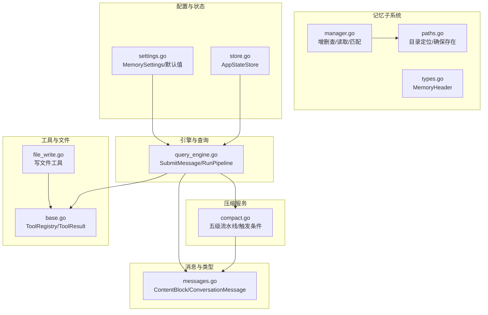
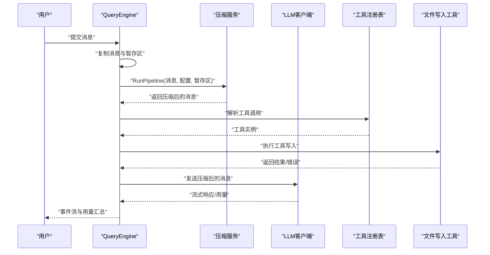
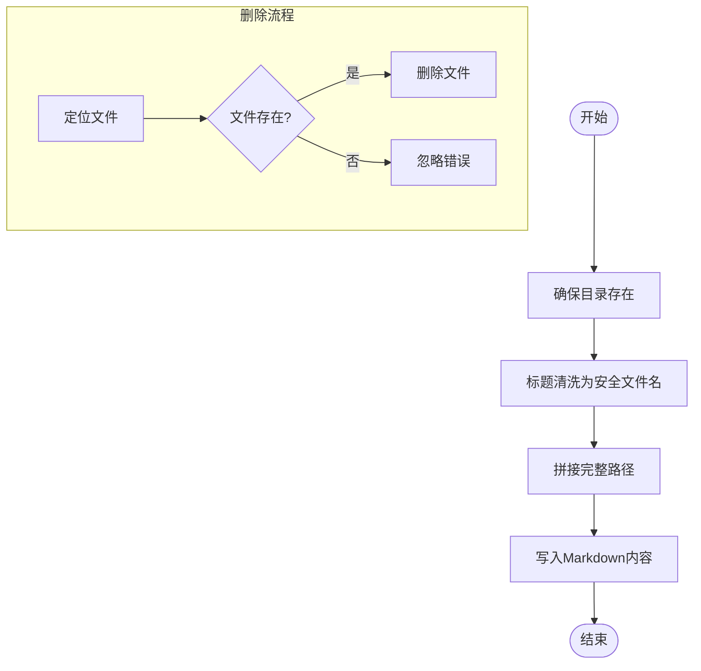
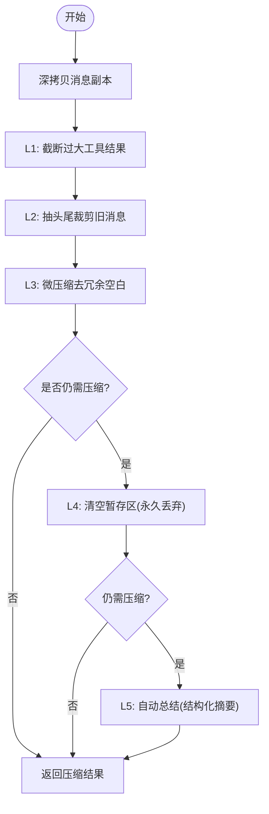
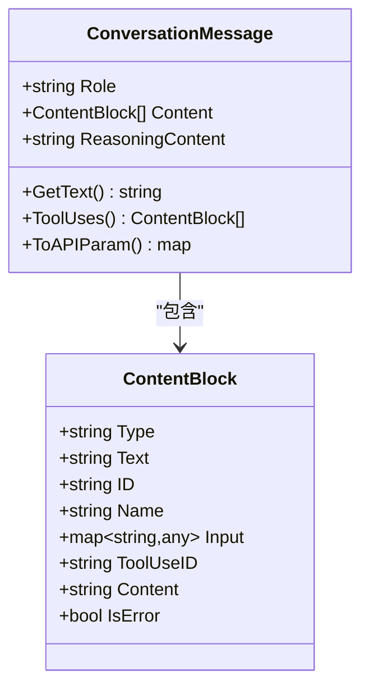
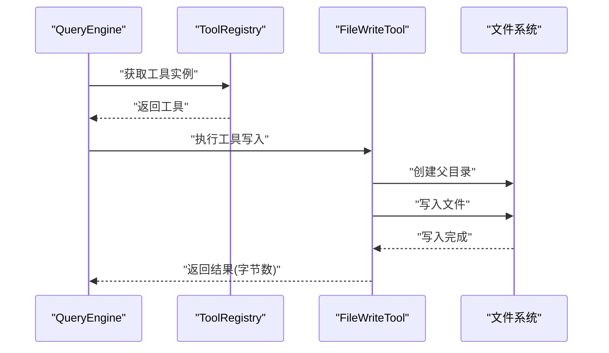
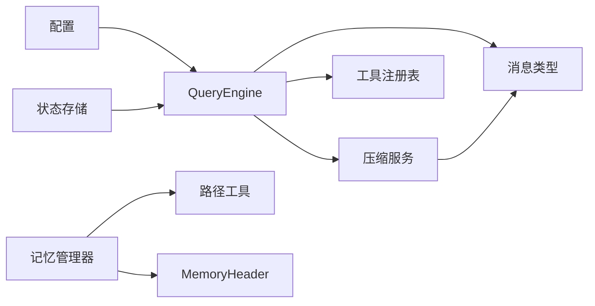

# 内存数据流

<cite>
**本文引用的文件**
- [pkg/memory/manager.go](file://pkg/memory/manager.go)
- [pkg/memory/types.go](file://pkg/memory/types.go)
- [pkg/memory/paths.go](file://pkg/memory/paths.go)
- [pkg/services/compact.go](file://pkg/services/compact.go)
- [docs/context_compaction_and_caching.md](file://docs/context_compaction_and_caching.md)
- [pkg/types/messages.go](file://pkg/types/messages.go)
- [pkg/engine/query_engine.go](file://pkg/engine/query_engine.go)
- [pkg/config/settings.go](file://pkg/config/settings.go)
- [pkg/tools/base.go](file://pkg/tools/base.go)
- [pkg/tools/builtin/file_write.go](file://pkg/tools/builtin/file_write.go)
- [pkg/state/store.go](file://pkg/state/store.go)
</cite>

## 目录
1. [简介](#简介)
2. [项目结构](#项目结构)
3. [核心组件](#核心组件)
4. [架构总览](#架构总览)
5. [详细组件分析](#详细组件分析)
6. [依赖分析](#依赖分析)
7. [性能考量](#性能考量)
8. [故障排查指南](#故障排查指南)
9. [结论](#结论)
10. [附录](#附录)

## 简介
本文件聚焦 OpenHarness Go 的“内存数据流”能力，系统性阐述如下主题：
- 对话历史的存储与检索：以项目为单位的本地知识库（记忆）文件系统，支持增删查、列表排序与组合注入。
- 上下文压缩算法：五级渐进式压缩流水线（L1~L5），触发条件与执行时机，以及与 KV 缓存命中冲突的权衡。
- 数据转换过程：从原始消息到压缩后的存储格式，以及消息块的序列化与反序列化。
- 缓存策略与垃圾回收：压缩流水线中的“暂存区回收”与“自动总结”替代，减少历史消息占用。
- 与工具调用的交互：工具执行产生的临时文件与结果写入，以及与内存系统的协同。
- 内存使用优化与监控：阈值配置、令牌估算、成本跟踪与性能指标。
- 泄漏预防与故障恢复：并发安全、错误传播与回滚策略。

## 项目结构
围绕“内存数据流”的关键模块与职责：
- 记忆子系统：负责项目级/全局记忆文件的创建、删除、列举、读取与标题清洗。
- 消息类型与序列化：定义内容块与消息结构，支撑压缩与 API 参数转换。
- 压缩服务：实现五级上下文压缩流水线，提供触发判断与执行流程。
- 引擎与查询：在提交消息前运行压缩流水线，将压缩后的消息送入 LLM 请求。
- 工具与文件写入：工具执行可能产生临时文件，需遵循权限与目录约定。
- 配置与状态：内存开关、最大文件数、入口行数限制；应用状态存储用于 UI/行为同步。

图表来源
- [pkg/memory/manager.go:1-124](file://pkg/memory/manager.go#L1-L124)
- [pkg/memory/types.go:1-13](file://pkg/memory/types.go#L1-L13)
- [pkg/memory/paths.go:1-29](file://pkg/memory/paths.go#L1-L29)
- [pkg/services/compact.go:1-330](file://pkg/services/compact.go#L1-L330)
- [pkg/types/messages.go:1-169](file://pkg/types/messages.go#L1-L169)
- [pkg/engine/query_engine.go:1-247](file://pkg/engine/query_engine.go#L1-L247)
- [pkg/tools/base.go:1-132](file://pkg/tools/base.go#L1-L132)
- [pkg/tools/builtin/file_write.go:1-79](file://pkg/tools/builtin/file_write.go#L1-L79)
- [pkg/config/settings.go:1-212](file://pkg/config/settings.go#L1-L212)
- [pkg/state/store.go:1-102](file://pkg/state/store.go#L1-L102)

章节来源
- [pkg/memory/manager.go:1-124](file://pkg/memory/manager.go#L1-L124)
- [pkg/memory/types.go:1-13](file://pkg/memory/types.go#L1-L13)
- [pkg/memory/paths.go:1-29](file://pkg/memory/paths.go#L1-L29)
- [pkg/services/compact.go:1-330](file://pkg/services/compact.go#L1-L330)
- [pkg/types/messages.go:1-169](file://pkg/types/messages.go#L1-L169)
- [pkg/engine/query_engine.go:1-247](file://pkg/engine/query_engine.go#L1-L247)
- [pkg/config/settings.go:1-212](file://pkg/config/settings.go#L1-L212)
- [pkg/state/store.go:1-102](file://pkg/state/store.go#L1-L102)

## 核心组件
- 记忆管理器（manager.go）
  - 提供添加、删除、列出、加载与相关性检索记忆文件的能力。
  - 列表按修改时间降序，便于最新优先。
  - 标题清洗避免非法文件名，必要时生成带时间戳的唯一标题。
- 记忆类型（types.go）
  - MemoryHeader：记录路径、标题、描述（可选）、修改时间。
- 记忆路径（paths.go）
  - 基于项目工作目录的 SHA1 前缀生成项目专属记忆目录，确保隔离。
  - 提供全局记忆目录与目录确保逻辑。
- 压缩服务（compact.go）
  - 五级流水线：L1 截断工具结果、L2 消息抽头尾裁剪、L3 微压缩去冗余空白、L4 上下文坍缩（暂存区回收）、L5 自动总结。
  - 触发条件：消息数量超过阈值、保留最近 N 条、总令牌数达到阈值。
  - 令牌估算：按文本/工具调用/工具结果分别估算，累加并考虑消息开销。
- 消息类型（messages.go）
  - ContentBlock：text/tool_use/tool_result 三态联合体。
  - ConversationMessage：角色与内容块数组，提供序列化为 API 参数、提取文本、查找工具调用等。
- 引擎与查询（query_engine.go）
  - SubmitMessage：在进入主循环前复制消息与暂存区，运行压缩流水线，再将压缩后的消息送入 RunQuery。
  - 成本跟踪：累计输入/输出令牌，便于监控与优化。
- 工具与文件写入（base.go、file_write.go）
  - ToolRegistry：注册与获取工具，线程安全。
  - FileWriteTool：写入文件，确保父目录存在，返回字节数统计。
- 配置与状态（settings.go、store.go）
  - MemorySettings：启用/最大文件数/入口行数限制。
  - AppStateStore：应用状态的读写与订阅通知。

章节来源
- [pkg/memory/manager.go:12-124](file://pkg/memory/manager.go#L12-L124)
- [pkg/memory/types.go:6-12](file://pkg/memory/types.go#L6-L12)
- [pkg/memory/paths.go:12-28](file://pkg/memory/paths.go#L12-L28)
- [pkg/services/compact.go:12-330](file://pkg/services/compact.go#L12-L330)
- [pkg/types/messages.go:15-169](file://pkg/types/messages.go#L15-L169)
- [pkg/engine/query_engine.go:49-247](file://pkg/engine/query_engine.go#L49-L247)
- [pkg/tools/base.go:51-132](file://pkg/tools/base.go#L51-L132)
- [pkg/tools/builtin/file_write.go:53-79](file://pkg/tools/builtin/file_write.go#L53-L79)
- [pkg/config/settings.go:58-125](file://pkg/config/settings.go#L58-L125)
- [pkg/state/store.go:6-102](file://pkg/state/store.go#L6-L102)

## 架构总览
OpenHarness 的“内存数据流”贯穿以下链路：
- 用户输入通过 QueryEngine 的 SubmitMessage 进入。
- 在进入主循环前，调用压缩服务对消息进行五级流水线处理。
- 压缩后的消息参与 LLM 请求；工具执行可能产生临时文件，写入策略遵循工具规范。
- 记忆子系统提供项目级知识库文件，可在系统提示中注入，作为静态长文本区的一部分，有助于提升 KV 缓存命中。

图表来源
- [pkg/engine/query_engine.go:124-205](file://pkg/engine/query_engine.go#L124-L205)
- [pkg/services/compact.go:74-115](file://pkg/services/compact.go#L74-L115)
- [pkg/tools/base.go:104-132](file://pkg/tools/base.go#L104-L132)
- [pkg/tools/builtin/file_write.go:53-79](file://pkg/tools/builtin/file_write.go#L53-L79)

## 详细组件分析

### 记忆管理器与文件系统
- 存储与检索
  - 添加：确保目录存在，标题清洗为安全文件名，写入 Markdown 文件。
  - 删除：按标题映射到文件并删除，忽略不存在错误。
  - 列表：遍历目录，过滤 .md 文件，读取修改时间，按时间倒序。
  - 加载：读取全部记忆文件内容，拼接为系统提示注入文本。
  - 相关性检索：大小写不敏感子串匹配，生产可替换为嵌入相似度。
- 目录与命名
  - 项目专属目录基于工作目录的哈希前缀，保证多项目隔离。
  - 全局记忆目录用于跨项目共享知识。
  - 标题清洗避免路径分隔符与非法字符，必要时生成带时间戳的唯一标题。

图表来源
- [pkg/memory/manager.go:14-34](file://pkg/memory/manager.go#L14-L34)
- [pkg/memory/paths.go:14-28](file://pkg/memory/paths.go#L14-L28)
- [pkg/memory/manager.go:111-123](file://pkg/memory/manager.go#L111-L123)

章节来源
- [pkg/memory/manager.go:12-124](file://pkg/memory/manager.go#L12-L124)
- [pkg/memory/paths.go:12-28](file://pkg/memory/paths.go#L12-L28)
- [pkg/memory/types.go:6-12](file://pkg/memory/types.go#L6-L12)

### 上下文压缩算法与触发条件
- 五级流水线
  - L1：工具结果预算截断，保留尾部并标注移除字符数。
  - L2：旧消息抽头尾裁剪，保留首尾预算字符，中间替换为占位。
  - L3：微压缩，去除冗余空行，无损节约。
  - L4：上下文坍缩，若仍超阈值，清空暂存区（永久丢弃）。
  - L5：自动总结，调用 LLM 生成结构化摘要，替换旧历史并拼接最近消息。
- 触发条件
  - 消息数量超过最小阈值，且可压缩的消息数足够，总令牌数达到阈值。
- 令牌估算
  - 文本/工具调用/工具结果分别估算，累加并考虑每条消息的额外开销。

图表来源
- [pkg/services/compact.go:74-115](file://pkg/services/compact.go#L74-L115)
- [pkg/services/compact.go:61-72](file://pkg/services/compact.go#L61-L72)
- [pkg/services/compact.go:32-59](file://pkg/services/compact.go#L32-L59)

章节来源
- [pkg/services/compact.go:12-330](file://pkg/services/compact.go#L12-L330)
- [docs/context_compaction_and_caching.md:7-77](file://docs/context_compaction_and_caching.md#L7-L77)

### 数据转换过程：从原始消息到压缩后的存储格式
- 消息结构
  - ConversationMessage：角色与内容块数组。
  - ContentBlock：text/tool_use/tool_result 三态联合体，支持序列化为 API 参数。
- 序列化与反序列化
  - ToAPIParam：将消息序列化为 API wire 格式，便于发送给 LLM 客户端。
  - AssistantMessageFromAPI：解析 API 响应为消息对象，兼容缺失字段。
- 压缩中的数据变换
  - L1/L2：对文本与工具结果进行截断/裁剪，更新内容块。
  - L3：压缩空白行，保持语义不变。
  - L4：将旧消息移入暂存区，随后清空（永久丢弃）。
  - L5：生成一条结构化摘要消息，拼接最近消息。

图表来源
- [pkg/types/messages.go:15-169](file://pkg/types/messages.go#L15-L169)

章节来源
- [pkg/types/messages.go:15-169](file://pkg/types/messages.go#L15-L169)
- [pkg/services/compact.go:130-205](file://pkg/services/compact.go#L130-L205)

### 缓存策略与垃圾回收机制
- 缓存冲突与权衡
  - KV 缓存基于绝对前缀匹配，任何中间字符修改都会导致后续缓存失效。
  - 采用高阈值与低频触发，尽量在“动态对话区”做压缩，避免破坏“静态长文本区”的缓存锚点。
- 垃圾回收
  - L4 上下文坍缩：将旧消息移入暂存区并在必要时清空，实现“二段回收”。
  - L5 自动总结：以单条摘要替换旧历史，开启“新会话”，重置缓存前缀。
- 实践建议
  - 将系统提示、工具 Schema、加载的长文档等作为静态长文本区，打上缓存标记锚点。
  - 仅在动态区进行 L1~L4 裁剪，避免影响静态区。

章节来源
- [docs/context_compaction_and_caching.md:37-77](file://docs/context_compaction_and_caching.md#L37-L77)
- [pkg/services/compact.go:207-241](file://pkg/services/compact.go#L207-L241)
- [pkg/services/compact.go:243-298](file://pkg/services/compact.go#L243-L298)

### 内存流与工具调用的交互
- 工具执行与文件写入
  - 工具注册表线程安全，支持注册/获取/列举工具。
  - 文件写入工具确保父目录存在，写入成功后返回字节数统计，便于监控与审计。
- 与压缩流水线的协作
  - 工具结果可能成为压缩目标（L1 截断、L2 裁剪），需合理设置阈值避免过度截断关键信息。
  - 压缩后的消息更利于缓存命中，降低重复计算成本。

图表来源
- [pkg/engine/query_engine.go:304-325](file://pkg/engine/query_engine.go#L304-L325)
- [pkg/tools/base.go:104-132](file://pkg/tools/base.go#L104-L132)
- [pkg/tools/builtin/file_write.go:53-79](file://pkg/tools/builtin/file_write.go#L53-L79)

章节来源
- [pkg/tools/base.go:51-132](file://pkg/tools/base.go#L51-L132)
- [pkg/tools/builtin/file_write.go:53-79](file://pkg/tools/builtin/file_write.go#L53-L79)
- [pkg/engine/query_engine.go:304-325](file://pkg/engine/query_engine.go#L304-L325)

### 内存使用优化与性能监控
- 配置项
  - MemorySettings：启用/最大文件数/入口行数限制，控制记忆文件规模。
  - 默认配置提供合理的上限，避免过多文件导致 IO 压力。
- 令牌估算与阈值
  - 使用粗略估算方法估计消息总令牌数，结合 MinMessages、TokenThreshold、PreserveRecent 等参数控制压缩触发频率。
- 成本跟踪
  - QueryEngine 内置 CostTracker，累计输入/输出令牌，便于监控与计费控制。
- 监控指标建议
  - 当前令牌数、压缩触发次数、L4/L5 发生次数、工具结果截断比例、平均消息长度、缓存命中率（需结合外部缓存系统）。

章节来源
- [pkg/config/settings.go:58-125](file://pkg/config/settings.go#L58-L125)
- [pkg/services/compact.go:32-59](file://pkg/services/compact.go#L32-L59)
- [pkg/engine/query_engine.go:17-43](file://pkg/engine/query_engine.go#L17-L43)
- [pkg/engine/query_engine.go:241-246](file://pkg/engine/query_engine.go#L241-L246)

## 依赖分析
- 组件耦合
  - QueryEngine 依赖压缩服务与工具注册表，负责在提交消息前运行压缩流水线。
  - 压缩服务依赖消息类型与令牌估算，提供触发判断与流水线执行。
  - 记忆子系统独立于压缩与引擎，但可被系统提示注入，形成静态长文本区。
- 外部依赖
  - 文件系统：目录创建、文件读写、删除。
  - 配置系统：内存设置、模型/令牌上限等。
  - 状态存储：应用状态的读写与订阅。

图表来源
- [pkg/engine/query_engine.go:49-247](file://pkg/engine/query_engine.go#L49-L247)
- [pkg/services/compact.go:12-330](file://pkg/services/compact.go#L12-L330)
- [pkg/memory/manager.go:1-124](file://pkg/memory/manager.go#L1-L124)
- [pkg/memory/paths.go:1-29](file://pkg/memory/paths.go#L1-L29)
- [pkg/memory/types.go:1-13](file://pkg/memory/types.go#L1-L13)
- [pkg/config/settings.go:1-212](file://pkg/config/settings.go#L1-L212)
- [pkg/state/store.go:1-102](file://pkg/state/store.go#L1-L102)

章节来源
- [pkg/engine/query_engine.go:49-247](file://pkg/engine/query_engine.go#L49-L247)
- [pkg/services/compact.go:12-330](file://pkg/services/compact.go#L12-L330)
- [pkg/memory/manager.go:1-124](file://pkg/memory/manager.go#L1-L124)
- [pkg/memory/paths.go:1-29](file://pkg/memory/paths.go#L1-L29)
- [pkg/memory/types.go:1-13](file://pkg/memory/types.go#L1-L13)
- [pkg/config/settings.go:1-212](file://pkg/config/settings.go#L1-L212)
- [pkg/state/store.go:1-102](file://pkg/state/store.go#L1-L102)

## 性能考量
- 令牌估算准确性
  - 粗略估算适合快速判断，实际部署建议结合更精确的分词器或 LLM 提供的估算接口。
- 压缩频率与阈值
  - 提高触发阈值可显著降低压缩频率，提升缓存命中；但需平衡上下文长度。
- L4/L5 的成本与收益
  - L4 为无损到有损的过渡，L5 代价最高但能大幅缩短上下文，适合阶段性干预。
- 工具结果截断
  - 合理设置 MaxToolResultChars，避免截断关键信息；对报错日志优先保留尾部。
- 并发与锁
  - QueryEngine 使用互斥锁保护消息与暂存区，避免竞态；建议在高频场景下减少持有锁的时间。

## 故障排查指南
- 记忆文件异常
  - 列表失败：检查目录是否存在与权限；不存在则返回空列表。
  - 写入失败：确认目录创建与权限设置；标题清洗后仍可能为空时自动生成唯一标题。
- 压缩失败回退
  - L5 自动总结失败时回退到 L3 结果，避免中断对话。
- 工具执行错误
  - 文件写入失败时返回错误结果；检查路径是否绝对、父目录是否可写。
- 并发问题
  - QueryEngine 的消息与暂存区访问均受锁保护；确保外部调用不会在持有锁期间阻塞。

章节来源
- [pkg/memory/manager.go:38-108](file://pkg/memory/manager.go#L38-L108)
- [pkg/services/compact.go:108-114](file://pkg/services/compact.go#L108-L114)
- [pkg/tools/builtin/file_write.go:68-79](file://pkg/tools/builtin/file_write.go#L68-L79)
- [pkg/engine/query_engine.go:124-205](file://pkg/engine/query_engine.go#L124-L205)

## 结论
OpenHarness Go 的内存数据流通过“项目级记忆文件 + 五级上下文压缩流水线”实现了对长上下文的有效管理。配合高阈值与低频触发策略，可在保证缓存命中率的同时控制上下文长度。工具调用产生的结果与文件写入被纳入压缩与监控体系，形成闭环。建议在生产环境中结合更精确的令牌估算、缓存锚点策略与可观测性指标，持续优化性能与稳定性。

## 附录
- 相关文档：上下文压缩与前缀缓存策略（context_compaction_and_caching.md）
- 关键实现路径
  - 记忆管理器：[pkg/memory/manager.go:1-124](file://pkg/memory/manager.go#L1-L124)
  - 记忆路径与类型：[pkg/memory/paths.go:1-29](file://pkg/memory/paths.go#L1-L29)、[pkg/memory/types.go:1-13](file://pkg/memory/types.go#L1-L13)
  - 压缩服务与触发条件：[pkg/services/compact.go:1-330](file://pkg/services/compact.go#L1-L330)
  - 消息类型与序列化：[pkg/types/messages.go:1-169](file://pkg/types/messages.go#L1-L169)
  - 引擎与查询：[pkg/engine/query_engine.go:1-247](file://pkg/engine/query_engine.go#L1-L247)
  - 工具与文件写入：[pkg/tools/base.go:1-132](file://pkg/tools/base.go#L1-L132)、[pkg/tools/builtin/file_write.go:1-79](file://pkg/tools/builtin/file_write.go#L1-L79)
  - 配置与状态：[pkg/config/settings.go:1-212](file://pkg/config/settings.go#L1-L212)、[pkg/state/store.go:1-102](file://pkg/state/store.go#L1-L102)