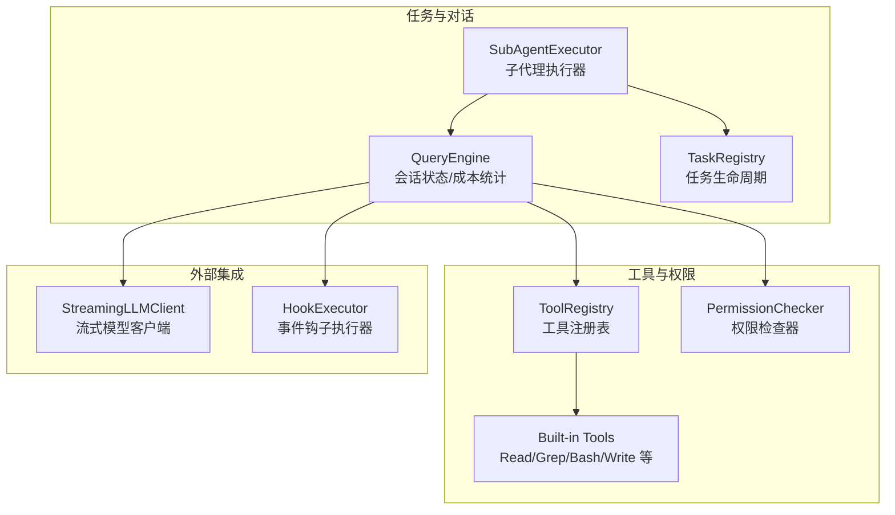
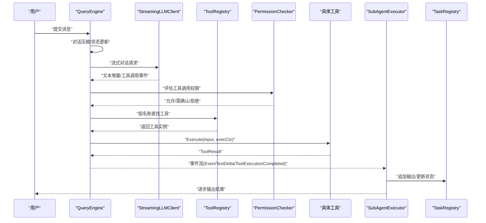
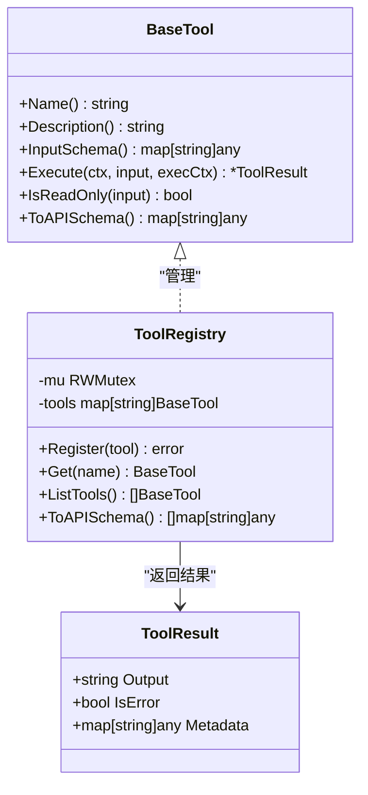
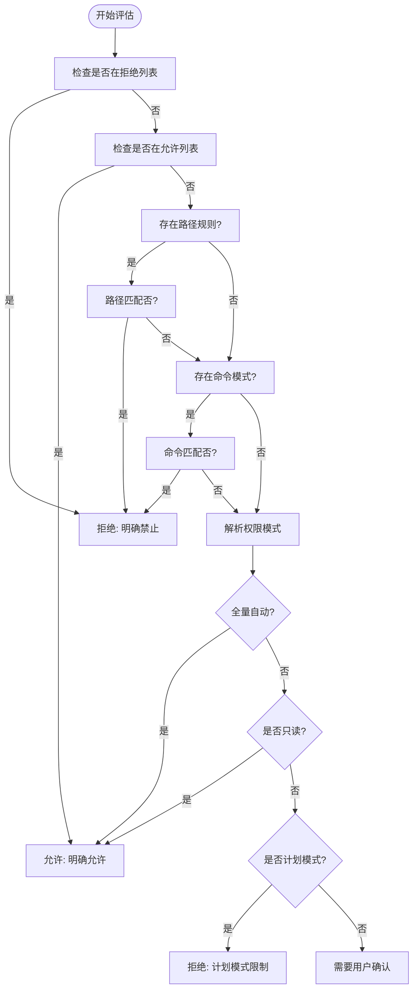
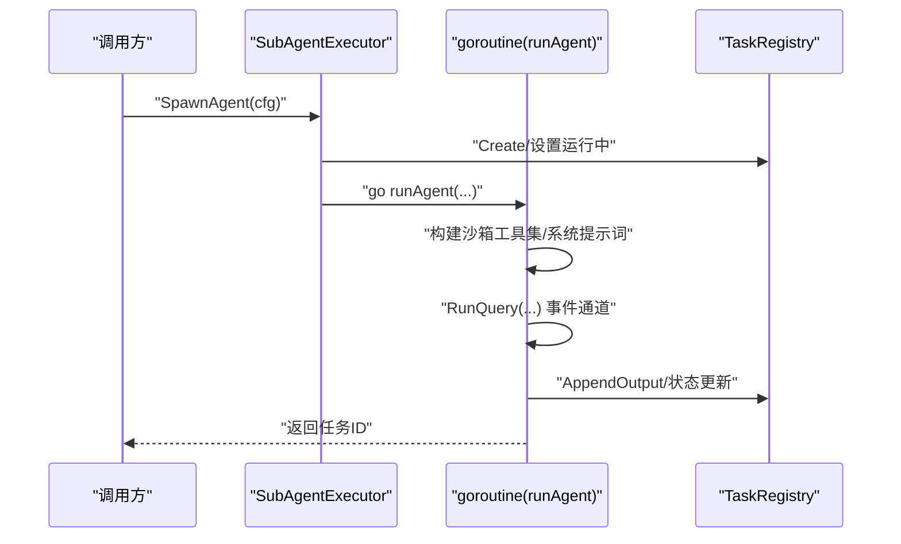
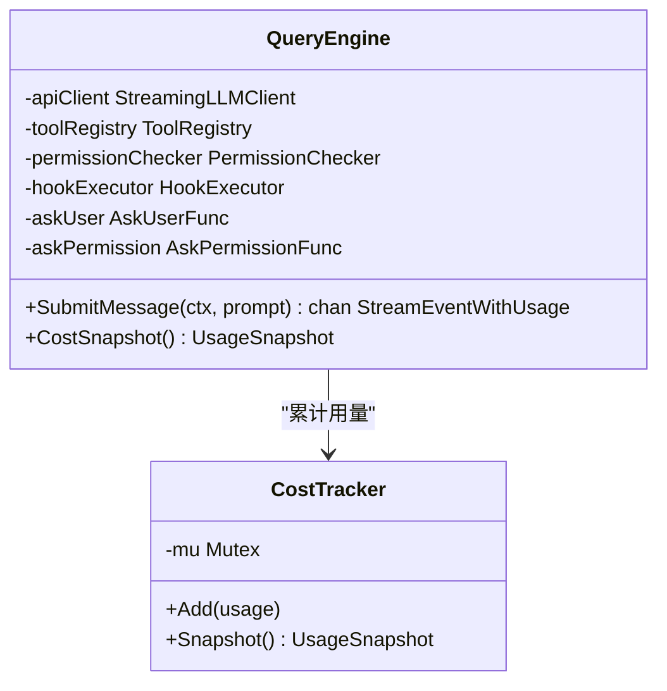
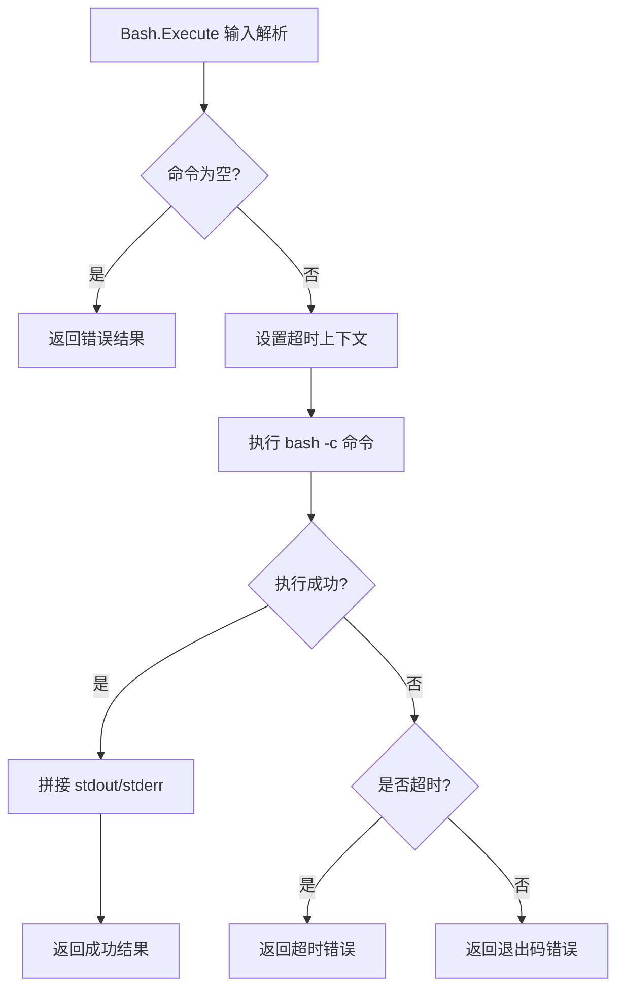
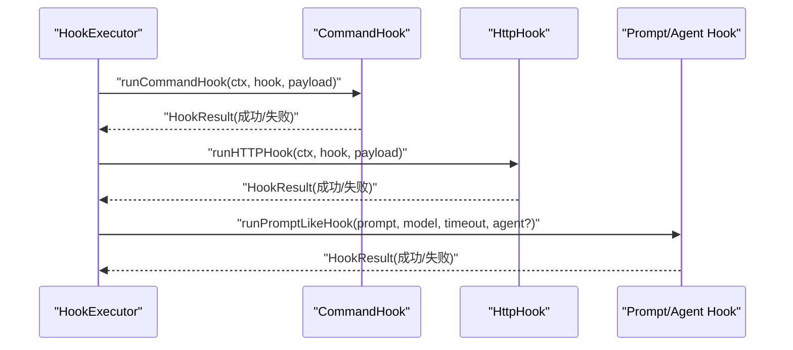
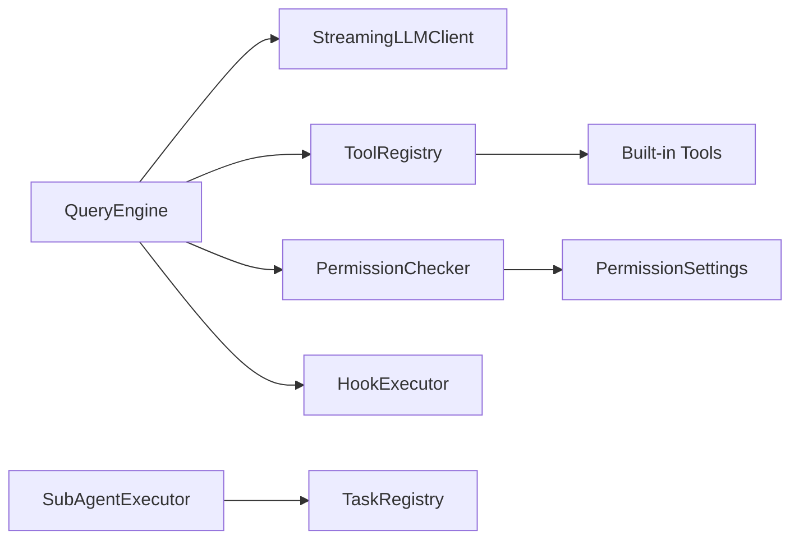

# 工具执行流

<cite>
**本文引用的文件**
- [pkg/tools/base.go](file://pkg/tools/base.go)
- [pkg/times/executor.go](file://pkg/tasks/executor.go)
- [pkg/permissions/checker.go](file://pkg/permissions/checker.go)
- [pkg/hooks/executor.go](file://pkg/hooks/executor.go)
- [pkg/times/registry.go](file://pkg/tasks/registry.go)
- [pkg/engine/query_engine.go](file://pkg/engine/query_engine.go)
- [pkg/tools/builtin/register.go](file://pkg/tools/builtin/register.go)
- [pkg/tools/builtin/bash.go](file://pkg/tools/builtin/bash.go)
- [pkg/tools/builtin/file_read.go](file://pkg/tools/builtin/file_read.go)
- [pkg/tools/builtin/file_write.go](file://pkg/tools/builtin/file_write.go)
- [pkg/tools/builtin/grep.go](file://pkg/tools/builtin/grep.go)
- [pkg/config/settings.go](file://pkg/config/settings.go)
- [pkg/permissions/modes.go](file://pkg/permissions/modes.go)
- [pkg/types/errors.go](file://pkg/types/errors.go)
</cite>

## 目录
1. [简介](#简介)
2. [项目结构](#项目结构)
3. [核心组件](#核心组件)
4. [架构总览](#架构总览)
5. [详细组件分析](#详细组件分析)
6. [依赖分析](#依赖分析)
7. [性能考虑](#性能考虑)
8. [故障排查指南](#故障排查指南)
9. [结论](#结论)
10. [附录](#附录)

## 简介
本文件系统性梳理 OpenHarness Go 的“工具执行流”，覆盖从 ToolUse 解析、权限检查、并发控制、工具执行、事件流、错误处理与回滚、性能监控与优化，以及内存管理等全生命周期。文档以代码为依据，配合可视化图示帮助读者快速建立对执行流的整体认知。

## 项目结构
OpenHarness 将“对话/任务编排”与“工具执行”解耦：上层通过 QueryEngine/SubAgentExecutor 驱动 LLM 对话与工具调度；工具注册表负责工具发现与调用；权限模块在执行前进行决策；内置工具提供文件读写、正则搜索、命令执行等能力；任务注册表用于子代理的生命周期与输出记录；钩子系统支持事件驱动的外部扩展。

图表来源
- [pkg/engine/query_engine.go:49-122](file://pkg/engine/query_engine.go#L49-L122)
- [pkg/tasks/executor.go:24-51](file://pkg/tasks/executor.go#L24-L51)
- [pkg/tasks/registry.go:13-28](file://pkg/tasks/registry.go#L13-L28)
- [pkg/tools/base.go:82-131](file://pkg/tools/base.go#L82-L131)
- [pkg/permissions/checker.go:25-82](file://pkg/permissions/checker.go#L25-L82)
- [pkg/hooks/executor.go:54-105](file://pkg/hooks/executor.go#L54-L105)

章节来源
- [pkg/engine/query_engine.go:49-122](file://pkg/engine/query_engine.go#L49-L122)
- [pkg/tasks/executor.go:24-51](file://pkg/tasks/executor.go#L24-L51)
- [pkg/tasks/registry.go:13-28](file://pkg/tasks/registry.go#L13-L28)
- [pkg/tools/base.go:82-131](file://pkg/tools/base.go#L82-L131)
- [pkg/permissions/checker.go:25-82](file://pkg/permissions/checker.go#L25-L82)
- [pkg/hooks/executor.go:54-105](file://pkg/hooks/executor.go#L54-L105)

## 核心组件
- 工具抽象与注册表
  - BaseTool 定义工具契约（名称、描述、输入模式、执行、只读标记、API 模式导出）。
  - ToolRegistry 提供线程安全的注册、查找、列举与 API 模式导出。
- 执行上下文
  - ToolExecutionContext 携带工作目录、元数据，以及用户问答与权限请求回调。
  - ToolResult 表示单次工具调用的结果（输出、是否错误、元数据）。
- 权限检查
  - PermissionChecker 基于配置的模式、显式允许/拒绝列表、路径规则、命令模式进行决策，返回是否允许及是否需要确认。
- 子代理与任务
  - SubAgentExecutor 负责创建任务、启动 goroutine 运行代理、构建沙箱化工具集、组装系统提示词、消费事件流并记录输出。
  - TaskRegistry 提供任务 ID 生成、状态管理、输出追加、消息记录、取消函数设置等。
- 查询引擎
  - QueryEngine 管理会话历史、对话压缩、并发事件通道、成本统计与最终消息落盘。
- 内置工具
  - 文件读取、写入、正则搜索、命令执行等工具实现具体 IO 与系统调用。
- 钩子系统
  - HookExecutor 支持命令、HTTP、提示词/代理型钩子，统一注入事件与负载，支持超时与阻断策略。

章节来源
- [pkg/tools/base.go:51-131](file://pkg/tools/base.go#L51-L131)
- [pkg/permissions/checker.go:10-82](file://pkg/permissions/checker.go#L10-L82)
- [pkg/tasks/executor.go:24-137](file://pkg/tasks/executor.go#L24-L137)
- [pkg/tasks/registry.go:13-191](file://pkg/tasks/registry.go#L13-L191)
- [pkg/engine/query_engine.go:49-247](file://pkg/engine/query_engine.go#L49-L247)
- [pkg/tools/builtin/register.go:7-30](file://pkg/tools/builtin/register.go#L7-L30)
- [pkg/hooks/executor.go:54-336](file://pkg/hooks/executor.go#L54-L336)

## 架构总览
下图展示一次典型工具执行的端到端流程：用户消息进入 QueryEngine，经由 LLM 推理产生 ToolUse，随后通过权限检查与工具注册表定位具体工具，执行后回传事件流，最终汇总到任务输出与会话历史。

图表来源
- [pkg/engine/query_engine.go:124-205](file://pkg/engine/query_engine.go#L124-L205)
- [pkg/tasks/executor.go:78-137](file://pkg/tasks/executor.go#L78-L137)
- [pkg/permissions/checker.go:42-82](file://pkg/permissions/checker.go#L42-L82)
- [pkg/tools/base.go:51-59](file://pkg/tools/base.go#L51-L59)

## 详细组件分析

### 工具抽象与注册表
- 设计要点
  - BaseTool 抽象了工具的最小接口集合，确保工具可被统一调度与导出 API 模式。
  - ToolRegistry 使用读写锁保证并发安全，支持动态注册、按名检索与 API 模式导出。
- 并发与资源
  - 注册/查询均使用互斥保护，避免竞态；API 模式导出复制切片，降低持有锁的时间。
- 错误与健壮性
  - 注册重复名称会返回错误；查询不存在工具返回空值，便于上层判断。

图表来源
- [pkg/tools/base.go:51-131](file://pkg/tools/base.go#L51-L131)

章节来源
- [pkg/tools/base.go:51-131](file://pkg/tools/base.go#L51-L131)

### 权限检查与时机
- 决策维度
  - 显式允许/拒绝工具列表、路径规则（glob 匹配）、命令模式匹配、权限模式（默认/计划/全量自动）。
- 时机
  - 在 QueryEngine/SubAgentExecutor 获取工具实例后、实际执行前进行评估，决定直接放行、要求确认或拒绝。
- 模式语义
  - 全量自动：放行所有工具。
  - 计划模式：仅放行只读工具，其他需退出计划模式。
  - 默认模式：只读放行，写类/命令类需用户确认。

图表来源
- [pkg/permissions/checker.go:42-82](file://pkg/permissions/checker.go#L42-L82)
- [pkg/permissions/modes.go:7-28](file://pkg/permissions/modes.go#L7-L28)

章节来源
- [pkg/permissions/checker.go:42-82](file://pkg/permissions/checker.go#L42-L82)
- [pkg/permissions/modes.go:7-28](file://pkg/permissions/modes.go#L7-L28)

### 子代理执行器与并发控制
- 并发模型
  - SpawnAgent 启动 goroutine 运行 runAgent；SpawnAgentSync 则同步等待完成。
  - runAgent 中 defer recover 捕获 panic，确保任务状态一致。
- 沙箱化工具集
  - 可根据类型或显式白名单构建受限工具集，避免任意工具被执行。
- 事件消费
  - 通过事件通道收集文本增量与工具执行完成事件，实时更新任务输出与状态。
- 取消与上下文
  - 为每个任务创建可取消上下文，支持外部停止。

图表来源
- [pkg/tasks/executor.go:33-76](file://pkg/tasks/executor.go#L33-L76)
- [pkg/tasks/executor.go:78-137](file://pkg/tasks/executor.go#L78-L137)
- [pkg/tasks/registry.go:30-134](file://pkg/tasks/registry.go#L30-L134)

章节来源
- [pkg/tasks/executor.go:33-76](file://pkg/tasks/executor.go#L33-L76)
- [pkg/tasks/executor.go:78-137](file://pkg/tasks/executor.go#L78-L137)
- [pkg/tasks/registry.go:30-134](file://pkg/tasks/registry.go#L30-L134)

### 查询引擎与事件流
- 会话管理
  - 维护消息历史，执行对话压缩管线，减少上下文开销。
- 成本追踪
  - 通过 CostTracker 原子地累积输入/输出 token，支持快照查询。
- 事件通道
  - 将底层 RunQuery 的事件流包装为带用量的通道，逐条转发并累计用量。
- 用户与权限回调
  - 支持注入 AskUser 与 AskPermission 回调，用于交互式确认与问答。

图表来源
- [pkg/engine/query_engine.go:49-247](file://pkg/engine/query_engine.go#L49-L247)

章节来源
- [pkg/engine/query_engine.go:49-247](file://pkg/engine/query_engine.go#L49-L247)

### 内置工具执行细节
- Bash 工具
  - 支持超时控制，子进程标准输出/错误合并返回；超时与非零退出分别构造错误结果。
- 文件读取/写入
  - 读取按行切分与偏移/限制裁剪；写入确保父目录存在并原子写入。
- 正则搜索
  - 递归遍历目录树，按 include 过滤文件，扫描匹配行并限制最大结果数。

图表来源
- [pkg/tools/builtin/bash.go:56-99](file://pkg/tools/builtin/bash.go#L56-L99)

章节来源
- [pkg/tools/builtin/bash.go:56-99](file://pkg/tools/builtin/bash.go#L56-L99)
- [pkg/tools/builtin/file_read.go:60-99](file://pkg/tools/builtin/file_read.go#L60-L99)
- [pkg/tools/builtin/file_write.go:54-80](file://pkg/tools/builtin/file_write.go#L54-L80)
- [pkg/tools/builtin/grep.go:62-141](file://pkg/tools/builtin/grep.go#L62-L141)

### 钩子系统与事件驱动
- 类型
  - 命令钩子、HTTP 钩子、提示词钩子、代理钩子，均支持超时与失败阻断策略。
- 执行
  - 统一注入 OPENHARNESS_HOOK_EVENT 与 OPENHARNESS_HOOK_PAYLOAD 环境变量；提示词/代理钩子通过 LLM 客户端评估 JSON 结果。
- 匹配
  - 基于 payload["tool_name"] 的通配符匹配，支持按工具名筛选钩子。

图表来源
- [pkg/hooks/executor.go:111-269](file://pkg/hooks/executor.go#L111-L269)

章节来源
- [pkg/hooks/executor.go:111-269](file://pkg/hooks/executor.go#L111-L269)

## 依赖分析
- 组件耦合
  - QueryEngine 依赖 LLM 客户端、工具注册表、权限检查器、钩子执行器与用户回调。
  - SubAgentExecutor 依赖任务注册表、工具注册表与引擎上下文，负责 goroutine 生命周期与事件消费。
  - ToolRegistry 与内置工具松耦合，通过接口契约连接。
- 外部依赖
  - 文件系统（读写/遍历）、正则表达式、系统命令执行、HTTP 客户端、流式 LLM API。
- 循环依赖
  - 未见直接循环；权限配置来自配置模块，Checker 仅依赖配置结构体字段。

图表来源
- [pkg/engine/query_engine.go:49-122](file://pkg/engine/query_engine.go#L49-L122)
- [pkg/tasks/executor.go:24-51](file://pkg/tasks/executor.go#L24-L51)
- [pkg/permissions/checker.go:31-39](file://pkg/permissions/checker.go#L31-L39)
- [pkg/config/settings.go:37-44](file://pkg/config/settings.go#L37-L44)

章节来源
- [pkg/engine/query_engine.go:49-122](file://pkg/engine/query_engine.go#L49-L122)
- [pkg/tasks/executor.go:24-51](file://pkg/tasks/executor.go#L24-L51)
- [pkg/permissions/checker.go:31-39](file://pkg/permissions/checker.go#L31-L39)
- [pkg/config/settings.go:37-44](file://pkg/config/settings.go#L37-L44)

## 性能考虑
- 会话压缩与上下文控制
  - QueryEngine 在提交消息前执行对话压缩管线，降低 token 使用与推理成本。
- 事件流与缓冲
  - 事件通道使用固定容量缓冲，避免阻塞上游；用量聚合在独立 goroutine 中转发。
- 工具执行优化
  - Bash 工具设置超时，防止长时间阻塞；文件读取支持偏移/限制，避免大文件全量传输。
  - Grep 工具限制最大结果数量，避免过多 IO 与内存占用。
- 并发与资源
  - 工具注册表使用读写锁，提高高并发下的查询吞吐；子代理使用 goroutine 并发推进，结合上下文取消实现快速停止。
- 成本与可观测性
  - CostTracker 原子累加，支持快照查询；建议在 UI 或日志中周期性打印用量统计。

章节来源
- [pkg/engine/query_engine.go:144-205](file://pkg/engine/query_engine.go#L144-L205)
- [pkg/tools/builtin/bash.go:70-99](file://pkg/tools/builtin/bash.go#L70-L99)
- [pkg/tools/builtin/file_read.go:79-98](file://pkg/tools/builtin/file_read.go#L79-L98)
- [pkg/tools/builtin/grep.go:88-117](file://pkg/tools/builtin/grep.go#L88-L117)

## 故障排查指南
- 权限相关
  - 若工具被拒绝，检查权限模式与工具/路径/命令规则；必要时切换到全量自动或添加允许项。
- 工具执行失败
  - Bash 超时：增大超时或优化命令；非零退出：查看标准错误输出定位问题。
  - 文件读写：确认路径是否绝对或相对工作目录正确；写入失败多因权限或父目录不存在。
  - Grep 无结果：检查 include 过滤条件与搜索范围。
- 任务异常
  - 子代理 panic：查看任务输出中的 panic 日志；使用 Stop 触发取消并清理。
- API 错误类型
  - 认证失败、速率限制、通用请求失败等，建议根据错误类型重试或调整配额。

章节来源
- [pkg/permissions/checker.go:42-82](file://pkg/permissions/checker.go#L42-L82)
- [pkg/tools/builtin/bash.go:90-99](file://pkg/tools/builtin/bash.go#L90-L99)
- [pkg/tasks/executor.go:78-84](file://pkg/tasks/executor.go#L78-L84)
- [pkg/types/errors.go:11-40](file://pkg/types/errors.go#L11-L40)

## 结论
OpenHarness 的工具执行流以“查询引擎 + 子代理 + 工具注册表 + 权限检查 + 钩子系统”为核心，通过 goroutine 并发与事件流实现高效、可观测、可扩展的自动化工具链。权限检查贯穿执行前的关键节点，内置工具覆盖常见开发场景，配置化策略满足不同安全需求。建议在生产环境中结合会话压缩、用量统计与超时策略，持续优化性能与稳定性。

## 附录
- 配置要点
  - 权限模式与规则：通过配置文件定义工具白/黑名单、路径规则与命令模式。
  - 模型与令牌上限：影响对话成本与上下文长度。
- 最佳实践
  - 优先使用只读工具进行探索与验证；变更操作在确认后执行。
  - 为长耗时工具设置合理超时；对大文件读取使用偏移/限制。
  - 定期清理任务与输出，避免内存膨胀。

章节来源
- [pkg/config/settings.go:37-142](file://pkg/config/settings.go#L37-L142)
- [pkg/tools/builtin/register.go:7-30](file://pkg/tools/builtin/register.go#L7-L30)