# 数据流分析

<cite>
**本文引用的文件**
- [cmd/openharness/main.go](file://cmd/openharness/main.go)
- [pkg/ui/runtime.go](file://pkg/ui/runtime.go)
- [pkg/engine/query_engine.go](file://pkg/engine/query_engine.go)
- [pkg/api/client.go](file://pkg/api/client.go)
- [pkg/tipos/messages.go](file://pkg/types/messages.go)
- [pkg/tipos/events.go](file://pkg/types/events.go)
- [pkg/state/store.go](file://pkg/state/store.go)
- [pkg/tools/base.go](file://pkg/tools/base.go)
- [pkg/permissions/checker.go](file://pkg/permissions/checker.go)
- [pkg/mcp/client.go](file://pkg/mcp/client.go)
- [pkg/hitl/cli_adapter.go](file://pkg/hitl/cli_adapter.go)
- [pkg/config/settings.go](file://pkg/config/settings.go)
- [pkg/skills/loader.go](file://pkg/skills/loader.go)
</cite>

## 目录
1. [简介](#简介)
2. [项目结构](#项目结构)
3. [核心组件](#核心组件)
4. [架构总览](#架构总览)
5. [详细组件分析](#详细组件分析)
6. [依赖分析](#依赖分析)
7. [性能考量](#性能考量)
8. [故障排查指南](#故障排查指南)
9. [结论](#结论)
10. [附录](#附录)

## 简介
本文件面向 OpenHarness Go 的数据流与控制流，围绕“从用户输入到最终输出”的完整链路进行系统化梳理，重点覆盖以下方面：
- 消息传递：用户输入如何被封装为 ConversationMessage，并通过 API 客户端与模型交互。
- 状态管理：应用状态 AppStateStore 如何在运行期更新与通知订阅者。
- 内存处理：对话历史、令牌用量统计与压缩管线的协作。
- 工具调用：工具注册、权限检查、执行回调与结果回传。
- 异步与并发：事件通道、后台 goroutine、上下文取消与重试策略。
- 数据一致性与错误传播：事件类型、错误包装与传播路径。

## 项目结构
OpenHarness 采用分层与模块化组织方式：
- 命令入口层：解析 CLI 参数、加载配置、选择运行模式（REPL/打印模式）。
- 运行时装配层：构建 RuntimeBundle，注入 API 客户端、工具注册表、MCP 管理器、Hook 执行器、查询引擎等。
- 引擎层：QueryEngine 负责对话历史管理、压缩、权限检查、工具调用与事件流转发。
- 类型与事件层：统一的消息与事件数据结构，确保跨模块一致的数据契约。
- 外部集成层：API 客户端（Anthropic/OpenAI 兼容）、MCP 协议客户端、人类在环（HITL）适配器。

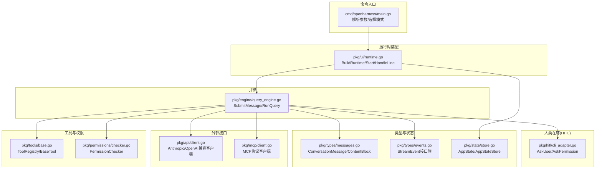

图表来源
- [cmd/openharness/main.go:15-102](file://cmd/openharness/main.go#L15-L102)
- [pkg/ui/runtime.go:52-192](file://pkg/ui/runtime.go#L52-L192)
- [pkg/engine/query_engine.go:98-205](file://pkg/engine/query_engine.go#L98-L205)
- [pkg/api/client.go:107-148](file://pkg/api/client.go#L107-L148)
- [pkg/mcp/client.go:136-148](file://pkg/mcp/client.go#L136-L148)
- [pkg/types/messages.go:62-109](file://pkg/types/messages.go#L62-L109)
- [pkg/types/events.go:5-40](file://pkg/types/events.go#L5-L40)
- [pkg/state/store.go:26-102](file://pkg/state/store.go#L26-L102)
- [pkg/tools/base.go:82-132](file://pkg/tools/base.go#L82-L132)
- [pkg/permissions/checker.go:42-82](file://pkg/permissions/checker.go#L42-L82)
- [pkg/hitl/cli_adapter.go:23-102](file://pkg/hitl/cli_adapter.go#L23-L102)

章节来源
- [cmd/openharness/main.go:15-102](file://cmd/openharness/main.go#L15-L102)
- [pkg/ui/runtime.go:52-192](file://pkg/ui/runtime.go#L52-L192)

## 核心组件
- 用户输入与运行模式
  - CLI 解析参数后，根据是否提供一次性提示或打印模式，决定进入 REPL 或直接打印响应。
- 运行时装配
  - 构建 RuntimeBundle，包含 API 客户端、工具注册表、MCP 管理器、Hook 执行器、查询引擎与会话信息。
- 查询引擎
  - 维护对话历史、令牌用量统计、最大轮次限制；提交用户消息后启动一轮完整的推理-工具循环。
- 类型与事件
  - ConversationMessage/ContentBlock 作为消息载体；StreamEvent 接口族承载增量文本、工具执行事件与回合完成事件。
- 状态存储
  - AppStateStore 提供线程安全的状态读写与订阅通知，用于 UI 与 MCP 连接状态展示。
- 权限与工具
  - PermissionChecker 基于配置评估工具调用许可；ToolRegistry 注册内置与插件技能工具，统一执行接口。
- MCP 客户端
  - 通过 stdio 与 MCP 服务器建立连接，支持工具调用与资源读取。
- HITL 适配器
  - 在 CLI 环境中实现 AskUser 与 AskPermission 回调，支持用户确认与问答。

章节来源
- [cmd/openharness/main.go:46-76](file://cmd/openharness/main.go#L46-L76)
- [pkg/ui/runtime.go:52-192](file://pkg/ui/runtime.go#L52-L192)
- [pkg/engine/query_engine.go:49-205](file://pkg/engine/query_engine.go#L49-L205)
- [pkg/types/messages.go:62-169](file://pkg/types/messages.go#L62-L169)
- [pkg/types/events.go:5-40](file://pkg/types/events.go#L5-L40)
- [pkg/state/store.go:26-102](file://pkg/state/store.go#L26-L102)
- [pkg/tools/base.go:82-132](file://pkg/tools/base.go#L82-L132)
- [pkg/permissions/checker.go:42-82](file://pkg/permissions/checker.go#L42-L82)
- [pkg/mcp/client.go:136-148](file://pkg/mcp/client.go#L136-L148)
- [pkg/hitl/cli_adapter.go:23-102](file://pkg/hitl/cli_adapter.go#L23-L102)

## 架构总览
下图展示了从用户输入到最终输出的关键数据流与控制流：

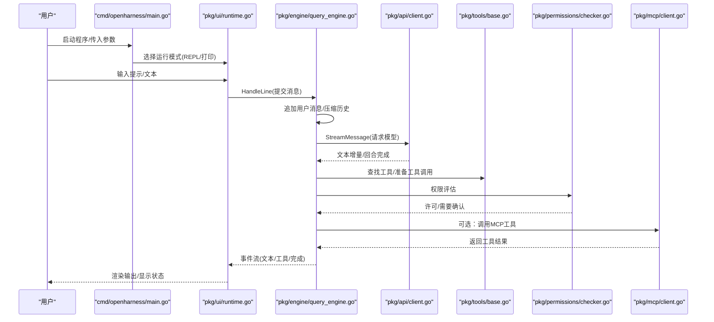

图表来源
- [cmd/openharness/main.go:46-76](file://cmd/openharness/main.go#L46-L76)
- [pkg/ui/runtime.go:222-283](file://pkg/ui/runtime.go#L222-L283)
- [pkg/engine/query_engine.go:124-205](file://pkg/engine/query_engine.go#L124-L205)
- [pkg/api/client.go:107-148](file://pkg/api/client.go#L107-L148)
- [pkg/tools/base.go:104-132](file://pkg/tools/base.go#L104-L132)
- [pkg/permissions/checker.go:42-82](file://pkg/permissions/checker.go#L42-L82)
- [pkg/mcp/client.go:198-230](file://pkg/mcp/client.go#L198-L230)

## 详细组件分析

### 组件一：消息与事件数据结构
- ConversationMessage/ContentBlock
  - 支持文本块、工具调用块与工具结果块，提供序列化为 API 参数与反序列化为消息的能力。
- StreamEvent 接口族
  - AssistantTextDelta：增量文本。
  - AssistantTurnComplete：回合完成，携带完整消息与用量快照。
  - ToolExecutionStarted/ToolExecutionCompleted：工具调用生命周期事件。

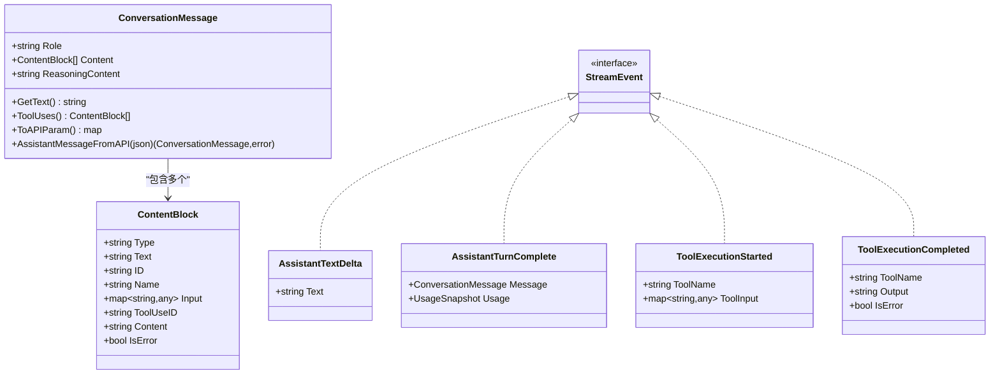

图表来源
- [pkg/types/messages.go:16-169](file://pkg/types/messages.go#L16-L169)
- [pkg/types/events.go:5-40](file://pkg/types/events.go#L5-L40)

章节来源
- [pkg/types/messages.go:62-169](file://pkg/types/messages.go#L62-L169)
- [pkg/types/events.go:5-40](file://pkg/types/events.go#L5-L40)

### 组件二：状态管理与订阅
- AppStateStore
  - 提供 Get/Set/Update/Subscribe/Notify 等方法，内部使用读写锁保证并发安全。
  - 订阅者列表采用 nil 填充以保持索引稳定，避免删除时的索引漂移问题。

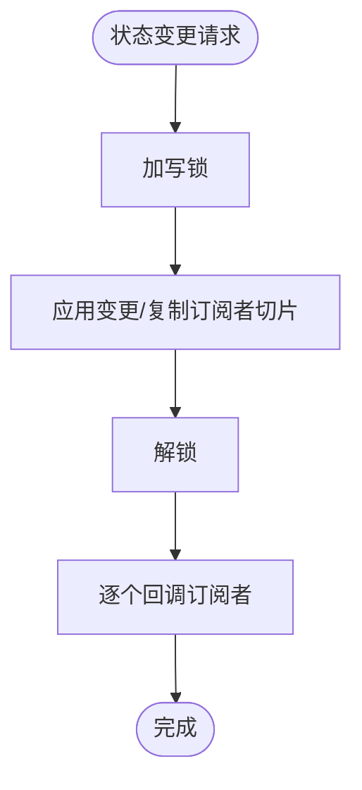

图表来源
- [pkg/state/store.go:44-102](file://pkg/state/store.go#L44-L102)

章节来源
- [pkg/state/store.go:26-102](file://pkg/state/store.go#L26-L102)

### 组件三：工具注册与执行
- ToolRegistry
  - 线程安全注册与查找工具；提供 API Schema 导出能力。
- BaseTool 接口
  - 规范工具名称、描述、输入模式、执行函数、只读属性与 API Schema。
- ToolResult
  - 不可变结果对象，支持错误标记与元数据。

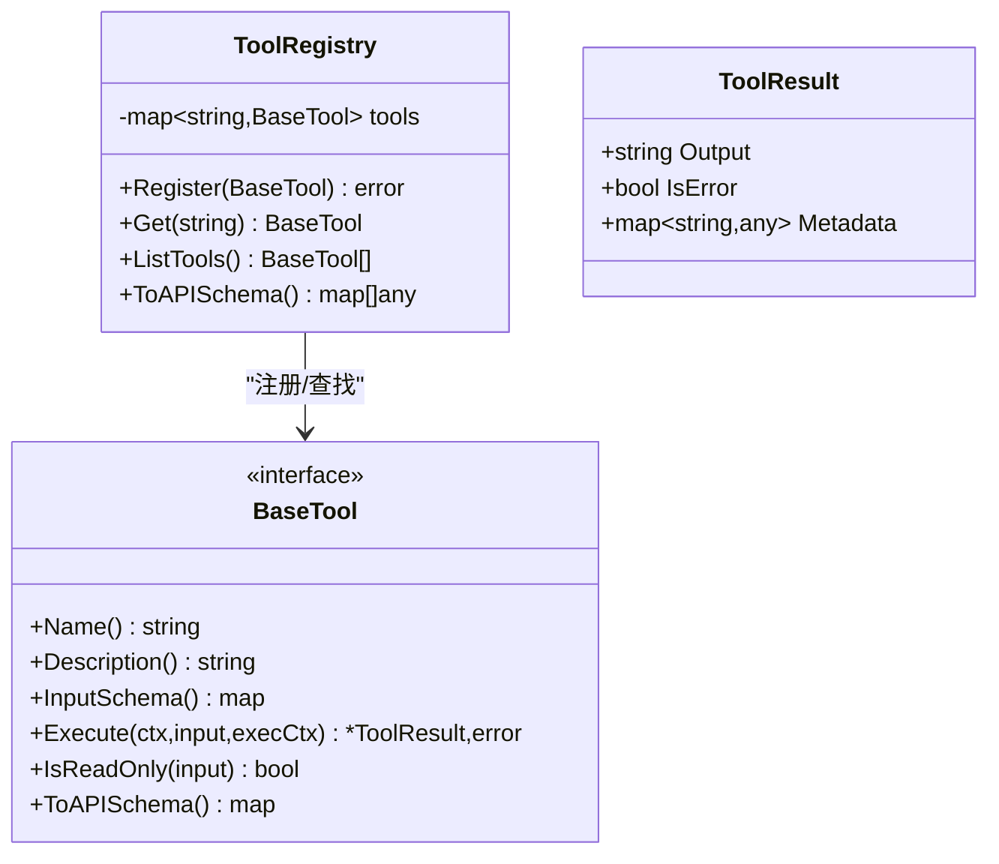

图表来源
- [pkg/tools/base.go:82-132](file://pkg/tools/base.go#L82-L132)

章节来源
- [pkg/tools/base.go:51-132](file://pkg/tools/base.go#L51-L132)

### 组件四：权限检查与决策
- PermissionChecker
  - 基于工具白名单/黑名单、路径规则与命令模式匹配进行评估。
  - 支持三种模式：全自动、计划模式、默认模式（需要确认）。

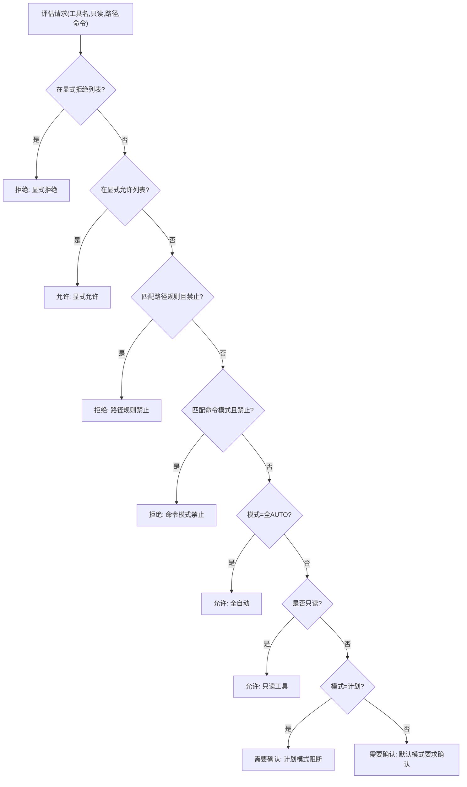

图表来源
- [pkg/permissions/checker.go:42-82](file://pkg/permissions/checker.go#L42-L82)

章节来源
- [pkg/permissions/checker.go:23-82](file://pkg/permissions/checker.go#L23-L82)

### 组件五：MCP 客户端与工具调用
- McpClientManager
  - 管理多服务器连接，支持初始化、列出工具与资源、调用工具与读取资源。
- JSON-RPC over stdio
  - 请求/响应序列化、按行读取、错误透传与状态维护。

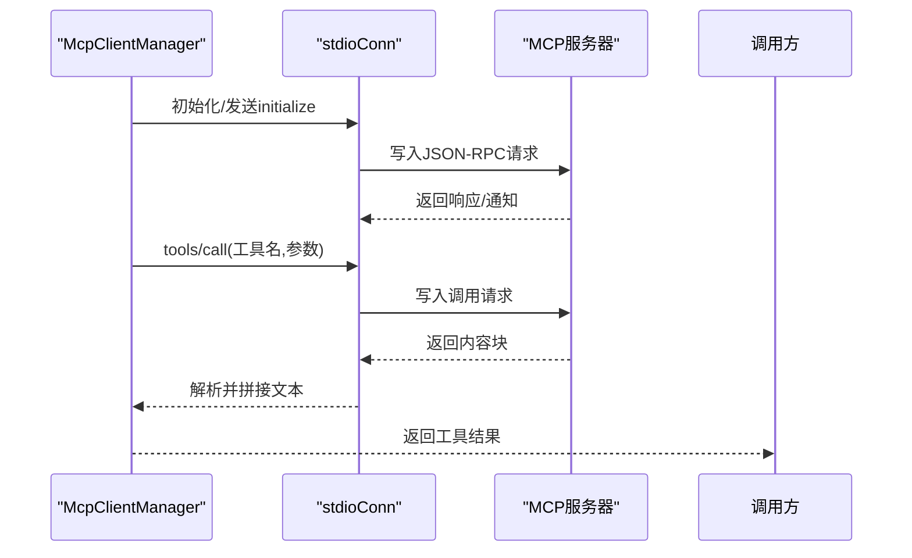

图表来源
- [pkg/mcp/client.go:136-230](file://pkg/mcp/client.go#L136-L230)
- [pkg/mcp/client.go:296-373](file://pkg/mcp/client.go#L296-L373)

章节来源
- [pkg/mcp/client.go:116-440](file://pkg/mcp/client.go#L116-L440)

### 组件六：API 客户端与流式事件
- AnthropicApiClient/OpenAI 兼容客户端
  - 支持 SSE 流式事件解析，包含文本增量、消息结束与用量信息。
  - 内置指数退避重试与可重试错误判断。
- 事件分发
  - 将 SSE 事件映射为 ApiStreamEvent，再上抛至引擎层。

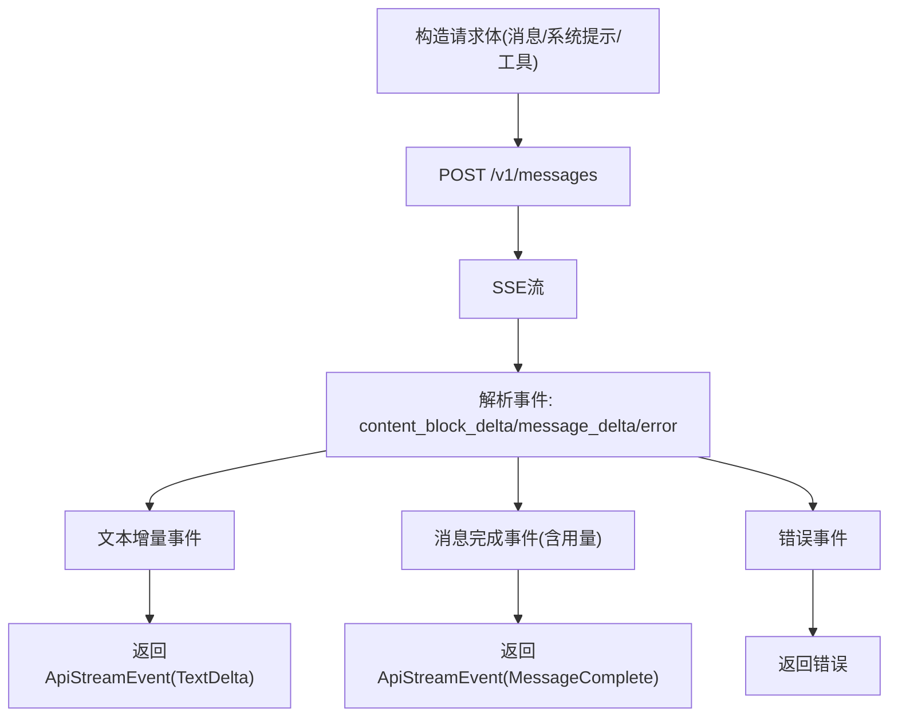

图表来源
- [pkg/api/client.go:174-354](file://pkg/api/client.go#L174-L354)
- [pkg/api/client.go:107-148](file://pkg/api/client.go#L107-L148)

章节来源
- [pkg/api/client.go:43-406](file://pkg/api/client.go#L43-L406)

### 组件七：查询引擎与消息提交
- SubmitMessage
  - 追加用户消息，复制当前对话历史与折叠缓冲区，执行压缩管线，然后启动 RunQuery。
  - 使用 goroutine 包装事件流，累计用量并更新消息历史。
- RunQuery
  - 实际的推理-工具循环，结合权限检查、工具调用与 MCP 调用，向 UI 层回传事件。

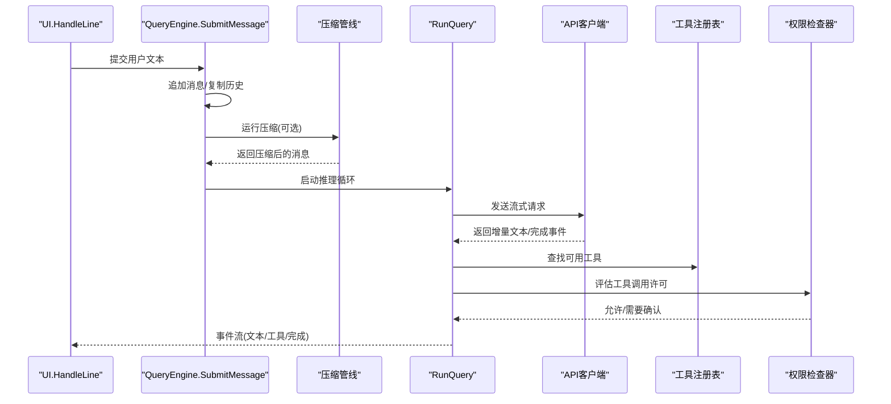

图表来源
- [pkg/engine/query_engine.go:124-205](file://pkg/engine/query_engine.go#L124-L205)
- [pkg/engine/query_engine.go:174-188](file://pkg/engine/query_engine.go#L174-L188)

章节来源
- [pkg/engine/query_engine.go:49-247](file://pkg/engine/query_engine.go#L49-L247)

### 组件八：人类在环（HITL）与交互
- CLIAdapter
  - 实现 AskUser 与 AskPermission，支持选项菜单与自由输入，配合上下文取消。

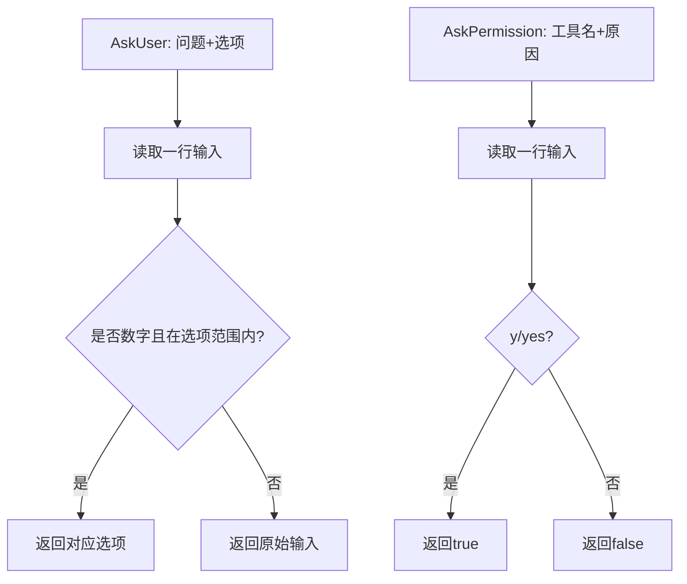

图表来源
- [pkg/hitl/cli_adapter.go:23-102](file://pkg/hitl/cli_adapter.go#L23-L102)

章节来源
- [pkg/hitl/cli_adapter.go:12-102](file://pkg/hitl/cli_adapter.go#L12-L102)

## 依赖分析
- 组件耦合
  - RuntimeBundle 将 API 客户端、工具注册表、MCP 管理器、Hook 执行器与查询引擎聚合，降低上层调用复杂度。
  - QueryEngine 对外暴露 SubmitMessage，内部依赖 API 客户端、工具注册表、权限检查器与 Hook 执行器。
- 外部依赖
  - API 客户端依赖 HTTP/SSE；MCP 客户端依赖子进程 stdio；权限检查器依赖配置与路径匹配。
- 并发与同步
  - AppStateStore 使用读写锁；ToolRegistry 使用读写锁；API 客户端内部使用 goroutine 与通道；QueryEngine 使用互斥锁保护消息历史与用量。

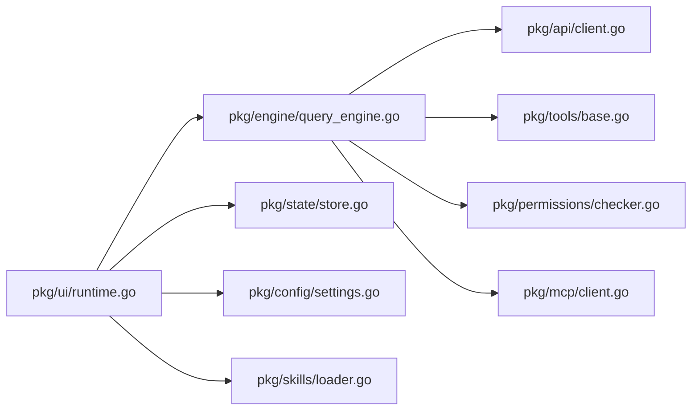

图表来源
- [pkg/ui/runtime.go:52-192](file://pkg/ui/runtime.go#L52-L192)
- [pkg/engine/query_engine.go:98-122](file://pkg/engine/query_engine.go#L98-L122)
- [pkg/api/client.go:107-148](file://pkg/api/client.go#L107-L148)
- [pkg/mcp/client.go:136-148](file://pkg/mcp/client.go#L136-L148)
- [pkg/state/store.go:26-102](file://pkg/state/store.go#L26-L102)
- [pkg/config/settings.go:160-195](file://pkg/config/settings.go#L160-L195)
- [pkg/skills/loader.go:23-60](file://pkg/skills/loader.go#L23-L60)

章节来源
- [pkg/ui/runtime.go:52-192](file://pkg/ui/runtime.go#L52-L192)
- [pkg/engine/query_engine.go:98-122](file://pkg/engine/query_engine.go#L98-L122)

## 性能考量
- 令牌用量统计
  - QueryEngine 内置 CostTracker，累积输入/输出令牌，便于成本监控与阈值告警。
- 历史压缩
  - 提供压缩管线与折叠缓冲区，减少上下文长度，提升吞吐与降低成本。
- 流式渲染
  - UI 层对文本增量进行即时渲染，工具调用前后清理“思考中”提示，改善交互体验。
- 重试与抖动
  - API 客户端采用指数退避与抖动，结合可重试状态码，提高稳定性。
- 并发与背压
  - 事件通道容量设置为 64，避免上游过快导致阻塞；建议根据负载调整。

章节来源
- [pkg/engine/query_engine.go:17-43](file://pkg/engine/query_engine.go#L17-L43)
- [pkg/ui/runtime.go:222-283](file://pkg/ui/runtime.go#L222-L283)
- [pkg/api/client.go:359-390](file://pkg/api/client.go#L359-L390)

## 故障排查指南
- API 错误分类与传播
  - HTTP 401/403 → 认证失败；429 → 速率限制；其他网络/超时 → 请求失败；SSE 错误 → API 流错误。
- 重试策略
  - 非致命错误与可重试状态码自动重试，支持 Retry-After 头；超过最大重试次数或不可重试则上报最终错误。
- 权限相关
  - 若工具被拒绝或需要确认，请检查配置中的工具白名单/黑名单、路径规则与命令模式。
- MCP 连接
  - 检查 MCP 服务器命令、工作目录与环境变量；关注连接状态与工具/资源列表。
- UI 交互
  - 若 HITL 无法读取输入，请确认标准输入未被占用且上下文未提前取消。

章节来源
- [pkg/api/client.go:359-406](file://pkg/api/client.go#L359-L406)
- [pkg/permissions/checker.go:42-82](file://pkg/permissions/checker.go#L42-L82)
- [pkg/mcp/client.go:136-148](file://pkg/mcp/client.go#L136-L148)
- [pkg/hitl/cli_adapter.go:23-102](file://pkg/hitl/cli_adapter.go#L23-L102)

## 结论
OpenHarness Go 通过清晰的分层与强类型数据结构，实现了从用户输入到模型输出与工具调用的闭环数据流。其关键优势包括：
- 统一的消息与事件模型，确保跨模块一致性。
- 线程安全的状态存储与订阅机制，支撑 UI 与 MCP 状态展示。
- 完整的权限与 HITL 机制，兼顾安全性与可控性。
- 流式事件与压缩管线，兼顾性能与成本。
建议在生产环境中结合令牌用量监控、MCP 连接健康检查与日志采样，持续优化数据流与用户体验。

## 附录
- 配置加载与保存
  - 支持从配置文件读取与环境变量覆盖，提供默认值与保存功能。
- 技能加载
  - 支持本地与全局插件/技能目录扫描，生成虚拟插件索引与子技能前缀。

章节来源
- [pkg/config/settings.go:160-212](file://pkg/config/settings.go#L160-L212)
- [pkg/skills/loader.go:23-198](file://pkg/skills/loader.go#L23-L198)