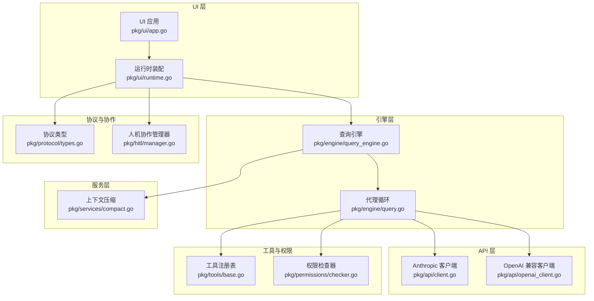
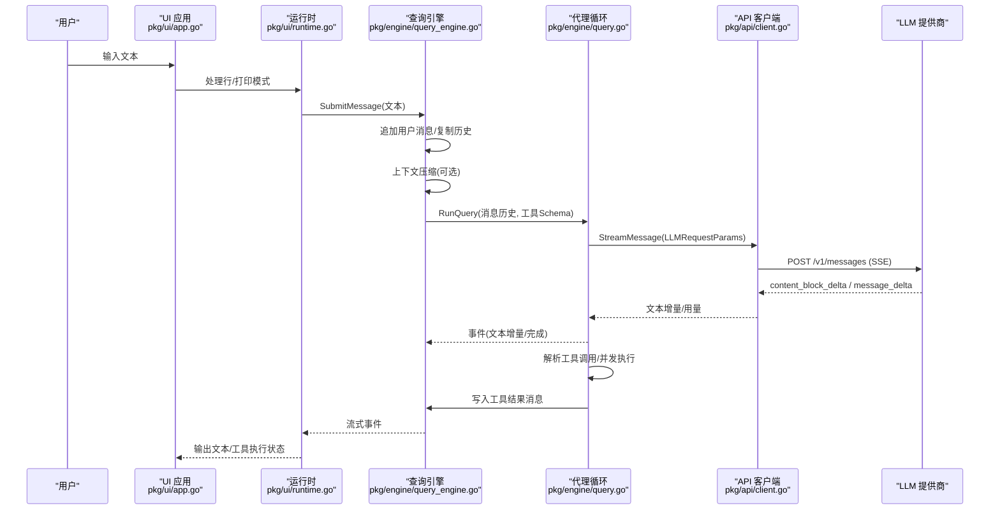
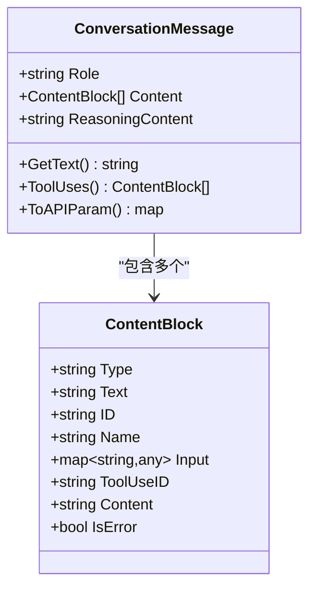
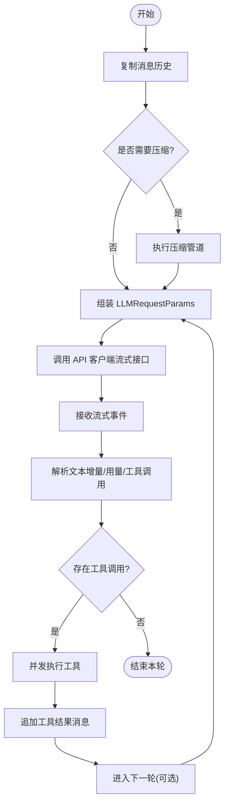
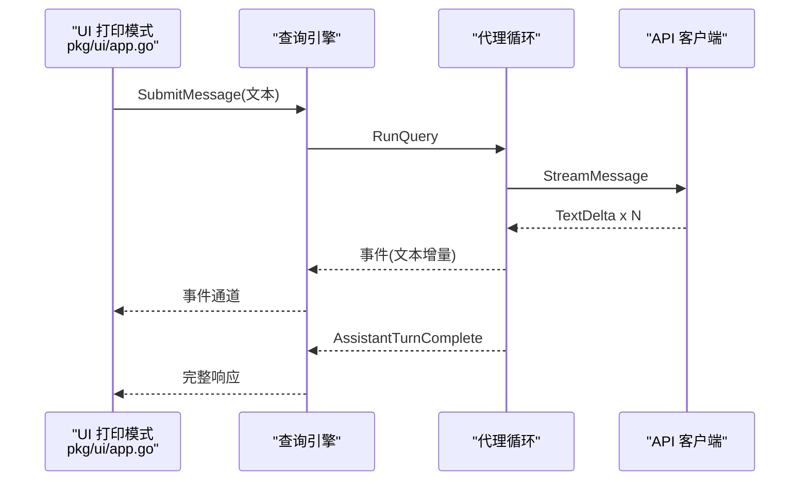
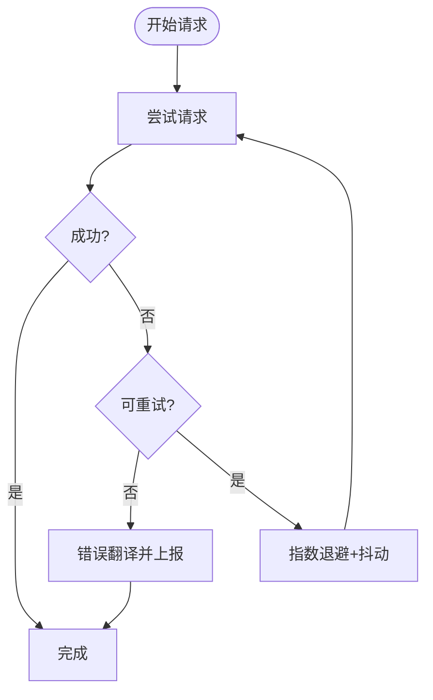
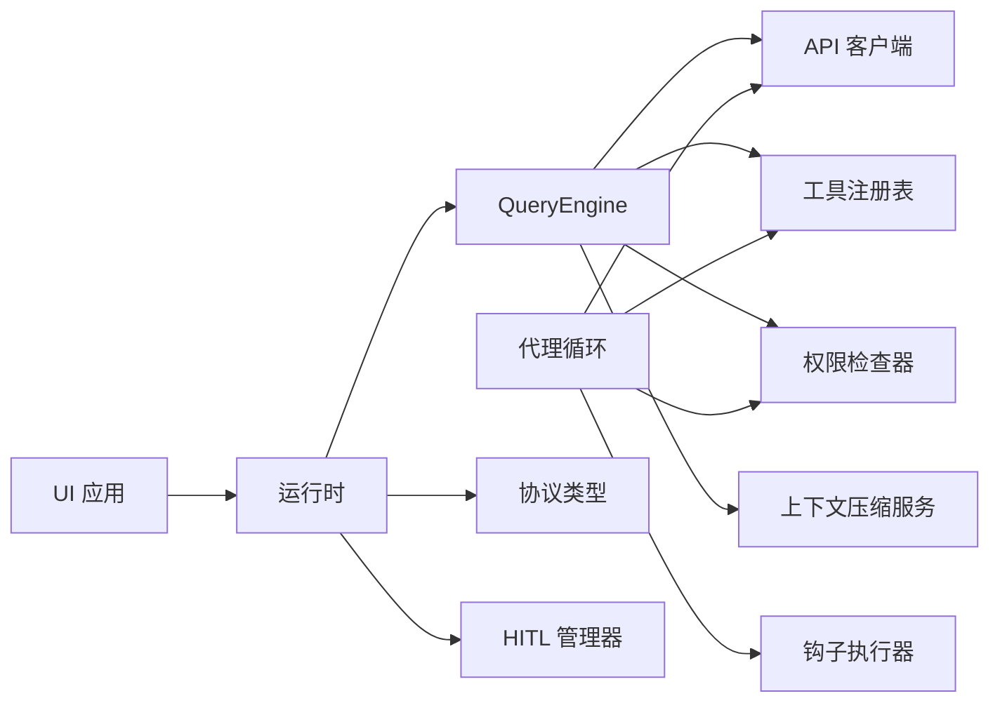

# 消息流处理

<cite>
**本文引用的文件**
- [pkg/types/messages.go](file://pkg/types/messages.go)
- [pkg/engine/query.go](file://pkg/engine/query.go)
- [pkg/engine/query_engine.go](file://pkg/engine/query_engine.go)
- [pkg/api/client.go](file://pkg/api/client.go)
- [pkg/api/openai_client.go](file://pkg/api/openai_client.go)
- [pkg/services/compact.go](file://pkg/services/compact.go)
- [pkg/protocol/types.go](file://pkg/protocol/types.go)
- [pkg/hitl/manager.go](file://pkg/hitl/manager.go)
- [pkg/tools/base.go](file://pkg/tools/base.go)
- [pkg/permissions/checker.go](file://pkg/permissions/checker.go)
- [pkg/ui/app.go](file://pkg/ui/app.go)
- [pkg/ui/runtime.go](file://pkg/ui/runtime.go)
- [cmd/openharness/main.go](file://cmd/openharness/main.go)
</cite>

## 目录
1. [简介](#简介)
2. [项目结构](#项目结构)
3. [核心组件](#核心组件)
4. [架构总览](#架构总览)
5. [详细组件分析](#详细组件分析)
6. [依赖分析](#依赖分析)
7. [性能考量](#性能考量)
8. [故障排查指南](#故障排查指南)
9. [结论](#结论)
10. [附录](#附录)

## 简介
本文件面向 OpenHarness Go 的消息流处理，系统性阐述 ConversationMessage 的创建、传输与处理机制，涵盖内容块类型（文本、工具调用、工具结果）与消息链路管理；详解 LLM 请求参数 LLMRequestParams 的构建流程（系统提示、消息历史、工具定义）；给出从用户输入到助手回复的完整生命周期；分析消息验证、序列化与反序列化；并提供同步与异步消息处理的时序图与消息流图，最后总结错误处理与重试机制。

## 项目结构
OpenHarness 将消息流处理按职责分层：UI 层负责交互与事件输出；引擎层负责对话状态管理与多轮代理循环；API 层负责与 LLM 提供商的流式通信与重试；服务层负责上下文压缩与令牌估算；协议与 HITL 层负责前后端事件协议与人机协作。

图表来源
- [pkg/ui/app.go:18-61](file://pkg/ui/app.go#L18-L61)
- [pkg/ui/runtime.go:52-192](file://pkg/ui/runtime.go#L52-L192)
- [pkg/engine/query_engine.go:98-205](file://pkg/engine/query_engine.go#L98-L205)
- [pkg/engine/query.go:142-280](file://pkg/engine/query.go#L142-L280)
- [pkg/api/client.go:106-148](file://pkg/api/client.go#L106-L148)
- [pkg/api/openai_client.go:130-402](file://pkg/api/openai_client.go#L130-L402)
- [pkg/services/compact.go:74-115](file://pkg/services/compact.go#L74-L115)
- [pkg/protocol/types.go:53-101](file://pkg/protocol/types.go#L53-L101)
- [pkg/hitl/manager.go:12-26](file://pkg/hitl/manager.go#L12-L26)
- [pkg/tools/base.go:82-131](file://pkg/tools/base.go#L82-L131)
- [pkg/permissions/checker.go:25-81](file://pkg/permissions/checker.go#L25-L81)

章节来源
- [pkg/ui/app.go:18-61](file://pkg/ui/app.go#L18-L61)
- [pkg/ui/runtime.go:52-192](file://pkg/ui/runtime.go#L52-L192)
- [pkg/engine/query_engine.go:98-205](file://pkg/engine/query_engine.go#L98-L205)
- [pkg/engine/query.go:142-280](file://pkg/engine/query.go#L142-L280)
- [pkg/api/client.go:106-148](file://pkg/api/client.go#L106-L148)
- [pkg/api/openai_client.go:130-402](file://pkg/api/openai_client.go#L130-L402)
- [pkg/services/compact.go:74-115](file://pkg/services/compact.go#L74-L115)
- [pkg/protocol/types.go:53-101](file://pkg/protocol/types.go#L53-L101)
- [pkg/hitl/manager.go:12-26](file://pkg/hitl/manager.go#L12-L26)
- [pkg/tools/base.go:82-131](file://pkg/tools/base.go#L82-L131)
- [pkg/permissions/checker.go:25-81](file://pkg/permissions/checker.go#L25-L81)

## 核心组件
- ConversationMessage 与 ContentBlock：消息由角色与内容块列表组成，支持文本、工具调用、工具结果三类内容块，并提供序列化为 API 参数与从 API 响应反序列化的转换。
- LLMRequestParams：封装模型名、系统提示、消息历史、工具定义与最大输出令牌数，用于一次 LLM 调用。
- QueryEngine：管理对话历史、执行上下文压缩、启动代理循环、聚合使用量统计。
- Agent Loop（RunQuery）：单轮或多轮代理循环，负责构建请求参数、发起流式调用、解析增量文本、收集工具调用、并发执行工具、回写工具结果消息。
- API 客户端：统一的 MessageStreamer 接口，支持 Anthropic 与 OpenAI 兼容接口；内置 SSE 解析、错误翻译与指数退避重试。
- 上下文压缩服务：在令牌阈值触发时进行多阶段压缩（截断工具结果、片段化旧消息、微压缩、上下文折叠、自动生成摘要）。
- 协议与 HITL：定义后端事件与前端请求类型，支持模态问答与权限请求的人机协作。
- 工具与权限：工具注册表提供工具 API Schema；权限检查器根据配置决定是否允许工具执行或需要确认。

章节来源
- [pkg/types/messages.go:62-169](file://pkg/types/messages.go#L62-L169)
- [pkg/engine/query.go:109-136](file://pkg/engine/query.go#L109-L136)
- [pkg/engine/query_engine.go:49-205](file://pkg/engine/query_engine.go#L49-L205)
- [pkg/engine/query.go:142-280](file://pkg/engine/query.go#L142-L280)
- [pkg/api/client.go:43-148](file://pkg/api/client.go#L43-L148)
- [pkg/api/openai_client.go:130-402](file://pkg/api/openai_client.go#L130-L402)
- [pkg/services/compact.go:74-330](file://pkg/services/compact.go#L74-L330)
- [pkg/protocol/types.go:16-101](file://pkg/protocol/types.go#L16-L101)
- [pkg/hitl/manager.go:12-148](file://pkg/hitl/manager.go#L12-L148)
- [pkg/tools/base.go:82-131](file://pkg/tools/base.go#L82-L131)
- [pkg/permissions/checker.go:25-81](file://pkg/permissions/checker.go#L25-L81)

## 架构总览
消息流从 UI 输入进入，经运行时装配与查询引擎，进入代理循环，通过 API 客户端与 LLM 提供商进行流式交互，期间可能触发工具调用与上下文压缩，最终将增量文本与工具结果回写到消息历史中。

图表来源
- [pkg/ui/app.go:36-61](file://pkg/ui/app.go#L36-L61)
- [pkg/ui/runtime.go:222-283](file://pkg/ui/runtime.go#L222-L283)
- [pkg/engine/query_engine.go:124-205](file://pkg/engine/query_engine.go#L124-L205)
- [pkg/engine/query.go:142-280](file://pkg/engine/query.go#L142-L280)
- [pkg/api/client.go:106-148](file://pkg/api/client.go#L106-L148)

## 详细组件分析

### ConversationMessage 与内容块
- 内容块类型
  - 文本块：仅填充文本字段
  - 工具调用块：生成唯一 ID，记录名称与输入参数
  - 工具结果块：携带工具调用 ID、内容与错误标记
- 创建与序列化
  - 用户文本消息可通过工厂方法快速构造
  - ToAPIParam 将消息序列化为供应商期望的 wire 格式
  - AssistantMessageFromAPI 反序列化供应商响应为消息对象
- 访问与筛选
  - GetText 拼接所有文本块
  - ToolUses 提取所有工具调用块

图表来源
- [pkg/types/messages.go:16-56](file://pkg/types/messages.go#L16-L56)
- [pkg/types/messages.go:63-109](file://pkg/types/messages.go#L63-L109)
- [pkg/types/messages.go:134-169](file://pkg/types/messages.go#L134-L169)

章节来源
- [pkg/types/messages.go:16-56](file://pkg/types/messages.go#L16-L56)
- [pkg/types/messages.go:63-109](file://pkg/types/messages.go#L63-L109)
- [pkg/types/messages.go:134-169](file://pkg/types/messages.go#L134-L169)

### LLMRequestParams 构建与消息链路
- 组成要素
  - Model：模型名
  - SystemPrompt：系统提示
  - Messages：消息历史（含用户、助手、工具结果）
  - Tools：工具 API Schema（来自工具注册表）
  - MaxTokens：最大输出令牌数
- 构建流程
  - 查询引擎在每次提交前复制当前消息历史，避免并发修改
  - 在进入代理循环前，先进行上下文压缩（可选）
  - 代理循环每轮重新组装 LLMRequestParams，确保包含最新消息与工具定义
- 与 API 客户端的对接
  - Anthropic 客户端将消息转换为 API 参数并发起 SSE 请求
  - OpenAI 兼容客户端将消息转换为 OpenAI 风格的消息数组与工具定义

图表来源
- [pkg/engine/query_engine.go:124-205](file://pkg/engine/query_engine.go#L124-L205)
- [pkg/engine/query.go:163-280](file://pkg/engine/query.go#L163-L280)
- [pkg/api/client.go:212-231](file://pkg/api/client.go#L212-L231)
- [pkg/api/openai_client.go:130-179](file://pkg/api/openai_client.go#L130-L179)

章节来源
- [pkg/engine/query_engine.go:124-205](file://pkg/engine/query_engine.go#L124-L205)
- [pkg/engine/query.go:163-280](file://pkg/engine/query.go#L163-L280)
- [pkg/api/client.go:212-231](file://pkg/api/client.go#L212-L231)
- [pkg/api/openai_client.go:130-179](file://pkg/api/openai_client.go#L130-L179)

### 消息验证、序列化与反序列化
- 序列化
  - ConversationMessage.ToAPIParam 将内容块映射为供应商期望的结构
  - Anthropic 客户端 buildRequestBody 将消息集合转换为 API 请求体
  - OpenAI 兼容客户端将消息转换为 OpenAI 风格的消息数组与工具定义
- 反序列化
  - Anthropic 客户端 parseSSEStream 解析 SSE 事件，提取文本增量与用量
  - OpenAI 兼容客户端解析流式响应，拼装工具调用与最终消息
  - AssistantMessageFromAPI 将供应商响应转换为 ConversationMessage
- 错误处理
  - SSE 错误事件被转换为可识别的错误
  - HTTP 错误码映射为认证失败、速率限制或其他请求失败

章节来源
- [pkg/types/messages.go:99-132](file://pkg/types/messages.go#L99-L132)
- [pkg/api/client.go:242-353](file://pkg/api/client.go#L242-L353)
- [pkg/api/openai_client.go:314-402](file://pkg/api/openai_client.go#L314-L402)
- [pkg/types/messages.go:134-169](file://pkg/types/messages.go#L134-L169)

### 同步与异步消息处理
- 同步（打印模式）
  - UI 打印模式一次性提交并等待完整响应，适合脚本化与批处理
- 异步（REPL/JSON-Lines）
  - REPL 实时输出文本增量与工具执行状态
  - JSON-Lines 通过协议事件与前端双向通信，支持模态问答与权限请求

图表来源
- [pkg/ui/app.go:36-61](file://pkg/ui/app.go#L36-L61)
- [pkg/engine/query.go:171-213](file://pkg/engine/query.go#L171-L213)
- [pkg/api/client.go:106-148](file://pkg/api/client.go#L106-L148)

章节来源
- [pkg/ui/app.go:36-61](file://pkg/ui/app.go#L36-L61)
- [pkg/ui/app.go:122-181](file://pkg/ui/app.go#L122-L181)
- [pkg/ui/runtime.go:222-283](file://pkg/ui/runtime.go#L222-L283)
- [pkg/engine/query.go:171-213](file://pkg/engine/query.go#L171-L213)

### 错误处理与重试机制
- 重试策略
  - 最大重试次数、基础延迟与最大延迟
  - 基于状态码（如 429、5xx）与网络错误进行可重试判定
  - 支持从 Retry-After 头计算延迟
- 错误翻译
  - HTTP 401/403 翻译为认证失败
  - HTTP 429 翻译为速率限制
  - 其他错误翻译为请求失败
- 事件传播
  - 代理循环在流式事件出现错误时，向事件通道发送错误事件
  - UI 层在打印模式下直接返回错误

图表来源
- [pkg/api/client.go:114-145](file://pkg/api/client.go#L114-L145)
- [pkg/api/client.go:359-405](file://pkg/api/client.go#L359-L405)

章节来源
- [pkg/api/client.go:114-145](file://pkg/api/client.go#L114-L145)
- [pkg/api/client.go:359-405](file://pkg/api/client.go#L359-L405)

### 工具调用与权限控制
- 工具注册与执行
  - 工具注册表提供 ToAPISchema，用于注入到 LLMRequestParams.Tools
  - 代理循环解析工具调用，使用权限检查器与钩子执行器进行前置/后置处理
- 权限决策
  - 根据工具白名单/黑名单、路径规则、命令模式与只读工具决定是否允许
  - 非只读工具在默认模式下需要用户确认

章节来源
- [pkg/tools/base.go:82-131](file://pkg/tools/base.go#L82-L131)
- [pkg/engine/query.go:286-325](file://pkg/engine/query.go#L286-L325)
- [pkg/permissions/checker.go:42-81](file://pkg/permissions/checker.go#L42-L81)

### 上下文压缩与内存管理
- 触发条件
  - 消息数量超过阈值且总令牌数达到阈值
- 压缩阶段
  - L1 截断过长工具结果
  - L2 片段化旧消息（保留首尾）
  - L3 微压缩（空白行合并）
  - L4 上下文折叠（预清理缓冲区）
  - L5 自动摘要（调用 LLM 生成结构化摘要）
- 令牌估算
  - 基于字符长度粗略估算，便于快速判断是否需要压缩

章节来源
- [pkg/services/compact.go:62-115](file://pkg/services/compact.go#L62-L115)
- [pkg/services/compact.go:131-205](file://pkg/services/compact.go#L131-L205)
- [pkg/services/compact.go:244-298](file://pkg/services/compact.go#L244-L298)
- [pkg/engine/query_engine.go:144-172](file://pkg/engine/query_engine.go#L144-L172)

### 协议与人机协作
- 后端事件
  - 包括就绪、状态快照、任务快照、转录项、助手增量/完成、行完成、工具开始/完成、清空转录、错误、关闭、模态请求、选择请求等
- 前端请求
  - 包括提交行、问题回答、权限回答、列出会话、关闭
- 模态请求
  - 通过管理器发出模态请求，等待前端响应，支持超时与取消

章节来源
- [pkg/protocol/types.go:16-101](file://pkg/protocol/types.go#L16-L101)
- [pkg/hitl/manager.go:12-148](file://pkg/hitl/manager.go#L12-L148)

## 依赖分析
- 组件耦合
  - QueryEngine 依赖 API 客户端、工具注册表、权限检查器、上下文压缩服务
  - Agent Loop 依赖 StreamingLLMClient、工具注册表、权限检查器、钩子执行器
  - UI 层通过运行时装配依赖 API 客户端、工具注册表、协议与 HITL 管理器
- 外部依赖
  - HTTP 客户端、SSE 解析、JSON 编解码
- 循环依赖规避
  - 协议包保持无依赖，避免 UI、HITL、引擎之间的循环导入

图表来源
- [pkg/engine/query_engine.go:49-122](file://pkg/engine/query_engine.go#L49-L122)
- [pkg/engine/query.go:122-136](file://pkg/engine/query.go#L122-L136)
- [pkg/ui/runtime.go:52-192](file://pkg/ui/runtime.go#L52-L192)
- [pkg/protocol/types.go:16-101](file://pkg/protocol/types.go#L16-L101)
- [pkg/hitl/manager.go:12-26](file://pkg/hitl/manager.go#L12-L26)

章节来源
- [pkg/engine/query_engine.go:49-122](file://pkg/engine/query_engine.go#L49-L122)
- [pkg/engine/query.go:122-136](file://pkg/engine/query.go#L122-L136)
- [pkg/ui/runtime.go:52-192](file://pkg/ui/runtime.go#L52-L192)
- [pkg/protocol/types.go:16-101](file://pkg/protocol/types.go#L16-L101)
- [pkg/hitl/manager.go:12-26](file://pkg/hitl/manager.go#L12-L26)

## 性能考量
- 令牌估算与压缩
  - 使用粗略估算快速判断是否需要压缩，减少昂贵的 LLM 调用
  - 多阶段压缩降低上下文长度，提升吞吐与降低成本
- 并发工具执行
  - 工具调用并发执行，缩短总响应时间
- 流式输出
  - SSE 增量文本即时输出，改善感知延迟
- 重试与退避
  - 指数退避与抖动降低对上游的压力峰值

## 故障排查指南
- 认证失败
  - 检查 API Key 配置与环境变量
  - 查看错误翻译中的认证失败标识
- 速率限制
  - 观察 429 状态码与 Retry-After 头
  - 调整重试策略或降低请求频率
- 网络错误
  - 关注连接拒绝、超时、EOF 等网络错误
  - 检查代理与防火墙设置
- LLM 流未产生完整消息
  - 代理循环会在流结束但未收到完整消息时返回错误
  - 检查上游服务稳定性与网络状况
- 工具执行失败
  - 查看工具返回的错误标记与输出
  - 检查权限配置与工具输入参数

章节来源
- [pkg/api/client.go:392-405](file://pkg/api/client.go#L392-L405)
- [pkg/engine/query.go:200-206](file://pkg/engine/query.go#L200-L206)
- [pkg/permissions/checker.go:42-81](file://pkg/permissions/checker.go#L42-L81)

## 结论
OpenHarness 的消息流处理以 ConversationMessage 为核心载体，结合 LLMRequestParams 的动态组装、API 客户端的流式与重试能力、以及代理循环的工具编排与上下文压缩，实现了从用户输入到助手回复的高效闭环。通过协议与 HITL 的人机协作扩展，系统在复杂场景下仍能保持可控与可观测性。

## 附录
- 入口程序与运行模式
  - CLI 主程序提供交互 REPL、打印模式与 JSON-Lines 模式入口
  - 运行时装配加载工具、技能、MCP 服务器与系统提示，构建查询引擎

章节来源
- [cmd/openharness/main.go:46-76](file://cmd/openharness/main.go#L46-L76)
- [pkg/ui/runtime.go:52-192](file://pkg/ui/runtime.go#L52-L192)
- [pkg/ui/app.go:18-61](file://pkg/ui/app.go#L18-L61)