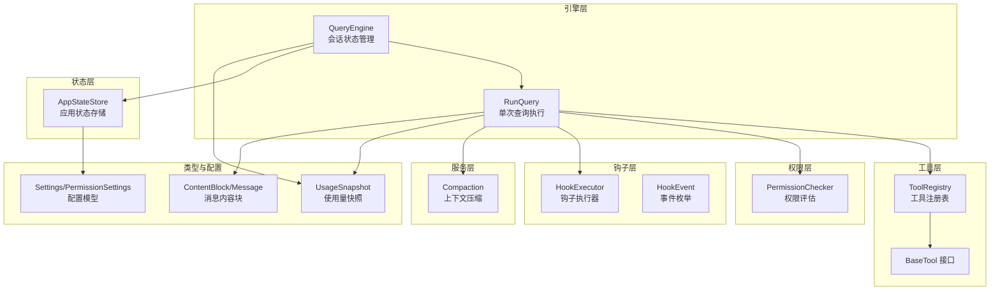
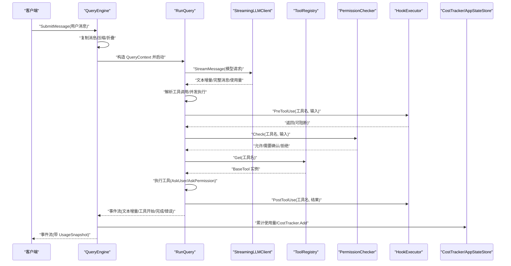
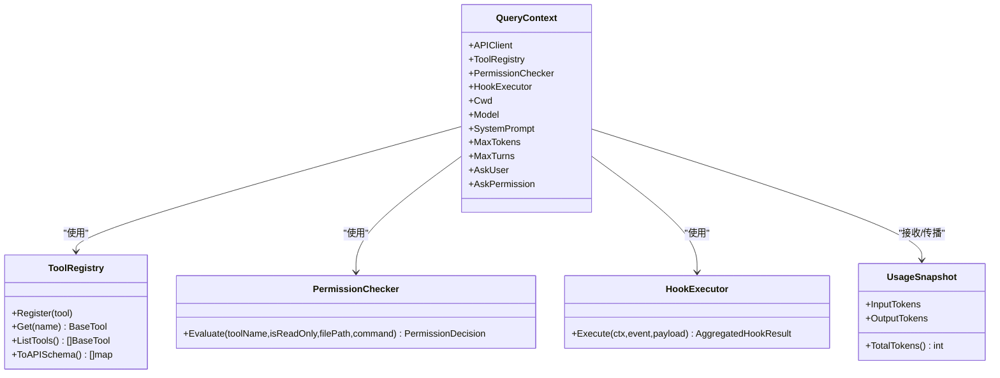
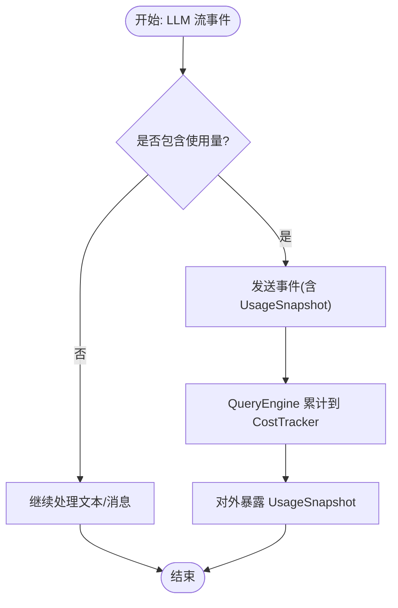
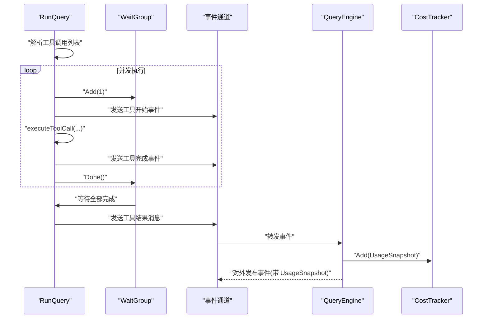
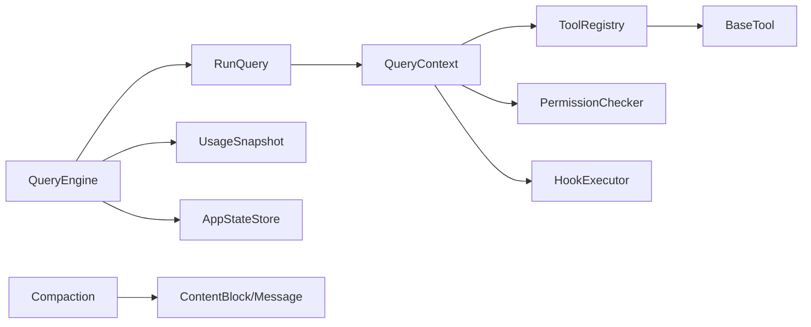

# 状态管理流

<cite>
**本文引用的文件**
- [pkg/engine/query.go](file://pkg/engine/query.go)
- [pkg/engine/query_engine.go](file://pkg/engine/query_engine.go)
- [pkg/state/store.go](file://pkg/state/store.go)
- [pkg/hooks/executor.go](file://pkg/hooks/executor.go)
- [pkg/hooks/events.go](file://pkg/hooks/events.go)
- [pkg/permissions/checker.go](file://pkg/permissions/checker.go)
- [pkg/types/usage.go](file://pkg/types/usage.go)
- [pkg/types/messages.go](file://pkg/types/messages.go)
- [pkg/tools/base.go](file://pkg/tools/base.go)
- [pkg/services/compact.go](file://pkg/services/compact.go)
- [pkg/config/settings.go](file://pkg/config/settings.go)
</cite>

## 目录
1. [简介](#简介)
2. [项目结构](#项目结构)
3. [核心组件](#核心组件)
4. [架构总览](#架构总览)
5. [详细组件分析](#详细组件分析)
6. [依赖分析](#依赖分析)
7. [性能考虑](#性能考虑)
8. [故障排查指南](#故障排查指南)
9. [结论](#结论)
10. [附录](#附录)

## 简介
本文件系统性梳理 OpenHarness Go 的状态管理流，聚焦于 QueryContext 在一次查询执行中各状态组件的流转：工具注册表、权限检查器、钩子执行器、使用量快照（UsageSnapshot）的生成与传播、并发状态更新的同步控制（WaitGroup 与通道）、状态持久化与恢复、以及状态一致性保障。同时提供状态流转图与并发控制示例，并总结状态监控与调试的最佳实践。

## 项目结构
围绕状态管理的关键模块与职责如下：
- 引擎层：RunQuery 与 QueryEngine 负责多轮对话循环、工具调用并发执行、事件流与使用量聚合。
- 工具层：ToolRegistry 提供线程安全的工具注册与检索；ToolResult 定义工具执行结果。
- 权限层：PermissionChecker 基于配置模式与规则评估工具调用许可。
- 钩子层：HookExecutor 执行预/后置钩子，支持命令、HTTP、提示词/代理型钩子。
- 状态层：AppStateStore 提供应用级运行时状态的读写与订阅通知。
- 服务层：Compaction 服务负责上下文压缩与折叠，避免 token 爆炸。
- 类型与配置：UsageSnapshot、消息内容块、设置模型等为状态与数据契约。

图表来源
- [pkg/engine/query_engine.go:49-68](file://pkg/engine/query_engine.go#L49-L68)
- [pkg/engine/query.go:122-136](file://pkg/engine/query.go#L122-L136)
- [pkg/tools/base.go:81-131](file://pkg/tools/base.go#L81-L131)
- [pkg/permissions/checker.go:23-41](file://pkg/permissions/checker.go#L23-L41)
- [pkg/hooks/executor.go:53-65](file://pkg/hooks/executor.go#L53-L65)
- [pkg/hooks/events.go:3-15](file://pkg/hooks/events.go#L3-L15)
- [pkg/state/store.go:25-30](file://pkg/state/store.go#L25-L30)
- [pkg/services/compact.go:74-115](file://pkg/services/compact.go#L74-L115)
- [pkg/types/messages.go:15-31](file://pkg/types/messages.go#L15-L31)
- [pkg/types/usage.go:3-7](file://pkg/types/usage.go#L3-L7)
- [pkg/config/settings.go:37-44](file://pkg/config/settings.go#L37-L44)

章节来源
- [pkg/engine/query.go:122-136](file://pkg/engine/query.go#L122-L136)
- [pkg/engine/query_engine.go:49-68](file://pkg/engine/query_engine.go#L49-L68)
- [pkg/state/store.go:25-30](file://pkg/state/store.go#L25-L30)

## 核心组件
- QueryContext：封装一次查询所需的所有依赖，包括 LLM 客户端、工具注册表、权限检查器、钩子执行器、工作目录、模型、系统提示、最大令牌数、最大轮次、用户回调等。
- QueryEngine：在 QueryContext 之上管理会话历史、成本统计、压缩与折叠、并发安全的提交流程。
- ToolRegistry：线程安全的工具注册表，提供注册、获取、列举与 API Schema 导出。
- PermissionChecker：基于配置的权限决策器，支持显式允许/拒绝、路径规则、命令规则与三种模式（默认、计划、全自动）。
- HookExecutor：按事件触发执行命令、HTTP、提示词或代理型钩子，支持阻断与原因说明。
- AppStateStore：应用级状态的读写与订阅通知，支持并发安全的 Set/Update/Subscribe。
- UsageSnapshot：记录单次调用的输入/输出 token，用于累计与传播。
- Compaction：上下文压缩流水线，包含截断、裁剪、微压缩、折叠与自动生成摘要等阶段。

章节来源
- [pkg/engine/query.go:122-136](file://pkg/engine/query.go#L122-L136)
- [pkg/engine/query_engine.go:49-68](file://pkg/engine/query_engine.go#L49-L68)
- [pkg/tools/base.go:81-131](file://pkg/tools/base.go#L81-L131)
- [pkg/permissions/checker.go:23-41](file://pkg/permissions/checker.go#L23-L41)
- [pkg/hooks/executor.go:53-65](file://pkg/hooks/executor.go#L53-L65)
- [pkg/state/store.go:25-30](file://pkg/state/store.go#L25-L30)
- [pkg/types/usage.go:3-7](file://pkg/types/usage.go#L3-L7)
- [pkg/services/compact.go:74-115](file://pkg/services/compact.go#L74-L115)

## 架构总览
下图展示一次查询从提交到完成的主状态流转：QueryEngine 封装 QueryContext 并驱动 RunQuery；RunQuery 在每轮中拉取 LLM 流、解析工具调用、并发执行工具、汇总结果并推进消息历史；同时通过 UsageSnapshot 传播使用量，QueryEngine 聚合到 CostTracker；工具执行前后由 HookExecutor 触发钩子；ToolRegistry 提供工具解析与执行；PermissionChecker 决策是否放行；Compaction 在必要时进行上下文压缩。

图表来源
- [pkg/engine/query_engine.go:124-204](file://pkg/engine/query_engine.go#L124-L204)
- [pkg/engine/query.go:142-280](file://pkg/engine/query.go#L142-L280)
- [pkg/hooks/executor.go:67-105](file://pkg/hooks/executor.go#L67-L105)
- [pkg/permissions/checker.go:41-82](file://pkg/permissions/checker.go#L41-L82)
- [pkg/tools/base.go:104-110](file://pkg/tools/base.go#L104-L110)
- [pkg/types/usage.go:3-7](file://pkg/types/usage.go#L3-L7)

## 详细组件分析

### QueryContext 状态组件与流转
- 工具注册表（ToolRegistry）
  - 维护：在 QueryContext 中以指针形式持有，供执行阶段按名称检索工具实例。
  - 状态维护：注册表内部使用读写锁保护，查询与导出 API Schema 时均加读锁，注册时加写锁。
  - 并发：executeToolCall 中并发 goroutine 仅读取，不修改注册表。
- 权限检查器（PermissionChecker）
  - 维护：在 QueryContext 中作为接口注入，支持默认/计划/全自动三种模式与路径/命令规则。
  - 状态维护：评估函数根据配置与输入参数返回许可决策（允许/需要确认/拒绝）。
- 钩子执行器（HookExecutor）
  - 维护：在 QueryContext 中作为接口注入，支持 PreToolUse/PostToolUse 等事件。
  - 状态维护：执行前/后分别调用，可能影响后续流程（如阻断）。
- 使用量快照（UsageSnapshot）
  - 生成：来自 LLM 流事件；在 RunQuery 中收集并在事件中传播；QueryEngine 收集后写入 CostTracker。
  - 传播：事件流中携带 UsageSnapshot，QueryEngine 聚合后对外暴露快照。

图表来源
- [pkg/engine/query.go:122-136](file://pkg/engine/query.go#L122-L136)
- [pkg/tools/base.go:81-131](file://pkg/tools/base.go#L81-L131)
- [pkg/permissions/checker.go:23-41](file://pkg/permissions/checker.go#L23-L41)
- [pkg/hooks/executor.go:53-65](file://pkg/hooks/executor.go#L53-L65)
- [pkg/types/usage.go:3-7](file://pkg/types/usage.go#L3-L7)

章节来源
- [pkg/engine/query.go:122-136](file://pkg/engine/query.go#L122-L136)
- [pkg/tools/base.go:81-131](file://pkg/tools/base.go#L81-L131)
- [pkg/permissions/checker.go:41-82](file://pkg/permissions/checker.go#L41-L82)
- [pkg/hooks/executor.go:67-105](file://pkg/hooks/executor.go#L67-L105)
- [pkg/types/usage.go:3-7](file://pkg/types/usage.go#L3-L7)

### UsageSnapshot 的生成与传播机制
- 生成位置
  - LLM 流事件中产生 UsageSnapshot，并在 RunQuery 的事件流中携带。
- 传播路径
  - RunQuery -> QueryEngine（事件通道）-> CostTracker（累计）-> 外部调用方。
- 聚合与一致性
  - QueryEngine 使用互斥锁保护消息历史与折叠缓冲区的更新，确保在事件流期间不会被并发修改。
  - CostTracker 使用互斥锁保护累计值，Snapshot 返回当前快照副本，避免外部竞态。

图表来源
- [pkg/engine/query.go:182-198](file://pkg/engine/query.go#L182-L198)
- [pkg/engine/query_engine.go:191-202](file://pkg/engine/query_engine.go#L191-L202)
- [pkg/engine/query_engine.go:236-239](file://pkg/engine/query_engine.go#L236-L239)

章节来源
- [pkg/engine/query.go:182-198](file://pkg/engine/query.go#L182-L198)
- [pkg/engine/query_engine.go:191-202](file://pkg/engine/query_engine.go#L191-L202)
- [pkg/engine/query_engine.go:236-239](file://pkg/engine/query_engine.go#L236-L239)

### 并发状态更新与同步控制
- WaitGroup 并发执行工具调用
  - RunQuery 在解析到多个工具调用后，为每个调用启动一个 goroutine，并使用 WaitGroup 等待全部完成。
  - 每个 goroutine 发送“开始/完成”事件，最终合并 ToolResultBlock 列表。
- 通道与事件流
  - RunQuery 与 QueryEngine 均使用带缓冲通道传递事件流，避免阻塞。
  - QueryEngine 在转发事件时累积使用量，完成后写回消息历史。
- 互斥锁与读写锁
  - QueryEngine 使用互斥锁保护消息历史、折叠缓冲区与系统提示/模型等字段的更新。
  - ToolRegistry 使用读写锁保护工具映射，注册时写锁，查询/导出时读锁。
  - CostTracker 使用互斥锁保护累计值。
  - AppStateStore 使用读写锁与订阅列表，Set/Update 后广播给所有订阅者。

图表来源
- [pkg/engine/query.go:231-258](file://pkg/engine/query.go#L231-L258)
- [pkg/engine/query_engine.go:188-202](file://pkg/engine/query_engine.go#L188-L202)
- [pkg/engine/query_engine.go:191-202](file://pkg/engine/query_engine.go#L191-L202)

章节来源
- [pkg/engine/query.go:231-258](file://pkg/engine/query.go#L231-L258)
- [pkg/engine/query_engine.go:188-202](file://pkg/engine/query_engine.go#L188-L202)

### 状态持久化与恢复机制及一致性保证
- 应用状态持久化与恢复
  - AppStateStore 支持 Set/Update 获取当前状态快照，Set/Update 后通知所有订阅者；Notify 可手动触发通知。
  - 该组件未直接实现磁盘持久化，但可通过订阅回调实现持久化逻辑（例如写入配置文件或数据库），并在启动时加载初始状态。
- 会话历史与上下文压缩
  - QueryEngine 在提交消息前复制消息切片与折叠缓冲区，避免并发修改。
  - 通过 Compaction 服务在必要时进行上下文压缩，防止 token 爆炸，提升稳定性。
- 一致性保证
  - 使用互斥锁保护共享状态（QueryEngine、CostTracker、AppStateStore）。
  - 事件通道缓冲与 WaitGroup 保证事件顺序与完成信号。
  - ToolRegistry 的读写锁确保注册与查询的并发安全。

章节来源
- [pkg/state/store.go:37-55](file://pkg/state/store.go#L37-L55)
- [pkg/state/store.go:57-69](file://pkg/state/store.go#L57-L69)
- [pkg/state/store.go:88-101](file://pkg/state/store.go#L88-L101)
- [pkg/engine/query_engine.go:124-172](file://pkg/engine/query_engine.go#L124-L172)
- [pkg/services/compact.go:74-115](file://pkg/services/compact.go#L74-L115)

### 状态监控与调试最佳实践
- 监控建议
  - 订阅 AppStateStore 的状态变更，记录关键字段（模型、权限模式、主题、工作目录、连接统计等）变化。
  - 记录事件流中的错误事件与工具执行耗时，结合 UsageSnapshot 追踪成本。
  - 对钩子执行结果进行聚合统计，识别阻断与失败原因。
- 调试建议
  - 在权限检查器与钩子执行器中增加日志，记录决策依据与阻断原因。
  - 对工具执行前后的钩子进行隔离测试，验证阻断与非阻断场景。
  - 使用较小的 MaxTurns 与 MaxTokens 进行快速回归测试，观察上下文压缩效果。

章节来源
- [pkg/state/store.go:71-86](file://pkg/state/store.go#L71-L86)
- [pkg/hooks/executor.go:67-105](file://pkg/hooks/executor.go#L67-L105)
- [pkg/permissions/checker.go:41-82](file://pkg/permissions/checker.go#L41-L82)

## 依赖分析
- 组件耦合
  - RunQuery 依赖 QueryContext 的四个核心组件：LLM 客户端、工具注册表、权限检查器、钩子执行器。
  - QueryEngine 依赖 RunQuery 并扩展会话状态管理与成本统计。
  - 工具注册表与权限检查器、钩子执行器之间无直接依赖，通过接口注入实现松耦合。
- 外部依赖
  - 类型层（UsageSnapshot、消息内容块）为跨模块的数据契约。
  - 配置层（Settings/PermissionSettings）为权限与行为提供策略来源。

图表来源
- [pkg/engine/query.go:122-136](file://pkg/engine/query.go#L122-L136)
- [pkg/engine/query_engine.go:49-68](file://pkg/engine/query_engine.go#L49-L68)
- [pkg/tools/base.go:51-59](file://pkg/tools/base.go#L51-L59)
- [pkg/services/compact.go:74-115](file://pkg/services/compact.go#L74-L115)
- [pkg/types/messages.go:15-31](file://pkg/types/messages.go#L15-L31)
- [pkg/types/usage.go:3-7](file://pkg/types/usage.go#L3-L7)

章节来源
- [pkg/engine/query.go:122-136](file://pkg/engine/query.go#L122-L136)
- [pkg/engine/query_engine.go:49-68](file://pkg/engine/query_engine.go#L49-L68)
- [pkg/tools/base.go:51-59](file://pkg/tools/base.go#L51-L59)
- [pkg/services/compact.go:74-115](file://pkg/services/compact.go#L74-L115)
- [pkg/types/messages.go:15-31](file://pkg/types/messages.go#L15-L31)
- [pkg/types/usage.go:3-7](file://pkg/types/usage.go#L3-L7)

## 性能考虑
- 上下文压缩
  - 在每轮开始与提交前进行压缩，减少 token 占用，避免 LLM 调用失败或超时。
- 并发工具执行
  - 使用 WaitGroup 并发执行多个工具调用，缩短总响应时间；注意工具数量与资源限制。
- 事件通道缓冲
  - 适当增大通道缓冲（如 64）以缓解上游压力，但需平衡内存占用。
- 成本追踪
  - 使用互斥锁保护累计值，避免高并发下的竞争条件；Snapshot 返回副本，降低锁持有时间。

章节来源
- [pkg/services/compact.go:61-72](file://pkg/services/compact.go#L61-L72)
- [pkg/engine/query.go:231-258](file://pkg/engine/query.go#L231-L258)
- [pkg/engine/query_engine.go:188-202](file://pkg/engine/query_engine.go#L188-L202)
- [pkg/engine/query_engine.go:17-43](file://pkg/engine/query_engine.go#L17-L43)

## 故障排查指南
- 常见问题
  - LLM 流提前结束：检查事件流中是否有错误事件，定位上游异常。
  - 工具执行失败：查看工具返回的错误信息与是否触发了 PostToolUse 钩子。
  - 权限拒绝：核对权限模式与路径/命令规则，确认是否需要用户确认。
  - 钩子阻断：检查钩子返回的阻断标记与原因，必要时调整钩子策略。
- 排查步骤
  - 启用详细日志，记录事件流与使用量变化。
  - 分离钩子执行，验证阻断与非阻断场景。
  - 使用最小化输入复现问题，逐步扩大范围。

章节来源
- [pkg/engine/query.go:173-206](file://pkg/engine/query.go#L173-L206)
- [pkg/engine/query.go:286-325](file://pkg/engine/query.go#L286-L325)
- [pkg/permissions/checker.go:41-82](file://pkg/permissions/checker.go#L41-L82)
- [pkg/hooks/executor.go:67-105](file://pkg/hooks/executor.go#L67-L105)

## 结论
OpenHarness Go 的状态管理流通过 QueryContext 将工具注册表、权限检查器、钩子执行器与使用量快照有机整合，配合 QueryEngine 的会话状态管理与并发控制，实现了稳定高效的多轮对话与工具执行。上下文压缩与成本追踪进一步提升了系统性能与可观测性。通过合理的并发同步与订阅通知机制，系统在保证一致性的同时提供了良好的扩展性与可维护性。

## 附录
- 关键接口与类型
  - QueryContext：承载一次查询所需的全部依赖。
  - ToolRegistry：线程安全的工具注册与检索容器。
  - PermissionChecker：基于配置的权限决策器。
  - HookExecutor：事件驱动的钩子执行器。
  - UsageSnapshot：使用量快照。
  - AppStateStore：应用级状态的读写与订阅通知。
- 配置要点
  - 权限模式与路径/命令规则决定工具调用许可策略。
  - 设置模型、最大令牌数、系统提示等影响对话质量与成本。

章节来源
- [pkg/engine/query.go:122-136](file://pkg/engine/query.go#L122-L136)
- [pkg/tools/base.go:81-131](file://pkg/tools/base.go#L81-L131)
- [pkg/permissions/checker.go:23-41](file://pkg/permissions/checker.go#L23-L41)
- [pkg/hooks/executor.go:53-65](file://pkg/hooks/executor.go#L53-L65)
- [pkg/types/usage.go:3-7](file://pkg/types/usage.go#L3-L7)
- [pkg/state/store.go:25-30](file://pkg/state/store.go#L25-L30)
- [pkg/config/settings.go:37-44](file://pkg/config/settings.go#L37-L44)