# 架构设计

<cite>
**本文引用的文件**
- [go.mod](file://go.mod)
- [cmd/openharness/main.go](file://cmd/openharness/main.go)
- [cmd/einoagent/main.go](file://cmd/einoagent/main.go)
- [pkg/config/settings.go](file://pkg/config/settings.go)
- [pkg/ui/app.go](file://pkg/ui/app.go)
- [pkg/api/client.go](file://pkg/api/client.go)
- [pkg/engine/query_engine.go](file://pkg/engine/query_engine.go)
- [pkg/memory/manager.go](file://pkg/memory/manager.go)
- [pkg/hooks/executor.go](file://pkg/hooks/executor.go)
- [pkg/state/store.go](file://pkg/state/store.go)
- [pkg/tools/base.go](file://pkg/tools/base.go)
- [pkg/types/messages.go](file://pkg/types/messages.go)
- [pkg/permissions/checker.go](file://pkg/permissions/checker.go)
- [pkg/mcp/client.go](file://pkg/mcp/client.go)
- [pkg/services/compact.go](file://pkg/services/compact.go)
- [pkg/tasks/registry.go](file://pkg/tasks/registry.go)
- [pkg/skills/loader.go](file://pkg/skills/loader.go)
- [pkg/hitl/manager.go](file://pkg/hitl/manager.go)
</cite>

## 目录
1. [引言](#引言)
2. [项目结构](#项目结构)
3. [核心组件](#核心组件)
4. [架构总览](#架构总览)
5. [详细组件分析](#详细组件分析)
6. [依赖关系分析](#依赖关系分析)
7. [性能考量](#性能考量)
8. [故障排查指南](#故障排查指南)
9. [结论](#结论)
10. [附录](#附录)

## 引言
本文件面向架构师与高级开发者，系统化阐述 OpenHarness Go 的架构设计。内容涵盖高层设计、架构模式、系统边界、组件交互、数据流与集成模式，以及技术决策、权衡与约束。同时提供基础设施要求、可扩展性考虑、部署拓扑建议，并补充安全、监控与灾难恢复等横切关注点。

## 项目结构
OpenHarness Go 采用分层与功能模块化的组织方式：
- 命令行入口：cmd/ 开头的可执行程序，分别提供 CLI 与独立 Agent 示例。
- 核心引擎：pkg/ 下按领域拆分的子包（config、api、engine、memory、hooks、state、tools、types、permissions、mcp、services、tasks、skills、hitl）。
- 插件与技能：plugins/ 与技能加载器实现可插拔能力。
- 文档与设计：design/、docs/ 提供设计说明与背景资料。

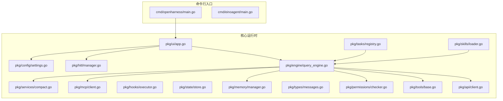

图表来源
- [cmd/openharness/main.go:15-102](file://cmd/openharness/main.go#L15-L102)
- [pkg/ui/app.go:18-61](file://pkg/ui/app.go#L18-L61)
- [pkg/engine/query_engine.go:49-122](file://pkg/engine/query_engine.go#L49-L122)
- [pkg/api/client.go:85-104](file://pkg/api/client.go#L85-L104)
- [pkg/tools/base.go:82-132](file://pkg/tools/base.go#L82-L132)
- [pkg/permissions/checker.go:25-40](file://pkg/permissions/checker.go#L25-L40)
- [pkg/memory/manager.go:14-23](file://pkg/memory/manager.go#L14-L23)
- [pkg/mcp/client.go:116-132](file://pkg/mcp/client.go#L116-L132)
- [pkg/services/compact.go:74-115](file://pkg/services/compact.go#L74-L115)
- [pkg/tasks/registry.go:13-28](file://pkg/tasks/registry.go#L13-L28)
- [pkg/skills/loader.go:21-60](file://pkg/skills/loader.go#L21-L60)
- [pkg/hitl/manager.go:11-26](file://pkg/hitl/manager.go#L11-L26)

章节来源
- [cmd/openharness/main.go:15-102](file://cmd/openharness/main.go#L15-L102)
- [cmd/einoagent/main.go:25-107](file://cmd/einoagent/main.go#L25-L107)
- [pkg/config/settings.go:97-142](file://pkg/config/settings.go#L97-L142)
- [pkg/ui/app.go:18-61](file://pkg/ui/app.go#L18-L61)

## 核心组件
- 配置与设置：集中管理模型、权限、内存、MCP、主题、输出风格等配置项，并支持环境变量覆盖。
- 用户界面与运行时：提供非交互打印模式、REPL 交互模式与 JSON-Lines 协议模式；构建运行时并启动引擎。
- 引擎与对话管理：封装消息提交、会话状态、令牌用量统计、压缩与记忆注入。
- 工具系统：统一的工具注册表与执行上下文，支持只读判定与 API Schema 导出。
- 权限控制：基于模式与规则的工具调用许可评估。
- 记忆与上下文压缩：项目级记忆文件管理与多阶段上下文压缩流水线。
- MCP 客户端：管理多服务器连接，暴露工具调用与资源读取接口。
- 钩子系统：支持命令、HTTP、提示词与代理型钩子，具备超时与阻断策略。
- 任务与技能：任务注册表与技能加载器，支持插件集合与子技能前缀化。
- 人机交互（HITL）：跨 UI/协议的问答与授权请求管理。

章节来源
- [pkg/config/settings.go:97-142](file://pkg/config/settings.go#L97-L142)
- [pkg/ui/app.go:18-61](file://pkg/ui/app.go#L18-L61)
- [pkg/engine/query_engine.go:49-122](file://pkg/engine/query_engine.go#L49-L122)
- [pkg/tools/base.go:82-132](file://pkg/tools/base.go#L82-L132)
- [pkg/permissions/checker.go:25-40](file://pkg/permissions/checker.go#L25-L40)
- [pkg/memory/manager.go:14-23](file://pkg/memory/manager.go#L14-L23)
- [pkg/mcp/client.go:116-132](file://pkg/mcp/client.go#L116-L132)
- [pkg/hooks/executor.go:53-105](file://pkg/hooks/executor.go#L53-L105)
- [pkg/tasks/registry.go:13-28](file://pkg/tasks/registry.go#L13-L28)
- [pkg/skills/loader.go:21-60](file://pkg/skills/loader.go#L21-L60)
- [pkg/hitl/manager.go:11-26](file://pkg/hitl/manager.go#L11-L26)

## 架构总览
OpenHarness Go 采用“配置驱动 + 分层引擎 + 可插拔工具与技能”的架构模式。系统边界清晰：CLI 作为入口，运行时负责编排引擎、工具、权限、记忆与 MCP；引擎通过 API 客户端与外部模型服务交互；UI 支持多种交互形态；插件与技能扩展能力；钩子与任务体系提供自动化与可观测性。

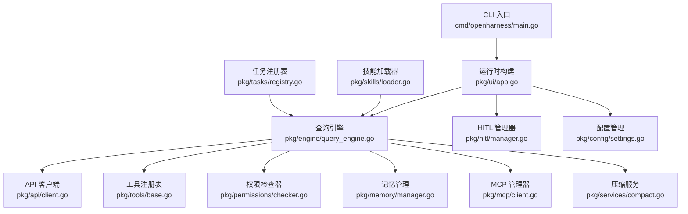

图表来源
- [cmd/openharness/main.go:15-102](file://cmd/openharness/main.go#L15-L102)
- [pkg/ui/app.go:18-61](file://pkg/ui/app.go#L18-L61)
- [pkg/engine/query_engine.go:49-122](file://pkg/engine/query_engine.go#L49-L122)
- [pkg/api/client.go:85-104](file://pkg/api/client.go#L85-L104)
- [pkg/tools/base.go:82-132](file://pkg/tools/base.go#L82-L132)
- [pkg/permissions/checker.go:25-40](file://pkg/permissions/checker.go#L25-L40)
- [pkg/memory/manager.go:14-23](file://pkg/memory/manager.go#L14-L23)
- [pkg/mcp/client.go:116-132](file://pkg/mcp/client.go#L116-L132)
- [pkg/services/compact.go:74-115](file://pkg/services/compact.go#L74-L115)
- [pkg/hitl/manager.go:11-26](file://pkg/hitl/manager.go#L11-L26)
- [pkg/config/settings.go:97-142](file://pkg/config/settings.go#L97-L142)
- [pkg/skills/loader.go:21-60](file://pkg/skills/loader.go#L21-L60)
- [pkg/tasks/registry.go:13-28](file://pkg/tasks/registry.go#L13-L28)

## 详细组件分析

### 组件一：CLI 与运行时（cmd/）
- openharness CLI：解析标志、加载设置、选择运行模式（打印/REPL/JSON-Lines），并提供 MCP 与认证子命令。
- einoagent：基于 cloudwego/eino 的 ReAct Agent 示例，演示非交互与 REPL 模式。

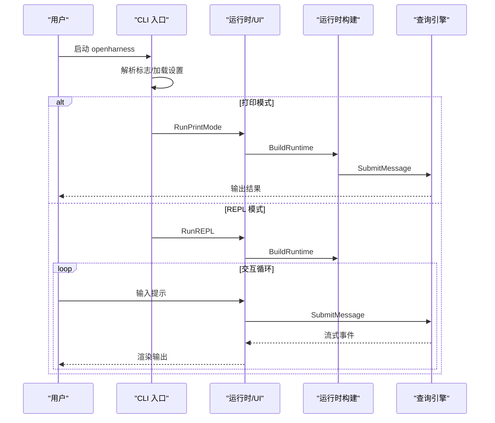

图表来源
- [cmd/openharness/main.go:46-76](file://cmd/openharness/main.go#L46-L76)
- [pkg/ui/app.go:18-61](file://pkg/ui/app.go#L18-L61)
- [pkg/engine/query_engine.go:124-205](file://pkg/engine/query_engine.go#L124-L205)

章节来源
- [cmd/openharness/main.go:46-102](file://cmd/openharness/main.go#L46-L102)
- [cmd/einoagent/main.go:25-107](file://cmd/einoagent/main.go#L25-L107)
- [pkg/ui/app.go:18-61](file://pkg/ui/app.go#L18-L61)

### 组件二：查询引擎与消息流（engine）
- 负责消息提交、会话状态管理、令牌用量统计、上下文压缩与权限检查。
- 提供并发安全的消息列表与成本快照，支持系统提示词与模型切换。

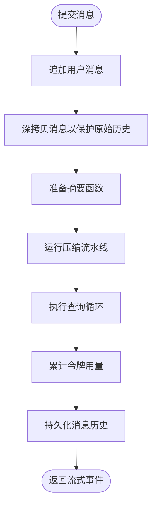

图表来源
- [pkg/engine/query_engine.go:124-205](file://pkg/engine/query_engine.go#L124-L205)
- [pkg/services/compact.go:74-115](file://pkg/services/compact.go#L74-L115)

章节来源
- [pkg/engine/query_engine.go:49-122](file://pkg/engine/query_engine.go#L49-L122)
- [pkg/engine/query_engine.go:124-205](file://pkg/engine/query_engine.go#L124-L205)

### 组件三：API 客户端与重试（api）
- 实现 Anthropic 风格的 SSE 流式响应，内置指数退避与抖动、可重试状态码判断与错误翻译。
- 将事件解码为统一的流式事件通道，便于上层消费。

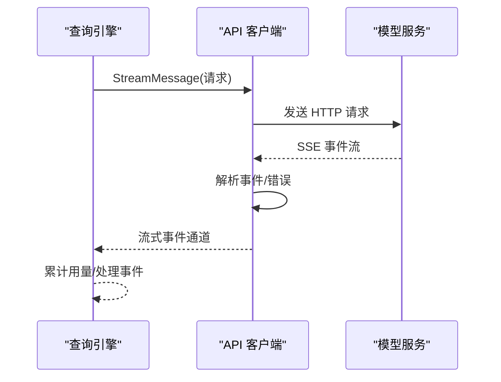

图表来源
- [pkg/api/client.go:107-148](file://pkg/api/client.go#L107-L148)
- [pkg/api/client.go:242-280](file://pkg/api/client.go#L242-L280)
- [pkg/api/client.go:379-405](file://pkg/api/client.go#L379-L405)

章节来源
- [pkg/api/client.go:85-104](file://pkg/api/client.go#L85-L104)
- [pkg/api/client.go:107-148](file://pkg/api/client.go#L107-L148)

### 组件四：工具系统与权限（tools + permissions）
- 工具注册表：线程安全注册、查询与导出 API Schema。
- 权限检查器：根据模式（默认/计划/全自动）、显式允许/拒绝、路径规则与命令模式进行决策。

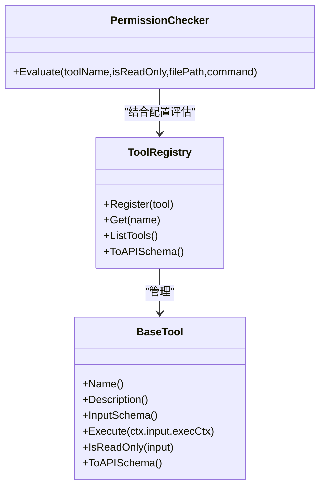

图表来源
- [pkg/tools/base.go:82-132](file://pkg/tools/base.go#L82-L132)
- [pkg/permissions/checker.go:25-40](file://pkg/permissions/checker.go#L25-L40)

章节来源
- [pkg/tools/base.go:82-132](file://pkg/tools/base.go#L82-L132)
- [pkg/permissions/checker.go:25-40](file://pkg/permissions/checker.go#L25-L40)

### 组件五：记忆与上下文压缩（memory + services）
- 记忆管理：项目级 Markdown 文件存取、标题清理、相关记忆检索。
- 压缩流水线：多阶段压缩（截断、裁剪、微压缩、上下文折叠、自动生成摘要）。

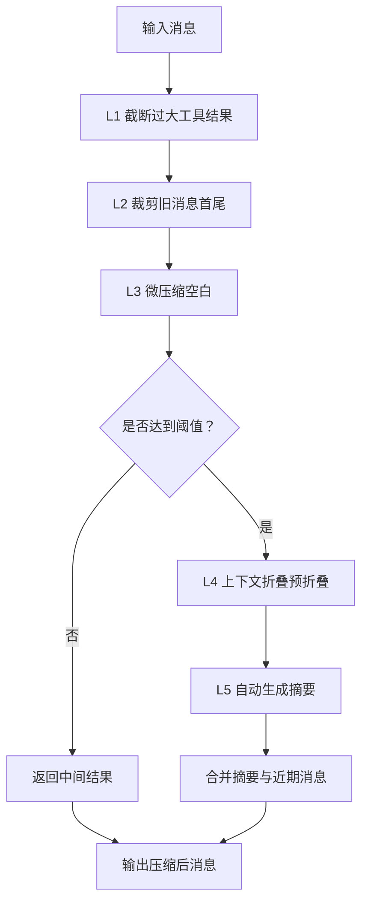

图表来源
- [pkg/services/compact.go:74-115](file://pkg/services/compact.go#L74-L115)
- [pkg/services/compact.go:244-298](file://pkg/services/compact.go#L244-L298)
- [pkg/memory/manager.go:74-90](file://pkg/memory/manager.go#L74-L90)

章节来源
- [pkg/memory/manager.go:14-23](file://pkg/memory/manager.go#L14-L23)
- [pkg/services/compact.go:12-30](file://pkg/services/compact.go#L12-L30)
- [pkg/services/compact.go:62-72](file://pkg/services/compact.go#L62-L72)

### 组件六：MCP 客户端与钩子（mcp + hooks）
- MCP 管理器：启动 stdio 子进程、初始化协议、列举工具与资源、调用工具与读取资源。
- 钩子执行器：支持命令、HTTP、提示词与代理型钩子，具备超时与阻断策略。

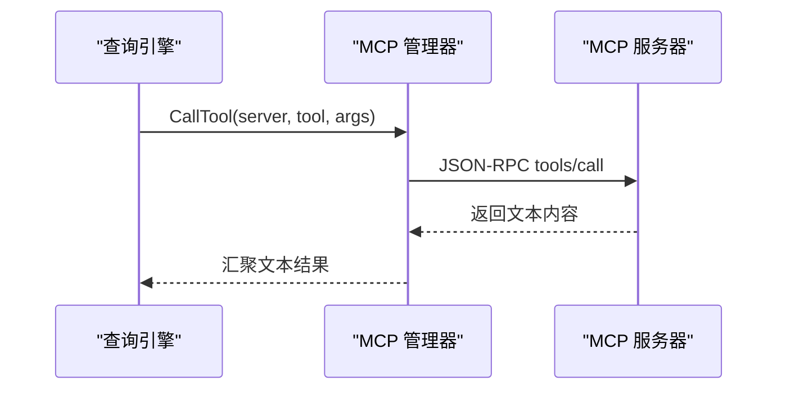

图表来源
- [pkg/mcp/client.go:197-230](file://pkg/mcp/client.go#L197-L230)
- [pkg/mcp/client.go:296-373](file://pkg/mcp/client.go#L296-L373)

章节来源
- [pkg/mcp/client.go:116-132](file://pkg/mcp/client.go#L116-L132)
- [pkg/mcp/client.go:197-230](file://pkg/mcp/client.go#L197-L230)
- [pkg/hooks/executor.go:53-105](file://pkg/hooks/executor.go#L53-L105)

### 组件七：任务与技能（tasks + skills）
- 任务注册表：生成唯一 ID、跟踪状态、输出与消息、取消与错误记录。
- 技能加载器：扫描目录与插件集合，解析 Markdown 前言元信息，生成虚拟插件索引与子技能前缀化。

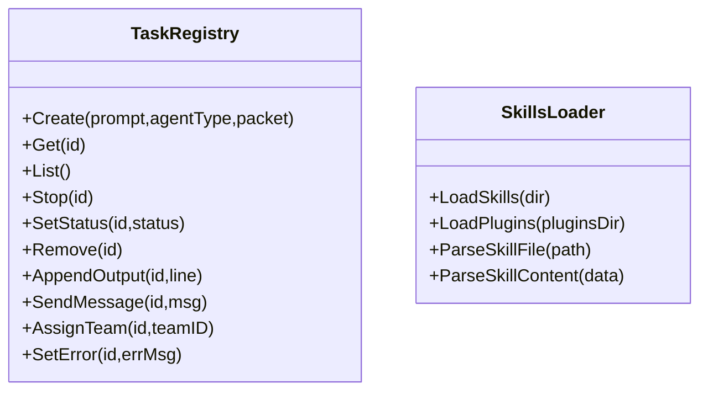

图表来源
- [pkg/tasks/registry.go:13-28](file://pkg/tasks/registry.go#L13-L28)
- [pkg/skills/loader.go:21-60](file://pkg/skills/loader.go#L21-L60)

章节来源
- [pkg/tasks/registry.go:13-28](file://pkg/tasks/registry.go#L13-L28)
- [pkg/skills/loader.go:21-60](file://pkg/skills/loader.go#L21-L60)

### 组件八：人机交互（HITL）
- 管理待处理的问答与授权请求，通过协议事件与前端交互，支持超时与取消。

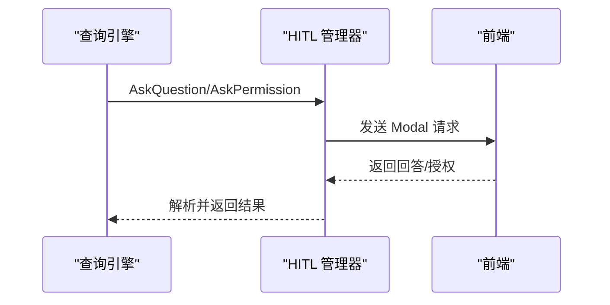

图表来源
- [pkg/hitl/manager.go:33-90](file://pkg/hitl/manager.go#L33-L90)

章节来源
- [pkg/hitl/manager.go:11-26](file://pkg/hitl/manager.go#L11-L26)

## 依赖关系分析
- 外部依赖：主要通过 go.mod 管理，包括 Cobra（CLI）、cloudwego/eino 及其扩展（ReAct Agent）、日志与序列化库等。
- 内部耦合：引擎对 API 客户端、工具注册表、权限检查器、记忆与 MCP 的依赖清晰；UI 仅通过运行时接口与引擎交互，降低耦合。
- 第三方集成：MCP 使用 JSON-RPC over stdio；API 客户端对接 Anthropic Messages API；钩子支持 HTTP 与命令行。

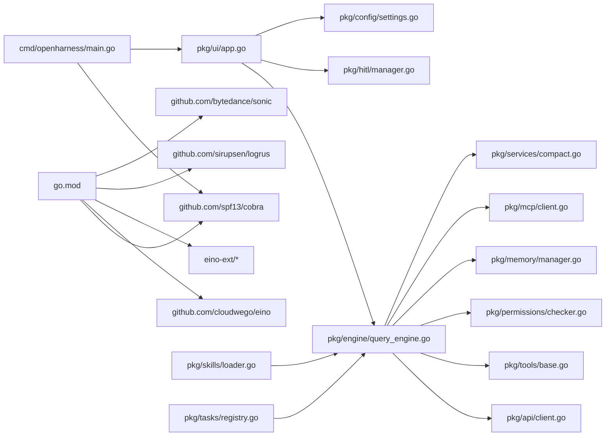

图表来源
- [go.mod:1-43](file://go.mod#L1-L43)
- [cmd/openharness/main.go:10-12](file://cmd/openharness/main.go#L10-L12)
- [pkg/ui/app.go:11-16](file://pkg/ui/app.go#L11-L16)
- [pkg/engine/query_engine.go:8-11](file://pkg/engine/query_engine.go#L8-L11)
- [pkg/api/client.go:4-20](file://pkg/api/client.go#L4-L20)
- [pkg/tools/base.go:4-9](file://pkg/tools/base.go#L4-L9)
- [pkg/permissions/checker.go:4-8](file://pkg/permissions/checker.go#L4-L8)
- [pkg/memory/manager.go:4-10](file://pkg/memory/manager.go#L4-L10)
- [pkg/mcp/client.go:3-13](file://pkg/mcp/client.go#L3-L13)
- [pkg/services/compact.go:3-10](file://pkg/services/compact.go#L3-L10)
- [pkg/hitl/manager.go:4-9](file://pkg/hitl/manager.go#L4-L9)
- [pkg/config/settings.go:3-8](file://pkg/config/settings.go#L3-L8)
- [pkg/skills/loader.go:3-11](file://pkg/skills/loader.go#L3-L11)
- [pkg/tasks/registry.go:3-11](file://pkg/tasks/registry.go#L3-L11)

章节来源
- [go.mod:1-43](file://go.mod#L1-L43)

## 性能考量
- 流式处理：API 客户端使用 SSE 流式事件，UI 逐段渲染，降低首屏延迟。
- 上下文压缩：多阶段压缩减少令牌占用，避免超出模型上下文长度限制。
- 并发与锁：引擎与注册表使用互斥锁保证一致性，避免高并发下的竞态。
- 估算与阈值：通过令牌估算与阈值触发压缩，平衡性能与上下文完整性。
- 重试与抖动：指数退避与抖动降低服务端压力，提升稳定性。

## 故障排查指南
- API 错误分类：区分鉴权失败、速率限制与网络/请求失败，便于针对性处理。
- 重试策略：基于状态码与网络错误识别可重试场景，避免无限重试。
- 钩子失败：命令与 HTTP 钩子均记录输出与原因，支持 BlockOnFailure 控制流程。
- HITL 超时：前端未及时响应时，请求通道会返回上下文取消错误。
- 配置校验：API Key 解析优先级与环境变量覆盖，确保配置正确生效。

章节来源
- [pkg/api/client.go:359-405](file://pkg/api/client.go#L359-L405)
- [pkg/hooks/executor.go:111-151](file://pkg/hooks/executor.go#L111-L151)
- [pkg/hooks/executor.go:157-206](file://pkg/hooks/executor.go#L157-L206)
- [pkg/hitl/manager.go:52-60](file://pkg/hitl/manager.go#L52-L60)
- [pkg/config/settings.go:144-154](file://pkg/config/settings.go#L144-L154)

## 结论
OpenHarness Go 通过清晰的分层与模块化设计，实现了从 CLI 到引擎、工具、权限、记忆与 MCP 的完整闭环。其架构在可扩展性、可观测性与安全性方面具备良好基础，适合在企业级开发与 AI 辅助场景中演进与落地。

## 附录

### 系统上下文图
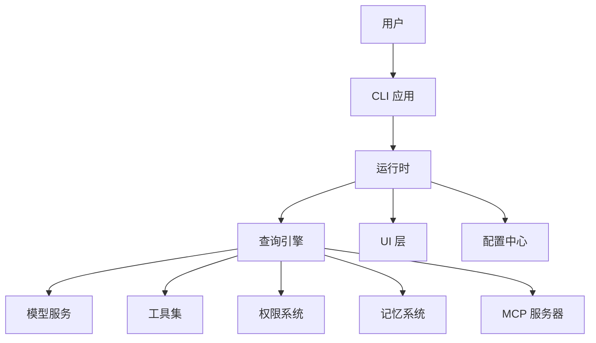

图表来源
- [cmd/openharness/main.go:15-102](file://cmd/openharness/main.go#L15-L102)
- [pkg/ui/app.go:18-61](file://pkg/ui/app.go#L18-L61)
- [pkg/engine/query_engine.go:49-122](file://pkg/engine/query_engine.go#L49-L122)
- [pkg/api/client.go:85-104](file://pkg/api/client.go#L85-L104)
- [pkg/tools/base.go:82-132](file://pkg/tools/base.go#L82-L132)
- [pkg/permissions/checker.go:25-40](file://pkg/permissions/checker.go#L25-L40)
- [pkg/memory/manager.go:14-23](file://pkg/memory/manager.go#L14-L23)
- [pkg/mcp/client.go:116-132](file://pkg/mcp/client.go#L116-L132)
- [pkg/config/settings.go:97-142](file://pkg/config/settings.go#L97-L142)

### 组件分解图（代码级）
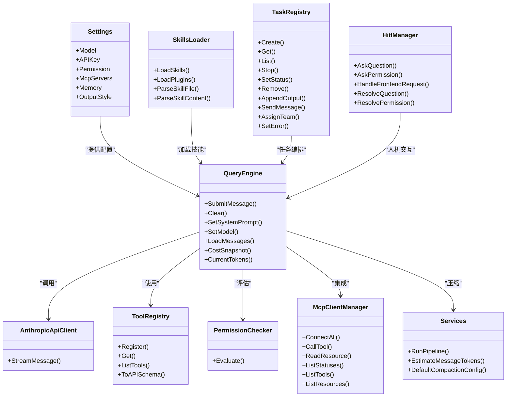

图表来源
- [pkg/config/settings.go:97-142](file://pkg/config/settings.go#L97-L142)
- [pkg/engine/query_engine.go:49-122](file://pkg/engine/query_engine.go#L49-L122)
- [pkg/api/client.go:85-104](file://pkg/api/client.go#L85-L104)
- [pkg/tools/base.go:82-132](file://pkg/tools/base.go#L82-L132)
- [pkg/permissions/checker.go:25-40](file://pkg/permissions/checker.go#L25-L40)
- [pkg/mcp/client.go:116-132](file://pkg/mcp/client.go#L116-L132)
- [pkg/services/compact.go:74-115](file://pkg/services/compact.go#L74-L115)
- [pkg/skills/loader.go:21-60](file://pkg/skills/loader.go#L21-L60)
- [pkg/tasks/registry.go:13-28](file://pkg/tasks/registry.go#L13-L28)
- [pkg/hitl/manager.go:11-26](file://pkg/hitl/manager.go#L11-L26)

### 技术栈与版本兼容性
- 语言与构建：Go 1.22，模块化依赖管理。
- CLI 框架：spf13/cobra。
- 第三方集成：cloudwego/eino 与 eino-ext（OpenAI 模型适配），日志与高性能 JSON 序列化库。
- 版本兼容性：遵循 go.mod 中的依赖版本与间接依赖，确保最小化冲突。

章节来源
- [go.mod:1-43](file://go.mod#L1-L43)

### 基础设施与部署拓扑
- 基础设施：标准 Linux/Windows/macOS 环境，具备网络访问与 shell 执行能力（用于钩子与 MCP）。
- 部署拓扑：单机部署为主，CLI 与 Agent 示例可独立运行；MCP 服务器可通过 stdio 与本地脚本或远程进程集成。
- 可扩展性：通过插件与技能加载器扩展能力；通过钩子与 MCP 管理器接入外部系统；通过配置中心动态调整行为。

### 横切关注点
- 安全性：权限模式与路径规则控制工具调用；API Key 优先级与环境变量覆盖；HITL 授权机制。
- 监控：令牌用量统计与当前上下文估算；压缩阈值可视化；钩子执行结果聚合。
- 灾难恢复：上下文压缩与记忆文件持久化；任务状态与输出记录；MCP 连接状态跟踪与重连策略。