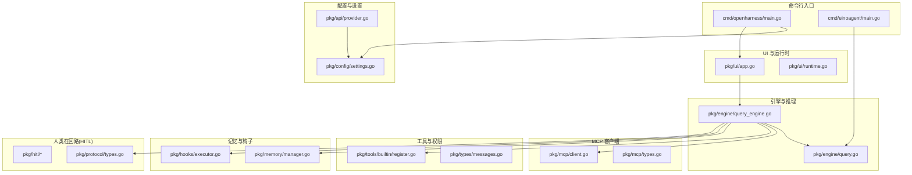
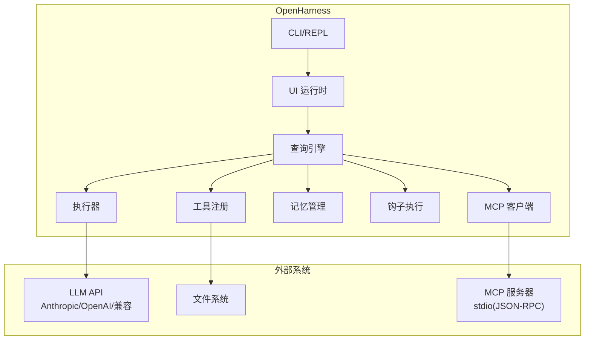
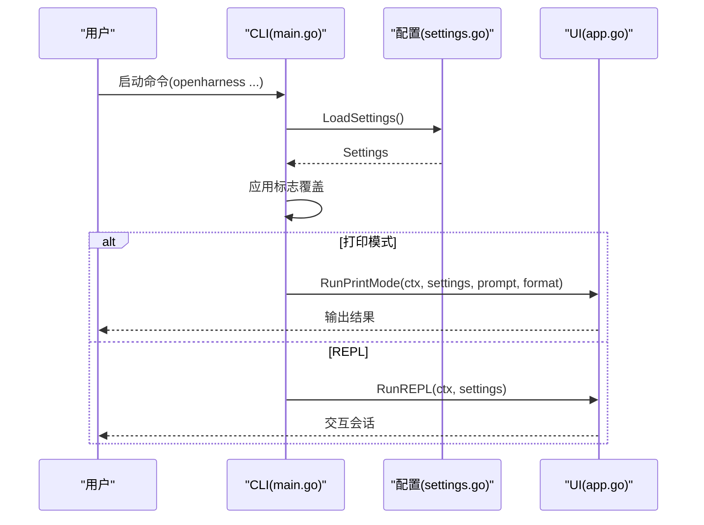
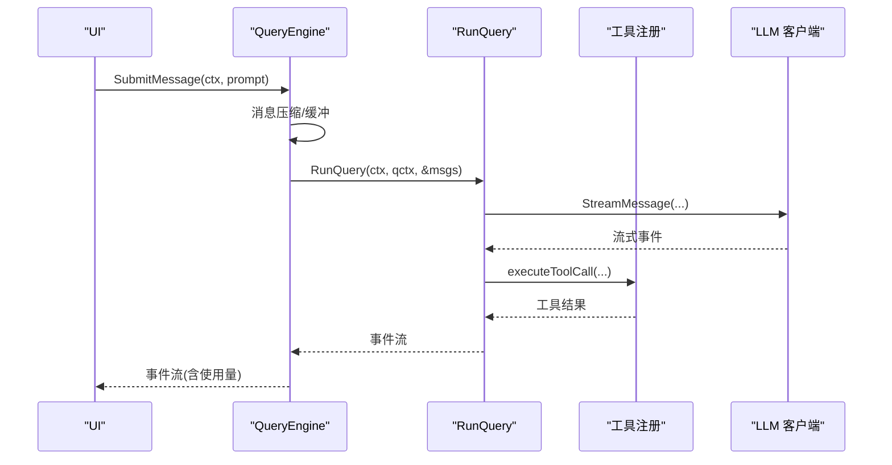
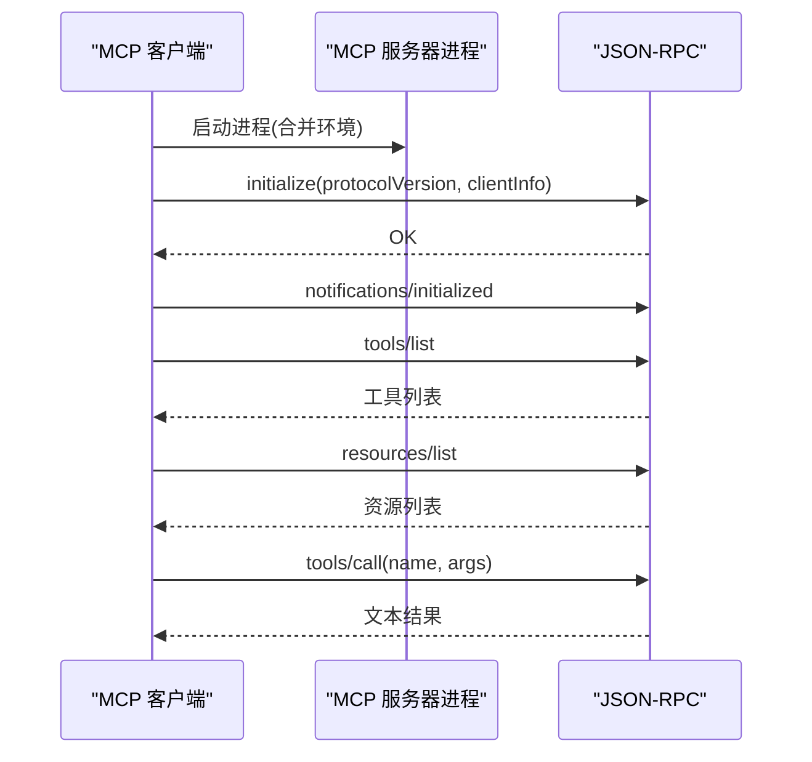
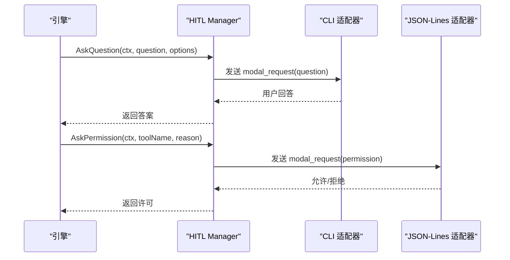
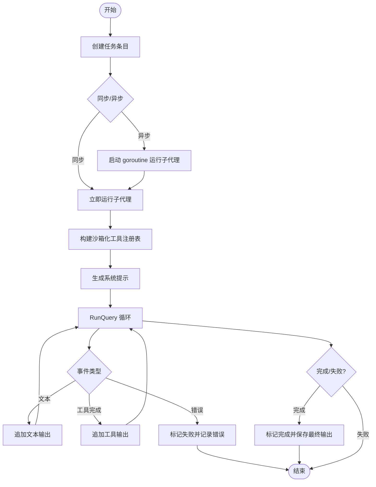
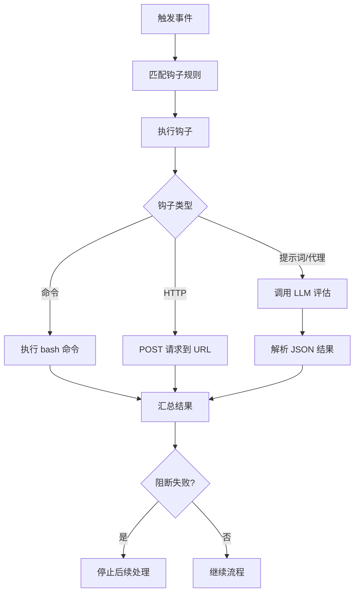
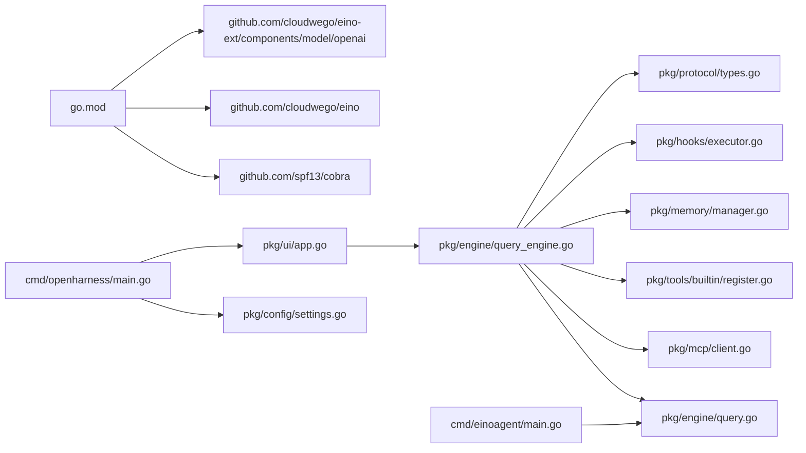
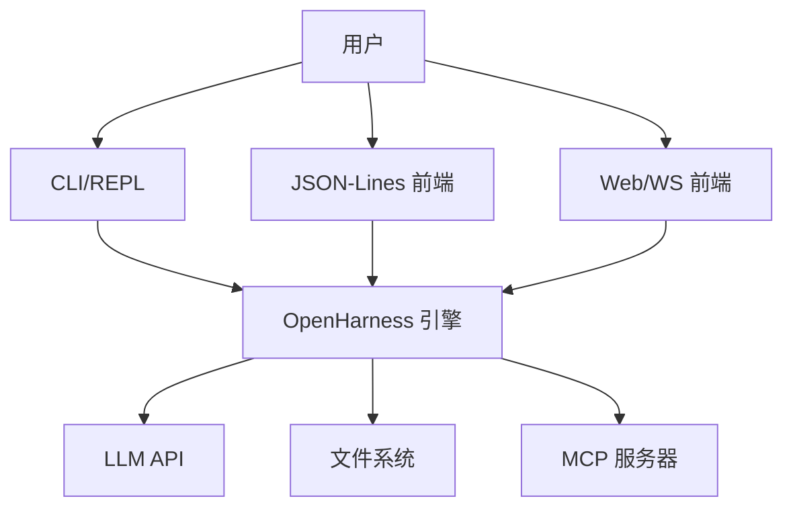

# 系统架构图

<cite>
**本文档引用的文件**
- [cmd/openharness/main.go](file://cmd/openharness/main.go)
- [cmd/einoagent/main.go](file://cmd/einoagent/main.go)
- [pkg/config/settings.go](file://pkg/config/settings.go)
- [pkg/api/provider.go](file://pkg/api/provider.go)
- [pkg/engine/query_engine.go](file://pkg/engine/query_engine.go)
- [pkg/engine/query.go](file://pkg/engine/query.go)
- [pkg/mcp/client.go](file://pkg/mcp/client.go)
- [pkg/mcp/types.go](file://pkg/mcp/types.go)
- [pkg/ui/app.go](file://pkg/ui/app.go)
- [pkg/ui/runtime.go](file://pkg/ui/runtime.go)
- [pkg/taskeks/executor.go](file://pkg/tasks/executor.go)
- [pkg/memory/manager.go](file://pkg/memory/manager.go)
- [pkg/hooks/executor.go](file://pkg/hooks/executor.go)
- [pkg/state/store.go](file://pkg/state/store.go)
- [pkg/types/messages.go](file://pkg/types/messages.go)
- [pkg/tools/builtin/register.go](file://pkg/tools/builtin/register.go)
- [pkg/protocol/types.go](file://pkg/protocol/types.go)
- [design/Human-In-The-Loop.md](file://design/Human-In-The-Loop.md)
- [go.mod](file://go.mod)
</cite>

## 目录
1. [引言](#引言)
2. [项目结构](#项目结构)
3. [核心组件](#核心组件)
4. [架构总览](#架构总览)
5. [详细组件分析](#详细组件分析)
6. [依赖关系分析](#依赖关系分析)
7. [性能考虑](#性能考虑)
8. [故障排除指南](#故障排除指南)
9. [结论](#结论)
10. [附录](#附录)

## 引言
本文件面向系统分析师与架构师，提供 OpenHarness Go 的系统架构图与深度解析。内容涵盖系统上下文、容器与部署视图、核心组件关系、数据流与处理逻辑、错误处理与性能特征，并给出架构决策的技术考量与未来演进方向。

## 项目结构
OpenHarness Go 采用模块化分层组织：
- 命令行入口：cmd/openharness 提供 CLI；cmd/einoagent 提供独立 ReAct 示例代理。
- 配置与设置：pkg/config 管理运行时配置与环境变量覆盖。
- 引擎与推理：pkg/engine 提供对话状态管理与查询执行。
- MCP 客户端：pkg/mcp 支持标准输入输出传输的 MCP 服务器连接。
- UI 与运行时：pkg/ui 提供 REPL、打印模式与 JSON-Lines 协议。
- 工具与权限：pkg/tools 提供内置工具注册与权限检查。
- 记忆与钩子：pkg/memory 提供项目级记忆存储；pkg/hooks 提供事件钩子执行。
- 人类在回路（HITL）：pkg/hitl 与 pkg/protocol 支持多前端的交互协议。
- 类型与消息：pkg/types 定义内容块与消息格式。
- 设计文档：design 目录包含 HITL 架构说明。

**图表来源**
- [cmd/openharness/main.go:15-102](file://cmd/openharness/main.go#L15-L102)
- [pkg/ui/app.go:18-61](file://pkg/ui/app.go#L18-L61)
- [pkg/engine/query_engine.go:49-122](file://pkg/engine/query_engine.go#L49-L122)
- [pkg/mcp/client.go:116-132](file://pkg/mcp/client.go#L116-L132)
- [pkg/config/settings.go:97-142](file://pkg/config/settings.go#L97-L142)

**章节来源**
- [cmd/openharness/main.go:15-102](file://cmd/openharness/main.go#L15-L102)
- [pkg/config/settings.go:97-142](file://pkg/config/settings.go#L97-L142)
- [pkg/ui/app.go:18-61](file://pkg/ui/app.go#L18-L61)
- [pkg/engine/query_engine.go:49-122](file://pkg/engine/query_engine.go#L49-L122)
- [pkg/mcp/client.go:116-132](file://pkg/mcp/client.go#L116-L132)

## 核心组件
- CLI 入口与命令管理：负责参数解析、设置加载与子命令（mcp、auth）分发。
- 配置与提供方检测：集中管理模型、令牌、提供方与内存设置。
- 查询引擎：封装对话历史、压缩与流式响应，协调工具与权限。
- 引擎执行器：驱动一次用户提交的完整推理循环，含工具调用与状态更新。
- MCP 客户端：通过 JSON-RPC over stdio 管理多个 MCP 服务器连接。
- UI 运行时：构建运行时环境，支持 REPL、打印模式与 JSON-Lines 协议。
- 工具注册：内置工具注册与沙箱化工具集。
- 记忆管理：项目级 Markdown 记忆条目管理与检索。
- 钩子执行：命令、HTTP、提示词与代理型钩子的统一执行框架。
- 人类在回路（HITL）：跨前端的阻塞式问答与权限请求协议。

**章节来源**
- [cmd/openharness/main.go:42-102](file://cmd/openharness/main.go#L42-L102)
- [pkg/config/settings.go:97-142](file://pkg/config/settings.go#L97-L142)
- [pkg/engine/query_engine.go:49-122](file://pkg/engine/query_engine.go#L49-L122)
- [pkg/mcp/client.go:116-132](file://pkg/mcp/client.go#L116-L132)
- [pkg/ui/app.go:18-61](file://pkg/ui/app.go#L18-L61)
- [pkg/tools/builtin/register.go:7-29](file://pkg/tools/builtin/register.go#L7-L29)
- [pkg/memory/manager.go:12-90](file://pkg/memory/manager.go#L12-L90)
- [pkg/hooks/executor.go:53-105](file://pkg/hooks/executor.go#L53-L105)
- [pkg/protocol/types.go:145-230](file://pkg/protocol/types.go#L145-L230)

## 架构总览
OpenHarness Go 采用“引擎 + 工具 + 外部系统”的三层架构：
- 上层：CLI 与 UI 层负责用户交互与会话管理。
- 中层：查询引擎与任务执行器负责对话状态、工具调度与权限控制。
- 下层：MCP 服务器、文件系统与 LLM API 提供能力扩展与数据访问。

**图表来源**
- [pkg/ui/app.go:18-61](file://pkg/ui/app.go#L18-L61)
- [pkg/engine/query_engine.go:124-205](file://pkg/engine/query_engine.go#L124-L205)
- [pkg/mcp/client.go:296-373](file://pkg/mcp/client.go#L296-L373)
- [pkg/tools/builtin/register.go:7-29](file://pkg/tools/builtin/register.go#L7-L29)
- [pkg/memory/manager.go:12-90](file://pkg/memory/manager.go#L12-L90)
- [pkg/hooks/executor.go:53-105](file://pkg/hooks/executor.go#L53-L105)

## 详细组件分析

### CLI 与设置加载
- CLI 主入口解析标志并加载设置，支持打印模式、REPL 与 MCP/认证子命令。
- 设置默认值与环境变量覆盖，提供提供方检测与认证状态查询。

**图表来源**
- [cmd/openharness/main.go:42-102](file://cmd/openharness/main.go#L42-L102)
- [pkg/config/settings.go:160-195](file://pkg/config/settings.go#L160-L195)
- [pkg/ui/app.go:18-61](file://pkg/ui/app.go#L18-L61)

**章节来源**
- [cmd/openharness/main.go:42-102](file://cmd/openharness/main.go#L42-L102)
- [pkg/config/settings.go:160-195](file://pkg/config/settings.go#L160-L195)

### 查询引擎与执行流程
- 查询引擎管理对话历史、消息压缩与流式事件，协调工具调用与权限检查。
- 执行器驱动一次提交的完整循环，包含工具调用、状态更新与成本统计。

**图表来源**
- [pkg/engine/query_engine.go:124-205](file://pkg/engine/query_engine.go#L124-L205)
- [pkg/engine/query.go:714-730](file://pkg/engine/query.go#L714-L730)

**章节来源**
- [pkg/engine/query_engine.go:124-205](file://pkg/engine/query_engine.go#L124-L205)
- [pkg/engine/query.go:714-730](file://pkg/engine/query.go#L714-L730)

### MCP 客户端与服务器交互
- 通过 stdio JSON-RPC 初始化与通知，列出工具与资源，调用工具与读取资源。
- 支持连接状态跟踪与聚合工具/资源清单。

**图表来源**
- [pkg/mcp/client.go:296-373](file://pkg/mcp/client.go#L296-L373)
- [pkg/mcp/client.go:375-427](file://pkg/mcp/client.go#L375-L427)

**章节来源**
- [pkg/mcp/client.go:116-132](file://pkg/mcp/client.go#L116-L132)
- [pkg/mcp/client.go:296-373](file://pkg/mcp/client.go#L296-L373)

### 人类在回路（HITL）交互协议
- 通过 Manager 维护每请求的通道，支持问题与权限两类模态请求。
- CLI 与 JSON-Lines 适配器分别对接本地与远程前端。

**图表来源**
- [pkg/hitl/manager.go:268-325](file://pkg/hitl/manager.go#L268-L325)
- [pkg/hitl/cli_adapter.go:410-490](file://pkg/hitl/cli_adapter.go#L410-L490)
- [pkg/hitl/jsonlines_adapter.go:529-591](file://pkg/hitl/jsonlines_adapter.go#L529-L591)
- [pkg/protocol/types.go:145-230](file://pkg/protocol/types.go#L145-L230)

**章节来源**
- [pkg/hitl/manager.go:246-384](file://pkg/hitl/manager.go#L246-L384)
- [pkg/protocol/types.go:145-230](file://pkg/protocol/types.go#L145-L230)

### 子代理与任务执行
- 子代理执行器根据类型构建受限工具集，生成系统提示并运行推理循环。
- 支持同步与异步派生子代理，记录输出与状态。

**图表来源**
- [pkg/tasks/executor.go:33-137](file://pkg/tasks/executor.go#L33-L137)
- [pkg/tasks/executor.go:139-204](file://pkg/tasks/executor.go#L139-L204)

**章节来源**
- [pkg/tasks/executor.go:33-137](file://pkg/tasks/executor.go#L33-L137)
- [pkg/tasks/executor.go:139-204](file://pkg/tasks/executor.go#L139-L204)

### 钩子执行框架
- 支持命令、HTTP、提示词与代理型钩子，统一匹配与超时控制。
- 通过 LLM 接口进行条件评估，支持阻断策略。

**图表来源**
- [pkg/hooks/executor.go:67-105](file://pkg/hooks/executor.go#L67-L105)
- [pkg/hooks/executor.go:111-206](file://pkg/hooks/executor.go#L111-L206)
- [pkg/hooks/executor.go:212-269](file://pkg/hooks/executor.go#L212-L269)

**章节来源**
- [pkg/hooks/executor.go:67-105](file://pkg/hooks/executor.go#L67-L105)
- [pkg/hooks/executor.go:111-206](file://pkg/hooks/executor.go#L111-L206)
- [pkg/hooks/executor.go:212-269](file://pkg/hooks/executor.go#L212-L269)

## 依赖关系分析

**图表来源**
- [go.mod:1-43](file://go.mod#L1-L43)
- [cmd/openharness/main.go:10-12](file://cmd/openharness/main.go#L10-L12)
- [cmd/einoagent/main.go:19-23](file://cmd/einoagent/main.go#L19-L23)

**章节来源**
- [go.mod:1-43](file://go.mod#L1-L43)
- [cmd/openharness/main.go:10-12](file://cmd/openharness/main.go#L10-L12)
- [cmd/einoagent/main.go:19-23](file://cmd/einoagent/main.go#L19-L23)

## 性能考虑
- 令牌估算与压缩：查询引擎在提交前对消息进行压缩管道处理，降低上下文开销。
- 成本追踪：累计输入/输出令牌，便于成本控制与阈值告警。
- 流式响应：UI 支持文本流与 JSON-Lines 流，减少等待时间。
- 并发与锁：查询引擎与状态存储使用互斥锁保证并发安全，工具注册采用只读快照策略。
- I/O 优化：JSON-Lines 读取使用大缓冲扫描器，减少系统调用次数。

**章节来源**
- [pkg/engine/query_engine.go:144-172](file://pkg/engine/query_engine.go#L144-L172)
- [pkg/engine/query_engine.go:236-246](file://pkg/engine/query_engine.go#L236-L246)
- [pkg/ui/app.go:63-120](file://pkg/ui/app.go#L63-L120)
- [pkg/state/store.go:25-86](file://pkg/state/store.go#L25-L86)
- [pkg/hooks/executor.go:53-105](file://pkg/hooks/executor.go#L53-L105)

## 故障排除指南
- API 密钥缺失：配置加载失败或环境变量未设置时，提供明确错误信息与配置路径提示。
- MCP 连接失败：检查服务器命令、参数与工作目录，确认初始化与工具列表返回。
- 工具调用异常：查看工具执行结果中的错误标记，结合日志定位输入参数与权限问题。
- 会话中断：REPL 模式下信号处理确保优雅退出；JSON-Lines 模式下前端应正确发送关闭请求。
- 钩子失败：检查钩子匹配规则、超时设置与 LLM 返回的 JSON 结构。

**章节来源**
- [pkg/config/settings.go:144-154](file://pkg/config/settings.go#L144-L154)
- [pkg/mcp/client.go:136-148](file://pkg/mcp/client.go#L136-L148)
- [pkg/hooks/executor.go:93-104](file://pkg/hooks/executor.go#L93-L104)
- [pkg/ui/app.go:122-181](file://pkg/ui/app.go#L122-L181)

## 结论
OpenHarness Go 通过清晰的分层架构实现了可扩展的人类在回路智能体系统。CLI 与 UI 提供多样的交互方式，查询引擎与工具体系支撑复杂任务编排，MCP 与钩子框架实现对外部能力的灵活集成。未来可在以下方向演进：增强多前端协议支持、引入嵌入式记忆检索、扩展权限模型与审计日志、以及容器化与可观测性增强。

## 附录

### 系统上下文图

**图表来源**
- [pkg/ui/app.go:122-181](file://pkg/ui/app.go#L122-L181)
- [pkg/mcp/client.go:296-373](file://pkg/mcp/client.go#L296-L373)
- [pkg/api/provider.go:18-59](file://pkg/api/provider.go#L18-L59)

### 容器图（运行时）
- 进程：CLI 主进程负责设置加载与会话管理。
- Goroutine：查询引擎内部使用 goroutine 转发流式事件与处理工具调用。
- 子进程：MCP 客户端启动并维护多个 MCP 服务器进程。

**章节来源**
- [pkg/engine/query_engine.go:188-204](file://pkg/engine/query_engine.go#L188-L204)
- [pkg/mcp/client.go:296-373](file://pkg/mcp/client.go#L296-L373)

### 部署图（概念）
- 单机部署：CLI 与引擎在本地运行，MCP 服务器可本地或远程进程。
- 容器化：将 CLI 与引擎打包为容器，MCP 服务作为 Sidecar 或独立 Pod。
- 云集成：通过提供方检测与 BaseURL/Provider 配置接入云端 LLM。

**章节来源**
- [pkg/config/settings.go:97-142](file://pkg/config/settings.go#L97-L142)
- [pkg/api/provider.go:18-59](file://pkg/api/provider.go#L18-L59)