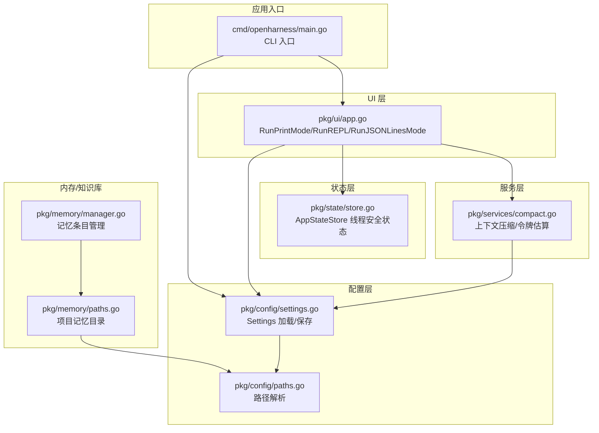
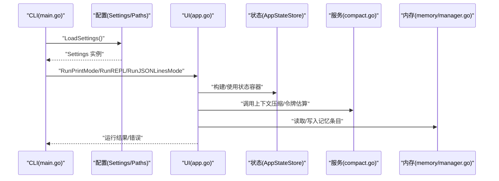
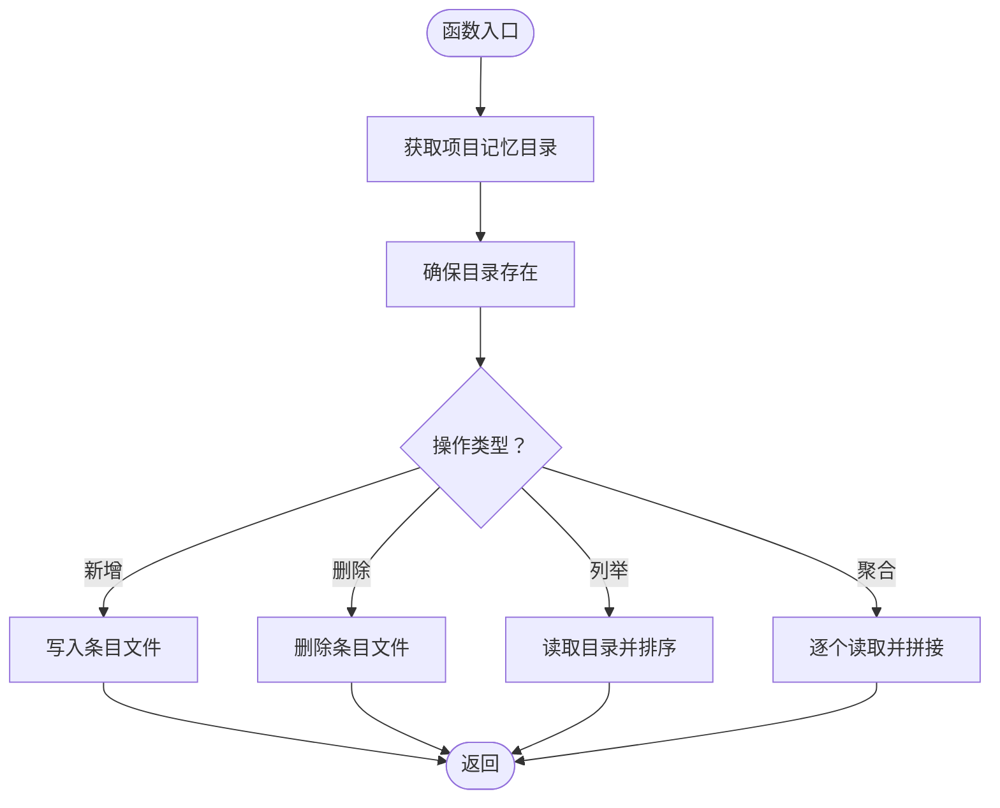
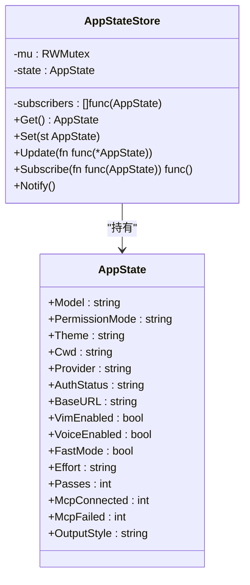
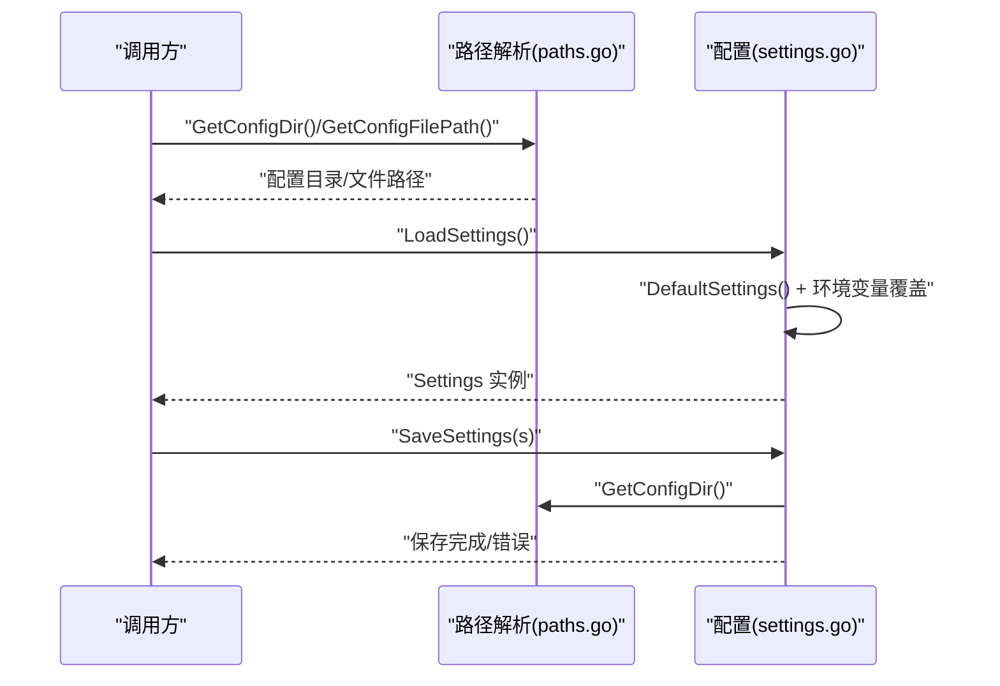
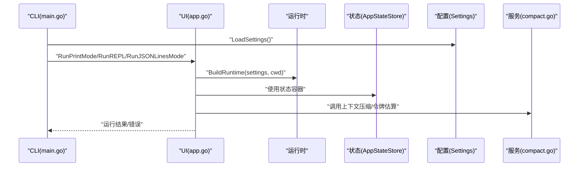
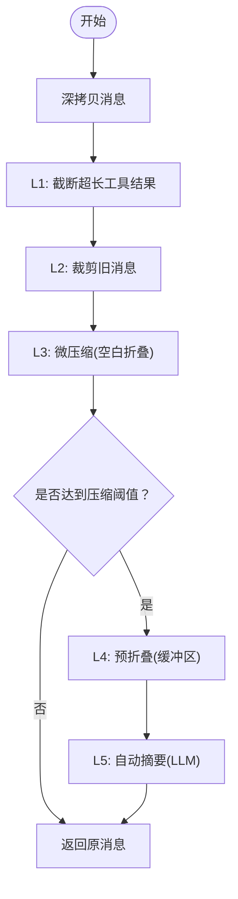
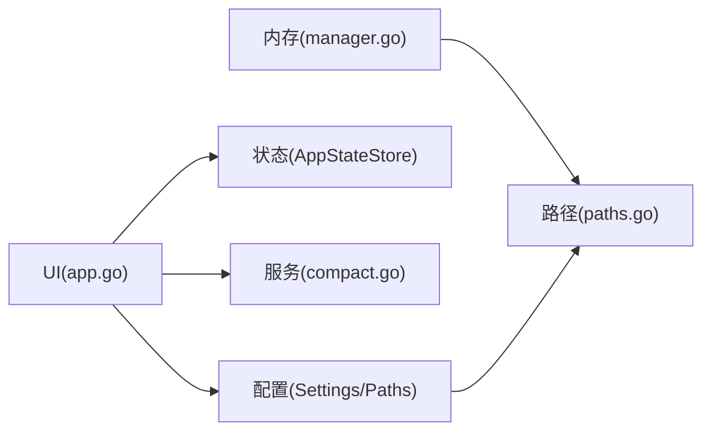

# 单例模式

<cite>
**本文引用的文件**
- [pkg/memory/manager.go](file://pkg/memory/manager.go)
- [pkg/memory/paths.go](file://pkg/memory/paths.go)
- [pkg/state/store.go](file://pkg/state/store.go)
- [pkg/config/settings.go](file://pkg/config/settings.go)
- [pkg/config/paths.go](file://pkg/config/paths.go)
- [pkg/ui/app.go](file://pkg/ui/app.go)
- [pkg/services/compact.go](file://pkg/services/compact.go)
- [cmd/openharness/main.go](file://cmd/openharness/main.go)
- [pkg/hitl/jsonlines_adapter.go](file://pkg/hitl/jsonlines_adapter.go)
</cite>

## 目录
1. [引言](#引言)
2. [项目结构](#项目结构)
3. [核心组件](#核心组件)
4. [架构总览](#架构总览)
5. [详细组件分析](#详细组件分析)
6. [依赖分析](#依赖分析)
7. [性能考虑](#性能考虑)
8. [故障排查指南](#故障排查指南)
9. [结论](#结论)

## 引言
本文件聚焦于 OpenHarness Go 代码库中“单例模式”的实际应用与工程化实践，围绕以下关键领域展开：
- 内存管理器（知识库）：通过全局数据目录与项目哈希目录组织，确保同一进程内对同一工作区的知识条目进行统一读写。
- 状态存储（AppStateStore）：提供线程安全的应用运行时状态容器，并支持发布/订阅回调，满足多模块共享状态与事件通知。
- 配置管理（Settings）：集中加载、解析与保存配置，支持环境变量覆盖，为全局提供统一的配置来源。

我们将从内存管理器、状态存储与配置管理三个维度，系统阐述单例模式在该系统中的落地方式、线程安全保证、延迟初始化与资源清理策略，并结合具体代码路径给出实现要点与最佳实践。

## 项目结构
OpenHarness 采用按功能域分层的包结构，其中与单例模式密切相关的模块包括：
- pkg/memory：知识库/记忆体子系统，负责项目级记忆条目的增删查与聚合提示词生成。
- pkg/state：应用运行时状态容器，提供线程安全的状态读写与订阅机制。
- pkg/config：配置模型与加载/保存逻辑，提供统一的配置来源与默认值。
- pkg/ui：用户界面与运行模式入口，贯穿配置加载与运行时生命周期。
- pkg/services：上下文压缩与令牌估算等核心服务，依赖配置与状态进行行为控制。
- cmd/openharness：CLI 入口，负责设置信号处理、加载配置并启动 UI。

图表来源
- [cmd/openharness/main.go:15-102](file://cmd/openharness/main.go#L15-L102)
- [pkg/config/settings.go:160-195](file://pkg/config/settings.go#L160-L195)
- [pkg/config/paths.go:8-28](file://pkg/config/paths.go#L8-L28)
- [pkg/state/store.go:25-101](file://pkg/state/store.go#L25-L101)
- [pkg/ui/app.go:18-61](file://pkg/ui/app.go#L18-L61)
- [pkg/services/compact.go:12-30](file://pkg/services/compact.go#L12-L30)
- [pkg/memory/manager.go:12-94](file://pkg/memory/manager.go#L12-L94)
- [pkg/memory/paths.go:12-28](file://pkg/memory/paths.go#L12-L28)

章节来源
- [cmd/openharness/main.go:15-102](file://cmd/openharness/main.go#L15-L102)
- [pkg/config/settings.go:160-195](file://pkg/config/settings.go#L160-L195)
- [pkg/config/paths.go:8-28](file://pkg/config/paths.go#L8-L28)
- [pkg/state/store.go:25-101](file://pkg/state/store.go#L25-L101)
- [pkg/ui/app.go:18-61](file://pkg/ui/app.go#L18-L61)
- [pkg/services/compact.go:12-30](file://pkg/services/compact.go#L12-L30)
- [pkg/memory/manager.go:12-94](file://pkg/memory/manager.go#L12-L94)
- [pkg/memory/paths.go:12-28](file://pkg/memory/paths.go#L12-L28)

## 核心组件
本节从“单例模式”的角度审视三个关键组件，说明其如何在进程内提供全局唯一实例、如何保证线程安全、以及如何进行资源管理与清理。

- 内存管理器（知识库）
  - 角色定位：为每个项目提供独立的记忆目录，统一执行新增、删除、列举与聚合提示词生成。
  - 单例体现：通过全局数据目录与项目哈希目录的组合，确保同一进程内对同一工作区的访问一致；函数式接口避免外部构造实例的需要。
  - 线程安全：仅进行文件系统操作，不涉及共享可变状态，无需额外同步。
  - 资源清理：文件系统操作遵循标准读写流程，由操作系统回收资源；未见显式关闭句柄。
  - 关键实现路径
    - [pkg/memory/paths.go:12-28](file://pkg/memory/paths.go#L12-L28)
    - [pkg/memory/manager.go:12-94](file://pkg/memory/manager.go#L12-L94)

- 状态存储（AppStateStore）
  - 角色定位：提供线程安全的运行时状态容器，支持读取、替换、更新与订阅回调。
  - 单例体现：通过 New 创建实例，供全局模块共享；内部以互斥锁保护状态与订阅者列表。
  - 线程安全：读写分离锁保障并发读取与互斥写入；订阅者列表复制后解锁，避免死锁。
  - 资源清理：无动态资源需释放；订阅者可通过返回的取消函数移除。
  - 关键实现路径
    - [pkg/state/store.go:25-101](file://pkg/state/store.go#L25-L101)

- 配置管理（Settings）
  - 角色定位：集中加载/保存配置，提供默认值与环境变量覆盖，作为全局配置来源。
  - 单例体现：通过 LoadSettings/SaveSettings 提供全局唯一配置读写入口；路径解析函数统一配置文件位置。
  - 线程安全：纯函数与只读配置对象，无并发共享状态；若跨 goroutine 使用，建议以只读副本传递。
  - 资源清理：文件读写完成后由系统回收；未见显式关闭句柄。
  - 关键实现路径
    - [pkg/config/settings.go:160-195](file://pkg/config/settings.go#L160-L195)
    - [pkg/config/paths.go:8-28](file://pkg/config/paths.go#L8-L28)

章节来源
- [pkg/memory/manager.go:12-94](file://pkg/memory/manager.go#L12-L94)
- [pkg/memory/paths.go:12-28](file://pkg/memory/paths.go#L12-L28)
- [pkg/state/store.go:25-101](file://pkg/state/store.go#L25-L101)
- [pkg/config/settings.go:160-195](file://pkg/config/settings.go#L160-L195)
- [pkg/config/paths.go:8-28](file://pkg/config/paths.go#L8-L28)

## 架构总览
下图展示了 CLI 启动到 UI 运行的关键流程，以及配置、状态与内存/知识库之间的交互关系。

图表来源
- [cmd/openharness/main.go:46-76](file://cmd/openharness/main.go#L46-L76)
- [pkg/ui/app.go:18-61](file://pkg/ui/app.go#L18-L61)
- [pkg/state/store.go:25-101](file://pkg/state/store.go#L25-L101)
- [pkg/services/compact.go:12-30](file://pkg/services/compact.go#L12-L30)
- [pkg/memory/manager.go:12-94](file://pkg/memory/manager.go#L12-L94)

## 详细组件分析

### 组件一：内存管理器（知识库）
- 设计要点
  - 项目级记忆目录：基于工作区路径计算哈希，映射到全局数据目录下的独立子目录，确保不同项目隔离。
  - 文件式存储：记忆条目以 Markdown 文件形式持久化，标题规范化为安全文件名。
  - 聚合提示词：按修改时间倒序读取所有条目，拼接为系统提示词片段。
- 单例与全局性
  - 通过全局数据目录与项目哈希目录的组合，保证同一进程内对同一工作区的访问一致性；函数式接口避免外部构造实例的需要。
- 线程安全
  - 仅进行文件系统操作，不涉及共享可变状态，天然线程安全。
- 资源清理
  - 文件读写完成后由操作系统回收；未见显式关闭句柄。
- 关键实现路径
  - [pkg/memory/paths.go:12-28](file://pkg/memory/paths.go#L12-L28)
  - [pkg/memory/manager.go:12-94](file://pkg/memory/manager.go#L12-L94)

图表来源
- [pkg/memory/manager.go:12-94](file://pkg/memory/manager.go#L12-L94)
- [pkg/memory/paths.go:12-28](file://pkg/memory/paths.go#L12-L28)

章节来源
- [pkg/memory/manager.go:12-94](file://pkg/memory/manager.go#L12-L94)
- [pkg/memory/paths.go:12-28](file://pkg/memory/paths.go#L12-L28)

### 组件二：状态存储（AppStateStore）
- 设计要点
  - 线程安全容器：使用读写锁保护状态与订阅者列表；读多写少场景下提升并发性能。
  - 发布/订阅：Set/Update 后复制订阅者列表并在解锁后触发回调，避免死锁与竞态。
  - 取消订阅：返回取消函数，将索引处置空以保持稳定。
- 单例与全局性
  - 通过 New 创建实例，供全局模块共享；建议在应用启动阶段初始化并注入到各模块。
- 线程安全
  - 读写分离锁；订阅者列表复制后解锁，避免回调期间再次加锁。
- 资源清理
  - 无动态资源需释放；订阅者可通过取消函数移除。
- 关键实现路径
  - [pkg/state/store.go:25-101](file://pkg/state/store.go#L25-L101)

图表来源
- [pkg/state/store.go:6-30](file://pkg/state/store.go#L6-L30)

章节来源
- [pkg/state/store.go:25-101](file://pkg/state/store.go#L25-L101)

### 组件三：配置管理（Settings）
- 设计要点
  - 集中式配置：统一加载/保存配置，支持默认值与环境变量覆盖。
  - 路径解析：统一解析配置目录与文件路径，便于跨平台部署。
  - API 密钥解析：优先使用实例字段，其次环境变量，最后报错。
- 单例与全局性
  - 通过 LoadSettings/SaveSettings 提供全局唯一配置读写入口；路径解析函数统一配置文件位置。
- 线程安全
  - 纯函数与只读配置对象，无并发共享状态；若跨 goroutine 使用，建议以只读副本传递。
- 资源清理
  - 文件读写完成后由系统回收；未见显式关闭句柄。
- 关键实现路径
  - [pkg/config/settings.go:160-195](file://pkg/config/settings.go#L160-L195)
  - [pkg/config/paths.go:8-28](file://pkg/config/paths.go#L8-L28)

图表来源
- [pkg/config/settings.go:160-195](file://pkg/config/settings.go#L160-L195)
- [pkg/config/paths.go:8-28](file://pkg/config/paths.go#L8-L28)

章节来源
- [pkg/config/settings.go:160-195](file://pkg/config/settings.go#L160-L195)
- [pkg/config/paths.go:8-28](file://pkg/config/paths.go#L8-L28)

### 组件四：UI 运行模式与生命周期
- 设计要点
  - 多运行模式：非交互打印模式、REPL 交互模式、JSON-Lines 远程模式。
  - 生命周期：构建运行时、启动、处理输入、关闭资源。
  - 与状态/配置/服务的协作：通过状态容器驱动 UI 行为，通过配置决定模型与输出风格，通过服务进行上下文压缩。
- 关键实现路径
  - [pkg/ui/app.go:18-61](file://pkg/ui/app.go#L18-L61)
  - [pkg/ui/app.go:122-181](file://pkg/ui/app.go#L122-L181)
  - [pkg/ui/app.go:191-238](file://pkg/ui/app.go#L191-L238)

图表来源
- [cmd/openharness/main.go:46-76](file://cmd/openharness/main.go#L46-L76)
- [pkg/ui/app.go:18-61](file://pkg/ui/app.go#L18-L61)
- [pkg/services/compact.go:12-30](file://pkg/services/compact.go#L12-L30)

章节来源
- [pkg/ui/app.go:18-61](file://pkg/ui/app.go#L18-L61)
- [pkg/ui/app.go:122-181](file://pkg/ui/app.go#L122-L181)
- [pkg/ui/app.go:191-238](file://pkg/ui/app.go#L191-L238)

### 组件五：上下文压缩与令牌估算
- 设计要点
  - 分层压缩流水线：截断工具结果、裁剪旧消息、微压缩、预折叠、自动摘要。
  - 令牌估算：基于字符长度粗略估算，用于触发压缩决策。
  - 默认配置：集中定义压缩阈值与保留策略。
- 关键实现路径
  - [pkg/services/compact.go:12-30](file://pkg/services/compact.go#L12-L30)
  - [pkg/services/compact.go:61-72](file://pkg/services/compact.go#L61-L72)
  - [pkg/services/compact.go:74-115](file://pkg/services/compact.go#L74-L115)

图表来源
- [pkg/services/compact.go:74-115](file://pkg/services/compact.go#L74-L115)

章节来源
- [pkg/services/compact.go:12-30](file://pkg/services/compact.go#L12-L30)
- [pkg/services/compact.go:61-72](file://pkg/services/compact.go#L61-L72)
- [pkg/services/compact.go:74-115](file://pkg/services/compact.go#L74-L115)

## 依赖分析
- 组件耦合
  - UI 层依赖配置层与状态层，同时调用服务层进行上下文压缩。
  - 内存管理器依赖配置层提供的全局数据目录，实现项目隔离。
  - 配置层与路径解析相互独立，但共同为其他模块提供统一的配置来源。
- 潜在循环依赖
  - 当前模块间无直接循环导入；UI 与服务层通过接口参数传递回调，避免反向依赖。
- 外部依赖
  - 未发现第三方单例框架；通过标准库互斥锁与函数式接口实现线程安全与全局访问。

图表来源
- [pkg/ui/app.go:18-61](file://pkg/ui/app.go#L18-L61)
- [pkg/config/settings.go:160-195](file://pkg/config/settings.go#L160-L195)
- [pkg/config/paths.go:8-28](file://pkg/config/paths.go#L8-L28)
- [pkg/state/store.go:25-101](file://pkg/state/store.go#L25-L101)
- [pkg/services/compact.go:12-30](file://pkg/services/compact.go#L12-L30)
- [pkg/memory/manager.go:12-94](file://pkg/memory/manager.go#L12-L94)
- [pkg/memory/paths.go:12-28](file://pkg/memory/paths.go#L12-L28)

章节来源
- [pkg/ui/app.go:18-61](file://pkg/ui/app.go#L18-L61)
- [pkg/config/settings.go:160-195](file://pkg/config/settings.go#L160-L195)
- [pkg/config/paths.go:8-28](file://pkg/config/paths.go#L8-L28)
- [pkg/state/store.go:25-101](file://pkg/state/store.go#L25-L101)
- [pkg/services/compact.go:12-30](file://pkg/services/compact.go#L12-L30)
- [pkg/memory/manager.go:12-94](file://pkg/memory/manager.go#L12-L94)
- [pkg/memory/paths.go:12-28](file://pkg/memory/paths.go#L12-L28)

## 性能考虑
- 状态存储
  - 读写分离锁适合高读低写场景；订阅者列表复制后解锁，避免回调期间阻塞写入。
- 上下文压缩
  - 令牌估算为近似值，避免昂贵的模型调用；分层流水线按需执行，减少不必要的处理。
- 内存管理器
  - 文件系统操作为 I/O 密集型；通过目录结构隔离与最小化文件数量，降低磁盘压力。
- 配置管理
  - 配置加载为一次性操作；建议在应用启动时缓存只读副本，避免重复解析。

## 故障排查指南
- 配置加载失败
  - 症状：无法读取配置文件或解析失败。
  - 排查：确认配置文件路径与权限；检查环境变量覆盖是否生效。
  - 参考路径
    - [pkg/config/settings.go:160-195](file://pkg/config/settings.go#L160-L195)
    - [pkg/config/paths.go:8-28](file://pkg/config/paths.go#L8-L28)
- 记忆条目异常
  - 症状：新增/删除/列举失败或内容为空。
  - 排查：检查项目记忆目录是否存在且可写；确认标题规范化后的文件名合法。
  - 参考路径
    - [pkg/memory/paths.go:12-28](file://pkg/memory/paths.go#L12-L28)
    - [pkg/memory/manager.go:12-94](file://pkg/memory/manager.go#L12-L94)
- 状态订阅无效
  - 症状：状态变更后未收到回调。
  - 排查：确认订阅者未被取消；检查回调函数是否为 nil。
  - 参考路径
    - [pkg/state/store.go:71-86](file://pkg/state/store.go#L71-L86)
- UI 运行模式问题
  - 症状：非交互模式输出异常或 REPL 无法退出。
  - 排查：检查运行时构建与关闭流程；确认上下文取消信号正确传递。
  - 参考路径
    - [pkg/ui/app.go:18-61](file://pkg/ui/app.go#L18-L61)
    - [pkg/ui/app.go:122-181](file://pkg/ui/app.go#L122-L181)
    - [pkg/ui/app.go:191-238](file://pkg/ui/app.go#L191-L238)

章节来源
- [pkg/config/settings.go:160-195](file://pkg/config/settings.go#L160-L195)
- [pkg/config/paths.go:8-28](file://pkg/config/paths.go#L8-L28)
- [pkg/memory/paths.go:12-28](file://pkg/memory/paths.go#L12-L28)
- [pkg/memory/manager.go:12-94](file://pkg/memory/manager.go#L12-L94)
- [pkg/state/store.go:71-86](file://pkg/state/store.go#L71-L86)
- [pkg/ui/app.go:18-61](file://pkg/ui/app.go#L18-L61)
- [pkg/ui/app.go:122-181](file://pkg/ui/app.go#L122-L181)
- [pkg/ui/app.go:191-238](file://pkg/ui/app.go#L191-L238)

## 结论
OpenHarness 在 Go 代码库中通过“函数式接口 + 全局路径解析”的方式实现了“单例模式”的工程化落地：
- 内存管理器：以全局数据目录与项目哈希目录确保同一进程内对同一工作区的访问一致性，函数式接口避免外部构造实例的需要。
- 状态存储：通过读写锁与订阅者列表复制，提供线程安全的状态容器，满足多模块共享状态与事件通知。
- 配置管理：集中加载/保存配置，支持默认值与环境变量覆盖，为全局提供统一的配置来源。

这些设计在保证线程安全与资源管理的同时，提升了系统的稳定性与可维护性。对于需要进一步扩展的场景，建议：
- 对于需要严格生命周期管理的资源，引入显式的初始化与关闭钩子。
- 对于跨模块共享的复杂状态，考虑以接口抽象与依赖注入的方式增强可测试性与解耦性。