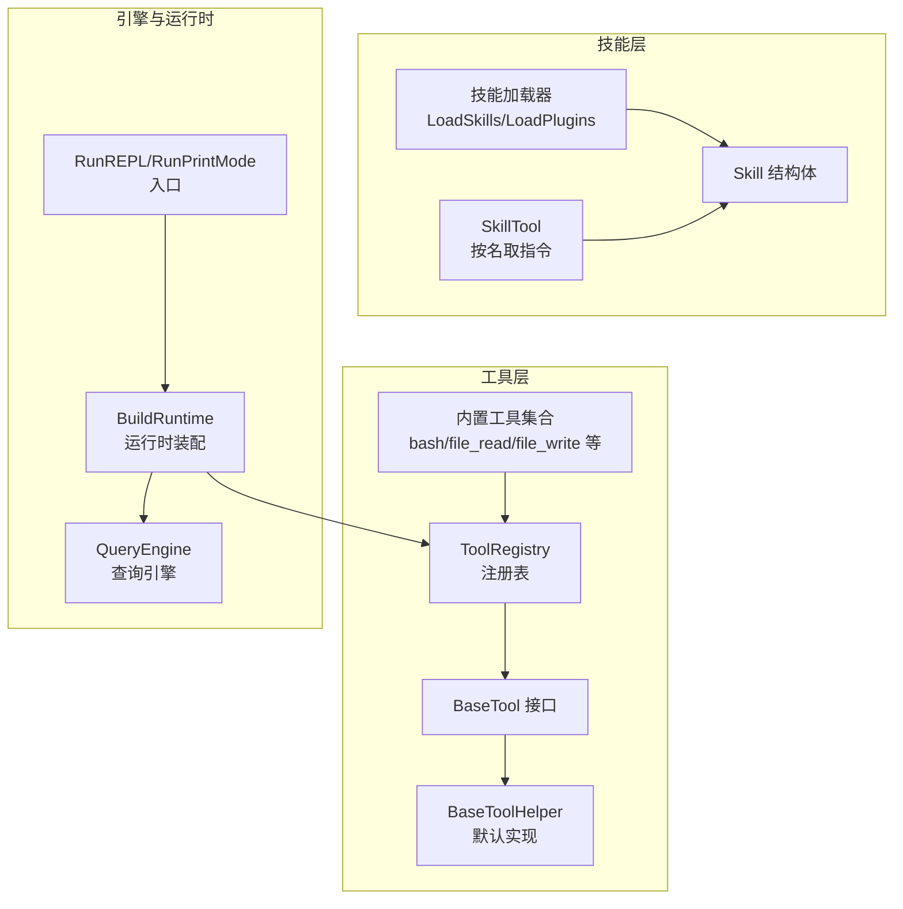
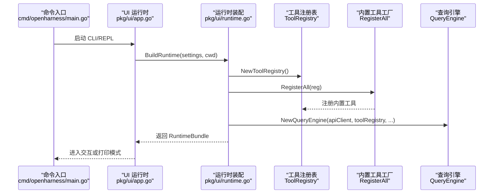
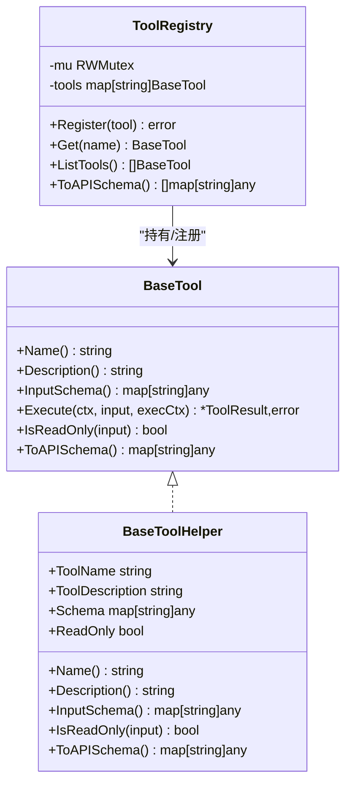
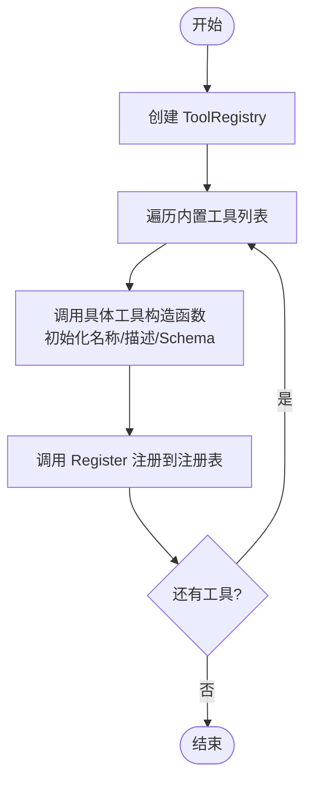
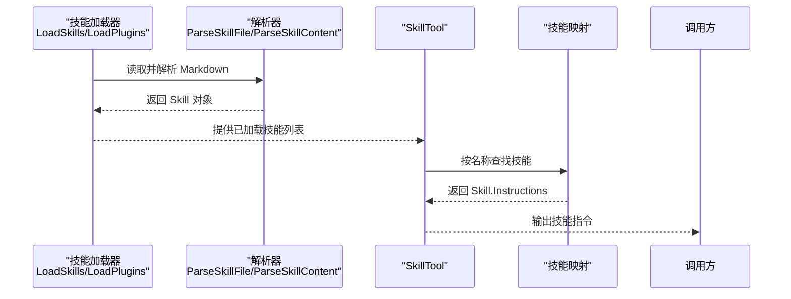
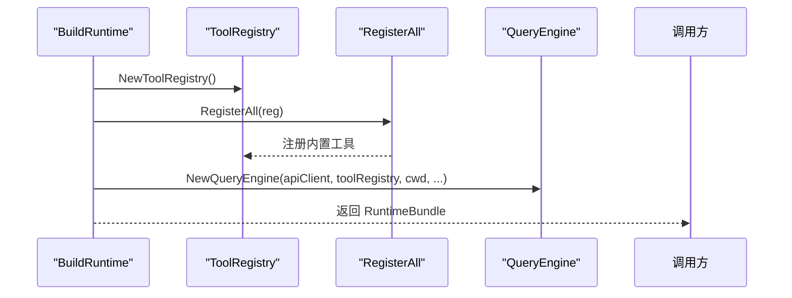
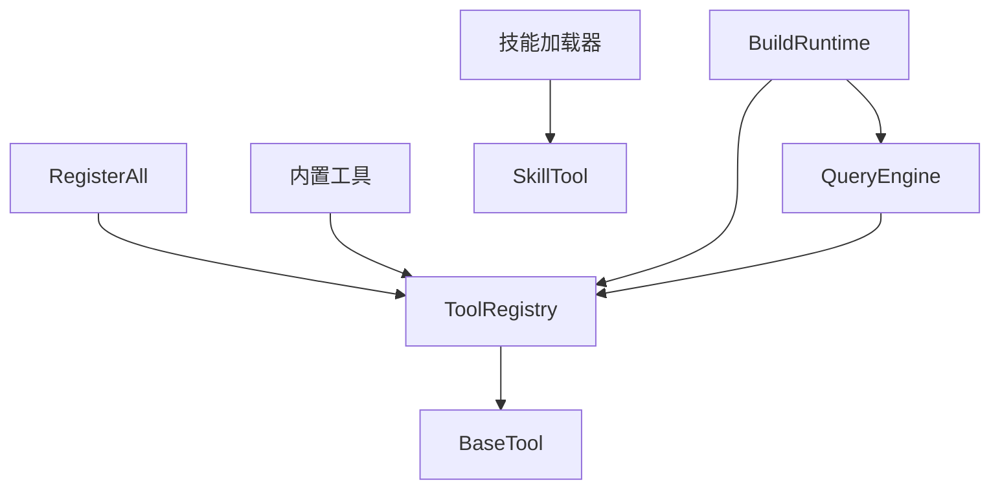

# 工厂模式

<cite>
**本文引用的文件**
- [pkg/tools/base.go](file://pkg/tools/base.go)
- [pkg/tools/builtin/register.go](file://pkg/tools/builtin/register.go)
- [pkg/tools/builtin/bash.go](file://pkg/tools/builtin/bash.go)
- [pkg/tools/builtin/file_read.go](file://pkg/tools/builtin/file_read.go)
- [pkg/tools/builtin/file_write.go](file://pkg/tools/builtin/file_write.go)
- [pkg/tools/builtin/agent.go](file://pkg/tools/builtin/agent.go)
- [pkg/tools/builtin/skill.go](file://pkg/tools/builtin/skill.go)
- [pkg/skills/loader.go](file://pkg/skills/loader.go)
- [pkg/engine/query_engine.go](file://pkg/engine/query_engine.go)
- [pkg/ui/runtime.go](file://pkg/ui/runtime.go)
- [pkg/ui/app.go](file://pkg/ui/app.go)
- [cmd/openharness/main.go](file://cmd/openharness/main.go)
- [design/TASK.md](file://design/TASK.md)
</cite>

## 目录
1. [引言](#引言)
2. [项目结构](#项目结构)
3. [核心组件](#核心组件)
4. [架构总览](#架构总览)
5. [详细组件分析](#详细组件分析)
6. [依赖分析](#依赖分析)
7. [性能考虑](#性能考虑)
8. [故障排查指南](#故障排查指南)
9. [结论](#结论)
10. [附录](#附录)

## 引言
本文件聚焦于 OpenHarness Go 在“工具注册表”与“技能加载器”两处对工厂模式的应用，系统阐述其如何通过抽象工厂接口设计、具体工厂实现与产品创建流程，降低对象创建复杂度、提升可扩展性与可维护性。我们将从代码级视角解析工具实例化、参数配置与生命周期管理，并结合实际调用链路展示工厂方法与抽象工厂在运行期的协作方式。

## 项目结构
围绕工厂模式的关键目录与文件如下：
- 工具体系与注册表：pkg/tools/base.go、pkg/tools/builtin/register.go、pkg/tools/builtin/*.go
- 技能加载与分发：pkg/skills/loader.go、pkg/tools/builtin/skill.go
- 引擎与运行时装配：pkg/engine/query_engine.go、pkg/ui/runtime.go、pkg/ui/app.go、cmd/openharness/main.go
- 设计文档参考：design/TASK.md（任务工具与子代理工具的设计说明）

**图表来源**
- [pkg/tools/base.go:81-131](file://pkg/tools/base.go#L81-L131)
- [pkg/tools/builtin/register.go:7-29](file://pkg/tools/builtin/register.go#L7-L29)
- [pkg/skills/loader.go:21-124](file://pkg/skills/loader.go#L21-L124)
- [pkg/tools/builtin/skill.go:21-72](file://pkg/tools/builtin/skill.go#L21-L72)
- [pkg/engine/query_engine.go:49-122](file://pkg/engine/query_engine.go#L49-L122)
- [pkg/ui/runtime.go:153-191](file://pkg/ui/runtime.go#L153-L191)
- [pkg/ui/app.go:18-61](file://pkg/ui/app.go#L18-L61)

**章节来源**
- [pkg/tools/base.go:81-131](file://pkg/tools/base.go#L81-L131)
- [pkg/tools/builtin/register.go:7-29](file://pkg/tools/builtin/register.go#L7-L29)
- [pkg/skills/loader.go:21-124](file://pkg/skills/loader.go#L21-L124)
- [pkg/engine/query_engine.go:49-122](file://pkg/engine/query_engine.go#L49-L122)
- [pkg/ui/runtime.go:153-191](file://pkg/ui/runtime.go#L153-L191)
- [pkg/ui/app.go:18-61](file://pkg/ui/app.go#L18-L61)

## 核心组件
- 工具注册表（ToolRegistry）：线程安全容器，负责注册、检索与导出工具的 API Schema。它扮演“具体工厂”的角色，提供统一的工具创建与获取入口。
- 工具接口与默认实现（BaseTool/BaseToolHelper）：定义工具契约与常用默认行为，便于具体工具复用。
- 内置工具工厂（RegisterAll/CreateDefaultToolRegistry）：集中创建并注册一组内置工具，体现“具体工厂”的批量创建能力。
- 技能加载器（LoadSkills/LoadPlugins/Parsing）：扫描目录与插件，解析 Markdown 中的 YAML 风格 Frontmatter，生成 Skill 对象，为 SkillTool 提供数据源。
- 技能工具（SkillTool）：根据名称从已加载技能映射中取回指令文本，体现“工厂方法”按名创建/获取产品的能力。
- 引擎与运行时装配（BuildRuntime/NewQueryEngine）：将工具注册表注入引擎，形成完整的执行环境。

**章节来源**
- [pkg/tools/base.go:51-79](file://pkg/tools/base.go#L51-L79)
- [pkg/tools/base.go:81-131](file://pkg/tools/base.go#L81-L131)
- [pkg/tools/builtin/register.go:7-29](file://pkg/tools/builtin/register.go#L7-L29)
- [pkg/skills/loader.go:21-197](file://pkg/skills/loader.go#L21-L197)
- [pkg/tools/builtin/skill.go:21-72](file://pkg/tools/builtin/skill.go#L21-L72)
- [pkg/engine/query_engine.go:98-122](file://pkg/engine/query_engine.go#L98-L122)
- [pkg/ui/runtime.go:153-191](file://pkg/ui/runtime.go#L153-L191)

## 架构总览
下图展示了工厂模式在系统中的位置与交互：工具注册表作为“具体工厂”，内置工具作为“产品”，技能加载器作为“输入数据源”，引擎通过注册表获取工具实例，运行时在装配阶段完成工具注册与引擎初始化。

**图表来源**
- [cmd/openharness/main.go:15-76](file://cmd/openharness/main.go#L15-L76)
- [pkg/ui/app.go:18-61](file://pkg/ui/app.go#L18-L61)
- [pkg/ui/runtime.go:153-191](file://pkg/ui/runtime.go#L153-L191)
- [pkg/tools/builtin/register.go:7-29](file://pkg/tools/builtin/register.go#L7-L29)
- [pkg/engine/query_engine.go:98-122](file://pkg/engine/query_engine.go#L98-L122)

## 详细组件分析

### 工具注册表与工厂方法模式
- 抽象工厂接口：BaseTool 定义工具的统一契约（名称、描述、输入模式、执行、只读标记、API 模式导出）。
- 默认实现：BaseToolHelper 提供 Name/Description/InputSchema/IsReadOnly/ToAPISchema 的默认实现，减少重复代码。
- 具体工厂（ToolRegistry）：提供 Register/Get/ListTools/ToAPISchema 等方法，实现“按名创建/获取工具”的工厂方法模式。
- 生命周期管理：注册表内部使用互斥锁保证并发安全；工具实例一旦注册即进入全局可用状态；API 导出用于向 LLM 展示可用工具。

**图表来源**
- [pkg/tools/base.go:51-79](file://pkg/tools/base.go#L51-L79)
- [pkg/tools/base.go:81-131](file://pkg/tools/base.go#L81-L131)

**章节来源**
- [pkg/tools/base.go:51-79](file://pkg/tools/base.go#L51-L79)
- [pkg/tools/base.go:81-131](file://pkg/tools/base.go#L81-L131)

### 内置工具工厂与产品创建
- 具体工厂（RegisterAll/CreateDefaultToolRegistry）：集中创建一组内置工具实例（如 Bash/FileRead/FileWrite 等），并通过注册表统一注册。
- 产品创建流程：每个工具通过构造函数（例如 NewBashTool/NewFileReadTool/NewFileWriteTool）完成自身属性与输入模式的初始化，随后由工厂方法注册到注册表。

**图表来源**
- [pkg/tools/builtin/register.go:7-29](file://pkg/tools/builtin/register.go#L7-L29)
- [pkg/tools/builtin/bash.go:29-53](file://pkg/tools/builtin/bash.go#L29-L53)
- [pkg/tools/builtin/file_read.go:30-57](file://pkg/tools/builtin/file_read.go#L30-L57)
- [pkg/tools/builtin/file_write.go:28-51](file://pkg/tools/builtin/file_write.go#L28-L51)

**章节来源**
- [pkg/tools/builtin/register.go:7-29](file://pkg/tools/builtin/register.go#L7-L29)
- [pkg/tools/builtin/bash.go:29-53](file://pkg/tools/builtin/bash.go#L29-L53)
- [pkg/tools/builtin/file_read.go:30-57](file://pkg/tools/builtin/file_read.go#L30-L57)
- [pkg/tools/builtin/file_write.go:28-51](file://pkg/tools/builtin/file_write.go#L28-L51)

### 技能加载器与工厂方法
- 技能加载器（LoadSkills/LoadPlugins）：扫描目录与插件，解析 Markdown Frontmatter，构建 Skill 对象集合。
- 工厂方法（SkillTool）：接收用户请求的技能名，从已加载技能映射中取出对应指令文本，实现“按名获取产品”的工厂方法。

**图表来源**
- [pkg/skills/loader.go:21-197](file://pkg/skills/loader.go#L21-L197)
- [pkg/tools/builtin/skill.go:27-72](file://pkg/tools/builtin/skill.go#L27-L72)

**章节来源**
- [pkg/skills/loader.go:21-197](file://pkg/skills/loader.go#L21-L197)
- [pkg/tools/builtin/skill.go:27-72](file://pkg/tools/builtin/skill.go#L27-L72)

### 引擎装配与运行时集成
- 运行时装配（BuildRuntime）：创建工具注册表、注册内置工具、构建查询引擎，并将 HITL 回调注入引擎选项。
- 查询引擎（QueryEngine）：接收工具注册表与工作目录等依赖，对外提供 SubmitMessage 等能力，内部通过工具注册表获取工具实例执行。

**图表来源**
- [pkg/ui/runtime.go:153-191](file://pkg/ui/runtime.go#L153-L191)
- [pkg/engine/query_engine.go:98-122](file://pkg/engine/query_engine.go#L98-L122)
- [pkg/tools/builtin/register.go:7-29](file://pkg/tools/builtin/register.go#L7-L29)

**章节来源**
- [pkg/ui/runtime.go:153-191](file://pkg/ui/runtime.go#L153-L191)
- [pkg/engine/query_engine.go:98-122](file://pkg/engine/query_engine.go#L98-L122)

### 子代理工具与任务工具（设计层面的工厂扩展）
- 设计文档中规划了任务工具与子代理工具，体现“工厂方法”在任务生命周期管理中的应用：按类型创建不同权限与能力的子代理，或按需创建任务实例。
- 这些设计为后续扩展提供了清晰的工厂接口与产品族边界，便于在不修改现有代码的前提下引入新工具族。

**章节来源**
- [design/TASK.md:220-254](file://design/TASK.md#L220-L254)

## 依赖分析
- 组件耦合与内聚
  - ToolRegistry 与 BaseTool 形成稳定的接口-实现耦合，工具实现仅依赖接口，降低耦合度。
  - RegisterAll 将工具创建逻辑集中，避免分散的实例化代码，提升内聚性。
  - SkillTool 依赖已加载的技能映射，解耦了技能内容与工具调用逻辑。
- 外部依赖与集成点
  - 引擎通过 ToolRegistry 获取工具，形成“工厂-使用者”解耦。
  - 运行时通过 BuildRuntime 将工具注册表注入引擎，形成装配期的工厂产物消费。

**图表来源**
- [pkg/tools/base.go:81-131](file://pkg/tools/base.go#L81-L131)
- [pkg/tools/builtin/register.go:7-29](file://pkg/tools/builtin/register.go#L7-L29)
- [pkg/skills/loader.go:21-197](file://pkg/skills/loader.go#L21-L197)
- [pkg/tools/builtin/skill.go:27-72](file://pkg/tools/builtin/skill.go#L27-L72)
- [pkg/ui/runtime.go:153-191](file://pkg/ui/runtime.go#L153-L191)
- [pkg/engine/query_engine.go:98-122](file://pkg/engine/query_engine.go#L98-L122)

**章节来源**
- [pkg/tools/base.go:81-131](file://pkg/tools/base.go#L81-L131)
- [pkg/tools/builtin/register.go:7-29](file://pkg/tools/builtin/register.go#L7-L29)
- [pkg/skills/loader.go:21-197](file://pkg/skills/loader.go#L21-L197)
- [pkg/tools/builtin/skill.go:27-72](file://pkg/tools/builtin/skill.go#L27-L72)
- [pkg/ui/runtime.go:153-191](file://pkg/ui/runtime.go#L153-L191)
- [pkg/engine/query_engine.go:98-122](file://pkg/engine/query_engine.go#L98-L122)

## 性能考虑
- 工具注册表的并发访问：注册表内部使用读写锁，确保高并发场景下的安全访问与良好吞吐。
- 工具实例化成本：内置工具多为轻量结构体组合，构造成本低；通过工厂方法集中注册，避免重复创建。
- 技能映射查找：SkillTool 使用哈希映射按名查找，时间复杂度近似 O(1)，适合高频调用。
- 引擎装配：运行时一次性装配工具注册表与引擎，后续调用无需再次创建工厂产物，降低延迟。

## 故障排查指南
- 工具重复注册
  - 现象：注册相同名称的工具报错。
  - 原因：注册表在 Register 时检查名称冲突。
  - 处理：确保工具名称唯一，或在注册前移除旧实例。
- 工具未找到
  - 现象：按名称获取工具失败。
  - 原因：工具未注册或名称不匹配。
  - 处理：确认注册流程已完成，名称大小写与拼写正确。
- 技能名称无效
  - 现象：SkillTool 返回“技能未找到”。
  - 原因：技能映射中不存在该名称。
  - 处理：检查技能加载是否成功，确认名称与已加载技能一致。
- 引擎初始化失败
  - 现象：运行时无法创建引擎。
  - 原因：工具注册表为空或依赖缺失。
  - 处理：确保 RegisterAll 已执行，且传入引擎的工具注册表有效。

**章节来源**
- [pkg/tools/base.go:92-102](file://pkg/tools/base.go#L92-L102)
- [pkg/tools/builtin/skill.go:54-72](file://pkg/tools/builtin/skill.go#L54-L72)
- [pkg/ui/runtime.go:153-191](file://pkg/ui/runtime.go#L153-L191)

## 结论
OpenHarness Go 在工具与技能两大领域成功应用了工厂模式：
- 工具侧通过 ToolRegistry 与 RegisterAll 实现“具体工厂”，将工具实例化与注册流程标准化，显著降低了对象创建复杂度，提升了可扩展性。
- 技能侧通过 LoadSkills/LoadPlugins 与 SkillTool 形成“工厂方法”，按名获取技能指令，使系统能够灵活扩展技能族而无需修改调用端。
- 引擎与运行时通过 BuildRuntime 将工厂产物注入，形成清晰的装配期与运行期职责分离，进一步增强了系统的模块化与可维护性。

## 附录
- 示例路径（不包含具体代码内容）
  - 工具注册表与接口定义：[pkg/tools/base.go:51-131](file://pkg/tools/base.go#L51-L131)
  - 内置工具工厂与默认注册：[pkg/tools/builtin/register.go:7-29](file://pkg/tools/builtin/register.go#L7-L29)
  - 典型工具实现（Bash/FileRead/FileWrite）：[pkg/tools/builtin/bash.go:29-99](file://pkg/tools/builtin/bash.go#L29-L99)、[pkg/tools/builtin/file_read.go:30-99](file://pkg/tools/builtin/file_read.go#L30-L99)、[pkg/tools/builtin/file_write.go:28-80](file://pkg/tools/builtin/file_write.go#L28-L80)
  - 技能加载与工厂方法：[pkg/skills/loader.go:21-197](file://pkg/skills/loader.go#L21-L197)、[pkg/tools/builtin/skill.go:27-72](file://pkg/tools/builtin/skill.go#L27-L72)
  - 引擎装配与运行时集成：[pkg/ui/runtime.go:153-191](file://pkg/ui/runtime.go#L153-L191)、[pkg/engine/query_engine.go:98-122](file://pkg/engine/query_engine.go#L98-L122)
  - 命令入口与交互模式：[cmd/openharness/main.go:15-76](file://cmd/openharness/main.go#L15-L76)、[pkg/ui/app.go:18-61](file://pkg/ui/app.go#L18-L61)
  - 设计文档（任务与子代理工具）：[design/TASK.md:220-254](file://design/TASK.md#L220-L254)