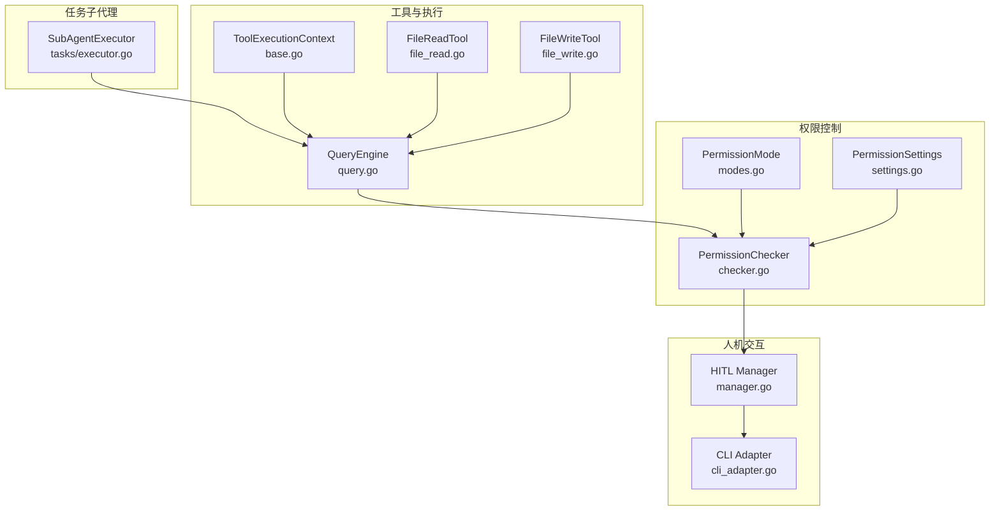
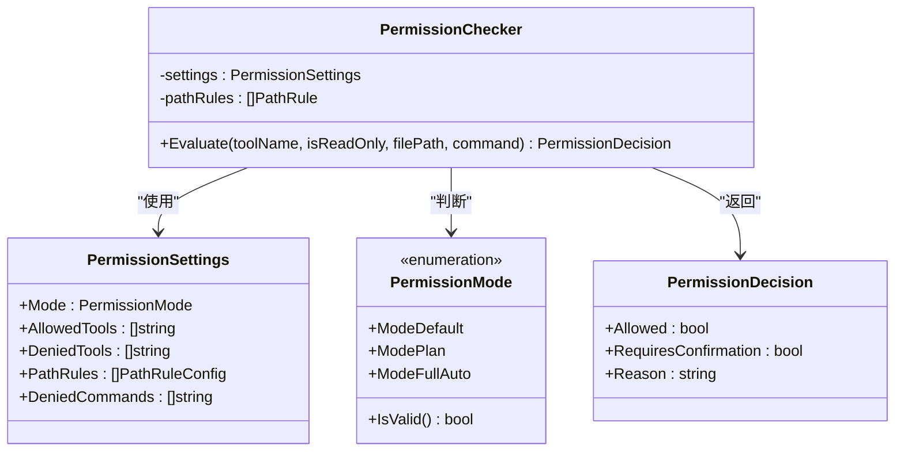
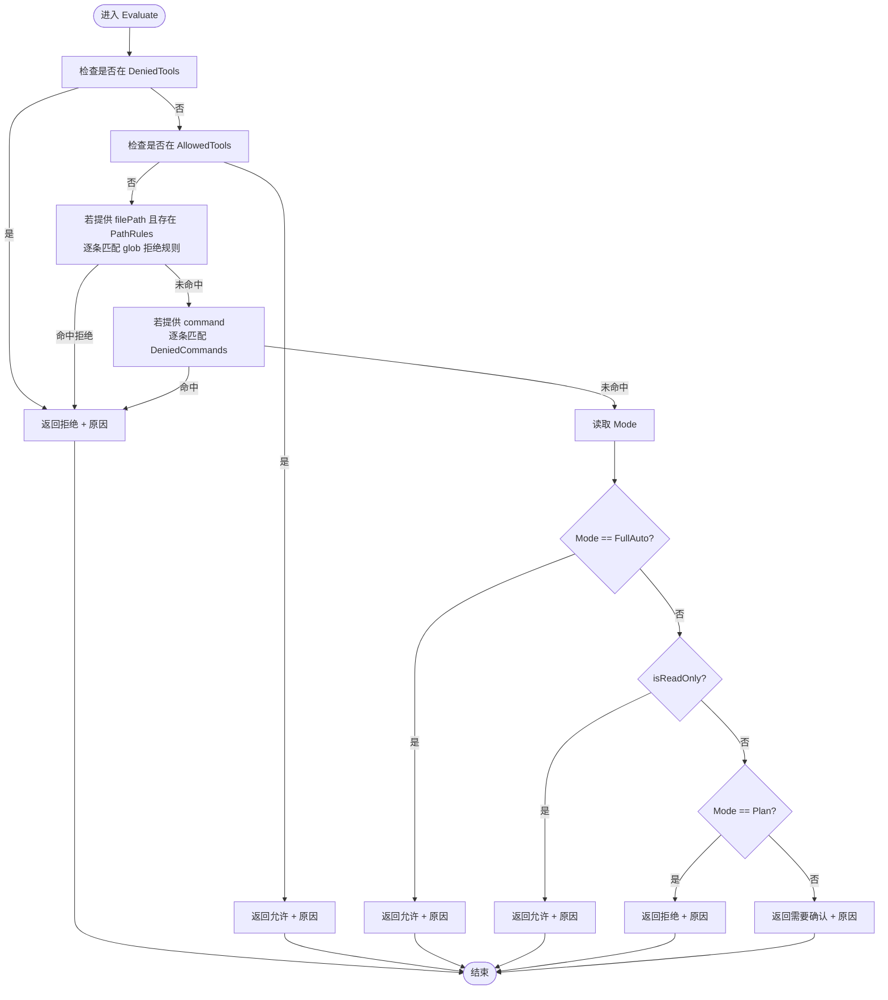
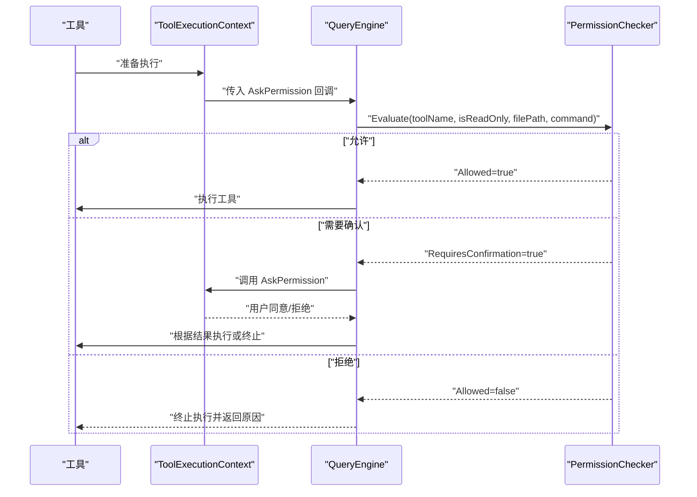
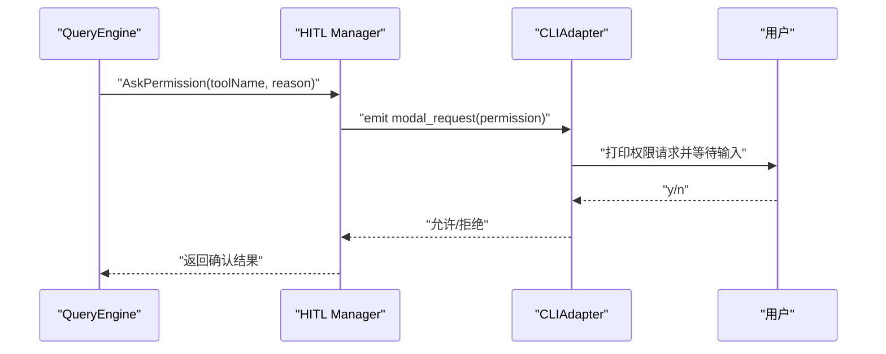
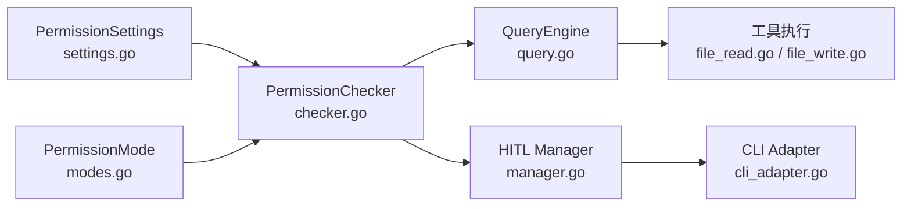

# 策略模式

<cite>
**本文引用的文件**
- [checker.go](file://pkg/permissions/checker.go)
- [modes.go](file://pkg/permissions/modes.go)
- [settings.go](file://pkg/config/settings.go)
- [base.go](file://pkg/tools/base.go)
- [file_read.go](file://pkg/tools/builtin/file_read.go)
- [file_write.go](file://pkg/tools/builtin/file_write.go)
- [executor.go](file://pkg/engine/query.go)
- [manager.go](file://pkg/hitl/manager.go)
- [cli_adapter.go](file://pkg/hitl/cli_adapter.go)
- [executor.go](file://pkg/tasks/executor.go)
</cite>

## 目录
1. [引言](#引言)
2. [项目结构](#项目结构)
3. [核心组件](#核心组件)
4. [架构总览](#架构总览)
5. [详细组件分析](#详细组件分析)
6. [依赖分析](#依赖分析)
7. [性能考虑](#性能考虑)
8. [故障排查指南](#故障排查指南)
9. [结论](#结论)

## 引言
本文件围绕 OpenHarness Go 在权限控制方面的策略模式设计与实现展开，重点解析权限检查器（PermissionChecker）的接口抽象与多种策略（如全量放行、全量禁止等）的可插拔机制。我们将从架构视角说明策略模式如何实现“按配置动态切换”的权限控制，并结合真实代码路径给出使用场景、流程图与序列图，帮助读者快速理解并扩展新的权限策略。

## 项目结构
OpenHarness 将权限控制能力集中在 pkg/permissions 子模块，配合配置模型 pkg/config 与工具执行引擎 pkg/engine 使用。关键文件如下：
- 权限检查器与决策结果定义：pkg/permissions/checker.go
- 权限模式枚举与校验：pkg/permissions/modes.go
- 配置模型（含权限设置）：pkg/config/settings.go
- 工具执行上下文与权限回调接口：pkg/tools/base.go
- 典型工具示例（只读/写入）：pkg/tools/builtin/file_read.go、pkg/tools/builtin/file_write.go
- 引擎执行入口与权限检查集成：pkg/engine/query.go
- 人机交互（HITL）权限请求与响应：pkg/hitl/manager.go、pkg/hitl/cli_adapter.go
- 任务子代理沙箱示例（注入 AllowAllPermissions 策略）：pkg/tasks/executor.go

图表来源
- [checker.go:1-92](file://pkg/permissions/checker.go#L1-L92)
- [modes.go:1-28](file://pkg/permissions/modes.go#L1-L28)
- [settings.go:35-55](file://pkg/config/settings.go#L35-L55)
- [base.go:11-27](file://pkg/tools/base.go#L11-L27)
- [file_read.go:25-51](file://pkg/tools/builtin/file_read.go#L25-L51)
- [file_write.go:24-51](file://pkg/tools/builtin/file_write.go#L24-L51)
- [executor.go:105-114](file://pkg/tasks/executor.go#L105-L114)

章节来源
- [checker.go:1-92](file://pkg/permissions/checker.go#L1-L92)
- [modes.go:1-28](file://pkg/permissions/modes.go#L1-L28)
- [settings.go:35-55](file://pkg/config/settings.go#L35-L55)
- [base.go:11-27](file://pkg/tools/base.go#L11-L27)
- [file_read.go:25-51](file://pkg/tools/builtin/file_read.go#L25-L51)
- [file_write.go:24-51](file://pkg/tools/builtin/file_write.go#L24-L51)
- [executor.go:105-114](file://pkg/tasks/executor.go#L105-L114)

## 核心组件
- 权限决策数据结构
  - PermissionDecision：封装允许与否、是否需要确认、原因等信息，作为 Evaluate 的统一输出。
- 权限检查器
  - PermissionChecker：持有 PermissionSettings 与预处理后的 PathRule 列表，提供 Evaluate 统一决策入口。
- 权限模式
  - PermissionMode：包含 default、plan、full_auto 三种模式，提供 IsValid 校验。
- 配置模型
  - PermissionSettings：包含 Mode、AllowedTools、DeniedTools、PathRules、DeniedCommands 等字段，用于驱动策略行为。
- 工具执行上下文
  - ToolExecutionContext：携带 AskUser 与 AskPermission 回调，供工具在需要时发起权限确认。
- 人机交互（HITL）
  - Manager：负责发出 modal_request 并等待前端响应；CLIAdapter：在命令行环境实现 AskPermission。

章节来源
- [checker.go:10-15](file://pkg/permissions/checker.go#L10-L15)
- [checker.go:23-28](file://pkg/permissions/checker.go#L23-L28)
- [modes.go:4-11](file://pkg/permissions/modes.go#L4-L11)
- [modes.go:19-27](file://pkg/permissions/modes.go#L19-L27)
- [settings.go:37-44](file://pkg/config/settings.go#L37-L44)
- [base.go:11-27](file://pkg/tools/base.go#L11-L27)
- [manager.go:63-90](file://pkg/hitl/manager.go#L63-L90)
- [cli_adapter.go:70-77](file://pkg/hitl/cli_adapter.go#L70-L77)

## 架构总览
OpenHarness 的权限控制采用“策略模式 + 配置驱动”的方式：
- 抽象：PermissionChecker.Evaluate 提供统一的决策接口，屏蔽具体策略细节。
- 策略：通过 PermissionSettings.Mode 与 Allowed/Denied 列表、PathRules、DeniedCommands 等配置，决定 Evaluate 的分支与返回。
- 可插拔：在运行期可替换为不同的 PermissionChecker 实例或注入不同配置，即可实现“全量放行”、“全量禁止”、“计划模式”等策略的动态切换。

图表来源
- [checker.go:23-28](file://pkg/permissions/checker.go#L23-L28)
- [checker.go:41-82](file://pkg/permissions/checker.go#L41-L82)
- [settings.go:37-44](file://pkg/config/settings.go#L37-L44)
- [modes.go:4-11](file://pkg/permissions/modes.go#L4-L11)
- [modes.go:19-27](file://pkg/permissions/modes.go#L19-L27)

## 详细组件分析

### 权限检查器（PermissionChecker）与策略模式
- 接口抽象
  - Evaluate 是唯一的对外接口，接收工具名、是否只读、文件路径、命令等上下文，返回 PermissionDecision。
- 决策流程
  - 先匹配 DeniedTools/AllowedTools，命中即直接返回。
  - 若存在文件路径与 PathRules，则按 glob 规则匹配 deny 规则。
  - 若存在命令，则按 glob 匹配 DeniedCommands。
  - 最后根据 Mode 分支：
    - ModeFullAuto：直接允许。
    - isReadOnly：直接允许。
    - ModePlan：阻止变更型工具。
    - 默认：要求用户确认。
- 可插拔性
  - 通过更换 PermissionSettings 或注入不同实例，即可实现“全量放行/禁止/计划模式”等策略的动态切换。

图表来源
- [checker.go:41-82](file://pkg/permissions/checker.go#L41-L82)

章节来源
- [checker.go:41-82](file://pkg/permissions/checker.go#L41-L82)
- [modes.go:7-11](file://pkg/permissions/modes.go#L7-L11)

### 权限模式（ModeFullAuto、ModePlan、ModeDefault）
- ModeFullAuto：忽略工具与路径限制，一律允许。
- ModePlan：只允许只读工具，变更型工具一律阻断，直到退出计划模式。
- ModeDefault：默认策略，只读工具直接允许，变更型工具需用户确认。

章节来源
- [modes.go:7-11](file://pkg/permissions/modes.go#L7-L11)
- [modes.go:19-27](file://pkg/permissions/modes.go#L19-L27)
- [checker.go:70-81](file://pkg/permissions/checker.go#L70-L81)

### 配置驱动的策略选择
- PermissionSettings 提供 Mode、AllowedTools、DeniedTools、PathRules、DeniedCommands 等字段，决定 Evaluate 的分支。
- DefaultPermissionSettings 提供默认值，确保系统在未显式配置时仍具备合理行为。

章节来源
- [settings.go:37-55](file://pkg/config/settings.go#L37-L55)

### 工具执行与权限检查集成
- 工具执行上下文 ToolExecutionContext 持有 AskPermission 回调，当 PermissionChecker 返回需要确认时，工具可通过该回调向用户发起权限请求。
- 引擎入口 QueryEngine 在执行工具前调用 PermissionChecker.Evaluate，依据返回结果决定是否继续执行或请求确认。

图表来源
- [base.go:14-26](file://pkg/tools/base.go#L14-L26)
- [executor.go:304-330](file://pkg/engine/query.go#L304-L330)
- [checker.go:41-82](file://pkg/permissions/checker.go#L41-L82)

章节来源
- [base.go:14-26](file://pkg/tools/base.go#L14-L26)
- [executor.go:304-330](file://pkg/engine/query.go#L304-L330)
- [checker.go:41-82](file://pkg/permissions/checker.go#L41-L82)

### 人机交互（HITL）与权限确认
- Manager 负责发出 modal_request（Kind=permission），等待前端返回 permission_response。
- CLIAdapter 在命令行环境中实现 AskPermission，打印提示并读取用户输入。
- 两者通过统一的协议与通道完成异步确认。

图表来源
- [manager.go:63-90](file://pkg/hitl/manager.go#L63-L90)
- [cli_adapter.go:70-77](file://pkg/hitl/cli_adapter.go#L70-L77)

章节来源
- [manager.go:63-90](file://pkg/hitl/manager.go#L63-L90)
- [cli_adapter.go:70-77](file://pkg/hitl/cli_adapter.go#L70-L77)

### 可插拔策略的使用场景与扩展方法
- 全量放行（AllowAllPermissions）
  - 场景：受控沙箱或子代理任务中，仅允许特定工具集合，但对这些工具不做额外限制。
  - 实现：在任务子代理示例中，直接注入 AllowAllPermissions 策略实例，使 Evaluate 总是返回允许。
  - 参考路径：[executor.go:105-114](file://pkg/tasks/executor.go#L105-L114)
- 全量禁止（DenyAllPermissions）
  - 场景：严格隔离环境，除非明确白名单，否则全部拒绝。
  - 实现：通过 PermissionSettings.DeniedTools 填充所有工具名，或自定义策略类在 Evaluate 中优先返回拒绝。
  - 参考路径：[checker.go:48-52](file://pkg/permissions/checker.go#L48-L52)
- 计划模式（ModePlan）
  - 场景：仅允许只读工具，变更型工具在计划模式下被阻断。
  - 实现：设置 Mode=plan，或在策略类中强制返回 Plan 行为。
  - 参考路径：[modes.go:8-10](file://pkg/permissions/modes.go#L8-L10)，[checker.go:78-80](file://pkg/permissions/checker.go#L78-L80)
- 动态切换策略
  - 通过替换 PermissionSettings 或注入不同 PermissionChecker 实例，即可在运行期切换策略。
  - 参考路径：[settings.go:37-44](file://pkg/config/settings.go#L37-L44)，[checker.go:30-39](file://pkg/permissions/checker.go#L30-L39)

章节来源
- [executor.go:105-114](file://pkg/tasks/executor.go#L105-L114)
- [checker.go:48-52](file://pkg/permissions/checker.go#L48-L52)
- [modes.go:8-10](file://pkg/permissions/modes.go#L8-L10)
- [checker.go:78-80](file://pkg/permissions/checker.go#L78-L80)
- [settings.go:37-44](file://pkg/config/settings.go#L37-L44)
- [checker.go:30-39](file://pkg/permissions/checker.go#L30-L39)

### 工具只读性与权限检查的关系
- 只读工具（如 Read）在 Evaluate 中会被直接允许，降低误操作风险。
- 变更型工具（如 Write）在默认策略下需要用户确认，体现最小授权原则。

章节来源
- [file_read.go:34-36](file://pkg/tools/builtin/file_read.go#L34-L36)
- [file_write.go:32-34](file://pkg/tools/builtin/file_write.go#L32-L34)
- [checker.go:75-77](file://pkg/permissions/checker.go#L75-L77)

## 依赖分析
- 权限检查器依赖配置模型（PermissionSettings）与模式枚举（PermissionMode）。
- 引擎执行入口依赖权限检查器与工具执行上下文。
- 人机交互（HITL）依赖权限检查器的“需要确认”分支，形成闭环。

图表来源
- [settings.go:37-44](file://pkg/config/settings.go#L37-L44)
- [modes.go:4-11](file://pkg/permissions/modes.go#L4-L11)
- [checker.go:23-28](file://pkg/permissions/checker.go#L23-L28)
- [executor.go:304-330](file://pkg/engine/query.go#L304-L330)
- [file_read.go:25-51](file://pkg/tools/builtin/file_read.go#L25-L51)
- [file_write.go:24-51](file://pkg/tools/builtin/file_write.go#L24-L51)
- [manager.go:63-90](file://pkg/hitl/manager.go#L63-L90)
- [cli_adapter.go:70-77](file://pkg/hitl/cli_adapter.go#L70-L77)

章节来源
- [settings.go:37-44](file://pkg/config/settings.go#L37-L44)
- [modes.go:4-11](file://pkg/permissions/modes.go#L4-L11)
- [checker.go:23-28](file://pkg/permissions/checker.go#L23-L28)
- [executor.go:304-330](file://pkg/engine/query.go#L304-L330)
- [file_read.go:25-51](file://pkg/tools/builtin/file_read.go#L25-L51)
- [file_write.go:24-51](file://pkg/tools/builtin/file_write.go#L24-L51)
- [manager.go:63-90](file://pkg/hitl/manager.go#L63-L90)
- [cli_adapter.go:70-77](file://pkg/hitl/cli_adapter.go#L70-L77)

## 性能考虑
- Evaluate 的主要开销来自字符串匹配与 glob 规则遍历。建议：
  - 合理精简 PathRules 与 DeniedCommands 数量。
  - 对高频工具名使用 AllowedTools 显式白名单，避免逐条规则扫描。
  - 将只读工具置于 AllowedTools，减少确认流程触发次数。
- 模式判断为常数时间，成本极低。

## 故障排查指南
- 问题：工具被意外拒绝
  - 检查 PermissionSettings.DeniedTools 是否包含该工具名。
  - 检查 PathRules 是否存在与 filePath 匹配的 deny 规则。
  - 检查 DeniedCommands 是否匹配 command。
  - 参考路径：[checker.go:48-68](file://pkg/permissions/checker.go#L48-L68)
- 问题：变更型工具总是被要求确认
  - 确认 Mode 是否为 default；只读工具会直接允许。
  - 参考路径：[checker.go:75-81](file://pkg/permissions/checker.go#L75-L81)
- 问题：HITL 无响应
  - 检查 Manager 是否正确发出 modal_request，前端是否返回 permission_response。
  - 参考路径：[manager.go:63-90](file://pkg/hitl/manager.go#L63-L90)，[cli_adapter.go:70-77](file://pkg/hitl/cli_adapter.go#L70-L77)

章节来源
- [checker.go:48-68](file://pkg/permissions/checker.go#L48-L68)
- [checker.go:75-81](file://pkg/permissions/checker.go#L75-L81)
- [manager.go:63-90](file://pkg/hitl/manager.go#L63-L90)
- [cli_adapter.go:70-77](file://pkg/hitl/cli_adapter.go#L70-L77)

## 结论
OpenHarness 通过 PermissionChecker 的策略模式设计，实现了“配置即策略”的灵活权限控制体系。借助 PermissionSettings 与 PermissionMode，系统可在运行期动态切换全量放行、全量禁止、计划模式等策略；配合工具只读性与 HITL 确认机制，既保证了安全性，又兼顾了可用性。该设计具有良好的可扩展性，便于后续引入更复杂的策略（如基于角色、基于上下文的策略），同时保持对外接口的稳定与简洁。