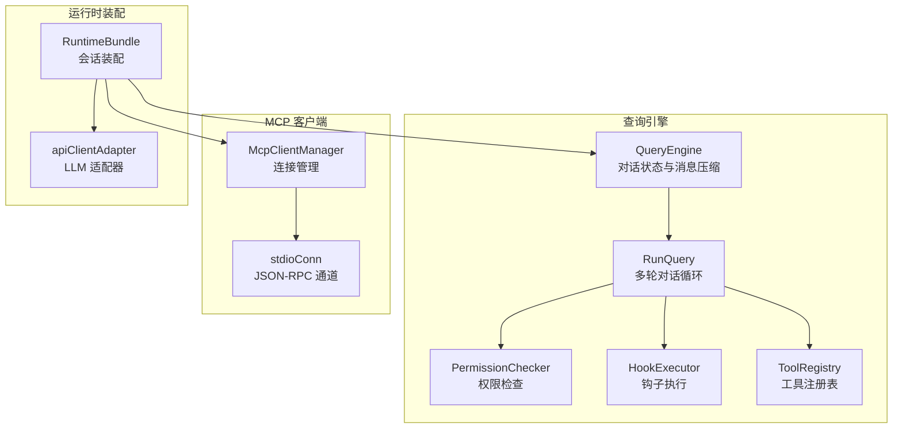
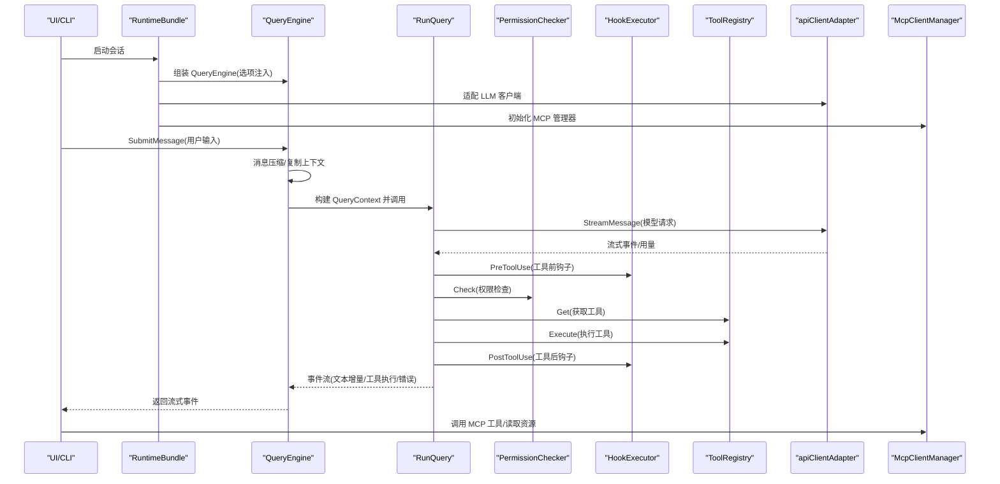
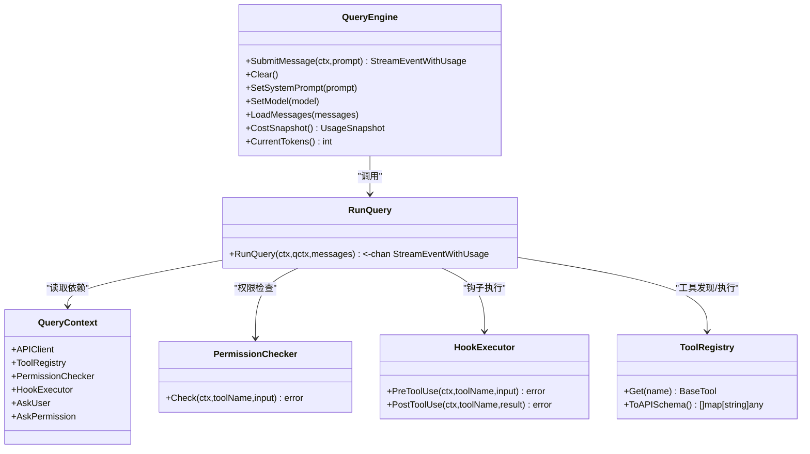
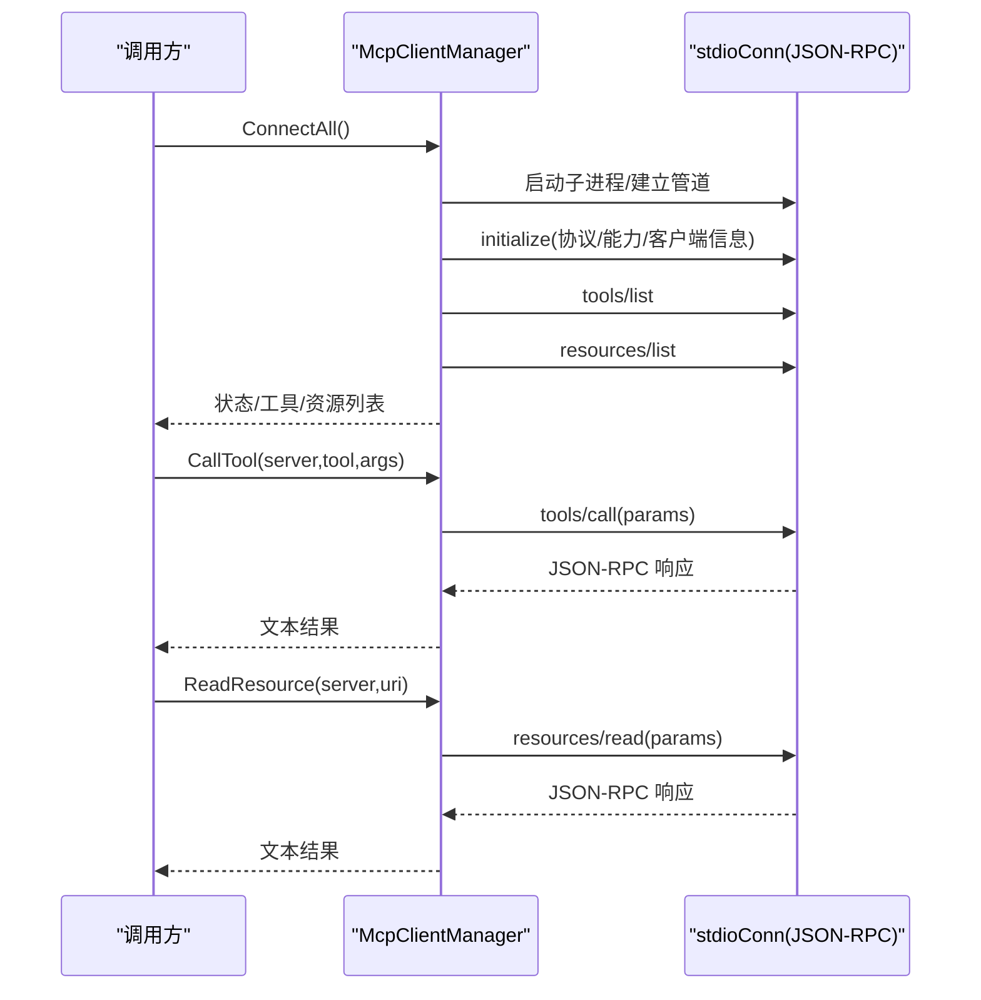
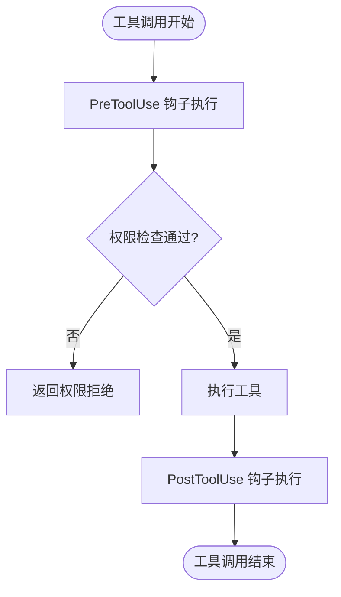
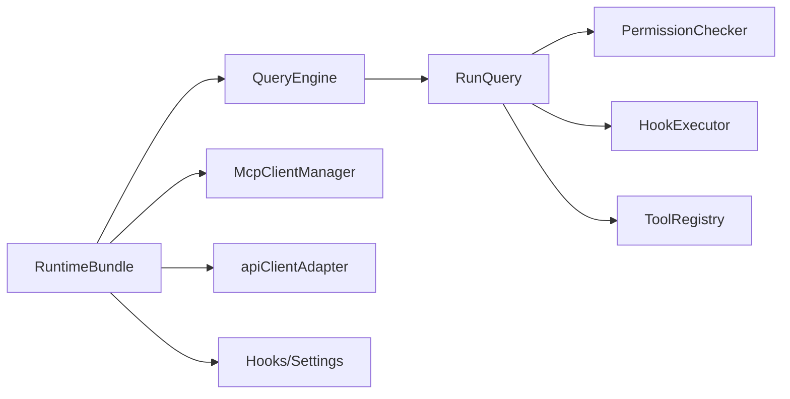

# 装饰器模式

<cite>
**本文引用的文件**
- [pkg/engine/query_engine.go](file://pkg/engine/query_engine.go)
- [pkg/engine/query.go](file://pkg/engine/query.go)
- [pkg/mcp/client.go](file://pkg/mcp/client.go)
- [pkg/hooks/executor.go](file://pkg/hooks/executor.go)
- [pkg/hooks/types.go](file://pkg/hooks/types.go)
- [pkg/permissions/checker.go](file://pkg/permissions/checker.go)
- [pkg/tools/base.go](file://pkg/tools/base.go)
- [pkg/ui/runtime.go](file://pkg/ui/runtime.go)
- [pkg/ui/adapter.go](file://pkg/ui/adapter.go)
- [pkg/config/settings.go](file://pkg/config/settings.go)
- [cmd/openharness/main.go](file://cmd/openharness/main.go)
</cite>

## 目录
1. [引言](#引言)
2. [项目结构](#项目结构)
3. [核心组件](#核心组件)
4. [架构总览](#架构总览)
5. [详细组件分析](#详细组件分析)
6. [依赖分析](#依赖分析)
7. [性能考量](#性能考量)
8. [故障排查指南](#故障排查指南)
9. [结论](#结论)
10. [附录](#附录)

## 引言
本文件系统性阐述 OpenHarness Go 在查询引擎与 MCP 客户端中对“装饰器模式”的应用与实践。我们将从架构视角解析如何通过装饰器增强核心功能：在不改变原有行为的前提下，为查询上下文包装横切关注点（如权限检查、钩子执行、成本统计），以及在 MCP 客户端中以连接管理器为核心进行功能扩展（如工具调用、资源读取）。同时给出装饰器链构建、功能叠加与性能影响的分析，并提供可直接定位到源码的路径指引。

## 项目结构
OpenHarness 的核心能力由以下模块构成：
- 查询引擎：负责对话状态管理、消息压缩、多轮对话循环、工具调用与事件流输出
- MCP 客户端：负责与外部 MCP 服务器建立连接、列举工具与资源、发起工具调用与资源读取
- 钩子系统：提供命令、HTTP、提示词/代理型钩子的统一执行框架
- 权限检查：基于配置的工具与路径规则进行决策
- 工具注册表：集中管理工具的注册、发现与 API Schema 输出
- 运行时装配：将各组件组装为会话级运行时包，注入回调与适配器

**图表来源**
- [pkg/engine/query_engine.go:49-247](file://pkg/engine/query_engine.go#L49-L247)
- [pkg/engine/query.go:122-280](file://pkg/engine/query.go#L122-L280)
- [pkg/mcp/client.go:116-440](file://pkg/mcp/client.go#L116-L440)
- [pkg/ui/runtime.go:25-192](file://pkg/ui/runtime.go#L25-L192)
- [pkg/ui/adapter.go:11-59](file://pkg/ui/adapter.go#L11-L59)

**章节来源**
- [pkg/engine/query_engine.go:1-247](file://pkg/engine/query_engine.go#L1-L247)
- [pkg/engine/query.go:1-331](file://pkg/engine/query.go#L1-L331)
- [pkg/mcp/client.go:1-440](file://pkg/mcp/client.go#L1-L440)
- [pkg/ui/runtime.go:1-284](file://pkg/ui/runtime.go#L1-L284)
- [pkg/ui/adapter.go:1-59](file://pkg/ui/adapter.go#L1-L59)

## 核心组件
- 查询引擎与查询上下文
  - QueryEngine：封装对话历史、消息压缩、并发工具调用、成本统计等；通过 WithXxx 选项注入依赖
  - RunQuery：核心多轮对话循环，负责 LLM 请求、事件流、工具调用与结果聚合
  - QueryContext：承载 APIClient、ToolRegistry、PermissionChecker、HookExecutor 等依赖
- MCP 客户端管理器
  - McpClientManager：管理多个 MCP 服务器连接，提供工具列表、资源列表、工具调用与资源读取
  - stdioConn：单进程 stdio JSON-RPC 通道，序列化写入与顺序响应读取
- 钩子执行器
  - HookExecutor：按事件匹配执行命令、HTTP、提示词/代理型钩子，聚合结果并支持阻断
- 权限检查器
  - PermissionChecker：根据配置决定工具是否允许、是否需要确认或拒绝
- 工具注册表
  - ToolRegistry：线程安全的工具容器，提供 API Schema 输出
- 运行时装配
  - RuntimeBundle：将 API 客户端、MCP 管理器、工具注册表、钩子执行器、查询引擎装配为会话组件

**章节来源**
- [pkg/engine/query_engine.go:49-247](file://pkg/engine/query_engine.go#L49-L247)
- [pkg/engine/query.go:122-331](file://pkg/engine/query.go#L122-L331)
- [pkg/mcp/client.go:116-440](file://pkg/mcp/client.go#L116-L440)
- [pkg/hooks/executor.go:53-336](file://pkg/hooks/executor.go#L53-L336)
- [pkg/permissions/checker.go:25-92](file://pkg/permissions/checker.go#L25-L92)
- [pkg/tools/base.go:81-132](file://pkg/tools/base.go#L81-L132)
- [pkg/ui/runtime.go:25-192](file://pkg/ui/runtime.go#L25-L192)

## 架构总览
下图展示了装饰器模式在查询引擎与 MCP 客户端中的应用：通过接口注入与组合，将横切关注点（权限、钩子、适配器、连接管理）以“装饰”形式叠加在核心流程上，既保持原有功能不变，又实现了模块化的扩展。

**图表来源**
- [pkg/ui/runtime.go:51-192](file://pkg/ui/runtime.go#L51-L192)
- [pkg/engine/query_engine.go:124-205](file://pkg/engine/query_engine.go#L124-L205)
- [pkg/engine/query.go:142-331](file://pkg/engine/query.go#L142-L331)
- [pkg/ui/adapter.go:17-59](file://pkg/ui/adapter.go#L17-L59)
- [pkg/mcp/client.go:197-261](file://pkg/mcp/client.go#L197-L261)

## 详细组件分析

### 查询引擎与查询上下文（装饰器模式）
- 角色与职责
  - QueryEngine：作为“装饰容器”，在提交消息前后进行消息压缩、成本统计与状态更新；通过选项函数注入 HookExecutor、PermissionChecker、AskUser、AskPermission 等依赖
  - RunQuery：核心流程，围绕 LLM 流式响应与工具调用构建事件流；在工具调用前后分别调用 HookExecutor 的 PreToolUse/PostToolUse
  - QueryContext：将 APIClient、ToolRegistry、PermissionChecker、HookExecutor 等依赖打包，形成“上下文装饰层”
- 装饰器链构建
  - 通过 WithXxx 选项函数（如 WithHookExecutor、WithPermissionChecker、WithAskUser、WithAskPermission）将横切关注点逐步叠加到 QueryEngine
  - RunQuery 在执行工具调用时，按序调用权限检查与钩子执行，形成“前置钩子 → 权限检查 → 工具执行 → 后置钩子”的装饰链
- 功能叠加与性能影响
  - 前置钩子与权限检查开销主要取决于外部系统（网络/磁盘/策略评估），工具执行的并发度由 RunQuery 控制
  - 成本统计与消息压缩在关键路径上，需注意锁竞争与内存占用

**图表来源**
- [pkg/engine/query_engine.go:49-247](file://pkg/engine/query_engine.go#L49-L247)
- [pkg/engine/query.go:122-331](file://pkg/engine/query.go#L122-L331)
- [pkg/permissions/checker.go:72-81](file://pkg/permissions/checker.go#L72-L81)
- [pkg/hooks/executor.go:86-90](file://pkg/hooks/executor.go#L86-L90)
- [pkg/tools/base.go:104-131](file://pkg/tools/base.go#L104-L131)

**章节来源**
- [pkg/engine/query_engine.go:70-122](file://pkg/engine/query_engine.go#L70-L122)
- [pkg/engine/query.go:286-325](file://pkg/engine/query.go#L286-L325)

### MCP 客户端（连接管理与功能扩展）
- 角色与职责
  - McpClientManager：核心“装饰容器”，负责连接生命周期管理、状态聚合、工具与资源列表收集；对外暴露 CallTool、ReadResource 等方法
  - stdioConn：底层 JSON-RPC 通道，负责请求序列化、写入串行化与顺序响应读取
- 装饰器链构建
  - 通过 ConnectAll 建立连接，随后在调用阶段按服务器名称路由至对应 stdioConn；在 CallTool/ReadResource 内部完成参数封装与响应解析
- 功能叠加与性能影响
  - 连接建立与初始化包含一次“initialize”与两次列表请求；后续调用为顺序阻塞读取，适合串行场景；并发调用可通过外部 goroutine 实现

**图表来源**
- [pkg/mcp/client.go:134-195](file://pkg/mcp/client.go#L134-L195)
- [pkg/mcp/client.go:296-373](file://pkg/mcp/client.go#L296-L373)
- [pkg/mcp/client.go:197-261](file://pkg/mcp/client.go#L197-L261)

**章节来源**
- [pkg/mcp/client.go:116-440](file://pkg/mcp/client.go#L116-L440)

### 钩子执行器（横切关注点的模块化处理）
- 角色与职责
  - HookExecutor：按事件类型与匹配规则执行命令、HTTP、提示词/代理型钩子，聚合结果并支持失败阻断
  - HookRegistry：维护钩子定义集合，按事件筛选匹配
- 装饰器链构建
  - 在工具调用前后分别触发 PreToolUse/PostToolUse，钩子执行器按注册顺序依次执行，最终汇总结果
- 性能与可靠性
  - 钩子执行可能引入网络/命令执行延迟；建议合理设置超时与阻断策略

**图表来源**
- [pkg/engine/query.go:291-318](file://pkg/engine/query.go#L291-L318)
- [pkg/hooks/executor.go:67-105](file://pkg/hooks/executor.go#L67-L105)

**章节来源**
- [pkg/hooks/executor.go:53-336](file://pkg/hooks/executor.go#L53-L336)
- [pkg/hooks/types.go:1-44](file://pkg/hooks/types.go#L1-L44)

### 权限检查（策略装饰）
- 角色与职责
  - PermissionChecker：根据配置的模式、工具白/黑名单、路径规则与命令模式进行决策
- 装饰器链构建
  - 在工具调用前由 RunQuery 调用 Check，形成“策略装饰层”
- 性能与灵活性
  - 规则匹配为字符串比较与通配符匹配，复杂度较低；可在配置层面灵活调整策略

**章节来源**
- [pkg/permissions/checker.go:25-92](file://pkg/permissions/checker.go#L25-L92)
- [pkg/engine/query.go:302-306](file://pkg/engine/query.go#L302-L306)

### 工具注册表（API Schema 装饰）
- 角色与职责
  - ToolRegistry：集中管理工具，提供 API Schema 输出，供 LLM 请求时注入可用工具列表
- 装饰器链构建
  - RunQuery 在每次请求中读取 ToolRegistry.ToAPISchema()，形成“工具装饰层”
- 性能与扩展性
  - API Schema 生成为 O(n) 操作，n 为已注册工具数量；并发安全通过读写锁保障

**章节来源**
- [pkg/tools/base.go:81-132](file://pkg/tools/base.go#L81-L132)
- [pkg/engine/query.go:167-168](file://pkg/engine/query.go#L167-L168)

### 运行时装配（适配器与回调装饰）
- 角色与职责
  - RuntimeBundle：将 API 客户端、MCP 管理器、工具注册表、钩子执行器、查询引擎装配为会话组件
  - apiClientAdapter：将具体 API 客户端适配为 StreamingLLMClient 接口，形成“适配器装饰层”
  - WithHITLCallbacks：注入 AskUser/AskPermission 回调，形成“交互装饰层”
- 装饰器链构建
  - 通过选项函数与适配器，将外部能力无缝接入核心流程

**章节来源**
- [pkg/ui/runtime.go:25-192](file://pkg/ui/runtime.go#L25-L192)
- [pkg/ui/adapter.go:11-59](file://pkg/ui/adapter.go#L11-L59)
- [cmd/openharness/main.go:165-231](file://cmd/openharness/main.go#L165-L231)

## 依赖分析
- 组件耦合与内聚
  - QueryEngine 与 RunQuery 通过 QueryContext 解耦，降低耦合度；权限检查与钩子执行作为可插拔装饰器
  - McpClientManager 与 stdioConn 通过名称映射解耦，便于扩展其他传输类型
- 外部依赖与集成点
  - LLM 客户端通过 apiClientAdapter 抽象，支持不同供应商
  - 配置系统通过 Settings 提供默认值与环境变量覆盖，便于部署

**图表来源**
- [pkg/engine/query_engine.go:49-122](file://pkg/engine/query_engine.go#L49-L122)
- [pkg/engine/query.go:122-168](file://pkg/engine/query.go#L122-L168)
- [pkg/ui/runtime.go:51-192](file://pkg/ui/runtime.go#L51-L192)
- [pkg/mcp/client.go:116-195](file://pkg/mcp/client.go#L116-L195)
- [pkg/config/settings.go:97-142](file://pkg/config/settings.go#L97-L142)

**章节来源**
- [pkg/engine/query_engine.go:1-247](file://pkg/engine/query_engine.go#L1-L247)
- [pkg/engine/query.go:1-331](file://pkg/engine/query.go#L1-L331)
- [pkg/mcp/client.go:1-440](file://pkg/mcp/client.go#L1-L440)
- [pkg/ui/runtime.go:1-284](file://pkg/ui/runtime.go#L1-L284)
- [pkg/config/settings.go:1-212](file://pkg/config/settings.go#L1-L212)

## 性能考量
- 查询引擎
  - 成本统计与消息压缩在关键路径上，建议在高并发场景下减少不必要的复制与锁竞争
  - 工具调用并发度由 WaitGroup 控制，建议根据资源限制调整最大并发
- MCP 客户端
  - JSON-RPC 读取为顺序阻塞，建议在调用侧使用 goroutine 并发以提升吞吐
  - 连接建立包含初始化与列表请求，建议缓存工具/资源清单以减少重复请求
- 钩子执行
  - 命令与 HTTP 钩子可能引入显著延迟，建议设置合理的超时与重试策略

[本节为通用性能讨论，无需特定文件来源]

## 故障排查指南
- 查询引擎
  - 若出现“LLM 流未完整结束”错误，检查 LLM 客户端适配器是否正确转换消息完成事件
  - 工具调用失败时，优先检查权限检查与钩子执行器返回的错误信息
- MCP 客户端
  - “服务器未连接”错误：确认 ConnectAll 是否成功，检查 stdio 进程启动与初始化响应
  - JSON-RPC 错误：检查请求参数与响应解析逻辑
- 钩子执行
  - 命令钩子返回非零退出码：查看标准错误输出与阻断标志
  - HTTP 钩子返回非 2xx：检查状态码与响应体

**章节来源**
- [pkg/engine/query.go:173-206](file://pkg/engine/query.go#L173-L206)
- [pkg/mcp/client.go:267-275](file://pkg/mcp/client.go#L267-L275)
- [pkg/hooks/executor.go:111-151](file://pkg/hooks/executor.go#L111-L151)
- [pkg/hooks/executor.go:157-206](file://pkg/hooks/executor.go#L157-L206)

## 结论
OpenHarness 通过装饰器模式将横切关注点（权限、钩子、适配器、连接管理）以可插拔的方式叠加在核心流程之上，在不破坏原有功能的前提下实现了模块化扩展。查询引擎与 MCP 客户端分别在“工具调用链”与“连接管理链”上体现了装饰器思想：前者通过上下文与接口注入实现功能叠加，后者通过管理器与通道抽象实现能力扩展。该设计提升了系统的可维护性、可测试性与可扩展性。

[本节为总结性内容，无需特定文件来源]

## 附录
- 具体使用示例（代码路径）
  - 创建查询引擎并注入钩子执行器与权限检查器
    - [pkg/ui/runtime.go:162-178](file://pkg/ui/runtime.go#L162-L178)
    - [pkg/engine/query_engine.go:78-96](file://pkg/engine/query_engine.go#L78-L96)
  - 执行一次查询并消费事件流
    - [pkg/engine/query_engine.go:124-205](file://pkg/engine/query_engine.go#L124-L205)
    - [pkg/engine/query.go:142-280](file://pkg/engine/query.go#L142-L280)
  - 调用 MCP 工具与读取资源
    - [pkg/mcp/client.go:197-261](file://pkg/mcp/client.go#L197-L261)
  - 注册命令/HTTP/提示词钩子并执行
    - [pkg/hooks/executor.go:67-105](file://pkg/hooks/executor.go#L67-L105)
    - [pkg/hooks/executor.go:111-206](file://pkg/hooks/executor.go#L111-L206)
  - 权限检查决策
    - [pkg/permissions/checker.go:41-82](file://pkg/permissions/checker.go#L41-L82)
  - 工具注册与 API Schema 输出
    - [pkg/tools/base.go:92-131](file://pkg/tools/base.go#L92-L131)
  - 运行时装配与适配器
    - [pkg/ui/runtime.go:51-192](file://pkg/ui/runtime.go#L51-L192)
    - [pkg/ui/adapter.go:17-59](file://pkg/ui/adapter.go#L17-L59)
  - CLI 子命令与 MCP 管理
    - [cmd/openharness/main.go:165-231](file://cmd/openharness/main.go#L165-L231)

[本节为附录内容，无需特定文件来源]