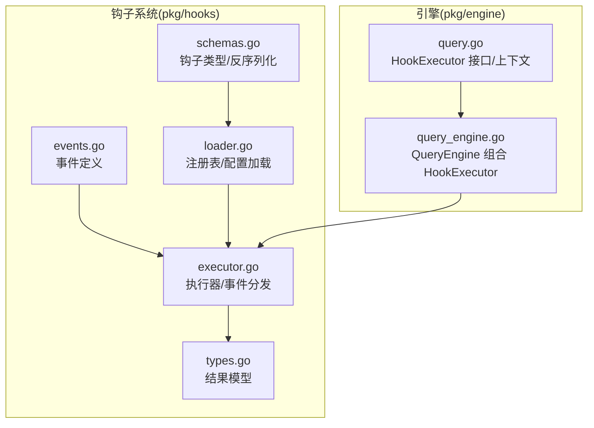
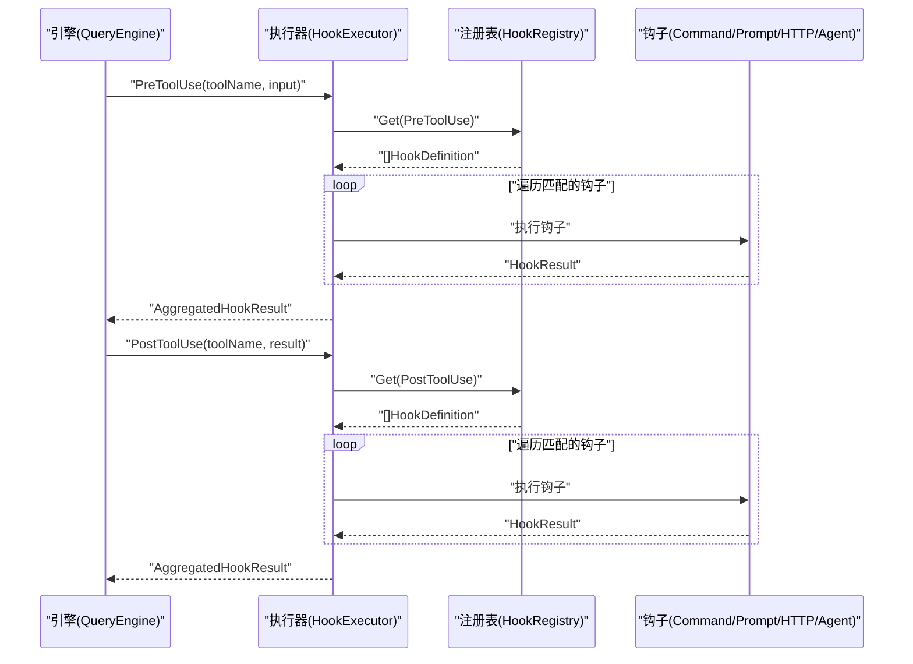
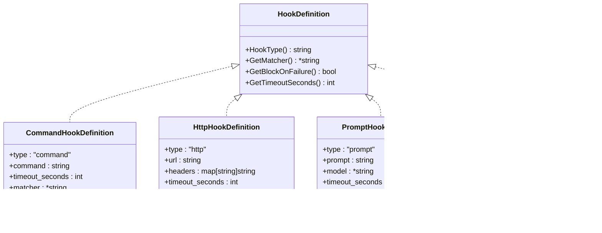
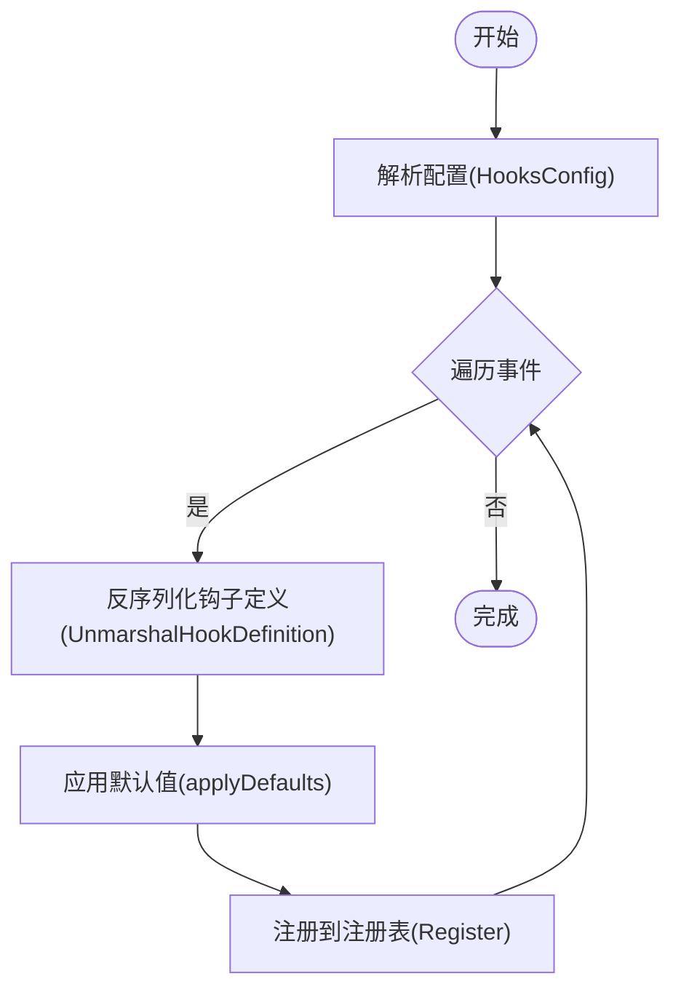
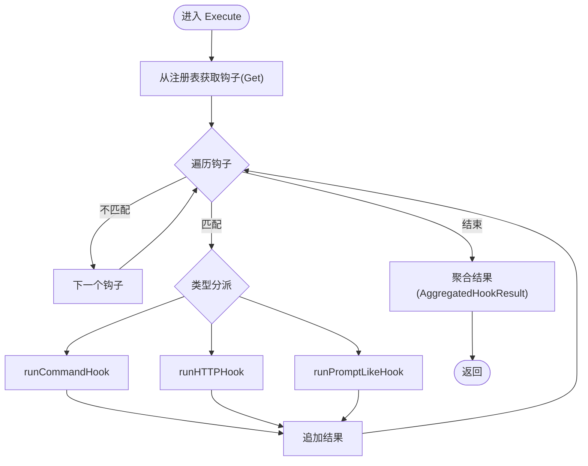
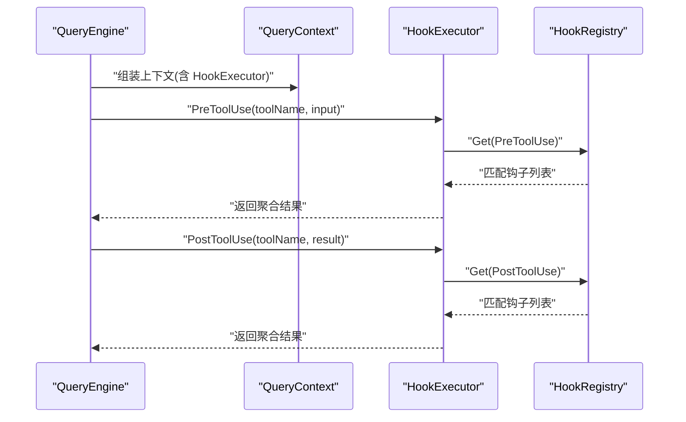
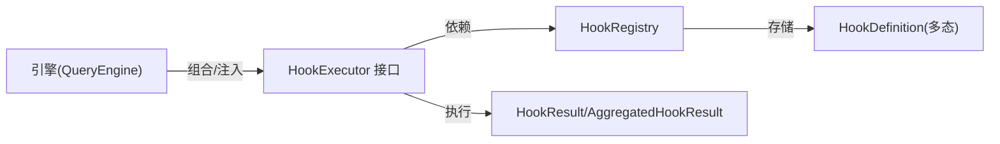

# 观察者模式

<cite>
**本文引用的文件**
- [pkg/hooks/executor.go](file://pkg/hooks/executor.go)
- [pkg/hooks/events.go](file://pkg/hooks/events.go)
- [pkg/hooks/types.go](file://pkg/hooks/types.go)
- [pkg/hooks/schemas.go](file://pkg/hooks/schemas.go)
- [pkg/hooks/loader.go](file://pkg/hooks/loader.go)
- [pkg/engine/query.go](file://pkg/engine/query.go)
- [pkg/engine/query_engine.go](file://pkg/engine/query_engine.go)
- [pkg/state/store.go](file://pkg/state/store.go)
- [pkg/tui/runtime.go](file://pkg/tui/runtime.go)
</cite>

## 目录
1. [引言](#引言)
2. [项目结构](#项目结构)
3. [核心组件](#核心组件)
4. [架构总览](#架构总览)
5. [详细组件分析](#详细组件分析)
6. [依赖分析](#依赖分析)
7. [性能考量](#性能考量)
8. [故障排查指南](#故障排查指南)
9. [结论](#结论)
10. [附录](#附录)

## 引言
本文件围绕 OpenHarness Go 的钩子系统（HookExecutor）展开，系统性阐述其在“观察者模式”下的实现与应用。钩子系统通过事件驱动的方式，将工具调用生命周期中的关键节点（如预执行、后执行、错误、通知等）作为“事件”，允许外部以“钩子”的形式订阅这些事件，并在事件发生时被通知执行。这种设计实现了引擎与外部扩展之间的松耦合通信：引擎无需关心钩子的具体实现，只需在合适的时机触发事件；而钩子则专注于各自职责（命令、HTTP、提示词或智能体评估），彼此独立演进。

## 项目结构
钩子系统位于 pkg/hooks 目录，核心由以下模块组成：
- 事件定义：定义可触发的生命周期事件类型
- 钩子类型与反序列化：定义不同类型的钩子及其 JSON 反序列化策略
- 注册表：按事件分组存储钩子定义
- 执行器：根据事件与匹配条件执行钩子，聚合结果
- 结果模型：统一描述单个钩子与聚合结果的状态

此外，引擎层（pkg/engine）通过接口注入 HookExecutor，在工具调用前后触发对应事件，形成“观察者”与“被观察对象”的协作关系。

**图表来源**
- [pkg/hooks/events.go:1-35](file://pkg/hooks/events.go#L1-L35)
- [pkg/hooks/schemas.go:1-182](file://pkg/hooks/schemas.go#L1-L182)
- [pkg/hooks/loader.go:1-90](file://pkg/hooks/loader.go#L1-L90)
- [pkg/hooks/executor.go:1-336](file://pkg/hooks/executor.go#L1-L336)
- [pkg/hooks/types.go:1-44](file://pkg/hooks/types.go#L1-L44)
- [pkg/engine/query.go:87-136](file://pkg/engine/query.go#L87-L136)
- [pkg/engine/query_engine.go:48-122](file://pkg/engine/query_engine.go#L48-L122)

**章节来源**
- [pkg/hooks/events.go:1-35](file://pkg/hooks/events.go#L1-L35)
- [pkg/hooks/schemas.go:1-182](file://pkg/hooks/schemas.go#L1-L182)
- [pkg/hooks/loader.go:1-90](file://pkg/hooks/loader.go#L1-L90)
- [pkg/hooks/executor.go:1-336](file://pkg/hooks/executor.go#L1-L336)
- [pkg/hooks/types.go:1-44](file://pkg/hooks/types.go#L1-L44)
- [pkg/engine/query.go:87-136](file://pkg/engine/query.go#L87-L136)
- [pkg/engine/query_engine.go:48-122](file://pkg/engine/query_engine.go#L48-L122)

## 核心组件
- 事件类型（HookEvent）：定义了 pre_tool_use、post_tool_use、on_error、on_notification 等生命周期事件，用于标识钩子触发点。
- 钩子定义（HookDefinition 及其实现）：支持命令型、HTTP 型、提示词型、智能体型钩子，均实现统一接口以供执行器识别与调度。
- 注册表（HookRegistry）：线程安全地按事件分组存储钩子定义，提供注册与查询能力。
- 执行器（HookExecutor）：接收事件与载荷，筛选匹配钩子，按类型执行，汇总结果并返回。
- 结果模型（HookResult、AggregatedHookResult）：标准化钩子执行结果，包含成功与否、输出、是否阻塞以及阻塞原因等信息。

**章节来源**
- [pkg/hooks/events.go:3-34](file://pkg/hooks/events.go#L3-L34)
- [pkg/hooks/schemas.go:9-181](file://pkg/hooks/schemas.go#L9-L181)
- [pkg/hooks/loader.go:9-35](file://pkg/hooks/loader.go#L9-L35)
- [pkg/hooks/executor.go:53-105](file://pkg/hooks/executor.go#L53-L105)
- [pkg/hooks/types.go:3-43](file://pkg/hooks/types.go#L3-L43)

## 架构总览
钩子系统采用“事件发布-订阅-通知”的观察者模式：
- 发布方：引擎在工具调用生命周期的关键节点触发事件（例如 PreToolUse、PostToolUse）。
- 订阅方：用户通过配置注册多种类型的钩子，每个钩子定义包含事件名、匹配规则、超时与阻断策略等。
- 通知方：执行器根据事件与匹配条件筛选钩子，依次执行，收集结果并决定是否阻断后续流程。

**图表来源**
- [pkg/engine/query_engine.go:78-81](file://pkg/engine/query_engine.go#L78-L81)
- [pkg/engine/query.go:291-318](file://pkg/engine/query.go#L291-L318)
- [pkg/hooks/executor.go:70-105](file://pkg/hooks/executor.go#L70-L105)
- [pkg/hooks/loader.go:29-35](file://pkg/hooks/loader.go#L29-L35)

## 详细组件分析

### 事件与事件有效性校验
- 事件类型为字符串枚举，提供 IsValid 与 String 方法，确保事件名称合法且可打印。
- 支持的事件包括：pre_tool_use、post_tool_use、on_error、on_notification。

**章节来源**
- [pkg/hooks/events.go:3-34](file://pkg/hooks/events.go#L3-L34)

### 钩子类型与反序列化
- HookDefinition 接口统一了钩子类型、匹配器、阻断策略与超时等元数据。
- 四种具体钩子类型：
  - 命令型：通过 bash 执行自定义命令，环境变量携带事件与载荷。
  - HTTP 型：向指定 URL 发送 JSON 载荷，支持自定义请求头。
  - 提示词型：构造系统消息与用户消息，调用 LLM 判定条件是否满足。
  - 智能体型：与提示词型类似，但允许工具调用，适合更复杂的决策。
- UnmarshalHookDefinition 根据 type 字段动态反序列化到具体类型，并设置默认值（如超时、头部、阻断策略）。

**图表来源**
- [pkg/hooks/schemas.go:9-181](file://pkg/hooks/schemas.go#L9-L181)

**章节来源**
- [pkg/hooks/schemas.go:9-181](file://pkg/hooks/schemas.go#L9-L181)

### 注册表与配置加载
- HookRegistry 使用读写锁保护，按事件名分组存储钩子定义，提供 Register 与 Get。
- HooksConfig 将事件名映射到原始 JSON 数组，FromSettings 解析并应用默认值，最终构建注册表。

**图表来源**
- [pkg/hooks/loader.go:42-65](file://pkg/hooks/loader.go#L42-L65)
- [pkg/hooks/schemas.go:105-181](file://pkg/hooks/schemas.go#L105-L181)

**章节来源**
- [pkg/hooks/loader.go:9-35](file://pkg/hooks/loader.go#L9-L35)
- [pkg/hooks/loader.go:42-65](file://pkg/hooks/loader.go#L42-L65)

### 执行器与事件分发
- HookExecutor.Execute 接收事件与载荷，从注册表取出该事件的所有钩子，按匹配器过滤，再按类型分派到具体执行函数。
- 对于命令型与 HTTP 型钩子，执行前设置超时上下文；对于 LLM 型钩子，注入系统消息与用户消息，解析 LLM 输出并判定是否通过。
- 执行结果统一封装为 HookResult，并聚合为 AggregatedHookResult 返回。

**图表来源**
- [pkg/hooks/executor.go:70-105](file://pkg/hooks/executor.go#L70-L105)
- [pkg/hooks/executor.go:111-206](file://pkg/hooks/executor.go#L111-L206)
- [pkg/hooks/executor.go:212-269](file://pkg/hooks/executor.go#L212-L269)

**章节来源**
- [pkg/hooks/executor.go:53-105](file://pkg/hooks/executor.go#L53-L105)
- [pkg/hooks/executor.go:111-206](file://pkg/hooks/executor.go#L111-L206)
- [pkg/hooks/executor.go:212-269](file://pkg/hooks/executor.go#L212-L269)

### 引擎集成与事件触发
- QueryEngine 通过 WithHookExecutor 注入 HookExecutor，并在 QueryContext 中携带该接口。
- 在工具调用前后，引擎分别调用 HookExecutor.PreToolUse 与 HookExecutor.PostToolUse，从而触发相应事件的钩子执行。
- 若钩子返回阻断标记，则引擎可据此中断后续流程。

**图表来源**
- [pkg/engine/query_engine.go:78-81](file://pkg/engine/query_engine.go#L78-L81)
- [pkg/engine/query.go:291-318](file://pkg/engine/query.go#L291-L318)

**章节来源**
- [pkg/engine/query_engine.go:78-81](file://pkg/engine/query_engine.go#L78-L81)
- [pkg/engine/query.go:291-318](file://pkg/engine/query.go#L291-L318)

### 结果模型与阻断语义
- HookResult 描述单个钩子的执行结果，包含类型、成功标志、输出、阻断标志与原因等。
- AggregatedHookResult 聚合所有钩子结果，并提供 IsBlocked 与 BlockReason 辅助判断是否需要阻断。

**章节来源**
- [pkg/hooks/types.go:3-43](file://pkg/hooks/types.go#L3-L43)

### 与状态管理的类比（观察者模式对比）
虽然状态管理（AppStateStore）使用的是“观察者模式”的另一种实现（订阅回调），但钩子系统体现的是“事件驱动的观察者”思想：事件作为主题，钩子作为观察者，执行器负责通知与聚合。两者都强调解耦与可扩展性。

**章节来源**
- [pkg/state/store.go:49-101](file://pkg/state/store.go#L49-L101)

## 依赖分析
- 低耦合：引擎仅依赖 HookExecutor 接口，不关心具体钩子类型与实现细节。
- 可插拔：通过注册表与配置加载，用户可自由增删钩子，不影响引擎核心逻辑。
- 并发安全：注册表使用读写锁，保证并发注册与查询的安全性。
- 类型安全：通过接口与 JSON 反序列化策略，确保钩子类型与字段一致性。

**图表来源**
- [pkg/engine/query_engine.go:48-122](file://pkg/engine/query_engine.go#L48-L122)
- [pkg/hooks/loader.go:9-35](file://pkg/hooks/loader.go#L9-L35)
- [pkg/hooks/types.go:3-43](file://pkg/hooks/types.go#L3-L43)

**章节来源**
- [pkg/engine/query_engine.go:48-122](file://pkg/engine/query_engine.go#L48-L122)
- [pkg/hooks/loader.go:9-35](file://pkg/hooks/loader.go#L9-L35)
- [pkg/hooks/types.go:3-43](file://pkg/hooks/types.go#L3-L43)

## 性能考量
- 并发执行：钩子执行在单次事件内串行进行，避免竞争；若需并行，可在钩子内部自行控制 goroutine（当前实现未强制并行）。
- 超时控制：命令与 HTTP 钩子均基于上下文超时，防止阻塞影响主流程。
- LLM 调用：提示词/智能体钩子会发起外部 LLM 请求，应合理设置超时与重试策略。
- 匹配开销：匹配器使用通配符匹配，建议在 payload 中提供明确的 tool_name，减少不必要的全量执行。
- 资源释放：HTTP 请求完成后及时关闭响应体，命令执行完成后清理缓冲区。

[本节为通用性能建议，不直接分析特定文件]

## 故障排查指南
- 钩子未触发
  - 检查事件名称是否正确（见事件定义）。
  - 检查钩子的匹配器是否与 payload 中的 tool_name 匹配。
- 命令钩子失败
  - 查看命令退出码与标准错误输出。
  - 确认工作目录与环境变量是否正确传递。
- HTTP 钩子失败
  - 检查 URL、请求头与响应状态码。
  - 关注网络超时与连接错误。
- LLM 钩子失败
  - 确认 APIClient 已注入且可用。
  - 检查模型名称与系统消息格式。
- 阻断行为
  - 若任一钩子标记阻断，聚合结果将指示阻断并给出原因，引擎可根据此决定是否继续。

**章节来源**
- [pkg/hooks/executor.go:111-151](file://pkg/hooks/executor.go#L111-L151)
- [pkg/hooks/executor.go:157-206](file://pkg/hooks/executor.go#L157-L206)
- [pkg/hooks/executor.go:212-269](file://pkg/hooks/executor.go#L212-L269)
- [pkg/hooks/types.go:24-43](file://pkg/hooks/types.go#L24-L43)

## 结论
OpenHarness Go 的钩子系统以“事件驱动 + 观察者模式”为核心，实现了引擎与外部扩展之间的松耦合协作。通过事件定义、钩子类型、注册表与执行器的清晰分工，系统具备良好的扩展性与可维护性：新增钩子类型无需修改引擎，新增事件也只需扩展事件枚举与执行路径。同时，统一的结果模型与阻断语义使得钩子的控制流更加可控与可观测。

[本节为总结性内容，不直接分析特定文件]

## 附录
- 事件与钩子类型一览
  - 事件：pre_tool_use、post_tool_use、on_error、on_notification
  - 钩子：command、http、prompt、agent
- 典型使用场景
  - 预执行钩子：权限校验、审计日志、资源准备
  - 后执行钩子：结果归档、通知上报、缓存更新
  - 错误钩子：异常捕获、告警推送
  - 通知钩子：状态广播、UI 更新

[本节为概览性内容，不直接分析特定文件]