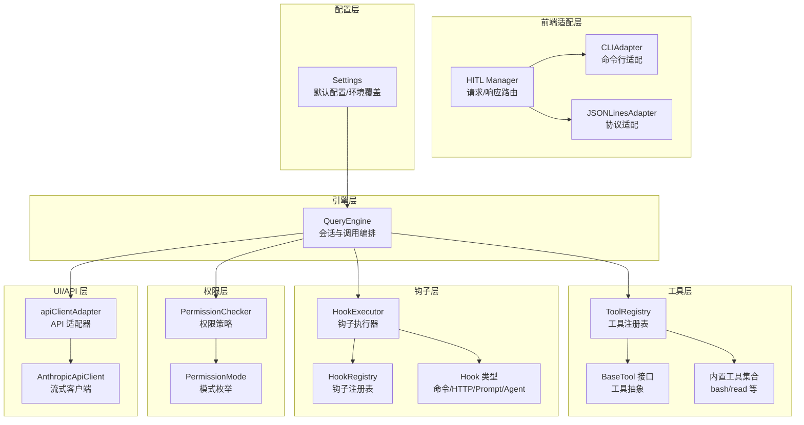
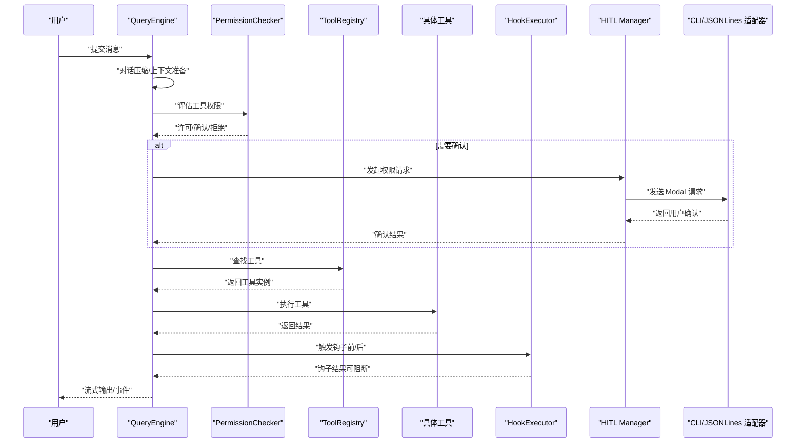
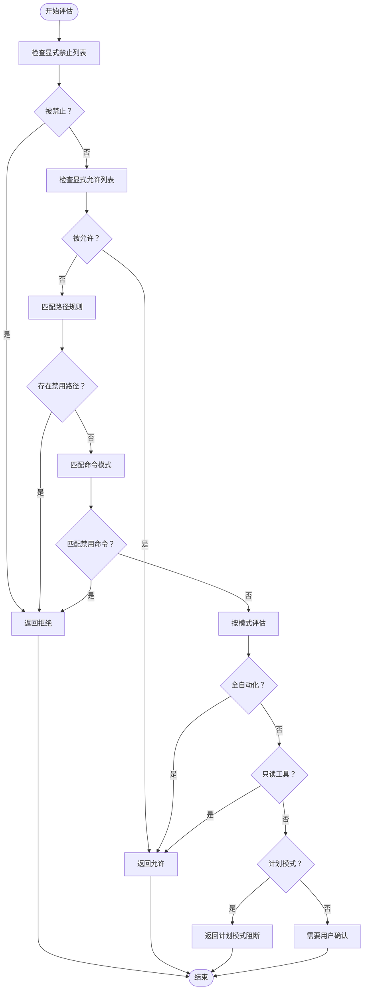
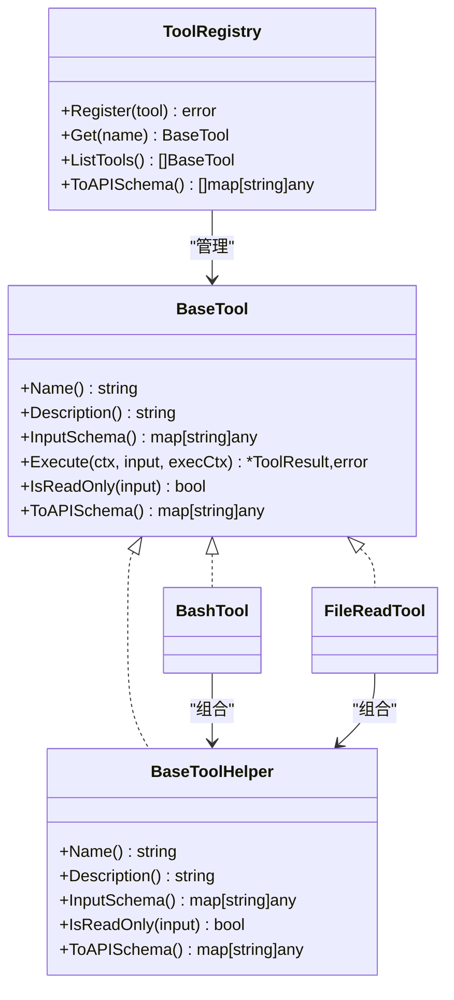
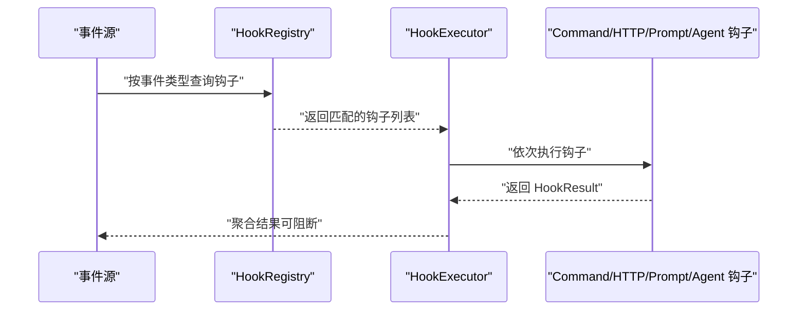
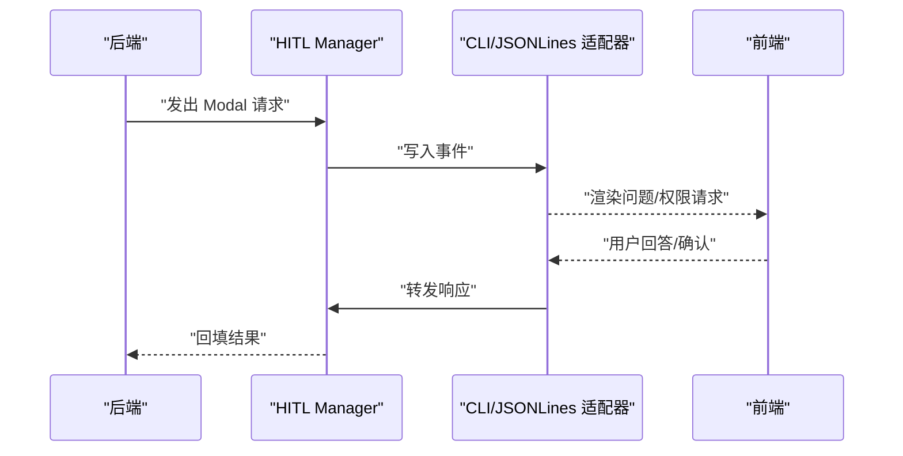
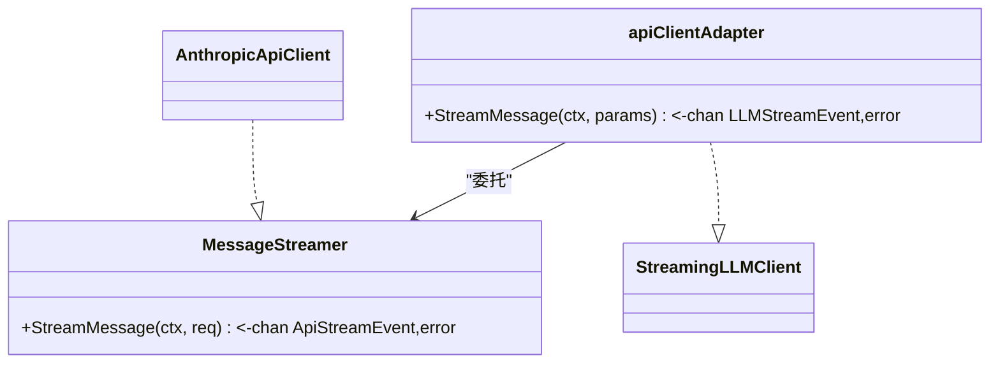
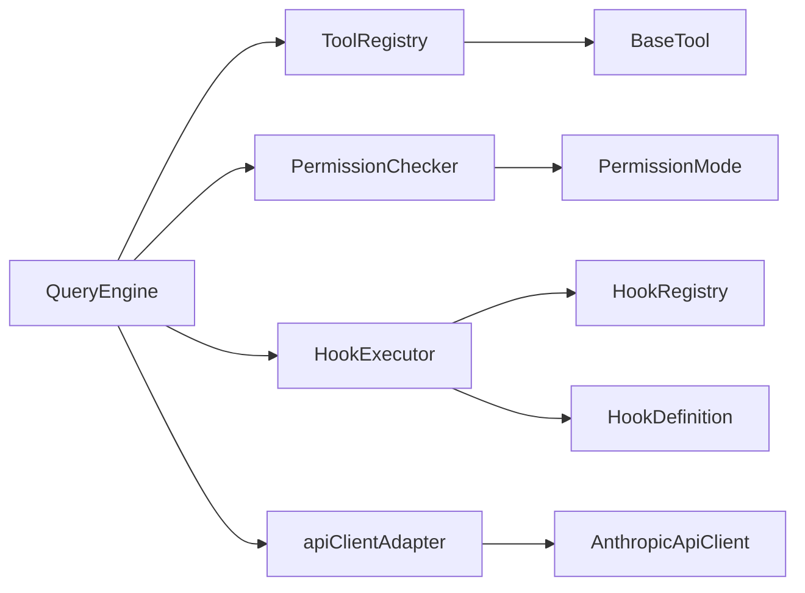

# 设计模式应用

<cite>
**本文引用的文件**
- [pkg/permissions/checker.go](file://pkg/permissions/checker.go)
- [pkg/permissions/modes.go](file://pkg/permissions/modes.go)
- [pkg/config/settings.go](file://pkg/config/settings.go)
- [pkg/tools/base.go](file://pkg/tools/base.go)
- [pkg/tools/builtin/register.go](file://pkg/tools/builtin/register.go)
- [pkg/tools/builtin/bash.go](file://pkg/tools/builtin/bash.go)
- [pkg/tools/builtin/file_read.go](file://pkg/tools/builtin/file_read.go)
- [pkg/hitl/manager.go](file://pkg/hitl/manager.go)
- [pkg/hitl/cli_adapter.go](file://pkg/hitl/cli_adapter.go)
- [pkg/hitl/jsonlines_adapter.go](file://pkg/hitl/jsonlines_adapter.go)
- [pkg/hooks/events.go](file://pkg/hooks/events.go)
- [pkg/hooks/types.go](file://pkg/hooks/types.go)
- [pkg/hooks/loader.go](file://pkg/hooks/loader.go)
- [pkg/hooks/executor.go](file://pkg/hooks/executor.go)
- [pkg/ui/adapter.go](file://pkg/ui/adapter.go)
- [pkg/api/client.go](file://pkg/api/client.go)
- [pkg/engine/query_engine.go](file://pkg/engine/query_engine.go)
</cite>

## 目录
1. [引言](#引言)
2. [项目结构](#项目结构)
3. [核心组件](#核心组件)
4. [架构总览](#架构总览)
5. [详细组件分析](#详细组件分析)
6. [依赖关系分析](#依赖关系分析)
7. [性能考量](#性能考量)
8. [故障排查指南](#故障排查指南)
9. [结论](#结论)
10. [附录](#附录)

## 引言
本文件系统性梳理 OpenHarness Go 在运行时与工具执行层面所采用的设计模式，重点覆盖以下方面：
- 策略模式：权限检查（基于配置与模式的动态决策）
- 工厂模式：工具注册与创建（统一注册表与便捷工厂函数）
- 观察者模式：钩子事件（事件驱动的扩展点）
- 适配器模式：前端交互适配（CLI 与 JSON-Lines 协议适配）
- 其他协同模式：接口抽象、适配器、流式处理与并发安全

通过对代码级实现的逐层解析，帮助开发者在不直接阅读源码的情况下，快速掌握各模块职责、数据流与协作关系，并提供可复用的实践建议。

## 项目结构
OpenHarness Go 以“引擎 + 工具 + 钩子 + 权限 + 前端适配”的分层组织代码。核心路径如下：
- 引擎层：pkg/engine/query_engine.go 负责对话状态管理、调用 LLM、编排工具与钩子
- 工具层：pkg/tools/* 定义工具抽象、注册表与内置工具
- 钩子层：pkg/hooks/* 提供事件定义、注册表、执行器与加载器
- 权限层：pkg/permissions/* 实现策略化的权限判定
- 前端适配层：pkg/hitl/* 提供 CLI 与 JSON-Lines 两种前端适配
- UI 层：pkg/ui/* 将外部 API 客户端适配为引擎可用的流式接口
- API 层：pkg/api/* 提供外部模型服务的客户端与流式解析
- 配置层：pkg/config/* 提供默认配置与环境变量覆盖

图表来源
- [pkg/engine/query_engine.go:49-122](file://pkg/engine/query_engine.go#L49-L122)
- [pkg/tools/base.go:51-131](file://pkg/tools/base.go#L51-L131)
- [pkg/hooks/executor.go:53-105](file://pkg/hooks/executor.go#L53-L105)
- [pkg/hooks/loader.go:9-35](file://pkg/hooks/loader.go#L9-L35)
- [pkg/permissions/checker.go:23-82](file://pkg/permissions/checker.go#L23-L82)
- [pkg/permissions/modes.go:4-17](file://pkg/permissions/modes.go#L4-L17)
- [pkg/hitl/manager.go:11-26](file://pkg/hitl/manager.go#L11-L26)
- [pkg/hitl/cli_adapter.go:12-20](file://pkg/hitl/cli_adapter.go#L12-L20)
- [pkg/hitl/jsonlines_adapter.go:14-32](file://pkg/hitl/jsonlines_adapter.go#L14-L32)
- [pkg/ui/adapter.go:11-59](file://pkg/ui/adapter.go#L11-L59)
- [pkg/api/client.go:85-104](file://pkg/api/client.go#L85-L104)
- [pkg/config/settings.go:97-142](file://pkg/config/settings.go#L97-L142)

章节来源
- [pkg/engine/query_engine.go:49-122](file://pkg/engine/query_engine.go#L49-L122)
- [pkg/tools/base.go:51-131](file://pkg/tools/base.go#L51-L131)
- [pkg/hooks/executor.go:53-105](file://pkg/hooks/executor.go#L53-L105)
- [pkg/hooks/loader.go:9-35](file://pkg/hooks/loader.go#L9-L35)
- [pkg/permissions/checker.go:23-82](file://pkg/permissions/checker.go#L23-L82)
- [pkg/permissions/modes.go:4-17](file://pkg/permissions/modes.go#L4-L17)
- [pkg/hitl/manager.go:11-26](file://pkg/hitl/manager.go#L11-L26)
- [pkg/hitl/cli_adapter.go:12-20](file://pkg/hitl/cli_adapter.go#L12-L20)
- [pkg/hitl/jsonlines_adapter.go:14-32](file://pkg/hitl/jsonlines_adapter.go#L14-L32)
- [pkg/ui/adapter.go:11-59](file://pkg/ui/adapter.go#L11-L59)
- [pkg/api/client.go:85-104](file://pkg/api/client.go#L85-L104)
- [pkg/config/settings.go:97-142](file://pkg/config/settings.go#L97-L142)

## 核心组件
- 权限检查器（策略模式）：根据配置与模式动态决定工具是否允许执行，支持显式白名单/黑名单、路径规则与命令模式匹配。
- 工具注册表（工厂模式）：集中注册与检索工具实例；提供便捷工厂函数批量注册内置工具。
- 钩子执行器（观察者模式）：按事件类型分发执行命令、HTTP 请求或 LLM 判定型钩子，支持阻断与聚合结果。
- 前端适配器（适配器模式）：将后端事件转换为 CLI 或 JSON-Lines 协议消息，实现人机交互的多入口适配。
- UI 适配器（适配器模式）：将外部 API 客户端适配为引擎期望的流式接口，屏蔽外部差异。
- 查询引擎（编排器）：整合工具、钩子、权限与 UI 适配器，负责对话历史、令牌统计与并发安全。

章节来源
- [pkg/permissions/checker.go:23-82](file://pkg/permissions/checker.go#L23-L82)
- [pkg/permissions/modes.go:4-17](file://pkg/permissions/modes.go#L4-L17)
- [pkg/tools/base.go:81-131](file://pkg/tools/base.go#L81-L131)
- [pkg/tools/builtin/register.go:7-29](file://pkg/tools/builtin/register.go#L7-L29)
- [pkg/hooks/executor.go:67-105](file://pkg/hooks/executor.go#L67-L105)
- [pkg/hooks/events.go:3-15](file://pkg/hooks/events.go#L3-L15)
- [pkg/hooks/types.go:3-44](file://pkg/hooks/types.go#L3-L44)
- [pkg/hitl/manager.go:11-26](file://pkg/hitl/manager.go#L11-L26)
- [pkg/hitl/cli_adapter.go:12-20](file://pkg/hitl/cli_adapter.go#L12-L20)
- [pkg/hitl/jsonlines_adapter.go:14-32](file://pkg/hitl/jsonlines_adapter.go#L14-L32)
- [pkg/ui/adapter.go:11-59](file://pkg/ui/adapter.go#L11-L59)
- [pkg/engine/query_engine.go:49-122](file://pkg/engine/query_engine.go#L49-L122)

## 架构总览
下图展示从用户输入到工具执行与钩子触发的整体流程，以及权限检查与前端适配的关键节点。

图表来源
- [pkg/engine/query_engine.go:124-205](file://pkg/engine/query_engine.go#L124-L205)
- [pkg/permissions/checker.go:41-82](file://pkg/permissions/checker.go#L41-L82)
- [pkg/hitl/manager.go:33-90](file://pkg/hitl/manager.go#L33-L90)
- [pkg/hitl/cli_adapter.go:70-102](file://pkg/hitl/cli_adapter.go#L70-L102)
- [pkg/hitl/jsonlines_adapter.go:34-96](file://pkg/hitl/jsonlines_adapter.go#L34-L96)
- [pkg/hooks/executor.go:67-105](file://pkg/hooks/executor.go#L67-L105)

## 详细组件分析

### 策略模式：权限检查（权限策略）
- 应用场景
  - 根据配置与模式动态决定工具是否允许执行，支持显式白名单/黑名单、路径规则与命令模式匹配。
  - 在只读工具、计划模式与全自动模式之间切换行为。
- 实现要点
  - 权限模式枚举与校验：通过模式常量与有效性判断，确保配置合法。
  - 决策流程：先检查显式允许/禁止，再匹配路径规则与命令模式，最后依据模式返回允许、拒绝或需要确认。
  - 配置来源：Settings 中的 PermissionSettings 作为策略输入。
- 好处
  - 将“如何判断”与“何时判断”解耦，便于扩展新规则与模式。
  - 通过配置即可控制行为，无需修改代码。
- 关键路径
  - [权限模式定义:4-17](file://pkg/permissions/modes.go#L4-L17)
  - [权限检查器:23-82](file://pkg/permissions/checker.go#L23-L82)
  - [配置项:37-54](file://pkg/config/settings.go#L37-L54)

图表来源
- [pkg/permissions/checker.go:41-82](file://pkg/permissions/checker.go#L41-L82)
- [pkg/permissions/modes.go:7-11](file://pkg/permissions/modes.go#L7-L11)

章节来源
- [pkg/permissions/checker.go:23-82](file://pkg/permissions/checker.go#L23-L82)
- [pkg/permissions/modes.go:4-17](file://pkg/permissions/modes.go#L4-L17)
- [pkg/config/settings.go:37-54](file://pkg/config/settings.go#L37-L54)

### 工厂模式：工具创建与注册（工具工厂）
- 应用场景
  - 统一注册与检索工具实例，避免分散创建与命名冲突。
  - 提供便捷工厂函数批量注册内置工具。
- 实现要点
  - 工具抽象：BaseTool 接口定义工具名称、描述、输入模式、执行与只读属性。
  - 注册表：ToolRegistry 提供线程安全的注册、查询与导出 API 模式。
  - 工厂函数：RegisterAll 与 CreateDefaultToolRegistry 将内置工具批量注入注册表。
- 好处
  - 降低工具扩展成本，新增工具只需实现接口并注册。
  - 通过注册表集中管理工具生命周期与元数据。
- 关键路径
  - [工具接口与注册表:51-131](file://pkg/tools/base.go#L51-L131)
  - [内置工具注册:7-29](file://pkg/tools/builtin/register.go#L7-L29)
  - [内置工具示例：bash:24-53](file://pkg/tools/builtin/bash.go#L24-L53)
  - [内置工具示例：file_read:25-56](file://pkg/tools/builtin/file_read.go#L25-L56)

图表来源
- [pkg/tools/base.go:51-131](file://pkg/tools/base.go#L51-L131)
- [pkg/tools/builtin/bash.go:24-53](file://pkg/tools/builtin/bash.go#L24-L53)
- [pkg/tools/builtin/file_read.go:25-56](file://pkg/tools/builtin/file_read.go#L25-L56)

章节来源
- [pkg/tools/base.go:51-131](file://pkg/tools/base.go#L51-L131)
- [pkg/tools/builtin/register.go:7-29](file://pkg/tools/builtin/register.go#L7-L29)
- [pkg/tools/builtin/bash.go:24-53](file://pkg/tools/builtin/bash.go#L24-L53)
- [pkg/tools/builtin/file_read.go:25-56](file://pkg/tools/builtin/file_read.go#L25-L56)

### 观察者模式：钩子事件（事件驱动扩展）
- 应用场景
  - 在工具使用前后、错误发生与通知事件时触发自定义逻辑（命令、HTTP、提示词/代理判定）。
- 实现要点
  - 事件枚举：定义 pre/post/error/notification 等事件类型。
  - 执行器：根据事件类型与匹配器选择性执行钩子，支持阻断与聚合结果。
  - 注册表：按事件分组存储钩子定义，支持并发安全访问。
- 好处
  - 将横切关注点（审计、告警、二次处理）从主流程剥离，提升可维护性。
  - 通过匹配器与阻断机制保障安全性与可控性。
- 关键路径
  - [事件类型:3-15](file://pkg/hooks/events.go#L3-L15)
  - [钩子结果聚合:3-44](file://pkg/hooks/types.go#L3-L44)
  - [钩子注册表:9-35](file://pkg/hooks/loader.go#L9-L35)
  - [钩子执行器:53-105](file://pkg/hooks/executor.go#L53-L105)

图表来源
- [pkg/hooks/events.go:3-15](file://pkg/hooks/events.go#L3-L15)
- [pkg/hooks/executor.go:67-105](file://pkg/hooks/executor.go#L67-L105)
- [pkg/hooks/loader.go:22-35](file://pkg/hooks/loader.go#L22-L35)

章节来源
- [pkg/hooks/events.go:3-15](file://pkg/hooks/events.go#L3-L15)
- [pkg/hooks/types.go:3-44](file://pkg/hooks/types.go#L3-L44)
- [pkg/hooks/loader.go:9-35](file://pkg/hooks/loader.go#L9-L35)
- [pkg/hooks/executor.go:53-105](file://pkg/hooks/executor.go#L53-L105)

### 适配器模式：前端适配（人机交互）
- 应用场景
  - 将后端事件转换为 CLI 或 JSON-Lines 协议消息，实现多入口前端接入。
- 实现要点
  - Manager：维护待处理的问答与权限请求，负责请求 ID 分配与结果回填。
  - CLIAdapter：通过标准输入输出进行问答与权限确认。
  - JSONLinesAdapter：解析/发送 JSON-Lines 协议，桥接后端事件与前端请求。
- 好处
  - 解耦后端业务与前端交互细节，便于扩展新的前端入口。
  - 通过协议适配统一事件格式，简化前端开发。
- 关键路径
  - [HITL 管理器:11-26](file://pkg/hitl/manager.go#L11-L26)
  - [CLI 适配器:12-20](file://pkg/hitl/cli_adapter.go#L12-L20)
  - [JSON-Lines 适配器:14-32](file://pkg/hitl/jsonlines_adapter.go#L14-L32)

图表来源
- [pkg/hitl/manager.go:33-90](file://pkg/hitl/manager.go#L33-L90)
- [pkg/hitl/cli_adapter.go:22-68](file://pkg/hitl/cli_adapter.go#L22-L68)
- [pkg/hitl/jsonlines_adapter.go:34-96](file://pkg/hitl/jsonlines_adapter.go#L34-L96)

章节来源
- [pkg/hitl/manager.go:11-26](file://pkg/hitl/manager.go#L11-L26)
- [pkg/hitl/cli_adapter.go:12-20](file://pkg/hitl/cli_adapter.go#L12-L20)
- [pkg/hitl/jsonlines_adapter.go:14-32](file://pkg/hitl/jsonlines_adapter.go#L14-L32)

### 适配器模式：UI 适配（外部 API 适配）
- 应用场景
  - 将外部模型服务客户端适配为引擎期望的流式接口，屏蔽外部差异。
- 实现要点
  - apiClientAdapter：将外部 MessageStreamer 的事件转换为引擎内部 LLM 流事件，包含文本增量与消息完成事件。
- 好处
  - 保持引擎对 LLM 的统一抽象，便于替换或扩展底层模型服务。
- 关键路径
  - [UI 适配器:11-59](file://pkg/ui/adapter.go#L11-L59)
  - [外部 API 客户端:75-104](file://pkg/api/client.go#L75-L104)

图表来源
- [pkg/ui/adapter.go:11-59](file://pkg/ui/adapter.go#L11-L59)
- [pkg/api/client.go:75-104](file://pkg/api/client.go#L75-L104)

章节来源
- [pkg/ui/adapter.go:11-59](file://pkg/ui/adapter.go#L11-L59)
- [pkg/api/client.go:75-104](file://pkg/api/client.go#L75-L104)

### 编排器：查询引擎（整体编排）
- 应用场景
  - 整合工具、钩子、权限与 UI 适配器，负责对话历史、令牌统计与并发安全。
- 实现要点
  - 选项模式：通过 With* 函数注入权限检查器、钩子执行器、回调等依赖。
  - 并发安全：使用互斥锁保护共享状态（消息、令牌统计、折叠缓冲）。
  - 对话压缩：在每次提交前对历史消息进行压缩，减少上下文开销。
- 好处
  - 将复杂编排逻辑封装在单一入口，降低上层调用复杂度。
  - 通过可插拔组件（权限、钩子、适配器）提升灵活性。
- 关键路径
  - [查询引擎:49-122](file://pkg/engine/query_engine.go#L49-L122)
  - [提交消息与编排:124-205](file://pkg/engine/query_engine.go#L124-L205)

章节来源
- [pkg/engine/query_engine.go:49-122](file://pkg/engine/query_engine.go#L49-L122)
- [pkg/engine/query_engine.go:124-205](file://pkg/engine/query_engine.go#L124-L205)

## 依赖关系分析
- 松耦合与高内聚
  - 引擎仅依赖抽象接口（如 StreamingLLMClient、BaseTool），通过组合注入具体实现。
  - 权限检查器、钩子执行器、适配器均以接口形式接入，便于替换与扩展。
- 循环依赖规避
  - 工具注册表与工具实现相互独立，通过接口与注册表解耦。
  - 钩子执行器与注册表通过事件枚举与匹配器解耦。
- 外部依赖集成
  - UI 适配器将外部 API 客户端纳入统一流式抽象。
  - 配置层提供默认值与环境变量覆盖，避免硬编码。

图表来源
- [pkg/engine/query_engine.go:49-122](file://pkg/engine/query_engine.go#L49-L122)
- [pkg/tools/base.go:51-131](file://pkg/tools/base.go#L51-L131)
- [pkg/hooks/executor.go:53-105](file://pkg/hooks/executor.go#L53-L105)
- [pkg/hooks/loader.go:9-35](file://pkg/hooks/loader.go#L9-L35)
- [pkg/permissions/checker.go:23-82](file://pkg/permissions/checker.go#L23-L82)
- [pkg/permissions/modes.go:4-17](file://pkg/permissions/modes.go#L4-L17)
- [pkg/ui/adapter.go:11-59](file://pkg/ui/adapter.go#L11-L59)
- [pkg/api/client.go:85-104](file://pkg/api/client.go#L85-L104)

章节来源
- [pkg/engine/query_engine.go:49-122](file://pkg/engine/query_engine.go#L49-L122)
- [pkg/tools/base.go:51-131](file://pkg/tools/base.go#L51-L131)
- [pkg/hooks/executor.go:53-105](file://pkg/hooks/executor.go#L53-L105)
- [pkg/hooks/loader.go:9-35](file://pkg/hooks/loader.go#L9-L35)
- [pkg/permissions/checker.go:23-82](file://pkg/permissions/checker.go#L23-L82)
- [pkg/permissions/modes.go:4-17](file://pkg/permissions/modes.go#L4-L17)
- [pkg/ui/adapter.go:11-59](file://pkg/ui/adapter.go#L11-L59)
- [pkg/api/client.go:85-104](file://pkg/api/client.go#L85-L104)

## 性能考量
- 并发与锁粒度
  - 工具注册表与查询引擎使用读写锁，尽量缩小临界区，减少锁竞争。
- 流式处理
  - API 客户端与 UI 适配器均采用通道（channel）进行事件传递，避免阻塞与内存堆积。
- 缓冲与背压
  - 事件通道设置合理容量，结合 select 与上下文取消，避免资源泄漏。
- 对话压缩
  - 在提交消息前进行压缩，降低上下文长度，间接提升吞吐与稳定性。

## 故障排查指南
- 权限相关
  - 显式禁止优先于允许，若出现意外拒绝，检查配置中的禁止列表与路径规则。
  - 计划模式会阻断非只读工具，确认当前模式设置。
- 钩子执行
  - 若钩子未生效，检查事件类型是否匹配、匹配器是否正确、阻断策略是否启用。
  - HTTP 钩子失败时查看状态码与响应体，确认网络与鉴权。
- 前端适配
  - JSON-Lines 协议解析失败时，检查事件格式与空行处理。
  - CLI 输入读取失败时，确认标准输入/输出是否可用且未被占用。
- API 客户端
  - SSE 流解析异常时，检查事件字段与数据块格式。
  - 重试策略：关注可重试错误与 Retry-After 头，避免频繁重试导致限流。

章节来源
- [pkg/permissions/checker.go:41-82](file://pkg/permissions/checker.go#L41-L82)
- [pkg/hooks/executor.go:157-206](file://pkg/hooks/executor.go#L157-L206)
- [pkg/hitl/jsonlines_adapter.go:56-81](file://pkg/hitl/jsonlines_adapter.go#L56-L81)
- [pkg/api/client.go:242-295](file://pkg/api/client.go#L242-L295)

## 结论
OpenHarness Go 在工具执行与运行时控制中系统性地运用了多种设计模式：
- 策略模式使权限判定灵活可配置；
- 工厂模式统一工具创建与注册；
- 观察者模式将横切逻辑以事件驱动方式扩展；
- 适配器模式隔离外部差异与前端差异；
- 编排器将上述能力整合为一致的对外接口。

这些模式协同工作，形成了高内聚、低耦合、易扩展的架构基础，适合在复杂 AI 应用场景中持续演进。

## 附录
- 快速定位参考
  - 权限策略：[权限检查器:23-82](file://pkg/permissions/checker.go#L23-L82)、[权限模式:4-17](file://pkg/permissions/modes.go#L4-L17)
  - 工具工厂：[工具接口与注册表:51-131](file://pkg/tools/base.go#L51-L131)、[内置工具注册:7-29](file://pkg/tools/builtin/register.go#L7-L29)
  - 钩子事件：[事件类型:3-15](file://pkg/hooks/events.go#L3-L15)、[执行器:53-105](file://pkg/hooks/executor.go#L53-L105)
  - 前端适配：[HITL 管理器:11-26](file://pkg/hitl/manager.go#L11-L26)、[CLI 适配器:12-20](file://pkg/hitl/cli_adapter.go#L12-L20)、[JSON-Lines 适配器:14-32](file://pkg/hitl/jsonlines_adapter.go#L14-L32)
  - UI 适配：[UI 适配器:11-59](file://pkg/ui/adapter.go#L11-L59)、[API 客户端:75-104](file://pkg/api/client.go#L75-L104)
  - 查询引擎：[编排入口:124-205](file://pkg/engine/query_engine.go#L124-L205)