# 适配器模式

<cite>
**本文档引用的文件**
- [cli_adapter.go](file://pkg/hitl/cli_adapter.go)
- [jsonlines_adapter.go](file://pkg/hitl/jsonlines_adapter.go)
- [manager.go](file://pkg/hitl/manager.go)
- [types.go](file://pkg/protocol/types.go)
- [base.go](file://pkg/tools/base.go)
- [ask_user_question.go](file://pkg/tools/builtin/ask_user_question.go)
- [app.go](file://pkg/ui/app.go)
- [runtime.go](file://pkg/ui/runtime.go)
- [adapter.go](file://pkg/ui/adapter.go)
- [Human-In-The-Loop.md](file://design/Human-In-The-Loop.md)
- [main.go](file://cmd/openharness/main.go)
</cite>

## 目录
1. [简介](#简介)
2. [项目结构](#项目结构)
3. [核心组件](#核心组件)
4. [架构概览](#架构概览)
5. [详细组件分析](#详细组件分析)
6. [依赖关系分析](#依赖关系分析)
7. [性能考虑](#性能考虑)
8. [故障排除指南](#故障排除指南)
9. [结论](#结论)

## 简介

OpenHarness Go项目中的适配器模式是实现人机协作（HITL）系统的关键设计模式。该模式通过将统一的协议接口适配到不同的前端交互方式，实现了系统的高度模块化和可扩展性。本文档深入分析CLI适配器和JSON-Lines适配器如何将统一的协议接口适配到不同的前端交互方式，以及适配器如何封装外部系统接口，提供统一的调用方式和数据格式转换。

适配器模式在系统集成和接口标准化方面发挥着重要作用，它使得后端引擎可以与多种前端界面无缝集成，同时保持代码的清晰性和可维护性。

## 项目结构

OpenHarness Go项目的适配器模式主要分布在以下关键目录中：

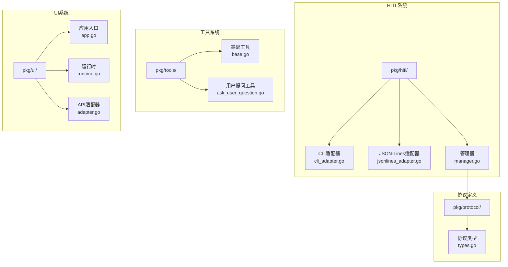

**图表来源**
- [cli_adapter.go:1-102](file://pkg/hitl/cli_adapter.go#L1-L102)
- [jsonlines_adapter.go:1-96](file://pkg/hitl/jsonlines_adapter.go#L1-L96)
- [manager.go:1-148](file://pkg/hitl/manager.go#L1-L148)
- [types.go:1-102](file://pkg/protocol/types.go#L1-L102)

**章节来源**
- [cli_adapter.go:1-102](file://pkg/hitl/cli_adapter.go#L1-L102)
- [jsonlines_adapter.go:1-96](file://pkg/hitl/jsonlines_adapter.go#L1-L96)
- [manager.go:1-148](file://pkg/hitl/manager.go#L1-L148)
- [types.go:1-102](file://pkg/protocol/types.go#L1-L102)

## 核心组件

### 协议层（Protocol Layer）

协议层定义了前后端通信的标准接口，确保不同适配器之间的兼容性：

- **BackendEventType**: 后端事件类型定义
- **FrontendRequestType**: 前端请求类型定义  
- **ModalInfo**: 弹窗信息结构
- **BackendEvent**: 后端事件消息
- **FrontendRequest**: 前端请求消息

### 适配器层（Adapter Layer）

适配器层包含两个主要适配器：

- **CLIAdapter**: 命令行界面适配器，处理stdin/stdout交互
- **JSONLinesAdapter**: JSON-Lines协议适配器，处理结构化协议通信

### 管理器层（Manager Layer）

管理器层负责协调HITL请求和响应：

- **Manager**: 核心管理器，跟踪待处理的HITL请求
- **AskQuestion**: 询问用户问题
- **AskPermission**: 请求用户权限
- **HandleFrontendRequest**: 处理前端请求

**章节来源**
- [types.go:16-101](file://pkg/protocol/types.go#L16-L101)
- [cli_adapter.go:12-102](file://pkg/hitl/cli_adapter.go#L12-L102)
- [jsonlines_adapter.go:14-96](file://pkg/hitl/jsonlines_adapter.go#L14-L96)
- [manager.go:11-148](file://pkg/hitl/manager.go#L11-L148)

## 架构概览

OpenHarness Go中的适配器模式架构展示了如何通过统一接口实现多前端支持：

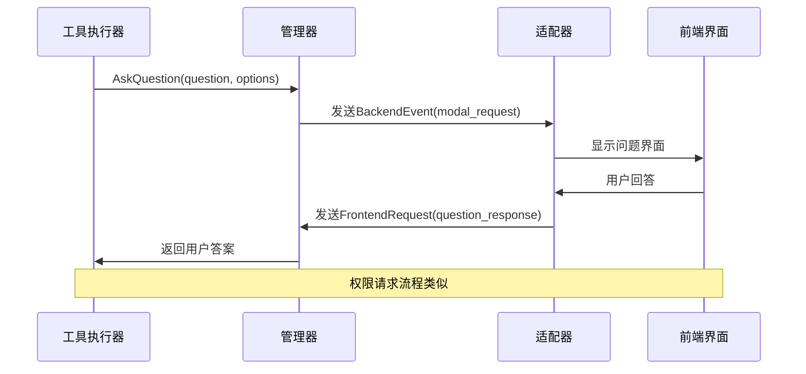

**图表来源**
- [manager.go:33-90](file://pkg/hitl/manager.go#L33-L90)
- [cli_adapter.go:22-68](file://pkg/hitl/cli_adapter.go#L22-L68)
- [jsonlines_adapter.go:34-82](file://pkg/hitl/jsonlines_adapter.go#L34-L82)

### 适配器模式实现原理

适配器模式在OpenHarness中的实现基于以下核心概念：

1. **统一接口**: 所有适配器都实现相同的接口方法
2. **协议转换**: 将内部协议转换为前端特定的格式
3. **异步处理**: 使用Go通道实现异步通信
4. **上下文支持**: 支持取消操作和超时控制

**章节来源**
- [Human-In-The-Loop.md:14-34](file://design/Human-In-The-Loop.md#L14-L34)
- [manager.go:120-142](file://pkg/hitl/manager.go#L120-L142)

## 详细组件分析

### CLI适配器分析

CLI适配器专门用于命令行环境的人机交互：

#### 核心功能

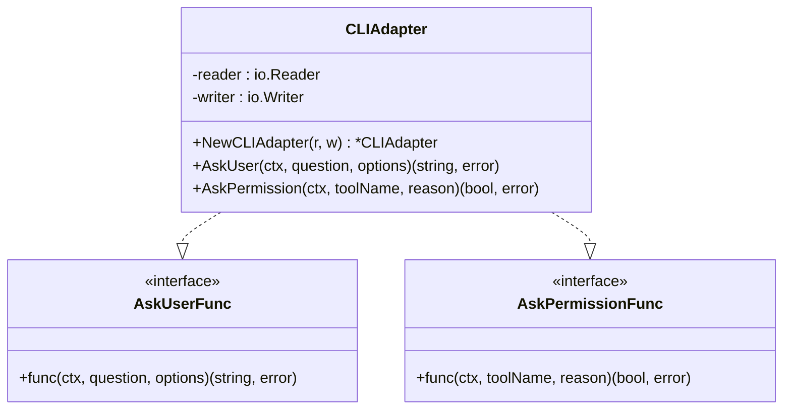

**图表来源**
- [cli_adapter.go:13-102](file://pkg/hitl/cli_adapter.go#L13-L102)
- [base.go:11-15](file://pkg/tools/base.go#L11-L15)

#### 交互流程

CLI适配器提供了直观的用户界面：

1. **问题显示**: 格式化显示问题和选项
2. **输入处理**: 支持数字选择和自由文本输入
3. **权限请求**: 显示工具名称和原因说明
4. **异步响应**: 使用goroutine处理用户输入

#### 错误处理机制

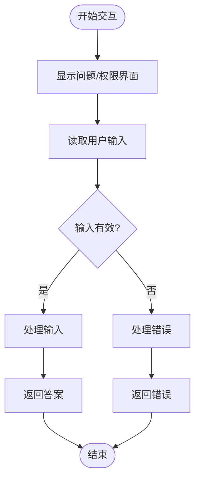

**图表来源**
- [cli_adapter.go:41-67](file://pkg/hitl/cli_adapter.go#L41-L67)
- [cli_adapter.go:78-101](file://pkg/hitl/cli_adapter.go#L78-L101)

**章节来源**
- [cli_adapter.go:22-102](file://pkg/hitl/cli_adapter.go#L22-L102)
- [Human-In-The-Loop.md:94-108](file://design/Human-In-The-Loop.md#L94-L108)

### JSON-Lines适配器分析

JSON-Lines适配器用于处理结构化的协议通信：

#### 数据流架构

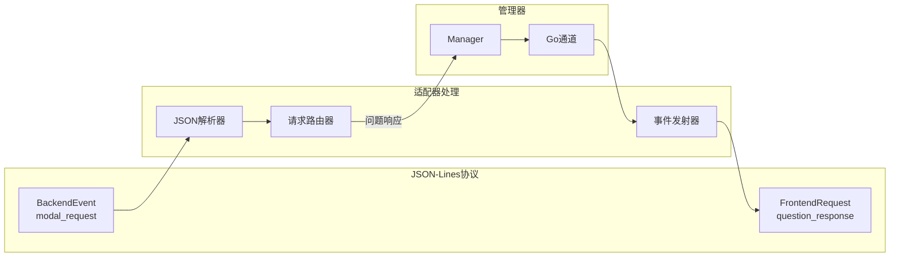

**图表来源**
- [jsonlines_adapter.go:34-82](file://pkg/hitl/jsonlines_adapter.go#L34-L82)
- [manager.go:120-142](file://pkg/hitl/manager.go#L120-L142)

#### 协议处理流程

JSON-Lines适配器实现了完整的协议处理：

1. **读取循环**: 持续监听输入流
2. **JSON解析**: 解析每行的JSON数据
3. **请求路由**: 将不同类型请求路由到相应处理逻辑
4. **事件发射**: 将处理结果发送回前端

#### 并发处理机制

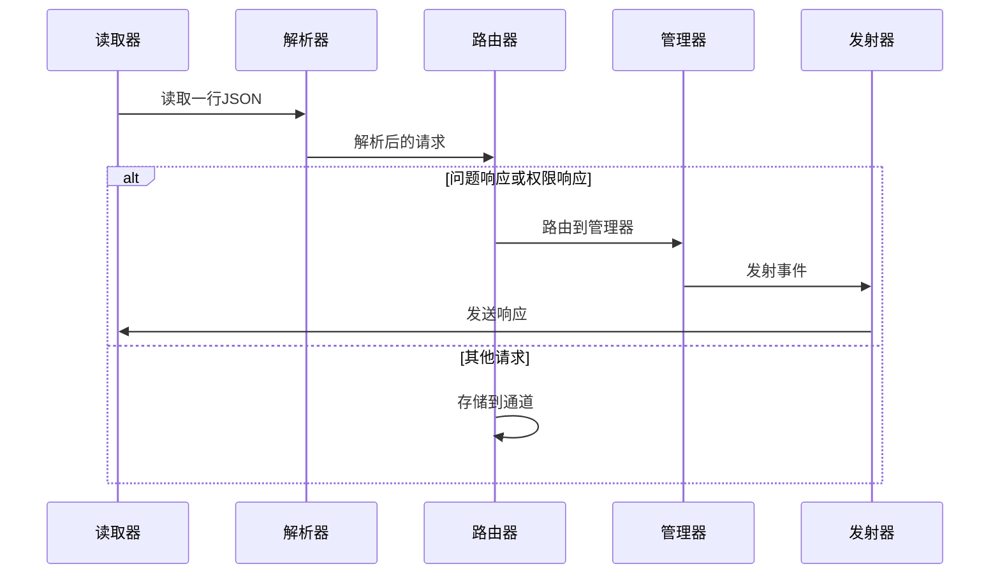

**图表来源**
- [jsonlines_adapter.go:56-81](file://pkg/hitl/jsonlines_adapter.go#L56-L81)

**章节来源**
- [jsonlines_adapter.go:14-96](file://pkg/hitl/jsonlines_adapter.go#L14-L96)
- [jsonlines_adapter.go:34-82](file://pkg/hitl/jsonlines_adapter.go#L34-L82)

### 管理器组件分析

管理器是适配器模式的核心协调组件：

#### 请求跟踪机制

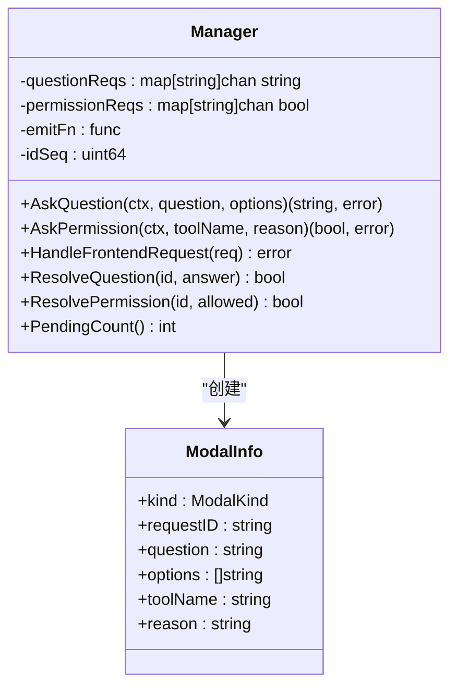

**图表来源**
- [manager.go:12-18](file://pkg/hitl/manager.go#L12-L18)
- [types.go:44-51](file://pkg/protocol/types.go#L44-L51)

#### 并发安全设计

管理器使用互斥锁确保线程安全：

1. **请求注册**: 使用互斥锁保护请求映射
2. **通道管理**: 通过Go通道实现异步通信
3. **资源清理**: 在取消时清理未完成的请求

**章节来源**
- [manager.go:11-148](file://pkg/hitl/manager.go#L11-L148)
- [types.go:16-60](file://pkg/protocol/types.go#L16-L60)

### 工具系统集成

工具系统通过适配器模式实现了统一的用户交互接口：

#### 适配器注入机制

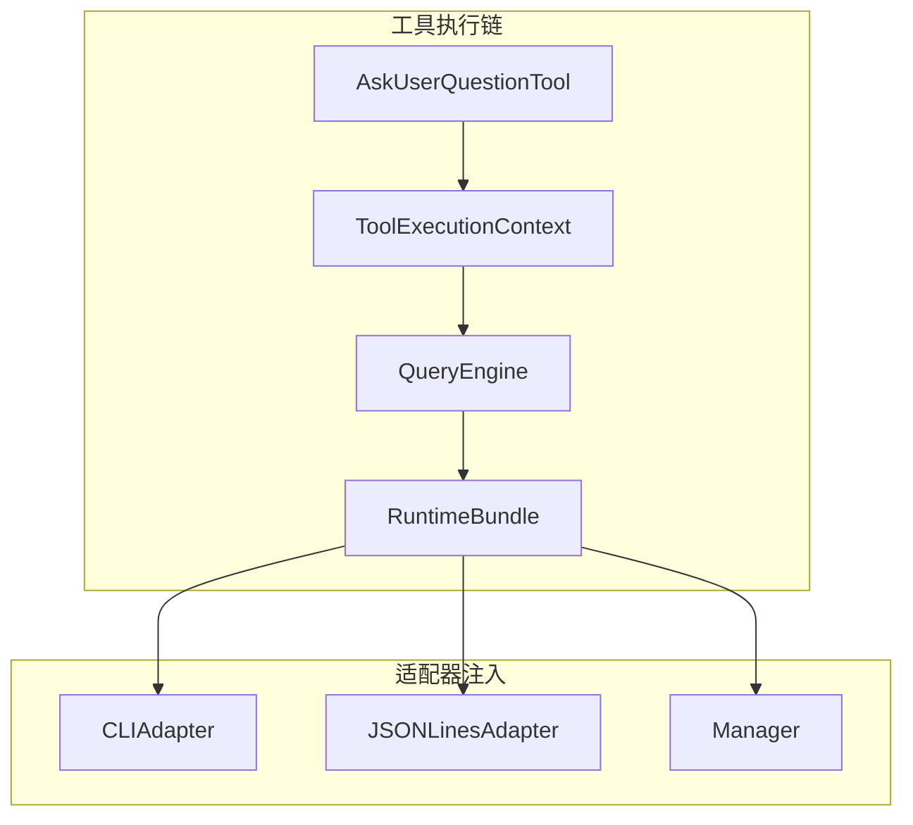

**图表来源**
- [ask_user_question.go:56-80](file://pkg/tools/builtin/ask_user_question.go#L56-L80)
- [runtime.go:162-178](file://pkg/ui/runtime.go#L162-L178)

#### 工具执行流程

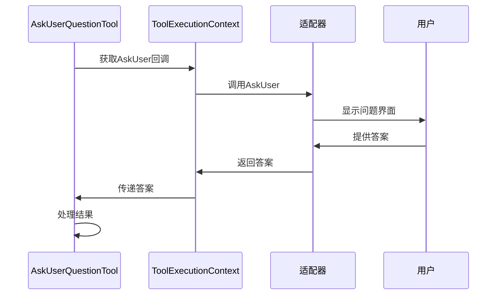

**图表来源**
- [ask_user_question.go:64-73](file://pkg/tools/builtin/ask_user_question.go#L64-L73)
- [base.go:19-27](file://pkg/tools/base.go#L19-L27)

**章节来源**
- [ask_user_question.go:12-80](file://pkg/tools/builtin/ask_user_question.go#L12-L80)
- [base.go:11-27](file://pkg/tools/base.go#L11-L27)
- [runtime.go:162-178](file://pkg/ui/runtime.go#L162-L178)

## 依赖关系分析

### 模块间依赖关系

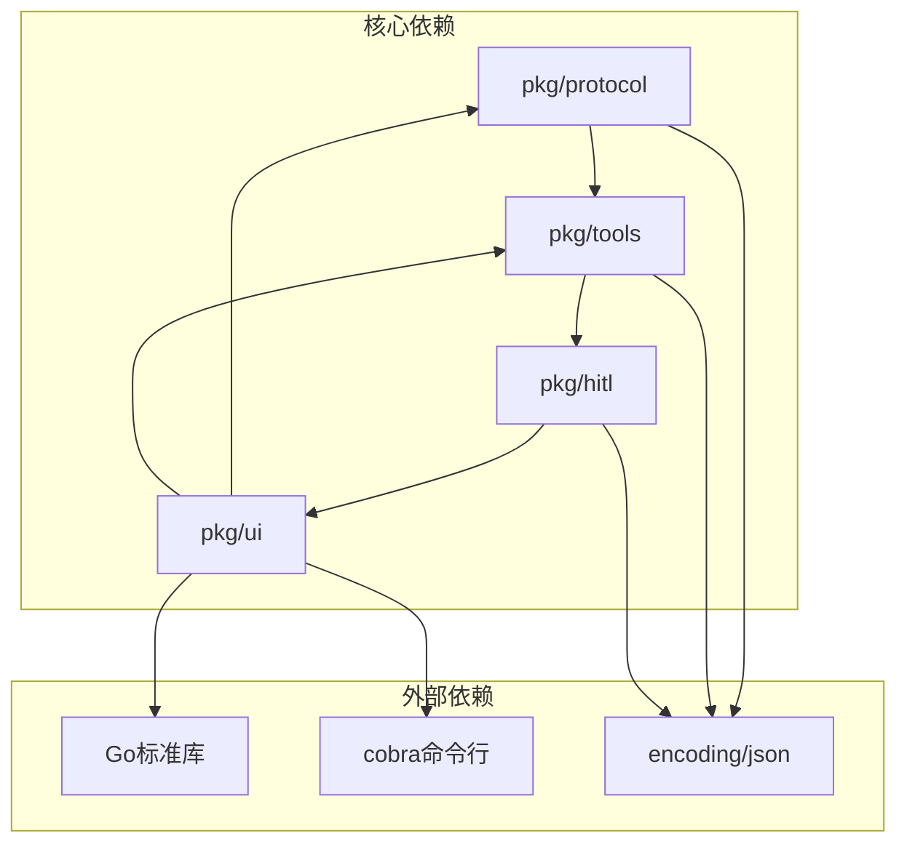

**图表来源**
- [types.go:8-10](file://pkg/protocol/types.go#L8-L10)
- [cli_adapter.go:3-10](file://pkg/hitl/cli_adapter.go#L3-L10)
- [jsonlines_adapter.go:3-12](file://pkg/hitl/jsonlines_adapter.go#L3-L12)

### 循环依赖避免策略

项目通过以下策略避免循环依赖：

1. **协议独立**: 协议类型定义在独立包中，无外部依赖
2. **接口抽象**: 使用函数类型定义回调接口
3. **分层设计**: 清晰的层次结构避免相互引用

**章节来源**
- [types.go:4-6](file://pkg/protocol/types.go#L4-L6)
- [base.go:11-15](file://pkg/tools/base.go#L11-L15)

## 性能考虑

### 并发性能优化

适配器模式在性能方面的优势：

1. **异步处理**: 使用Go通道实现非阻塞I/O
2. **内存效率**: 缓冲区优化减少内存分配
3. **连接复用**: 单连接支持多个并发请求

### 内存管理策略

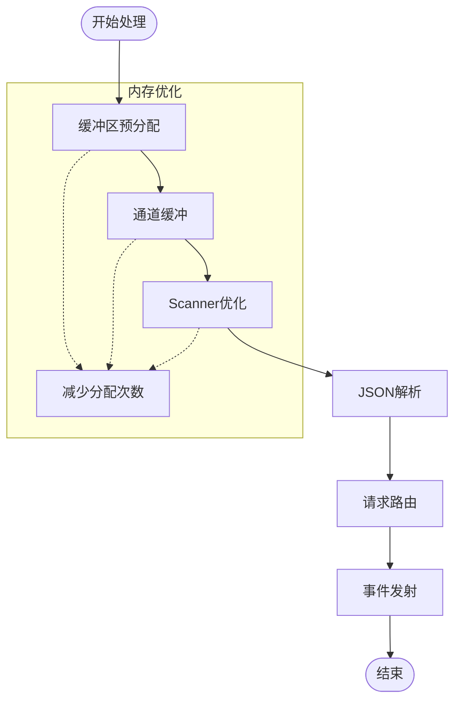

**图表来源**
- [jsonlines_adapter.go:35-38](file://pkg/hitl/jsonlines_adapter.go#L35-L38)
- [jsonlines_adapter.go:56-63](file://pkg/hitl/jsonlines_adapter.go#L56-L63)

### 错误恢复机制

系统实现了多层次的错误处理：

1. **输入验证**: 协议级别的数据验证
2. **连接监控**: 自动检测和恢复连接
3. **资源清理**: 确保在错误情况下释放资源

## 故障排除指南

### 常见问题诊断

#### CLI适配器问题

| 问题症状 | 可能原因 | 解决方案 |
|---------|---------|---------|
| 输入无响应 | 标准输入被占用 | 检查输入重定向 |
| 选项选择失败 | 数字输入格式错误 | 确认输入范围 |
| 文本显示异常 | 终端编码问题 | 设置正确的终端编码 |

#### JSON-Lines适配器问题

| 问题症状 | 可能原因 | 解决方案 |
|---------|---------|---------|
| 协议解析错误 | JSON格式不正确 | 验证JSON格式 |
| 请求丢失 | 通道缓冲不足 | 增加缓冲大小 |
| 连接中断 | 网络不稳定 | 检查网络连接 |

### 调试技巧

1. **日志记录**: 启用详细的调试日志
2. **协议监控**: 监控JSON-Lines协议流量
3. **状态检查**: 定期检查管理器状态

**章节来源**
- [cli_adapter.go:41-67](file://pkg/hitl/cli_adapter.go#L41-L67)
- [jsonlines_adapter.go:56-63](file://pkg/hitl/jsonlines_adapter.go#L56-L63)

## 结论

OpenHarness Go项目中的适配器模式成功实现了人机协作系统的高度模块化和可扩展性。通过CLI适配器和JSON-Lines适配器，系统能够支持多种前端交互方式，同时保持统一的协议接口。

### 主要成就

1. **接口标准化**: 统一的协议定义确保了不同适配器的兼容性
2. **模块化设计**: 清晰的层次结构便于维护和扩展
3. **并发优化**: 基于Go通道的异步处理提升了性能
4. **错误处理**: 完善的错误处理机制增强了系统稳定性

### 技术创新

- **协议独立**: 协议类型定义在独立包中，避免循环依赖
- **回调注入**: 通过依赖注入实现灵活的适配器切换
- **上下文支持**: 原生支持取消操作和超时控制
- **多前端支持**: 同时支持CLI、JSON-Lines和HTTP/WebSocket

适配器模式在OpenHarness中的成功应用为其他系统集成项目提供了宝贵的参考经验，展示了如何通过合理的架构设计实现系统的高内聚、低耦合和良好的可扩展性。