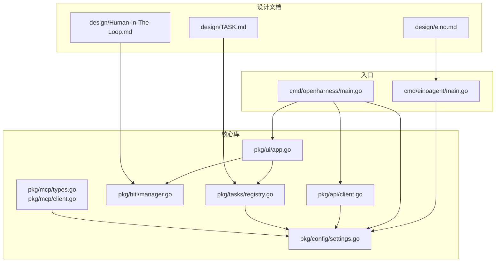
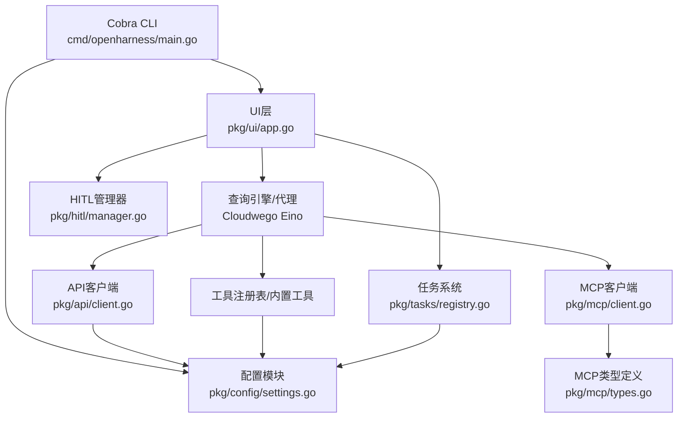
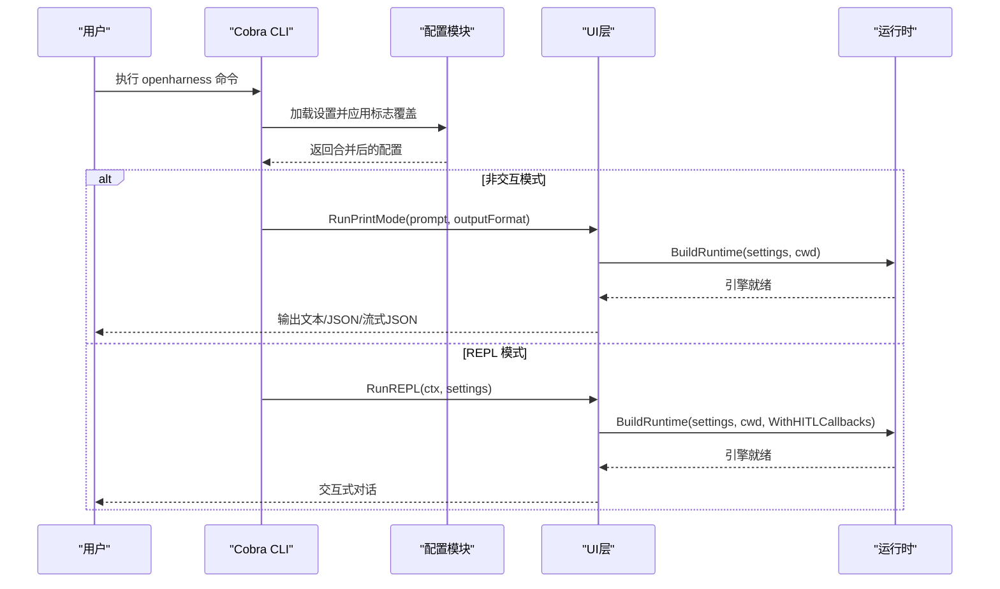
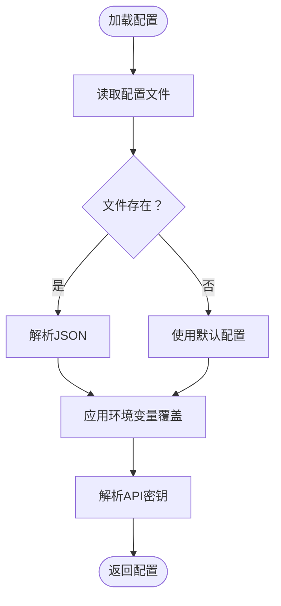
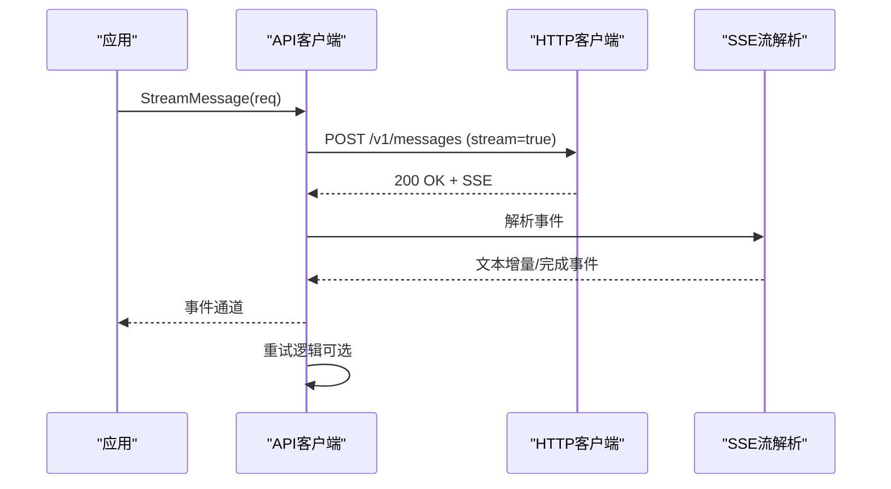
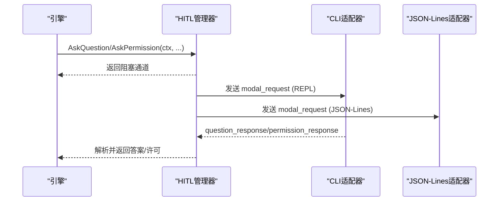
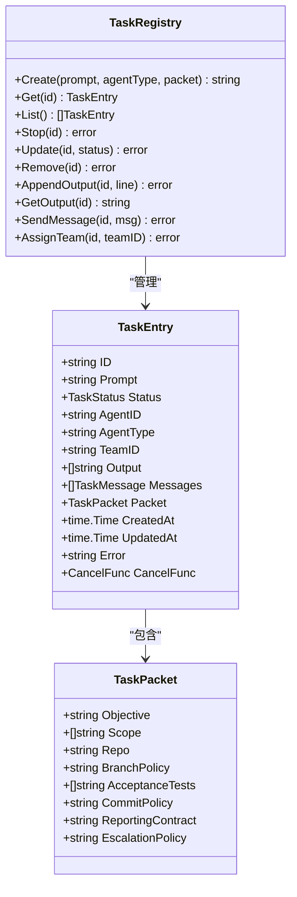
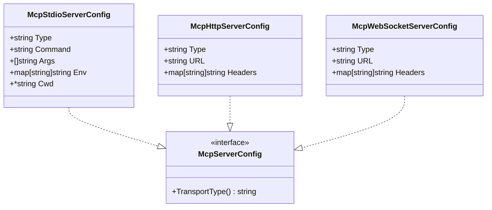
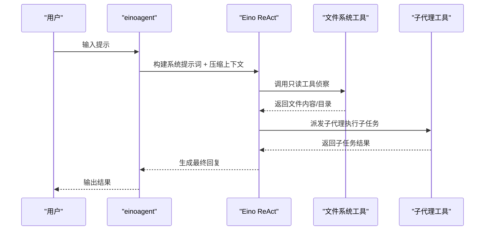
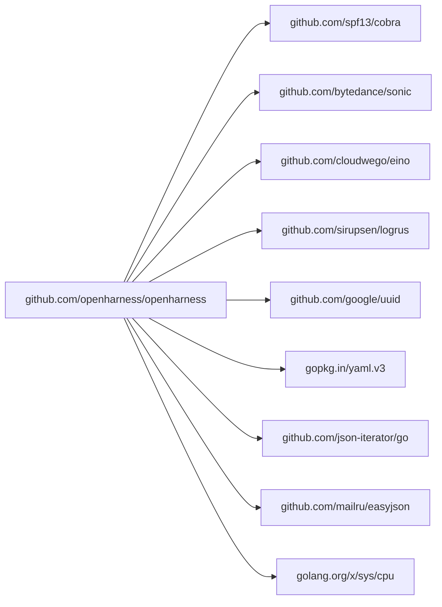

# 技术栈

<cite>
**本文档引用的文件**
- [go.mod](file://go.mod)
- [cmd/einoagent/main.go](file://cmd/einoagent/main.go)
- [cmd/openharness/main.go](file://cmd/openharness/main.go)
- [pkg/config/settings.go](file://pkg/config/settings.go)
- [pkg/api/client.go](file://pkg/api/client.go)
- [pkg/ui/app.go](file://pkg/ui/app.go)
- [pkg/hitl/manager.go](file://pkg/hitl/manager.go)
- [pkg/mcp/types.go](file://pkg/mcp/types.go)
- [pkg/mcp/client.go](file://pkg/mcp/client.go)
- [pkg/tasks/registry.go](file://pkg/tasks/registry.go)
- [design/Human-In-The-Loop.md](file://design/Human-In-The-Loop.md)
- [design/TASK.md](file://design/TASK.md)
- [design/eino.md](file://design/eino.md)
</cite>

## 目录
1. [简介](#简介)
2. [项目结构](#项目结构)
3. [核心组件](#核心组件)
4. [架构总览](#架构总览)
5. [详细组件分析](#详细组件分析)
6. [依赖关系分析](#依赖关系分析)
7. [性能考虑](#性能考虑)
8. [故障排查指南](#故障排查指南)
9. [结论](#结论)
10. [附录](#附录)

## 简介
本项目采用 Go 1.22.0 作为主要开发语言，结合 Cloudwego Eino ReAct 代理框架、Cobra CLI 框架、Logrus 日志记录、Sonic JSON 处理等关键技术，构建一个可扩展、高性能的 AI 编码助手与智能代理系统。Go 1.22.0 在并发模型、内存管理、工具链成熟度等方面提供了稳定基础，配合现代化依赖管理与高性能 JSON 库，满足复杂 AI 代理场景对吞吐与延迟的要求。

## 项目结构
项目采用按功能域划分的模块化组织方式，核心入口位于 cmd 目录，业务逻辑分布在 pkg 下的多个子包，设计文档位于 design 目录，插件与技能位于 plugins 目录。

图表来源
- [cmd/einoagent/main.go:1-107](file://cmd/einoagent/main.go#L1-L107)
- [cmd/openharness/main.go:1-299](file://cmd/openharness/main.go#L1-L299)
- [pkg/config/settings.go:1-212](file://pkg/config/settings.go#L1-L212)
- [pkg/api/client.go:1-406](file://pkg/api/client.go#L1-L406)
- [pkg/ui/app.go:1-238](file://pkg/ui/app.go#L1-L238)
- [pkg/hitl/manager.go:1-148](file://pkg/hitl/manager.go#L1-L148)
- [pkg/mcp/types.go:1-113](file://pkg/mcp/types.go#L1-L113)
- [pkg/mcp/client.go:1-53](file://pkg/mcp/client.go#L1-L53)
- [pkg/tasks/registry.go:1-191](file://pkg/tasks/registry.go#L1-L191)
- [design/Human-In-The-Loop.md:1-815](file://design/Human-In-The-Loop.md#L1-L815)
- [design/TASK.md:1-366](file://design/TASK.md#L1-L366)
- [design/eino.md:1-295](file://design/eino.md#L1-L295)

章节来源
- [go.mod:1-43](file://go.mod#L1-L43)
- [cmd/einoagent/main.go:1-107](file://cmd/einoagent/main.go#L1-L107)
- [cmd/openharness/main.go:1-299](file://cmd/openharness/main.go#L1-L299)
- [pkg/config/settings.go:1-212](file://pkg/config/settings.go#L1-L212)

## 核心组件
- Go 1.22.0：提供强大的并发原语（goroutine、channel）、高效的垃圾回收与编译优化，适合高吞吐的 AI 代理与 CLI 工具。
- Cobra CLI 框架：为 openharness 提供命令行入口与子命令体系，支持标志参数、环境变量覆盖与交互/非交互模式切换。
- Cloudwego Eino ReAct 代理框架：提供 ReAct（推理-行动）代理能力，支持工具调用、消息流式传输、上下文压缩与子代理派发。
- Logrus 日志记录：统一的日志记录与格式化输出，便于调试与生产监控。
- Sonic JSON 处理：高性能 JSON 编解码，提升 API 请求/响应与配置文件处理效率。
- 人类在回路（HITL）：通过统一的 Manager 与前端适配器，支持 CLI、JSON-Lines、HTTP 等多种交互模式。
- 任务系统（Task）：支持并行子代理执行、工具白名单沙箱、团队与定时任务注册表等高级能力。
- MCP（Model Context Protocol）：支持通过标准协议连接外部工具与资源服务器。

章节来源
- [go.mod:3-42](file://go.mod#L3-L42)
- [cmd/openharness/main.go:22-102](file://cmd/openharness/main.go#L22-L102)
- [pkg/api/client.go:26-37](file://pkg/api/client.go#L26-L37)
- [pkg/hitl/manager.go:11-26](file://pkg/hitl/manager.go#L11-L26)
- [pkg/tasks/registry.go:13-28](file://pkg/tasks/registry.go#L13-L28)
- [pkg/mcp/types.go:13-88](file://pkg/mcp/types.go#L13-L88)

## 架构总览
整体架构围绕“配置驱动 + 代理引擎 + 工具生态 + 人机交互”的模式展开。CLI 入口负责参数解析与运行模式选择，配置模块提供统一设置与环境变量覆盖，API 客户端封装 Anthropic/OpenAI 风格的流式调用与重试策略，UI 层根据模式输出文本、JSON 或 JSON-Lines 协议事件，HITL 管理器与前端适配器实现跨前端的一致交互体验，Task 系统支撑并行子代理执行，MCP 提供标准化工具/资源接入。

图表来源
- [cmd/openharness/main.go:15-102](file://cmd/openharness/main.go#L15-L102)
- [pkg/config/settings.go:97-142](file://pkg/config/settings.go#L97-L142)
- [pkg/ui/app.go:18-61](file://pkg/ui/app.go#L18-L61)
- [pkg/api/client.go:87-104](file://pkg/api/client.go#L87-L104)
- [pkg/hitl/manager.go:12-26](file://pkg/hitl/manager.go#L12-L26)
- [pkg/tasks/registry.go:13-28](file://pkg/tasks/registry.go#L13-L28)
- [pkg/mcp/types.go:13-88](file://pkg/mcp/types.go#L13-L88)
- [pkg/mcp/client.go:46-53](file://pkg/mcp/client.go#L46-L53)

## 详细组件分析

### Go 1.22.0 与依赖管理
- 版本选择：Go 1.22.0 在并发调度、内存分配与工具链稳定性方面表现优异，适合高负载的 AI 代理与 CLI 工具。
- 关键依赖：
  - Cobra：命令行框架，提供标志参数、子命令与环境变量覆盖。
  - Sonic：高性能 JSON 编解码，减少序列化开销。
  - Eino/Eino-Ext：ReAct 代理、工具节点与消息流式处理。
  - Logrus：结构化日志记录。
  - 其他：UUID、YAML、JSON-Iterator、EasyJSON、cpuid 等辅助库。

章节来源
- [go.mod:3-42](file://go.mod#L3-L42)

### CLI 入口与 Cobra 集成
- openharness CLI 提供根命令与子命令（如 mcp、auth），支持非交互打印模式、REPL 模式与 JSON-Lines 协议模式。
- 参数覆盖顺序：命令行标志 > 环境变量 > 配置文件默认值。
- 信号处理：支持中断信号优雅退出。

图表来源
- [cmd/openharness/main.go:15-102](file://cmd/openharness/main.go#L15-L102)
- [pkg/config/settings.go:161-195](file://pkg/config/settings.go#L161-L195)
- [pkg/ui/app.go:18-61](file://pkg/ui/app.go#L18-L61)

章节来源
- [cmd/openharness/main.go:15-102](file://cmd/openharness/main.go#L15-L102)
- [pkg/config/settings.go:161-195](file://pkg/config/settings.go#L161-L195)
- [pkg/ui/app.go:122-181](file://pkg/ui/app.go#L122-L181)

### 配置系统与环境变量覆盖
- 默认配置：包含模型、最大令牌数、权限模式、内存设置、主题、输出样式、快速模式、努力级别、轮次等。
- 环境变量覆盖：支持 Anthropic/OpenHarress 相关环境变量，优先级高于配置文件。
- API 密钥解析：优先使用实例配置，其次环境变量，最后报错。

图表来源
- [pkg/config/settings.go:161-212](file://pkg/config/settings.go#L161-L212)

章节来源
- [pkg/config/settings.go:127-142](file://pkg/config/settings.go#L127-L142)
- [pkg/config/settings.go:197-211](file://pkg/config/settings.go#L197-L211)
- [pkg/config/settings.go:144-154](file://pkg/config/settings.go#L144-L154)

### API 客户端与流式传输
- 支持 Anthropic 风格 Messages API，封装 SSE 流式事件解析。
- 重试策略：指数退避 + 抖动，支持 Retry-After 头与网络错误重试。
- 错误翻译：将 HTTP 错误映射为统一的错误类型，便于上层处理。

图表来源
- [pkg/api/client.go:107-148](file://pkg/api/client.go#L107-L148)
- [pkg/api/client.go:174-210](file://pkg/api/client.go#L174-L210)
- [pkg/api/client.go:242-295](file://pkg/api/client.go#L242-L295)

章节来源
- [pkg/api/client.go:26-37](file://pkg/api/client.go#L26-L37)
- [pkg/api/client.go:107-148](file://pkg/api/client.go#L107-L148)
- [pkg/api/client.go:359-405](file://pkg/api/client.go#L359-L405)

### 人类在回路（HITL）与多前端适配
- Manager：统一管理问题与权限请求，使用 Go channel 实现阻塞等待与响应派发。
- CLI 适配器：REPL 模式下的 stdin/stdout 交互，支持多选题与自由文本。
- JSON-Lines 适配器：TUI/IDE/远程场景的双向协议，支持 modal_request/question_response。
- 协议类型：BackendEvent/FrontendRequest，区分事件类型与模态种类。

图表来源
- [pkg/hitl/manager.go:28-90](file://pkg/hitl/manager.go#L28-L90)
- [pkg/hitl/manager.go:120-142](file://pkg/hitl/manager.go#L120-L142)
- [pkg/ui/app.go:192-237](file://pkg/ui/app.go#L192-L237)

章节来源
- [pkg/hitl/manager.go:11-26](file://pkg/hitl/manager.go#L11-L26)
- [pkg/ui/app.go:183-189](file://pkg/ui/app.go#L183-L189)
- [design/Human-In-The-Loop.md:14-34](file://design/Human-In-The-Loop.md#L14-L34)

### 任务系统（Task）与并行执行
- TaskPacket：结构化任务契约，包含目标、作用域、分支策略、验收测试、报告契约等。
- TaskRegistry：线程安全的任务注册表，支持 CRUD、输出与消息管理、团队关联与取消。
- 子代理执行器：根据子代理类型构建工具白名单沙箱，限制 Bash 等危险工具的使用。
- 并行执行：Agent 工具异步派生子代理，等待完成后汇总结果。

图表来源
- [pkg/tasks/registry.go:89-104](file://pkg/tasks/registry.go#L89-L104)
- [pkg/tasks/registry.go:119-146](file://pkg/tasks/registry.go#L119-L146)

章节来源
- [pkg/tasks/registry.go:13-28](file://pkg/tasks/registry.go#L13-L28)
- [pkg/tasks/registry.go:119-146](file://pkg/tasks/registry.go#L119-L146)
- [design/TASK.md:64-112](file://design/TASK.md#L64-L112)

### MCP（Model Context Protocol）客户端
- 服务器配置：支持 stdio/http/ws 三种传输类型，通过 discriminator 字段自动解析。
- JSON-RPC 通信：封装请求/响应与错误类型，提供连接管理与请求 ID 序列化。
- 配置持久化：通过配置文件管理 MCP 服务器列表，支持增删查操作。

图表来源
- [pkg/mcp/types.go:13-88](file://pkg/mcp/types.go#L13-L88)

章节来源
- [pkg/mcp/types.go:13-88](file://pkg/mcp/types.go#L13-L88)
- [pkg/mcp/client.go:19-53](file://pkg/mcp/client.go#L19-L53)
- [cmd/openharness/main.go:165-231](file://cmd/openharness/main.go#L165-L231)

### Eino ReAct 代理示例
- einoagent 示例展示了如何基于 Cloudwego Eino 构建 ReAct 代理，集成文件系统工具、子代理派发、TODO 反思与上下文压缩。
- 代理配置包含模型、工作目录、技能根目录、最大步数、反思周期与上下文压缩配置。
- 运行流程：构建系统提示词 → 上下文压缩 → ReAct 生成 → 记录历史。

图表来源
- [cmd/einoagent/main.go:25-95](file://cmd/einoagent/main.go#L25-L95)
- [einoagent/agent/agent.go:100-153](file://einoagent/agent/agent.go#L100-L153)

章节来源
- [cmd/einoagent/main.go:25-95](file://cmd/einoagent/main.go#L25-L95)
- [einoagent/agent/agent.go:24-43](file://einoagent/agent/agent.go#L24-L43)
- [einoagent/agent/agent.go:100-153](file://einoagent/agent/agent.go#L100-L153)
- [design/eino.md:34-140](file://design/eino.md#L34-L140)

## 依赖关系分析
- 直接依赖：Cobra、Sonic、Eino/Eino-Ext、Logrus 等。
- 间接依赖：UUID、YAML、JSON-Iterator、EasyJSON、cpuid 等，用于唯一标识、配置解析、高性能 JSON 与 CPU 检测。
- 外部集成：Anthropic/OpenAI API（通过 API 客户端），MCP 服务器（通过 MCP 客户端）。

图表来源
- [go.mod:5-42](file://go.mod#L5-L42)

章节来源
- [go.mod:5-42](file://go.mod#L5-L42)

## 性能考虑
- JSON 处理：使用 Sonic 提升序列化/反序列化性能，降低 API 调用与配置读写的开销。
- 并发模型：利用 Go 的 goroutine/channel 实现高并发工具执行与流式事件处理。
- 上下文压缩：在 ReAct 代理与任务系统中引入上下文压缩与自动压缩阈值，控制 Token 使用。
- 重试与抖动：指数退避 + 抖动策略降低服务端压力与冲突概率。
- I/O 缓冲：SSE 解析器使用大缓冲区，减少扫描次数，提升流式传输吞吐。

## 故障排查指南
- API 错误分类：认证失败、速率限制、请求失败等，通过统一错误类型便于定位。
- 重试策略：检查 Retry-After 头与网络错误，确认是否触发指数退避。
- 配置优先级：确认命令行标志、环境变量与配置文件的覆盖顺序。
- HITL 交互：确认前端适配器是否正确发送 question_response/permission_response。
- 任务执行：检查 TaskRegistry 的状态流转与取消函数是否正确设置。

章节来源
- [pkg/api/client.go:359-405](file://pkg/api/client.go#L359-L405)
- [pkg/config/settings.go:197-211](file://pkg/config/settings.go#L197-L211)
- [pkg/hitl/manager.go:120-142](file://pkg/hitl/manager.go#L120-L142)
- [pkg/tasks/registry.go:74-90](file://pkg/tasks/registry.go#L74-L90)

## 结论
本项目通过 Go 1.22.0 的并发与性能优势，结合 Cloudwego Eino ReAct 代理、Cobra CLI、Sonic JSON 与 Logrus 等关键技术，构建了可扩展、可维护且高性能的 AI 编码助手与智能代理系统。配置驱动、工具生态、人机交互与任务系统的协同，使得系统既能满足 CLI 交互需求，也能支持复杂场景下的并行执行与多前端适配。

## 附录
- 技术选型动机：
  - Go 1.22.0：并发原语成熟、GC 优化显著、工具链完善。
  - Cobra：命令行生态成熟、子命令与标志管理便捷。
  - Eino：ReAct 代理能力完备、工具节点与消息流式处理成熟。
  - Sonic：JSON 性能领先，适合高频序列化场景。
  - Logrus：结构化日志、可扩展性强。
- 兼容性信息：
  - 操作系统：Linux/macOS/Windows（CLI 工具与代理均可运行）。
  - 版本要求：Go 1.22.0，依赖库版本由 go.mod 管理。
  - API 兼容：Anthropic Messages API 与 OpenAI 兼容接口均受支持。