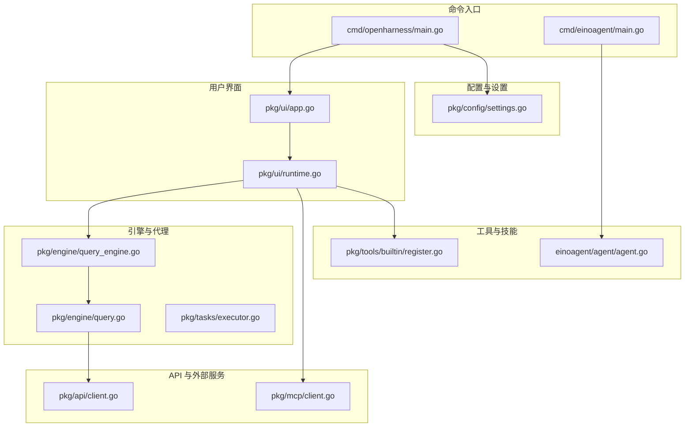
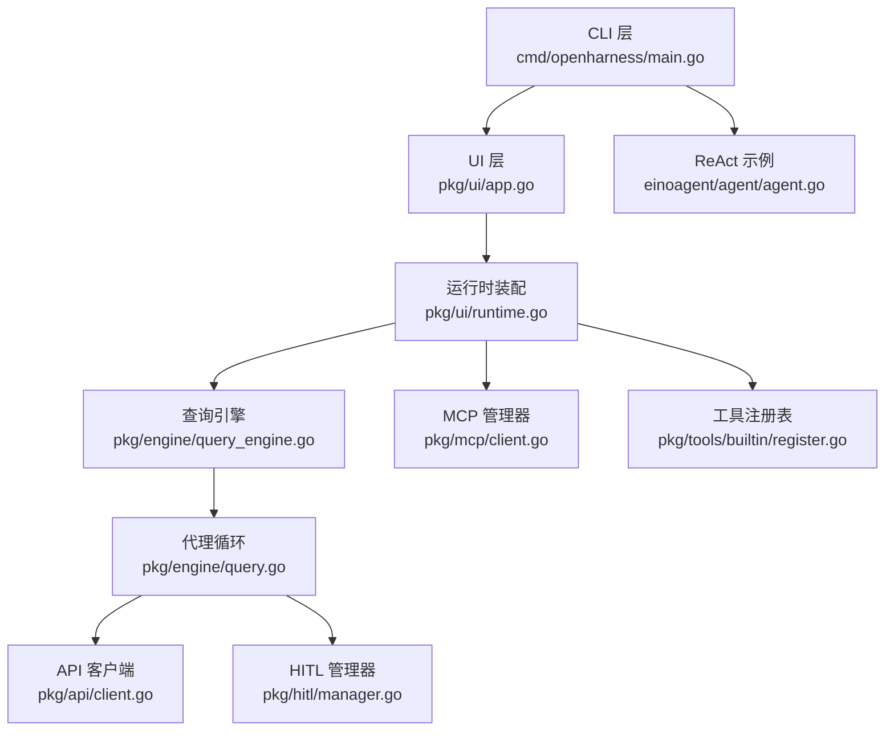
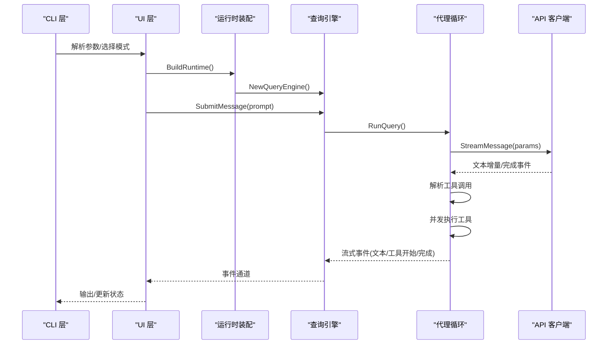
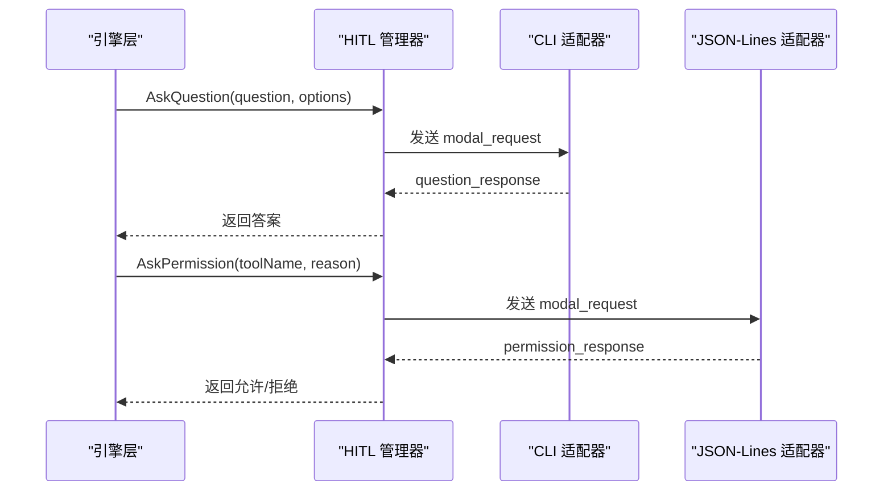
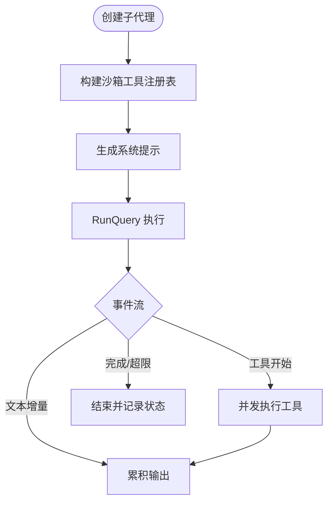
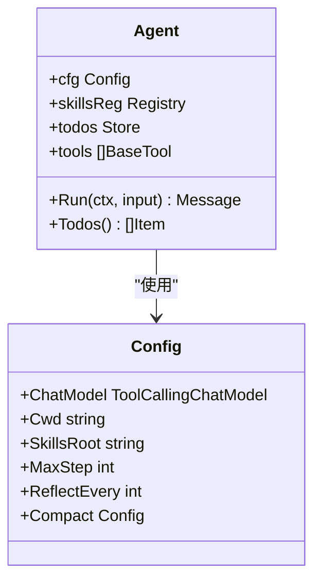
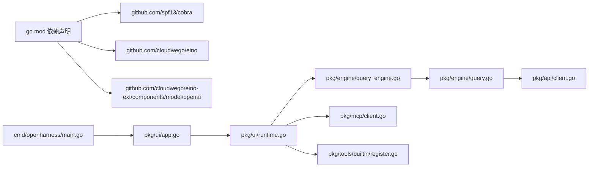

# 架构概览

<cite>
**本文档引用的文件**
- [cmd/openharness/main.go](file://cmd/openharness/main.go)
- [cmd/einoagent/main.go](file://cmd/einoagent/main.go)
- [pkg/engine/query_engine.go](file://pkg/engine/query_engine.go)
- [pkg/engine/query.go](file://pkg/engine/query.go)
- [pkg/api/client.go](file://pkg/api/client.go)
- [pkg/ui/app.go](file://pkg/ui/app.go)
- [pkg/ui/runtime.go](file://pkg/ui/runtime.go)
- [pkg/config/settings.go](file://pkg/config/settings.go)
- [pkg/mcp/client.go](file://pkg/mcp/client.go)
- [pkg/hitl/manager.go](file://pkg/hitl/manager.go)
- [pkg/taske/executor.go](file://pkg/tasks/executor.go)
- [pkg/tools/builtin/register.go](file://pkg/tools/builtin/register.go)
- [einoagent/agent/agent.go](file://einoagent/agent/agent.go)
- [go.mod](file://go.mod)
- [design/Human-In-The-Loop.md](file://design/Human-In-The-Loop.md)
</cite>

## 目录
1. [引言](#引言)
2. [项目结构](#项目结构)
3. [核心组件](#核心组件)
4. [架构总览](#架构总览)
5. [详细组件分析](#详细组件分析)
6. [依赖关系分析](#依赖关系分析)
7. [性能考虑](#性能考虑)
8. [故障排查指南](#故障排查指南)
9. [结论](#结论)

## 引言
本文件为 OpenHarness Go 项目的架构概览文档，目标是帮助开发者快速理解系统的整体设计、分层架构与模块化原则，并掌握 ReAct 代理框架在项目中的应用方式。文档重点覆盖以下方面：
- 分层架构与模块化设计：CLI 层、UI 层、引擎层、API 层、工具层、MCP 层等职责划分与协作方式
- ReAct 代理框架：思考-行动-观察循环机制与事件流
- 设计模式应用：策略模式、工厂模式、观察者模式等
- 请求处理流程与数据流图：从 CLI 到引擎再到外部 API 的完整链路
- 人机协同（HITL）机制：统一的权限与问答请求管理
- 性能与扩展性建议

## 项目结构
OpenHarness Go 采用清晰的分层与模块化组织：
- cmd：命令入口（CLI 与 ReAct 示例）
- pkg：核心业务包（engine、api、ui、config、mcp、hitl、tasks、tools 等）
- plugins：插件与技能集合
- design/docs：设计文档与技术说明

图表来源
- [cmd/openharness/main.go:15-102](file://cmd/openharness/main.go#L15-L102)
- [pkg/ui/app.go:18-61](file://pkg/ui/app.go#L18-L61)
- [pkg/ui/runtime.go:52-192](file://pkg/ui/runtime.go#L52-L192)
- [pkg/engine/query_engine.go:98-205](file://pkg/engine/query_engine.go#L98-L205)
- [pkg/engine/query.go:142-280](file://pkg/engine/query.go#L142-L280)
- [pkg/api/client.go:107-148](file://pkg/api/client.go#L107-L148)
- [pkg/mcp/client.go:136-148](file://pkg/mcp/client.go#L136-L148)
- [pkg/tools/builtin/register.go:7-29](file://pkg/tools/builtin/register.go#L7-L29)
- [einoagent/agent/agent.go:46-98](file://einoagent/agent/agent.go#L46-L98)

章节来源
- [cmd/openharness/main.go:15-102](file://cmd/openharness/main.go#L15-L102)
- [pkg/ui/app.go:18-61](file://pkg/ui/app.go#L18-L61)
- [pkg/ui/runtime.go:52-192](file://pkg/ui/runtime.go#L52-L192)
- [pkg/engine/query_engine.go:98-205](file://pkg/engine/query_engine.go#L98-L205)
- [pkg/engine/query.go:142-280](file://pkg/engine/query.go#L142-L280)
- [pkg/api/client.go:107-148](file://pkg/api/client.go#L107-L148)
- [pkg/mcp/client.go:136-148](file://pkg/mcp/client.go#L136-L148)
- [pkg/tools/builtin/register.go:7-29](file://pkg/tools/builtin/register.go#L7-L29)
- [einoagent/agent/agent.go:46-98](file://einoagent/agent/agent.go#L46-L98)

## 核心组件
- CLI 层（cmd/openharness/main.go）：提供 Cobra 命令行入口，支持打印模式、REPL 模式与子命令（MCP、auth）
- UI 层（pkg/ui/app.go、pkg/ui/runtime.go）：装配运行时组件、启动引擎、处理事件流与输出格式
- 引擎层（pkg/engine/query_engine.go、pkg/engine/query.go）：实现 ReAct 代理循环，管理对话历史、工具调用与权限检查
- API 层（pkg/api/client.go）：封装 Anthropic/OpenAI 兼容 API 的流式调用与重试逻辑
- 工具层（pkg/tools/builtin/register.go）：内置工具注册与默认工具集
- MCP 层（pkg/mcp/client.go）：管理本地进程形式的 MCP 服务器连接与工具/资源发现
- 人机协同（HITL）（pkg/hitl/manager.go）：统一的权限与问答请求管理，支持 CLI/JSON-Lines 等前端
- 任务与子代理（pkg/tasks/executor.go）：派生子代理执行特定任务，限制工具集与轮次
- ReAct 示例（einoagent/agent/agent.go）：基于 cloudwego/eino 的 ReAct agent 封装

章节来源
- [cmd/openharness/main.go:46-76](file://cmd/openharness/main.go#L46-L76)
- [pkg/ui/app.go:18-61](file://pkg/ui/app.go#L18-L61)
- [pkg/ui/runtime.go:52-192](file://pkg/ui/runtime.go#L52-L192)
- [pkg/engine/query_engine.go:49-122](file://pkg/engine/query_engine.go#L49-L122)
- [pkg/engine/query.go:142-280](file://pkg/engine/query.go#L142-L280)
- [pkg/api/client.go:107-148](file://pkg/api/client.go#L107-L148)
- [pkg/mcp/client.go:136-148](file://pkg/mcp/client.go#L136-L148)
- [pkg/hitl/manager.go:20-90](file://pkg/hitl/manager.go#L20-L90)
- [pkg/tasks/executor.go:24-76](file://pkg/tasks/executor.go#L24-L76)
- [pkg/tools/builtin/register.go:7-29](file://pkg/tools/builtin/register.go#L7-L29)
- [einoagent/agent/agent.go:46-98](file://einoagent/agent/agent.go#L46-L98)

## 架构总览
OpenHarness Go 采用“分层 + 事件驱动”的架构：
- CLI 层负责参数解析与模式选择
- UI 层负责运行时装配与事件消费
- 引擎层负责 ReAct 循环与工具调度
- API 层负责外部模型服务调用
- 工具层提供可插拔的能力扩展
- MCP 层提供外部工具/资源桥接
- HITL 层提供统一的人机交互通道

图表来源
- [cmd/openharness/main.go:46-76](file://cmd/openharness/main.go#L46-L76)
- [pkg/ui/app.go:18-61](file://pkg/ui/app.go#L18-L61)
- [pkg/ui/runtime.go:52-192](file://pkg/ui/runtime.go#L52-L192)
- [pkg/engine/query_engine.go:98-205](file://pkg/engine/query_engine.go#L98-L205)
- [pkg/engine/query.go:142-280](file://pkg/engine/query.go#L142-L280)
- [pkg/api/client.go:107-148](file://pkg/api/client.go#L107-L148)
- [pkg/mcp/client.go:136-148](file://pkg/mcp/client.go#L136-L148)
- [pkg/tools/builtin/register.go:7-29](file://pkg/tools/builtin/register.go#L7-L29)
- [einoagent/agent/agent.go:46-98](file://einoagent/agent/agent.go#L46-L98)

## 详细组件分析

### ReAct 代理框架与思考-行动-观察循环
ReAct 循环由引擎层实现，核心流程如下：
- 每轮开始：发送系统提示与历史消息，触发模型生成文本增量
- 模型响应：当包含工具调用时，进入工具执行阶段
- 工具执行：并发调用工具，收集结果并注入为用户消息
- 结束条件：无工具调用或达到最大轮次

图表来源
- [pkg/ui/app.go:18-61](file://pkg/ui/app.go#L18-L61)
- [pkg/ui/runtime.go:52-192](file://pkg/ui/runtime.go#L52-L192)
- [pkg/engine/query_engine.go:124-205](file://pkg/engine/query_engine.go#L124-L205)
- [pkg/engine/query.go:142-280](file://pkg/engine/query.go#L142-L280)
- [pkg/api/client.go:107-148](file://pkg/api/client.go#L107-L148)

章节来源
- [pkg/engine/query.go:142-280](file://pkg/engine/query.go#L142-L280)
- [pkg/engine/query_engine.go:124-205](file://pkg/engine/query_engine.go#L124-L205)
- [pkg/api/client.go:107-148](file://pkg/api/client.go#L107-L148)

### 人机协同（HITL）机制
HITL 通过统一的 Manager 管理权限与问答请求，支持 CLI 与 JSON-Lines 两种前端适配器：
- Manager 维护 per-request 的 channel 映射，阻塞等待前端响应
- 通过 BackendEvent/ FrontendRequest 协议进行跨前端通信
- 支持多选题与权限请求复用同一机制

图表来源
- [pkg/hitl/manager.go:20-90](file://pkg/hitl/manager.go#L20-L90)
- [pkg/ui/runtime.go:760-790](file://pkg/ui/runtime.go#L760-L790)
- [pkg/ui/app.go:191-237](file://pkg/ui/app.go#L191-L237)
- [design/Human-In-The-Loop.md:16-34](file://design/Human-In-The-Loop.md#L16-L34)

章节来源
- [pkg/hitl/manager.go:20-90](file://pkg/hitl/manager.go#L20-L90)
- [pkg/ui/runtime.go:760-790](file://pkg/ui/runtime.go#L760-L790)
- [pkg/ui/app.go:191-237](file://pkg/ui/app.go#L191-L237)
- [design/Human-In-The-Loop.md:16-34](file://design/Human-In-The-Loop.md#L16-L34)

### 子代理与任务执行
子代理用于在复杂任务中隔离上下文与工具访问，限制轮次与工具集，提升稳定性与安全性。

图表来源
- [pkg/tasks/executor.go:33-76](file://pkg/tasks/executor.go#L33-L76)
- [pkg/tasks/executor.go:78-137](file://pkg/tasks/executor.go#L78-L137)
- [pkg/tasks/executor.go:139-163](file://pkg/tasks/executor.go#L139-L163)

章节来源
- [pkg/tasks/executor.go:33-76](file://pkg/tasks/executor.go#L33-L76)
- [pkg/tasks/executor.go:78-137](file://pkg/tasks/executor.go#L78-L137)
- [pkg/tasks/executor.go:139-163](file://pkg/tasks/executor.go#L139-L163)

### ReAct 示例（einoagent）
einoagent 基于 cloudwego/eino 的 ReAct agent，集成文件系统工具、Skills 与 subagent 能力，演示了“思考-行动-观察”在真实场景中的应用。

图表来源
- [einoagent/agent/agent.go:24-32](file://einoagent/agent/agent.go#L24-L32)
- [einoagent/agent/agent.go:46-98](file://einoagent/agent/agent.go#L46-L98)

章节来源
- [einoagent/agent/agent.go:46-98](file://einoagent/agent/agent.go#L46-L98)

## 依赖关系分析
- 外部依赖：Cobra（CLI）、cloudwego/eino（ReAct）、OpenAI 兼容模型客户端等
- 内部模块：UI 依赖引擎与配置；引擎依赖 API 与工具注册表；MCP 提供外部工具/资源；HITL 提供人机交互

图表来源
- [go.mod:5-42](file://go.mod#L5-L42)
- [cmd/openharness/main.go:10-12](file://cmd/openharness/main.go#L10-L12)
- [pkg/ui/app.go:11-16](file://pkg/ui/app.go#L11-L16)
- [pkg/ui/runtime.go:10-23](file://pkg/ui/runtime.go#L10-L23)
- [pkg/engine/query_engine.go:8-11](file://pkg/engine/query_engine.go#L8-L11)
- [pkg/engine/query.go:12-15](file://pkg/engine/query.go#L12-L15)
- [pkg/api/client.go:4-20](file://pkg/api/client.go#L4-L20)
- [pkg/mcp/client.go:3-13](file://pkg/mcp/client.go#L3-L13)
- [pkg/tools/builtin/register.go:3-5](file://pkg/tools/builtin/register.go#L3-L5)

章节来源
- [go.mod:5-42](file://go.mod#L5-L42)
- [cmd/openharness/main.go:10-12](file://cmd/openharness/main.go#L10-L12)
- [pkg/ui/app.go:11-16](file://pkg/ui/app.go#L11-L16)
- [pkg/ui/runtime.go:10-23](file://pkg/ui/runtime.go#L10-L23)
- [pkg/engine/query_engine.go:8-11](file://pkg/engine/query_engine.go#L8-L11)
- [pkg/engine/query.go:12-15](file://pkg/engine/query.go#L12-L15)
- [pkg/api/client.go:4-20](file://pkg/api/client.go#L4-L20)
- [pkg/mcp/client.go:3-13](file://pkg/mcp/client.go#L3-L13)
- [pkg/tools/builtin/register.go:3-5](file://pkg/tools/builtin/register.go#L3-L5)

## 性能考虑
- 流式输出与事件通道：UI 与引擎之间通过通道传递事件，避免阻塞，适合实时反馈
- Token 压缩与记忆阈值：引擎在提交前与每轮内进行上下文压缩，控制 token 使用
- 并发工具执行：工具调用并发执行，提高吞吐
- 重试与退避：API 客户端对网络错误与限流进行指数退避与抖动
- MCP 连接池：管理多个 MCP 服务器连接，按状态聚合工具与资源

章节来源
- [pkg/engine/query_engine.go:144-172](file://pkg/engine/query_engine.go#L144-L172)
- [pkg/engine/query.go:155-161](file://pkg/engine/query.go#L155-L161)
- [pkg/api/client.go:359-390](file://pkg/api/client.go#L359-L390)
- [pkg/mcp/client.go:136-148](file://pkg/mcp/client.go#L136-L148)

## 故障排查指南
- API 错误分类：认证失败、速率限制、请求失败等，分别映射到不同错误类型
- 重试策略：根据 HTTP 状态码与网络错误判断是否可重试，遵循最大重试次数与最大延迟
- SSE 解析：逐行扫描并解析事件类型，确保在异常情况下正确关闭通道
- HITL 请求：确认前端适配器正确发出 modal_request，并在后端收到对应响应

章节来源
- [pkg/api/client.go:359-405](file://pkg/api/client.go#L359-L405)
- [pkg/api/client.go:242-280](file://pkg/api/client.go#L242-L280)
- [pkg/hitl/manager.go:35-90](file://pkg/hitl/manager.go#L35-L90)

## 结论
OpenHarness Go 通过清晰的分层与模块化设计，结合 ReAct 代理框架与统一的人机协同机制，实现了从 CLI 到引擎再到外部服务的完整闭环。该架构既保证了扩展性（工具、MCP、技能），又兼顾了易用性（CLI/JSON-Lines/TUI）。开发者可在理解整体架构的基础上，深入任一模块进行二次开发与定制。