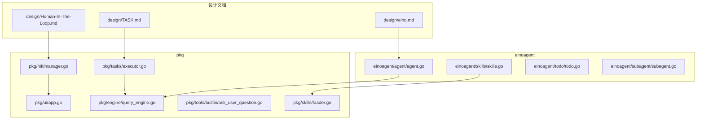
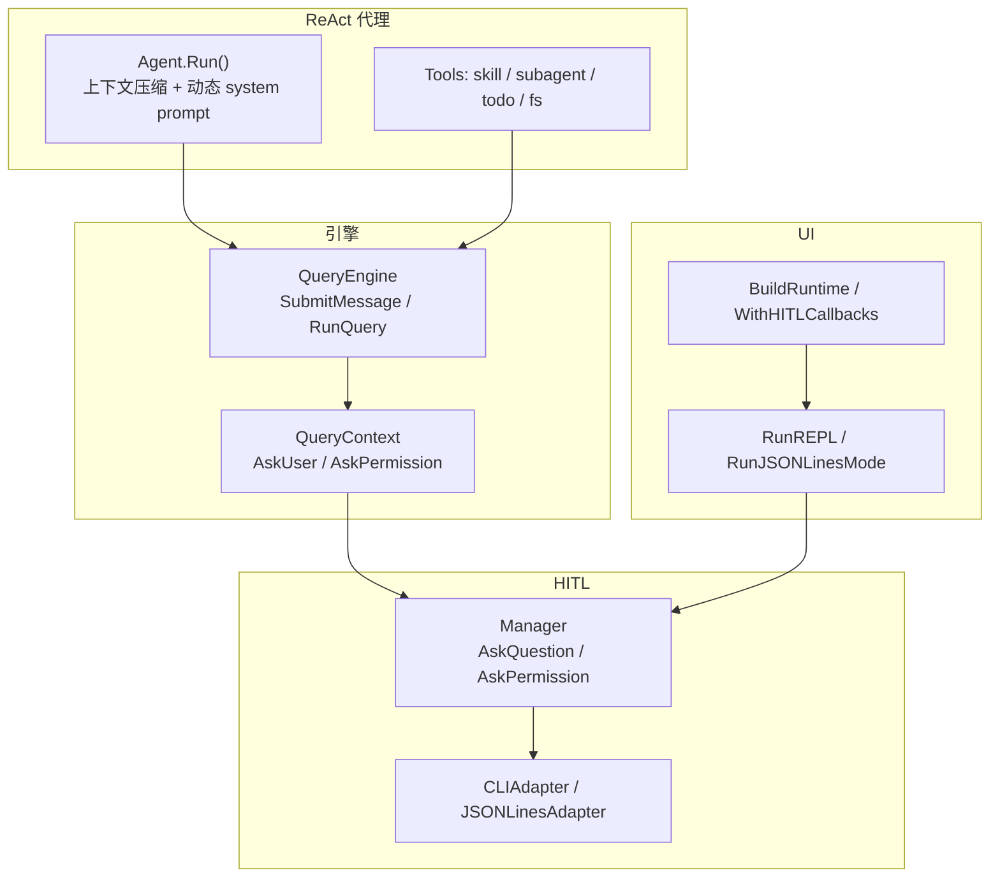
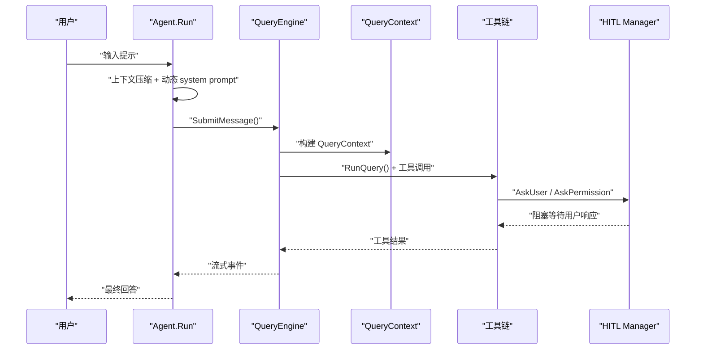
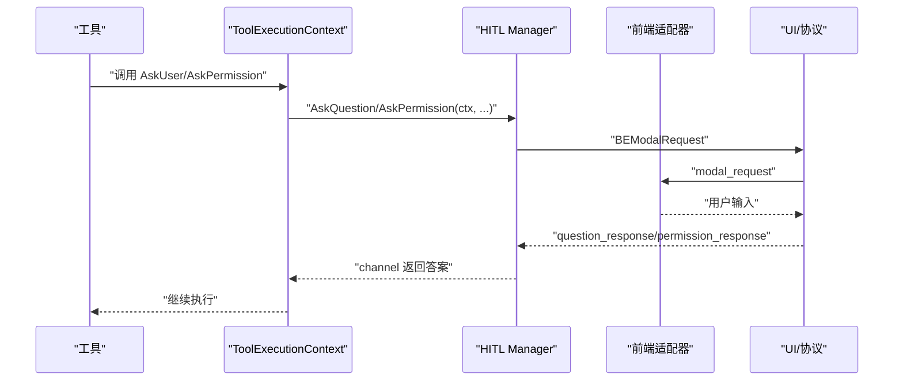
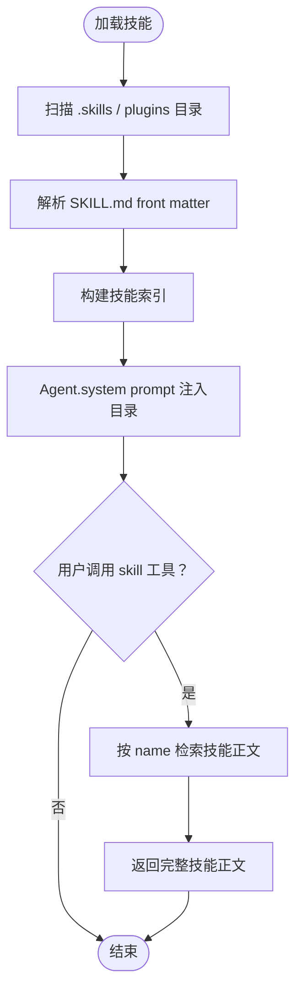
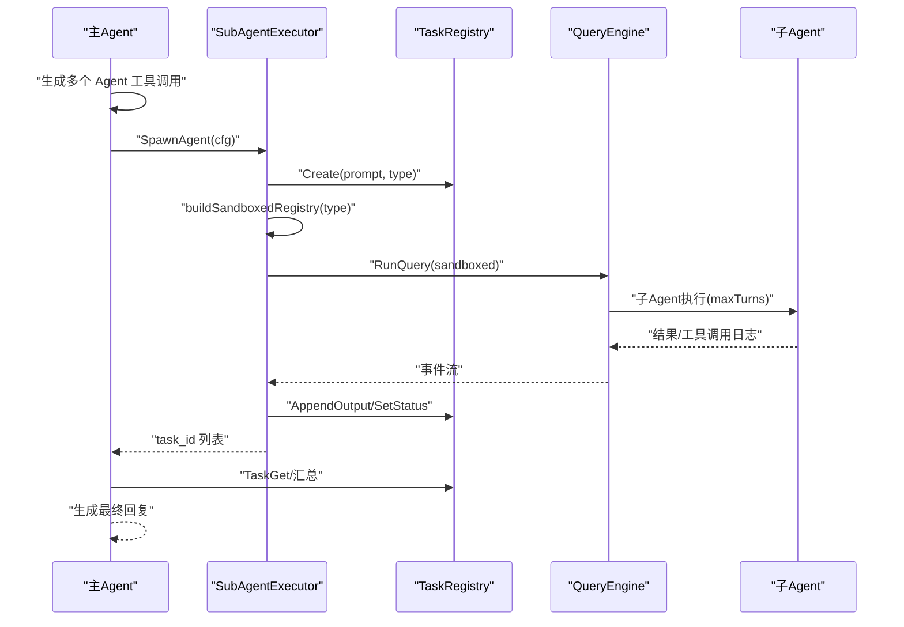
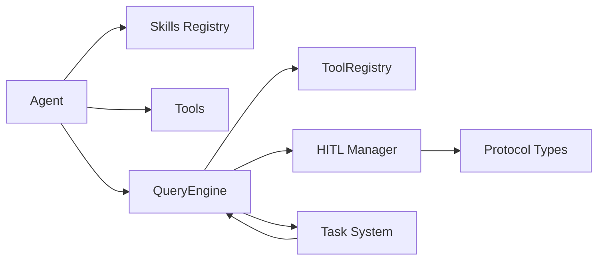

# 核心概念

<cite>
**本文引用的文件**
- [Human-In-The-Loop.md](file://design/Human-In-The-Loop.md)
- [TASK.md](file://design/TASK.md)
- [eino.md](file://design/eino.md)
- [agent.go](file://einoagent/agent/agent.go)
- [skills.go](file://einoagent/skills/skills.go)
- [loader.go](file://pkg/skills/loader.go)
- [manager.go](file://pkg/hitl/manager.go)
- [cli_adapter.go](file://pkg/hitl/cli_adapter.go)
- [jsonlines_adapter.go](file://pkg/hitl/jsonlines_adapter.go)
- [ask_user_question.go](file://pkg/tools/builtin/ask_user_question.go)
- [base.go](file://pkg/tools/base.go)
- [register.go](file://pkg/tools/builtin/register.go)
- [query.go](file://pkg/engine/query.go)
- [query_engine.go](file://pkg/engine/query_engine.go)
- [runtime.go](file://pkg/ui/runtime.go)
- [app.go](file://pkg/ui/app.go)
- [executor.go](file://pkg/tasks/executor.go)
</cite>

## 目录
1. [引言](#引言)
2. [项目结构](#项目结构)
3. [核心组件](#核心组件)
4. [架构总览](#架构总览)
5. [详细组件分析](#详细组件分析)
6. [依赖关系分析](#依赖关系分析)
7. [性能考量](#性能考量)
8. [故障排查指南](#故障排查指南)
9. [结论](#结论)
10. [附录](#附录)

## 引言
本文件面向 OpenHarness Go 项目的核心概念文档，围绕三大主题展开：ReAct 代理框架的工作原理、人机协作（HITL）系统的设计理念、以及渐进式披露技能系统的工作机制。文档旨在帮助初学者快速理解系统如何组织与协作，同时为有经验的开发者提供深入的技术细节与实现映射，确保概念解释与实际代码保持一致。

## 项目结构
OpenHarness Go 采用分层与功能域结合的组织方式：
- 设计文档：位于 design/，包含 HITL、Task、Eino ReAct 等高层设计说明
- einoagent：面向“simple claude code”风格的 ReAct agent 实现，包含 skills、todo、subagent、tools 等
- pkg：核心引擎与基础设施，包括 engine、hitl、tasks、skills、tools、ui 等
- plugins：插件集合，提供可复用的技能与工具

图表来源
- [Human-In-The-Loop.md:14-34](file://design/Human-In-The-Loop.md#L14-L34)
- [TASK.md:10-47](file://design/TASK.md#L10-L47)
- [eino.md:1-295](file://design/eino.md#L1-L295)
- [agent.go:1-180](file://einoagent/agent/agent.go#L1-L180)
- [skills.go:1-181](file://einoagent/skills/skills.go#L1-L181)
- [query_engine.go:1-200](file://pkg/engine/query_engine.go#L1-L200)
- [manager.go:1-148](file://pkg/hitl/manager.go#L1-L148)
- [executor.go:1-224](file://pkg/tasks/executor.go#L1-L224)
- [loader.go:1-198](file://pkg/skills/loader.go#L1-L198)
- [ask_user_question.go:1-677](file://pkg/tools/builtin/ask_user_question.go#L1-L677)
- [app.go:1-200](file://pkg/ui/app.go#L1-L200)

章节来源
- [Human-In-The-Loop.md:1-122](file://design/Human-In-The-Loop.md#L1-L122)
- [TASK.md:1-366](file://design/TASK.md#L1-L366)
- [eino.md:1-295](file://design/eino.md#L1-L295)

## 核心组件
- ReAct 代理框架：以“思考-行动-观察-反思”的循环驱动，结合工具调用与上下文压缩，实现可控、可解释的智能体行为
- 人机协作（HITL）系统：通过统一的 Manager 与前端适配器，实现问题与权限两类阻塞式交互，支持 CLI、JSON-Lines、HTTP/WebSocket 等多种前端形态
- 渐进式披露技能系统：延迟加载技能正文，仅在 system prompt 中暴露技能名与简述，按需加载完整技能内容，避免上下文膨胀

章节来源
- [agent.go:1-180](file://einoagent/agent/agent.go#L1-L180)
- [manager.go:1-148](file://pkg/hitl/manager.go#L1-L148)
- [skills.go:1-181](file://einoagent/skills/skills.go#L1-L181)

## 架构总览
下图展示了 ReAct 代理、HITL 与技能系统的交互关系，以及与引擎、UI 的集成路径。

图表来源
- [agent.go:100-153](file://einoagent/agent/agent.go#L100-L153)
- [query_engine.go:124-200](file://pkg/engine/query_engine.go#L124-L200)
- [query.go:714-731](file://pkg/engine/query.go#L714-L731)
- [manager.go:33-90](file://pkg/hitl/manager.go#L33-L90)
- [cli_adapter.go:410-490](file://pkg/hitl/cli_adapter.go#L410-L490)
- [jsonlines_adapter.go:509-592](file://pkg/hitl/jsonlines_adapter.go#L509-L592)
- [runtime.go:759-790](file://pkg/ui/runtime.go#L759-L790)
- [app.go:122-200](file://pkg/ui/app.go#L122-L200)

## 详细组件分析

### ReAct 代理框架
- 工作原理
  - 代理在每轮推理前执行上下文压缩，构造动态 system prompt，并根据工具调用轮次触发强制反思
  - 使用 React Agent 配置工具集，限制最大步数，确保可控性
- 关键实现
  - Agent.Run：维护历史消息，注入 system prompt，调用 react.NewAgent 执行
  - 上下文压缩与反思：在 MessageModifier 中执行压缩与反思提示拼接
- 与引擎集成
  - QueryEngine.SubmitMessage 将用户消息加入历史，构建 QueryContext 并调用 RunQuery
  - QueryContext 注入 AskUser/AskPermission 回调，贯穿到工具执行上下文

图表来源
- [agent.go:100-153](file://einoagent/agent/agent.go#L100-L153)
- [query_engine.go:124-200](file://pkg/engine/query_engine.go#L124-L200)
- [query.go:714-731](file://pkg/engine/query.go#L714-L731)
- [manager.go:33-90](file://pkg/hitl/manager.go#L33-L90)

章节来源
- [agent.go:100-153](file://einoagent/agent/agent.go#L100-L153)
- [query_engine.go:124-200](file://pkg/engine/query_engine.go#L124-L200)
- [query.go:714-731](file://pkg/engine/query.go#L714-L731)

### 人机协作（HITL）系统
- 设计理念
  - 通过统一的 Manager 管理 per-request 的 Go channel，屏蔽前端差异
  - 问题与权限两类阻塞式交互共享同一套机制，前端通过 ModalKind 区分
- 核心组件
  - Manager：注册/解析请求 ID，阻塞等待与派发答案
  - CLIAdapter：REPL 模式下的 stdin/stdout 交互，支持多选题
  - JSONLinesAdapter：远端/IDE 的 JSON-Lines 协议适配器
  - 协议类型：BackendEvent/FrontendRequest，定义 modal_request/question_response 等事件
- 回调注入
  - 通过 RuntimeOption → QueryEngineOption → QueryContext → ToolExecutionContext 的链路，将 AskUser/AskPermission 注入工具执行环境
- 交互示例
  - REPL 模式：直接注入 CLIAdapter 的 AskUser/AskPermission
  - JSON-Lines 模式：注入 Manager 的 AskQuestion/AskPermission，通过协议与前端通信

图表来源
- [manager.go:33-90](file://pkg/hitl/manager.go#L33-L90)
- [cli_adapter.go:410-490](file://pkg/hitl/cli_adapter.go#L410-L490)
- [jsonlines_adapter.go:509-592](file://pkg/hitl/jsonlines_adapter.go#L509-L592)
- [ask_user_question.go:652-676](file://pkg/tools/builtin/ask_user_question.go#L652-L676)
- [base.go:681-698](file://pkg/tools/base.go#L681-L698)
- [register.go:700-712](file://pkg/tools/builtin/register.go#L700-L712)
- [query.go:714-731](file://pkg/engine/query.go#L714-L731)
- [query_engine.go:733-757](file://pkg/engine/query_engine.go#L733-L757)
- [runtime.go:759-790](file://pkg/ui/runtime.go#L759-L790)
- [app.go:122-200](file://pkg/ui/app.go#L122-L200)

章节来源
- [Human-In-The-Loop.md:14-122](file://design/Human-In-The-Loop.md#L14-L122)
- [manager.go:1-148](file://pkg/hitl/manager.go#L1-L148)
- [cli_adapter.go:1-490](file://pkg/hitl/cli_adapter.go#L1-L490)
- [jsonlines_adapter.go:1-592](file://pkg/hitl/jsonlines_adapter.go#L1-L592)
- [ask_user_question.go:1-677](file://pkg/tools/builtin/ask_user_question.go#L1-L677)
- [base.go:681-698](file://pkg/tools/base.go#L681-L698)
- [register.go:700-712](file://pkg/tools/builtin/register.go#L700-L712)
- [query.go:714-731](file://pkg/engine/query.go#L714-L731)
- [query_engine.go:733-757](file://pkg/engine/query_engine.go#L733-L757)
- [runtime.go:759-790](file://pkg/ui/runtime.go#L759-L790)
- [app.go:122-200](file://pkg/ui/app.go#L122-L200)

### 渐进式披露技能系统
- 设计目标
  - 仅在 system prompt 中列出技能名与简述，避免一次性塞满上下文
  - 通过 skill 工具按需加载完整技能正文，降低 token 消耗
- 实现机制
  - 加载器：扫描 .skills 或 plugins 下的 SKILL.md，解析 front matter，构建技能索引
  - 注册表：提供 RenderCatalog 与 Get，分别用于目录渲染与按名检索
  - 工具：skill 工具接收 name 参数，返回技能完整正文
- 与代理集成
  - Agent 在构建 system prompt 时调用 RenderCatalog，注入可用技能清单
  - 工具执行时，按需加载正文，避免上下文膨胀

图表来源
- [loader.go:21-60](file://pkg/skills/loader.go#L21-L60)
- [loader.go:62-124](file://pkg/skills/loader.go#L62-L124)
- [loader.go:126-197](file://pkg/skills/loader.go#L126-L197)
- [skills.go:37-70](file://einoagent/skills/skills.go#L37-L70)
- [skills.go:95-106](file://einoagent/skills/skills.go#L95-L106)
- [skills.go:160-180](file://einoagent/skills/skills.go#L160-L180)
- [agent.go:158-179](file://einoagent/agent/agent.go#L158-L179)

章节来源
- [loader.go:1-198](file://pkg/skills/loader.go#L1-L198)
- [skills.go:1-181](file://einoagent/skills/skills.go#L1-L181)
- [agent.go:158-179](file://einoagent/agent/agent.go#L158-L179)

### Task 系统（子代理与并行执行）
- 设计理念
  - 以 Task 代替 TodoWrite 的扁平列表，批量创建任务，每个任务启动独立子 Agent 并行执行，最后汇总结果
  - 通过工具白名单沙箱隔离子 Agent，控制其工具访问范围
- 核心组件
  - TaskPacket：结构化任务契约（objective、scope、策略等）
  - TaskRegistry：线程安全的任务注册表，支持 CRUD、输出与消息管理
  - SubAgentExecutor：子 Agent 执行器，负责构建受限工具集、运行 QueryEngine、写回结果
  - 白名单：根据子 Agent 类型选择允许的工具集合
- 执行流程
  - 主 Agent 生成多个 Agent 工具调用
  - SubAgentExecutor.SpawnAgent 并发启动子 Agent
  - 子 Agent 在受限工具集内执行，最多 maxTurns 轮
  - 结果写回 TaskRegistry，主循环收集并汇总

图表来源
- [TASK.md:148-218](file://design/TASK.md#L148-L218)
- [executor.go:33-76](file://pkg/tasks/executor.go#L33-L76)
- [executor.go:78-137](file://pkg/tasks/executor.go#L78-L137)
- [executor.go:139-176](file://pkg/tasks/executor.go#L139-L176)
- [executor.go:178-204](file://pkg/tasks/executor.go#L178-L204)

章节来源
- [TASK.md:1-366](file://design/TASK.md#L1-L366)
- [executor.go:1-224](file://pkg/tasks/executor.go#L1-L224)

## 依赖关系分析
- 组件耦合
  - Agent 依赖 skills 注册表与工具集，通过 system prompt 注入技能目录
  - QueryEngine 依赖工具注册表与权限检查器，承载 AskUser/AskPermission 回调
  - HITL Manager 与前端适配器解耦，通过协议类型与回调注入实现前端无关
  - Task 系统通过 SubAgentExecutor 与 QueryEngine 集成，实现子 Agent 的沙箱执行
- 外部依赖
  - Eino ReAct 框架：Agent.Run 使用 react.NewAgent 与工具节点组合
  - JSON-Lines 协议：前端与后端通过统一事件类型交换 modal_request/question_response

图表来源
- [agent.go:1-180](file://einoagent/agent/agent.go#L1-L180)
- [query_engine.go:1-200](file://pkg/engine/query_engine.go#L1-L200)
- [manager.go:1-148](file://pkg/hitl/manager.go#L1-L148)
- [executor.go:1-224](file://pkg/tasks/executor.go#L1-L224)

章节来源
- [agent.go:1-180](file://einoagent/agent/agent.go#L1-L180)
- [query_engine.go:1-200](file://pkg/engine/query_engine.go#L1-L200)
- [manager.go:1-148](file://pkg/hitl/manager.go#L1-L148)
- [executor.go:1-224](file://pkg/tasks/executor.go#L1-L224)

## 性能考量
- 上下文压缩
  - ReAct 代理在每轮推理前执行压缩，减少 token 使用，避免超出模型上下文长度
- 自动压缩阈值
  - QueryEngine 中可设置自动压缩阈值，当消息 token 数超过阈值时进行压缩
- 工具调用限制
  - 子 Agent 默认最大步数限制，防止无限循环与资源消耗
- Token 计费追踪
  - QueryEngine 内置 CostTracker，累计输入/输出 token，便于成本控制

章节来源
- [agent.go:107-130](file://einoagent/agent/agent.go#L107-L130)
- [query_engine.go:174-200](file://pkg/engine/query_engine.go#L174-L200)

## 故障排查指南
- HITL 无响应
  - 检查前端适配器是否正确注入 Manager 的 EmitFn
  - 确认 FrontendRequest 的 request_id 是否匹配 Manager 的注册项
  - 查看 PendingCount 是否异常增长
- 问题与权限混用
  - 确保 ModalKind 正确区分 question 与 permission
  - 检查 ResolveQuestion/ResolvePermission 的通道类型与派发逻辑
- 技能加载失败
  - 确认 SKILL.md front matter 格式正确
  - 检查 plugins 目录结构与子技能命名冲突
- 子 Agent 执行异常
  - 检查工具白名单是否正确构建
  - 关注 panic 恢复与错误写回 TaskRegistry 的逻辑

章节来源
- [manager.go:92-142](file://pkg/hitl/manager.go#L92-L142)
- [cli_adapter.go:410-490](file://pkg/hitl/cli_adapter.go#L410-L490)
- [jsonlines_adapter.go:529-592](file://pkg/hitl/jsonlines_adapter.go#L529-L592)
- [loader.go:126-197](file://pkg/skills/loader.go#L126-L197)
- [executor.go:78-137](file://pkg/tasks/executor.go#L78-L137)

## 结论
OpenHarness Go 通过 ReAct 代理框架、HITL 人机协作系统与渐进式披露技能系统，构建了可控、可解释且可扩展的智能体平台。ReAct 代理强调“思考-行动-观察-反思”的循环与上下文压缩；HITL 通过统一的 Manager 与前端适配器实现跨前端的一致交互；技能系统通过延迟加载避免上下文膨胀。Task 系统进一步将任务拆分为子代理并行执行，提升复杂任务的处理效率。这些概念与实现相互支撑，形成清晰的知识体系与实践路径。

## 附录
- 相关设计文档
  - [Human-In-The-Loop.md:1-122](file://design/Human-In-The-Loop.md#L1-L122)
  - [TASK.md:1-366](file://design/TASK.md#L1-L366)
  - [eino.md:1-295](file://design/eino.md#L1-L295)
- 关键实现文件
  - [agent.go:1-180](file://einoagent/agent/agent.go#L1-L180)
  - [skills.go:1-181](file://einoagent/skills/skills.go#L1-L181)
  - [manager.go:1-148](file://pkg/hitl/manager.go#L1-L148)
  - [executor.go:1-224](file://pkg/tasks/executor.go#L1-L224)
  - [query_engine.go:1-200](file://pkg/engine/query_engine.go#L1-L200)