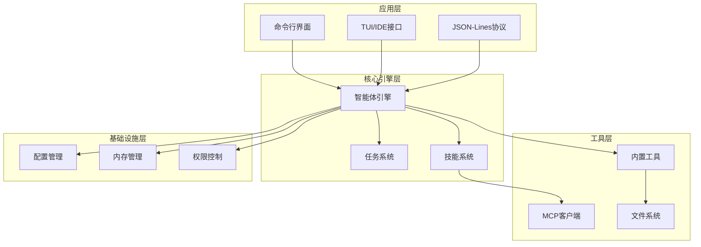
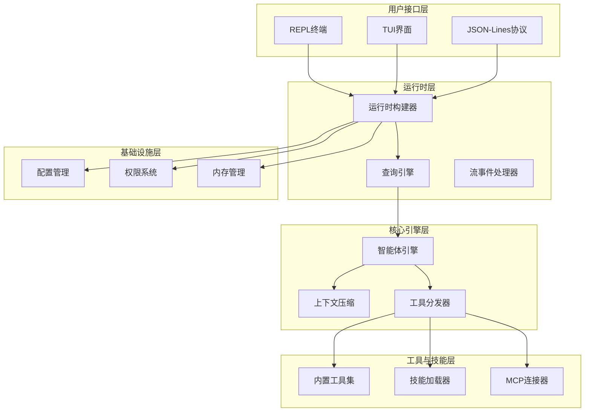
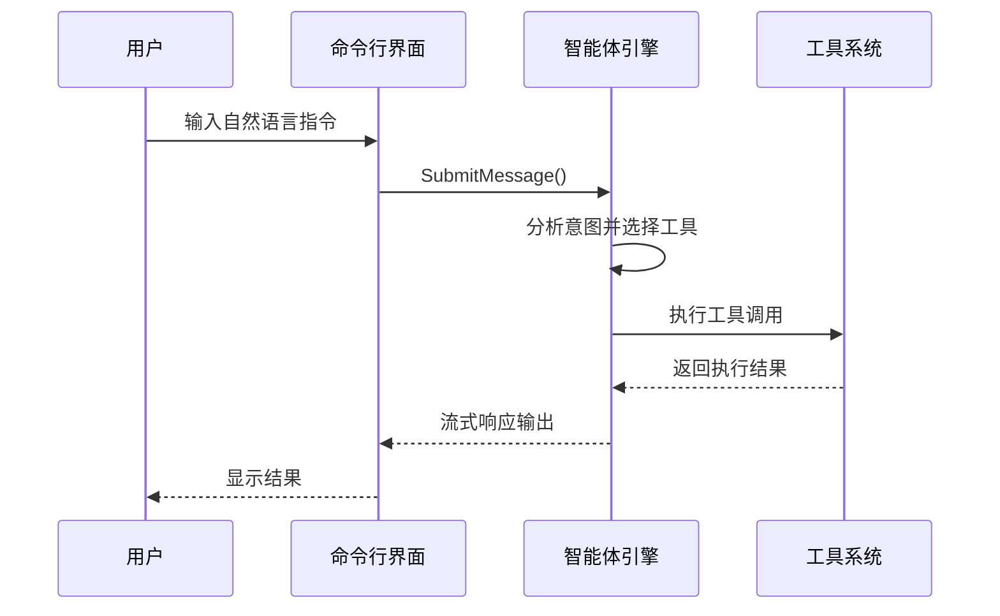
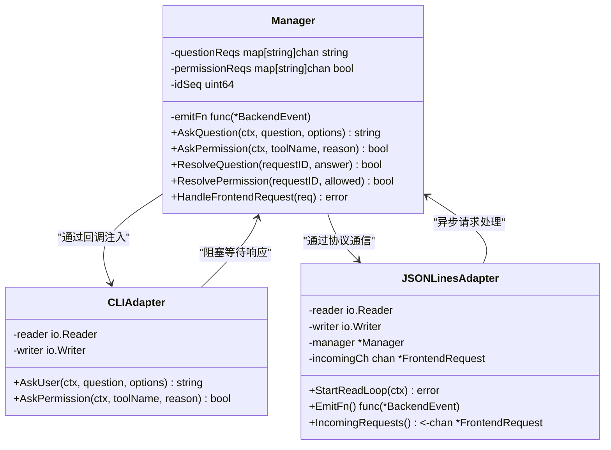
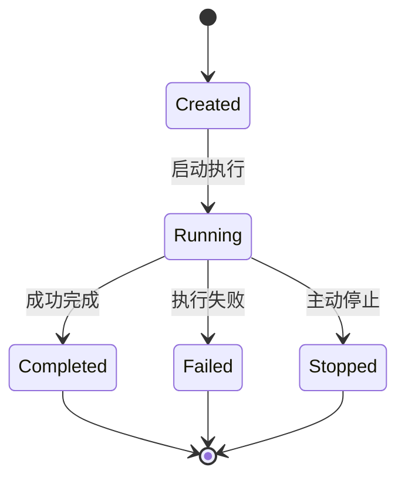
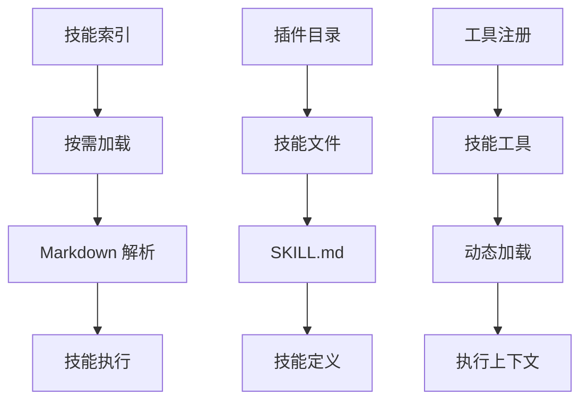
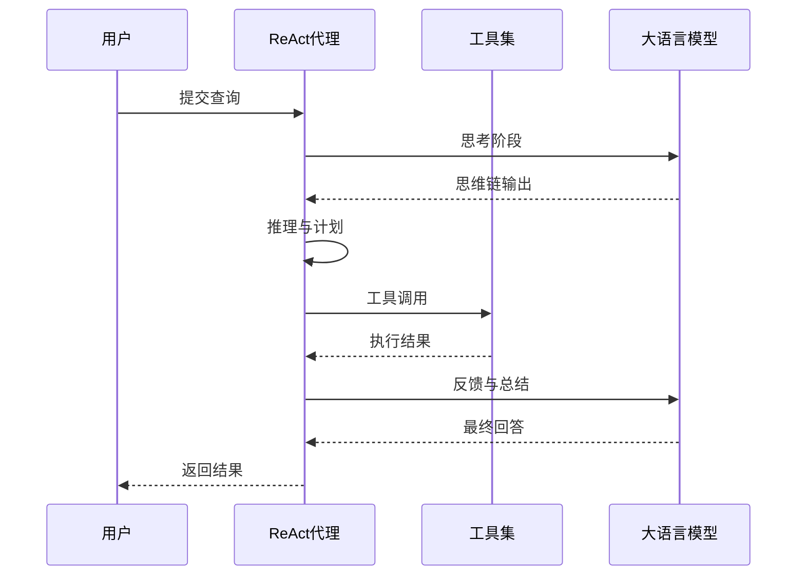
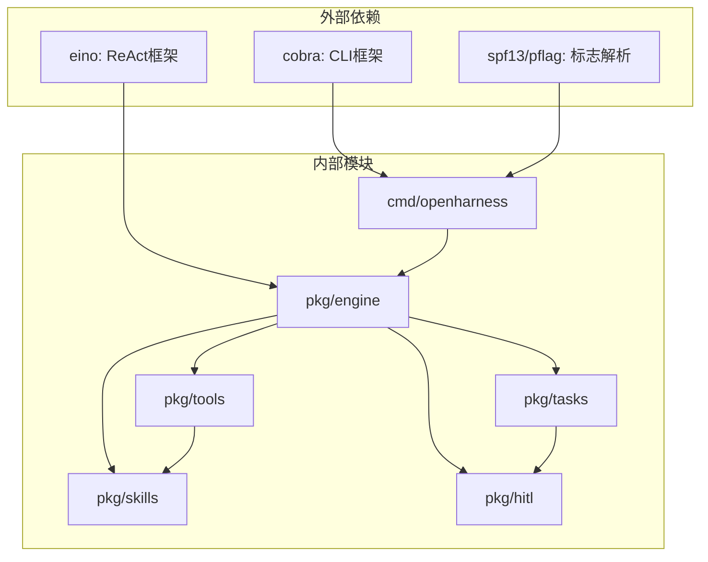

# 项目介绍

<cite>
**本文档引用的文件**
- [README.md](file://README.md)
- [cmd/openharness/main.go](file://cmd/openharness/main.go)
- [cmd/einoagent/main.go](file://cmd/einoagent/main.go)
- [pkg/config/settings.go](file://pkg/config/settings.go)
- [pkg/ui/app.go](file://pkg/ui/app.go)
- [pkg/tools/builtin/register.go](file://pkg/tools/builtin/register.go)
- [pkg/tools/builtin/file_read.go](file://pkg/tools/builtin/file_read.go)
- [pkg/tools/builtin/bash.go](file://pkg/tools/builtin/bash.go)
- [pkg/hitl/manager.go](file://pkg/hitl/manager.go)
- [pkg/hitl/cli_adapter.go](file://pkg/hitl/cli_adapter.go)
- [pkg/hitl/jsonlines_adapter.go](file://pkg/hitl/jsonlines_adapter.go)
- [pkg/tasks/registry.go](file://pkg/tasks/registry.go)
- [pkg/tasks/executor.go](file://pkg/tasks/executor.go)
- [design/Human-In-The-Loop.md](file://design/Human-In-The-Loop.md)
- [design/TASK.md](file://design/TASK.md)
- [design/eino.md](file://design/eino.md)
- [plugins/anthropic/skills/code-review/SKILL.md](file://plugins/anthropic/skills/code-review/SKILL.md)
- [go.mod](file://go.mod)
</cite>

## 目录
1. [简介](#简介)
2. [项目结构](#项目结构)
3. [核心组件](#核心组件)
4. [架构总览](#架构总览)
5. [详细组件分析](#详细组件分析)
6. [依赖关系分析](#依赖关系分析)
7. [性能考量](#性能考量)
8. [故障排除指南](#故障排除指南)
9. [结论](#结论)
10. [附录](#附录)

## 简介
OpenHarness Go 是一个基于 Go 语言开发的高性能、高可扩展的 AI 编码助手平台。该项目实现了强大的多轮智能体引擎，原生支持文件操作、Shell 执行等工具，同时完美集成了 MCP（Model Context Protocol）、渐进式披露技能系统以及并行任务与子智能体体系。OpenHarness 的目标是为开发者提供一个受控、安全且具备强大上下文管理能力的执行环境，适用于自动化代码开发、代码审查、系统管理以及复杂并行任务编排。

### 核心价值主张
- **智能代码生成**：通过 ReAct 代理框架和多轮对话实现高质量的代码生成
- **文件操作能力**：安全的文件读写、搜索和编辑功能
- **技能学习系统**：基于 Markdown 的渐进式披露技能，按需加载
- **人机协作**：完善的 HITL（Human-In-The-Loop）机制，支持多前端交互
- **并行任务处理**：从串行 Todo 升级为并行 Task 架构

### 目标用户群体
- **高级开发者**：需要高效代码生成和审查工具的专业程序员
- **技术团队**：寻求自动化代码审查和质量保证的开发团队
- **系统管理员**：需要批量文件操作和系统管理的运维人员
- **AI 应用开发者**：希望构建自己的 AI 编码助手的工程师

## 项目结构
OpenHarness Go 采用模块化设计，主要分为以下几个层次：



**图表来源**
- [cmd/openharness/main.go:15-102](file://cmd/openharness/main.go#L15-L102)
- [pkg/ui/app.go:122-238](file://pkg/ui/app.go#L122-L238)

**章节来源**
- [README.md:16-41](file://README.md#L16-L41)
- [go.mod:1-43](file://go.mod#L1-43)

## 核心组件
OpenHarness Go 的核心组件包括智能体引擎、工具系统、任务管理和技能系统四大支柱。

### 智能体引擎（Agent Engine）
智能体引擎是整个系统的大脑，负责：
- 多轮对话状态管理
- 上下文压缩与优化
- 工具调用调度
- 流式响应输出

### 工具系统（Tool System）
内置多种实用工具：
- 文件操作：读取、写入、编辑、搜索
- Shell 执行：安全的命令执行环境
- 任务管理：创建、查询、停止任务
- 人类交互：问答、权限请求

### 任务系统（Task System）
从串行 Todo 升级为并行 Task 架构：
- 结构化任务契约
- 子智能体并行执行
- 工具白名单沙箱
- 任务状态跟踪

### 技能系统（Skill System）
基于 Markdown 的渐进式披露技能：
- 分层索引机制
- 按需加载
- 社区生态丰富

**章节来源**
- [README.md:7-15](file://README.md#L7-L15)
- [pkg/config/settings.go:97-125](file://pkg/config/settings.go#L97-L125)

## 架构总览
OpenHarness Go 采用分层架构设计，确保了高度的模块化和可扩展性：



**图表来源**
- [pkg/ui/app.go:18-121](file://pkg/ui/app.go#L18-L121)
- [pkg/ui/app.go:191-238](file://pkg/ui/app.go#L191-L238)

## 详细组件分析

### 命令行界面与运行模式
OpenHarness 提供三种主要运行模式：

#### 交互式 REPL 模式


**图表来源**
- [cmd/openharness/main.go:46-76](file://cmd/openharness/main.go#L46-L76)
- [pkg/ui/app.go:122-181](file://pkg/ui/app.go#L122-L181)

#### 非交互打印模式
适用于批处理和自动化场景，支持多种输出格式：
- 文本格式：标准输出
- JSON 格式：结构化输出
- 流式 JSON：实时事件流

#### JSON-Lines 协议模式
为 TUI/IDE 提供标准化的双向通信协议，支持：
- 事件驱动的交互
- 多种前端适配器
- 远程协作支持

**章节来源**
- [cmd/openharness/main.go:15-102](file://cmd/openharness/main.go#L15-L102)
- [pkg/ui/app.go:18-121](file://pkg/ui/app.go#L18-L121)

### 人机协作系统（HITL）
OpenHarness 实现了完整的人机协作机制，支持多种交互方式：

#### 核心架构设计


**图表来源**
- [pkg/hitl/manager.go:246-384](file://pkg/hitl/manager.go#L246-L384)
- [pkg/hitl/cli_adapter.go:400-491](file://pkg/hitl/cli_adapter.go#L400-L491)
- [pkg/hitl/jsonlines_adapter.go:509-592](file://pkg/hitl/jsonlines_adapter.go#L509-L592)

#### 多选题交互机制
HITL 系统支持灵活的多选题交互：
- CLI 模式：数字选择 + 自由文本输入
- JSON-Lines 模式：结构化协议交互
- 权限请求：统一的许可机制

**章节来源**
- [design/Human-In-The-Loop.md:94-122](file://design/Human-In-The-Loop.md#L94-L122)
- [pkg/hitl/cli_adapter.go:410-456](file://pkg/hitl/cli_adapter.go#L410-L456)

### 任务系统与子智能体
OpenHarness 的任务系统实现了从串行 Todo 到并行 Task 的重大升级：

#### 任务生命周期管理


**图表来源**
- [pkg/tasks/registry.go:119-146](file://pkg/tasks/registry.go#L119-L146)

#### 子智能体执行器
子智能体系统提供了强大的并行处理能力：
- **Explore 模式**：只读工具集，专注代码探索
- **Plan 模式**：规划与设计专用
- **Verification 模式**：测试验证专用
- **General 模式**：通用任务处理

**章节来源**
- [design/TASK.md:148-218](file://design/TASK.md#L148-L218)
- [pkg/tasks/executor.go:173-218](file://pkg/tasks/executor.go#L173-L218)

### 技能系统与渐进式披露
OpenHarness 的技能系统采用了创新的渐进式披露机制：

#### 分层索引架构


**图表来源**
- [plugins/anthropic/skills/code-review/SKILL.md:1-94](file://plugins/anthropic/skills/code-review/SKILL.md#L1-L94)

#### 技能执行流程
1. **索引发现**：系统扫描插件目录，建立技能索引
2. **按需加载**：当大模型需要特定技能时才加载
3. **上下文注入**：将技能相关信息注入到执行环境中
4. **执行与反馈**：执行技能并返回结果

**章节来源**
- [README.md:74-102](file://README.md#L74-L102)
- [pkg/tools/builtin/register.go:7-29](file://pkg/tools/builtin/register.go#L7-L29)

### ReAct 代理框架应用
OpenHarness 基于 cloudwego/eino 的 ReAct 框架构建：

#### ReAct 执行流程


**图表来源**
- [design/eino.md:93-140](file://design/eino.md#L93-L140)

**章节来源**
- [cmd/einoagent/main.go:25-107](file://cmd/einoagent/main.go#L25-L107)
- [design/eino.md:1-295](file://design/eino.md#L1-L295)

## 依赖关系分析
OpenHarness Go 采用模块化依赖设计，确保了良好的可维护性和扩展性：



**图表来源**
- [go.mod:5-42](file://go.mod#L5-L42)

**章节来源**
- [go.mod:1-43](file://go.mod#L1-L43)

## 性能考量
OpenHarness Go 在性能方面采用了多项优化策略：

### 上下文压缩机制
系统实现了五阶段的上下文压缩管道：
1. **L1 截断**：结果截断
2. **L2 Snip**：内容裁剪
3. **L3 微压缩**：轻量级压缩
4. **L4 坍缩**：结构化压缩
5. **L5 LLM 总结**：智能摘要

### 并发执行优化
- **工具并发**：支持多个工具并行执行
- **子智能体并行**：任务级别的并行处理
- **内存管理**：智能的内存使用监控

### 缓存与持久化
- **配置缓存**：减少磁盘访问
- **技能缓存**：按需加载机制
- **会话持久化**：支持中断恢复

## 故障排除指南
针对常见的使用问题，提供以下解决方案：

### API 密钥配置问题
**症状**：无法连接到 LLM 服务
**解决方案**：
1. 检查环境变量 `ANTHROPIC_API_KEY`
2. 验证配置文件中的 API 密钥设置
3. 使用 `openharness auth status` 检查认证状态

### 权限不足错误
**症状**：工具执行失败或被拒绝
**解决方案**：
1. 检查权限模式配置
2. 验证工具白名单设置
3. 审核路径规则配置

### 内存溢出问题
**症状**：长时间运行后性能下降
**解决方案**：
1. 启用自动上下文压缩
2. 调整记忆设置
3. 检查工具执行时间

**章节来源**
- [pkg/config/settings.go:144-154](file://pkg/config/settings.go#L144-L154)
- [pkg/ui/app.go:63-90](file://pkg/ui/app.go#L63-L90)

## 结论
OpenHarness Go 代表了 AI 编码助手领域的最新进展，通过其创新的架构设计和丰富的功能特性，为开发者提供了强大而灵活的工具。项目的核心优势包括：

1. **全面的功能覆盖**：从智能代码生成到复杂任务编排
2. **强大的安全性**：完善的权限控制和沙箱机制
3. **优秀的扩展性**：模块化设计支持无限扩展
4. **良好的用户体验**：多前端支持和直观的交互界面

随着项目的持续发展，OpenHarness Go 将继续演进，为 AI 编码助手领域带来更多的创新和突破。

## 附录

### 快速开始示例
```bash
# 构建项目
go build -o openharness ./cmd/openharness/main.go

# 运行交互式 REPL
./openharness

# 运行单次指令
./openharness --prompt "帮我列出当前目录的文件并用 karpathy-guidelines 技能进行审查"
```

### 配置文件示例
```json
{
  "provider": "openai-compatible",
  "base_url": "https://openrouter.ai/api/v1",
  "api_key": "sk-xxxx",
  "model": "meta-llama/llama-3.3-70b-instruct:free"
}
```

### 支持的技能类型
- **代码审查**：并行代码审查和质量评估
- **代码简化**：复杂代码的重构和优化
- **前端设计**：React/UI 开发最佳实践
- **Web 应用测试**：自动化测试和验证
- **系统调试**：深度 Bug 分析和排查