# 项目概述

<cite>
**本文档引用的文件**
- [go.mod](file://go.mod)
- [cmd/openharness/main.go](file://cmd/openharness/main.go)
- [cmd/einoagent/main.go](file://cmd/einoagent/main.go)
- [pkg/config/settings.go](file://pkg/config/settings.go)
- [pkg/ui/app.go](file://pkg/ui/app.go)
- [pkg/engine/query_engine.go](file://pkg/engine/query_engine.go)
- [pkg/tools/base.go](file://pkg/tools/base.go)
- [pkg/tools/builtin/register.go](file://pkg/tools/builtin/register.go)
- [pkg/hitl/manager.go](file://pkg/hitl/manager.go)
- [pkg/hitl/cli_adapter.go](file://pkg/hitl/cli_adapter.go)
- [pkg/hitl/jsonlines_adapter.go](file://pkg/hitl/jsonlines_adapter.go)
- [pkg/mcp/client.go](file://pkg/mcp/client.go)
- [pkg/skills/loader.go](file://pkg/skills/loader.go)
- [pkg/memory/manager.go](file://pkg/memory/manager.go)
- [pkg/services/compact.go](file://pkg/services/compact.go)
- [design/Human-In-The-Loop.md](file://design/Human-In-The-Loop.md)
- [design/TASK.md](file://design/TASK.md)
- [design/eino.md](file://design/eino.md)
</cite>

## 目录
1. [引言](#引言)
2. [项目结构](#项目结构)
3. [核心组件](#核心组件)
4. [架构总览](#架构总览)
5. [详细组件分析](#详细组件分析)
6. [依赖分析](#依赖分析)
7. [性能考虑](#性能考虑)
8. [故障排除指南](#故障排除指南)
9. [结论](#结论)
10. [附录](#附录)

## 引言

OpenHarness Go 是一个开源的 AI 编码助手项目，基于云雀科技的 Eino ReAct 框架构建。该项目旨在解决开发者在 AI 编码辅助过程中的核心痛点，提供智能代码生成、文件操作、技能学习等能力。

### 核心价值主张

**智能代码生成与编辑**
- 基于 ReAct 框架的智能代理系统
- 支持多模态交互（文本、文件、工具调用）
- 提供渐进式披露技能系统，按需学习和应用专业技能

**人机协作 (HITL) 系统**
- 实时的人类在环控制机制
- 支持多种前端适配器（CLI、JSON-Lines、HTTP）
- 完整的权限管理和安全控制

**任务驱动开发**
- 基于 Task 的并行执行架构
- 子代理系统实现专业化分工
- 自动化的上下文压缩和缓存机制

### 设计理念

项目采用"渐进式披露"的设计理念，通过技能系统让 AI 代理能够逐步学习和掌握复杂的编程任务。每个技能都是一个独立的模块，可以单独训练、测试和部署。

## 项目结构

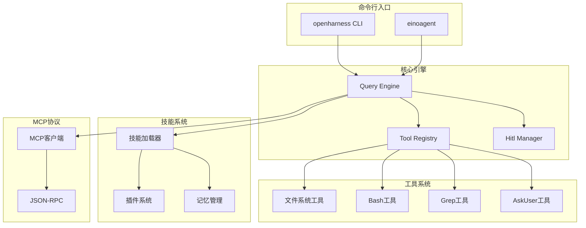

**图表来源**
- [cmd/openharness/main.go:15-102](file://cmd/openharness/main.go#L15-L102)
- [cmd/einoagent/main.go:25-107](file://cmd/einoagent/main.go#L25-L107)
- [pkg/engine/query_engine.go:49-122](file://pkg/engine/query_engine.go#L49-L122)

### 主要模块组织

项目采用按功能域划分的模块化架构：

**命令行接口层**
- `cmd/` - 应用程序入口点
- `pkg/ui/` - 用户界面抽象层

**核心引擎层**
- `pkg/engine/` - 查询引擎和对话管理
- `pkg/tools/` - 工具系统和注册表
- `pkg/hitl/` - 人机协作管理系统

**功能服务层**
- `pkg/skills/` - 技能加载和管理
- `pkg/memory/` - 记忆和上下文管理
- `pkg/services/` - 上下文压缩和缓存服务

**协议集成层**
- `pkg/mcp/` - MCP 协议客户端
- `pkg/protocol/` - 协议定义和类型

**设计文档层**
- `design/` - 架构设计文档
- `docs/` - 技术文档

**Section sources**
- [go.mod:1-43](file://go.mod#L1-L43)
- [cmd/openharness/main.go:15-102](file://cmd/openharness/main.go#L15-L102)

## 核心组件

### ReAct 代理框架

OpenHarness 基于 Eino ReAct 框架构建，实现了智能的推理-行动循环：

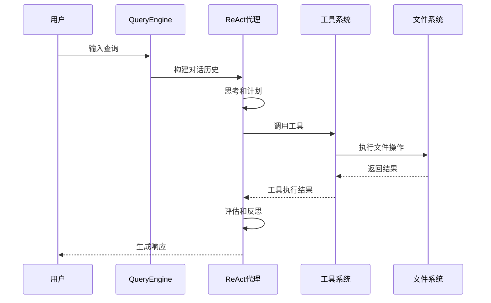

**图表来源**
- [design/eino.md:93-140](file://design/eino.md#L93-L140)
- [pkg/engine/query_engine.go:124-205](file://pkg/engine/query_engine.go#L124-L205)

### 人机协作 (HITL) 系统

HITL 系统提供了灵活的人类在环控制机制：

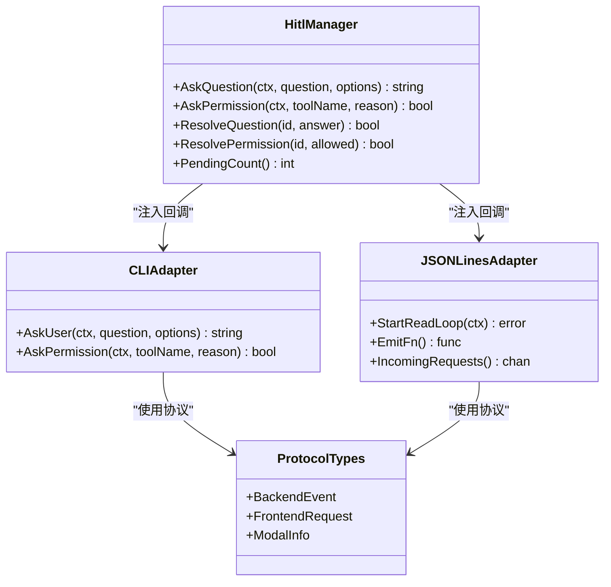

**图表来源**
- [pkg/hitl/manager.go:246-384](file://pkg/hitl/manager.go#L246-L384)
- [pkg/hitl/cli_adapter.go:400-491](file://pkg/hitl/cli_adapter.go#L400-L491)
- [pkg/hitl/jsonlines_adapter.go:509-592](file://pkg/hitl/jsonlines_adapter.go#L509-L592)

### 渐进式披露技能系统

技能系统采用渐进式学习模式，支持技能的动态加载和组合：

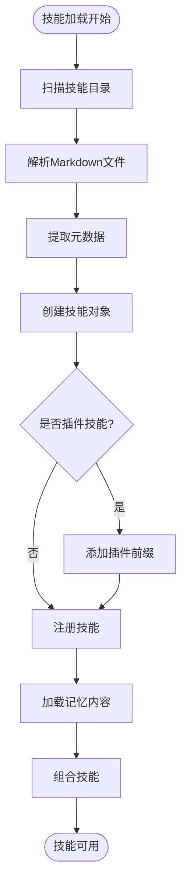

**图表来源**
- [pkg/skills/loader.go:21-124](file://pkg/skills/loader.go#L21-L124)

**Section sources**
- [design/Human-In-The-Loop.md:14-123](file://design/Human-In-The-Loop.md#L14-L123)
- [design/TASK.md:59-218](file://design/TASK.md#L59-L218)
- [pkg/skills/loader.go:13-198](file://pkg/skills/loader.go#L13-L198)

## 架构总览

OpenHarness 采用分层架构设计，确保了良好的可扩展性和维护性：

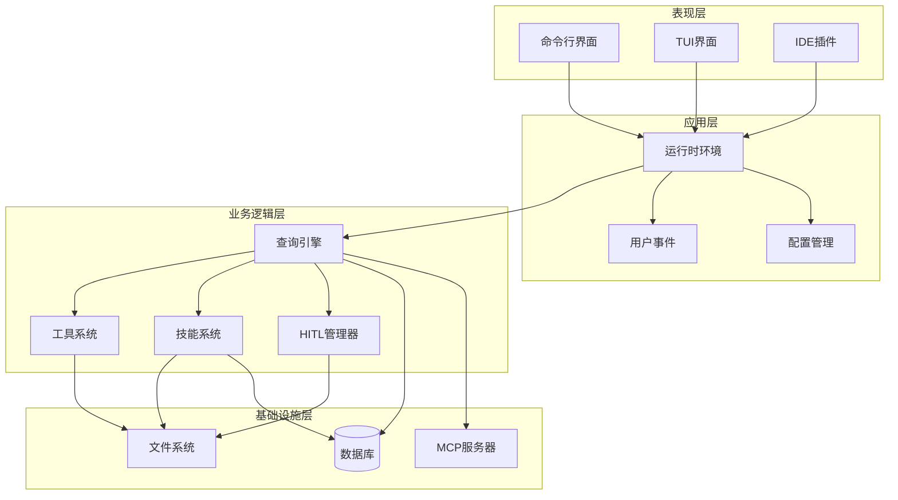

**图表来源**
- [pkg/ui/app.go:122-238](file://pkg/ui/app.go#L122-L238)
- [pkg/engine/query_engine.go:49-122](file://pkg/engine/query_engine.go#L49-L122)

### 系统边界

系统边界清晰地定义了各个组件的职责范围：

**内部边界**
- 查询引擎：负责对话管理和工具调度
- 工具系统：提供文件操作和系统调用能力
- 技能系统：管理 AI 代理的专业技能

**外部边界**
- MCP 协议：与外部工具和服务通信
- 文件系统：访问和修改项目文件
- 环境变量：配置和认证信息

## 详细组件分析

### 配置管理系统

配置系统提供了灵活的设置管理机制：

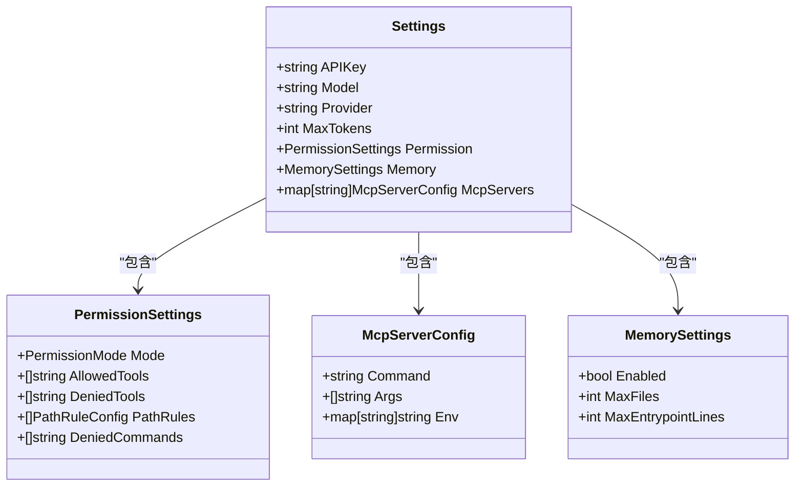

**图表来源**
- [pkg/config/settings.go:97-142](file://pkg/config/settings.go#L97-L142)

### 工具系统架构

工具系统采用插件化设计，支持动态注册和执行：

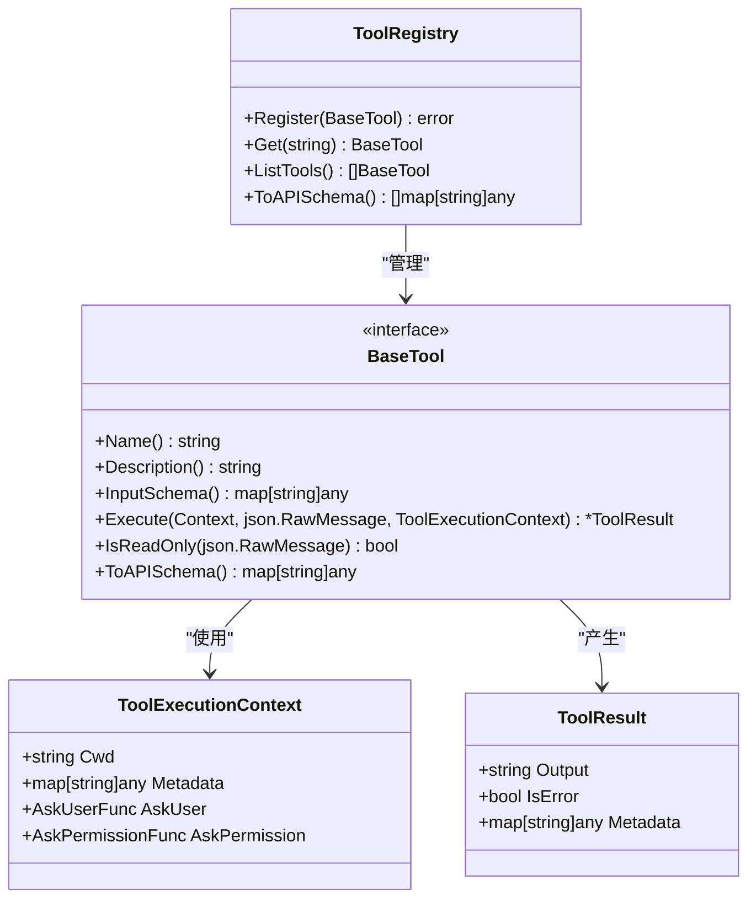

**图表来源**
- [pkg/tools/base.go:81-132](file://pkg/tools/base.go#L81-L132)

### 上下文压缩系统

为了优化性能和成本，系统实现了多层次的上下文压缩机制：

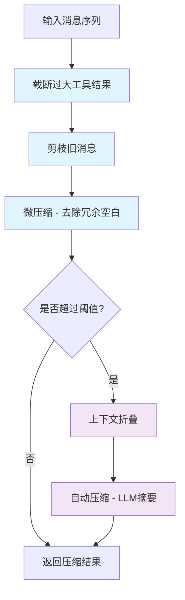

**图表来源**
- [pkg/services/compact.go:74-115](file://pkg/services/compact.go#L74-L115)

**Section sources**
- [pkg/config/settings.go:97-212](file://pkg/config/settings.go#L97-L212)
- [pkg/tools/base.go:17-132](file://pkg/tools/base.go#L17-L132)
- [pkg/services/compact.go:12-330](file://pkg/services/compact.go#L12-L330)

### MCP 协议集成

MCP (Model Context Protocol) 集成了外部工具和服务：

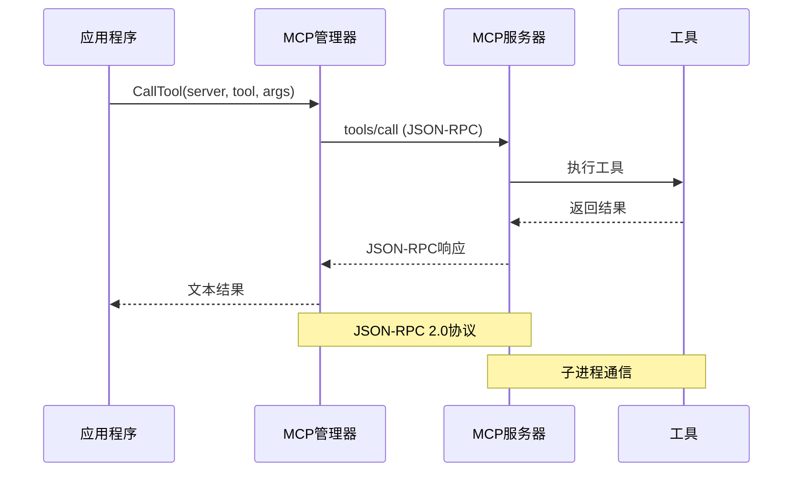

**图表来源**
- [pkg/mcp/client.go:196-230](file://pkg/mcp/client.go#L196-L230)

**Section sources**
- [pkg/mcp/client.go:115-440](file://pkg/mcp/client.go#L115-L440)

## 依赖分析

项目使用 Go 模块系统管理依赖关系：

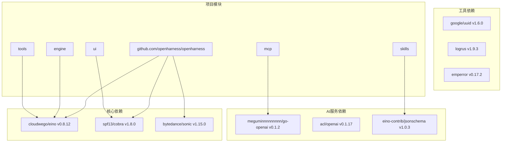

**图表来源**
- [go.mod:1-43](file://go.mod#L1-L43)

### 外部依赖关系

项目的主要外部依赖包括：

**核心框架依赖**
- Eino ReAct 框架：提供智能代理和对话管理能力
- Cobra CLI 框架：提供命令行界面功能

**工具和库依赖**
- Sonic JSON 库：高性能 JSON 处理
- UUID 生成器：唯一标识符管理
- Logrus 日志库：结构化日志记录

**AI 服务集成**
- OpenAI 客户端：与 OpenAI API 通信
- ACL 组件：访问控制和权限管理
- JSON Schema：输入验证和类型检查

**Section sources**
- [go.mod:1-43](file://go.mod#L1-L43)

## 性能考虑

### 上下文压缩策略

系统实现了五层压缩管道来优化性能：

1. **截断阶段**：限制工具结果大小
2. **剪枝阶段**：移除过旧的消息
3. **微压缩阶段**：去除冗余空白字符
4. **上下文折叠**：预折叠消息缓冲区
5. **自动压缩**：使用 LLM 生成摘要

### 并发执行优化

查询引擎支持并发工具执行，通过 WaitGroup 管理多个工具的并行调用：

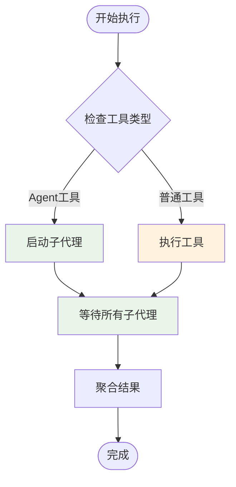

### 内存管理

系统提供了智能的记忆管理机制：

- **项目特定记忆**：每个项目独立的记忆存储
- **自动清理**：基于时间戳的过期管理
- **搜索功能**：基于标题的快速检索

## 故障排除指南

### 常见问题诊断

**API 密钥配置问题**
- 检查环境变量 `ANTHROPIC_API_KEY`
- 验证配置文件中的 API 密钥设置
- 确认网络连接和代理设置

**工具执行失败**
- 查看工具返回的错误信息
- 检查工作目录权限
- 验证工具参数格式

**内存不足问题**
- 监控上下文长度和 token 使用
- 调整压缩阈值配置
- 检查文件大小限制

### 调试工具

系统提供了多种调试和监控功能：

- **详细日志模式**：启用详细的调试输出
- **成本跟踪**：监控 token 使用情况
- **内存使用统计**：显示当前内存占用

**Section sources**
- [pkg/config/settings.go:144-154](file://pkg/config/settings.go#L144-L154)
- [pkg/ui/app.go:183-189](file://pkg/ui/app.go#L183-L189)

## 结论

OpenHarness Go 项目通过创新的 ReAct 代理框架、完善的 HITL 系统和渐进式披露技能系统，为开发者提供了一个强大而灵活的 AI 编码助手平台。

### 主要优势

**技术先进性**
- 基于最新的 ReAct 框架
- 支持多模态交互和工具调用
- 实现了智能化的上下文管理

**用户体验**
- 多种前端适配器支持
- 灵活的权限控制系统
- 渐进式技能学习机制

**可扩展性**
- 模块化架构设计
- 插件化技能系统
- 标准化的 MCP 协议集成

### 发展方向

未来的发展重点包括：
- 增强技能系统的自动化程度
- 优化性能和资源使用效率
- 扩展更多类型的工具和插件
- 改进人机协作的自然度

## 附录

### 快速开始

1. **安装依赖**
   ```bash
   go mod tidy
   ```

2. **配置环境**
   ```bash
   export ANTHROPIC_API_KEY=your_api_key
   ```

3. **运行应用程序**
   ```bash
   go run ./cmd/openharness
   ```

### API 参考

系统提供了丰富的命令行接口：
- `openharness` - 主应用程序
- `openharness mcp` - MCP 服务器管理
- `openharness auth` - 认证管理
- `einoagent` - ReAct 代理演示

### 贡献指南

欢迎贡献代码和技能：
- 遵循 Go 语言编码规范
- 提供完整的测试用例
- 编写清晰的文档说明
- 遵循 MIT 开源许可证